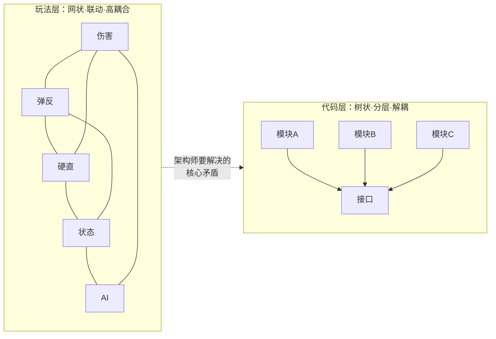
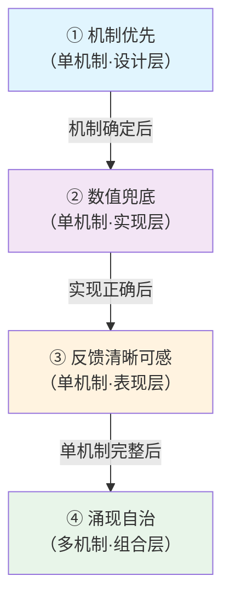
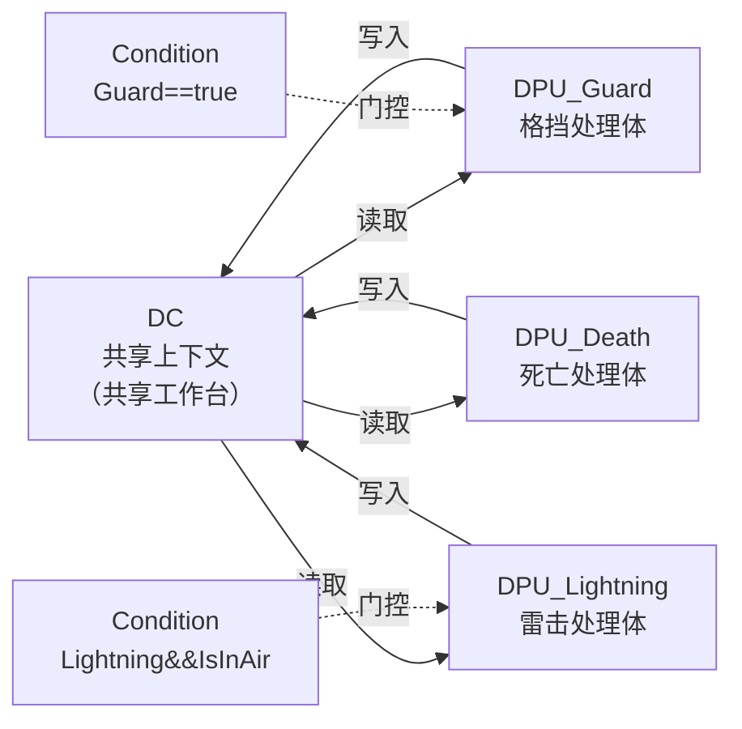

# 动作游戏模块化伤害管线 — 设计哲学深度调研

> **一句话本质**：动作游戏的伤害管线不是"算血的公式"，而是"讲规则的语言"——它是将设计者脑中的战斗机制，通过模块化架构忠实投射为玩家可感知、可操作、可涌现的战斗体验的完整技术范式。

**调研日期**: 2026-03-25
**信息源**: 项目全量调研资料（设计观点、模型规范v4.3、实现层设计文档、案例分析、行业理论）
**调研方法**: 认知成长公式 — 黄金圈法则（WHY→HOW→WHAT）

---

## 文档导航

| 文档 | 内容 | 适读角色 |
|------|------|---------|
| **本文** | 总览：设计哲学的核心命题与逻辑链路 | 所有人 |
| [快速入门](./快速入门.md) | 5分钟理解伤害管线的本质区别与核心概念 | 策划、新成员 |
| [架构设计](./架构设计.md) | **重点文档**：代码架构如何承载设计哲学（WHY→HOW→WHAT纵向链路） | 程序、TA、架构师 |
| [术语速查表](./术语速查表.md) | 核心术语、设计原则、案例映射快速参考 | 所有人 |

---

## WHY — 模块化伤害管线要解决的核心命题

### 命题一：伤害是机制的表达，不是目的

动作游戏和数值游戏对"伤害"的定位根本不同：

| 维度 | 数值游戏 | 动作游戏 |
|------|---------|---------|
| **伤害的角色** | 战斗的目的 | 机制的副产品 |
| **玩家决策** | 调系数（堆攻防、选BD） | 选路径（走哪条伤害链路） |
| **流程结构** | 单分支线性公式 | 多分支离散状态机 |
| **反馈核心** | 飘数字 | 动画/音效/顿帧/镜头 |
| **本质隐喻** | "解方程"——把系数调到最大 | "选方程"——选哪个函数 |

**核心洞察**：数值游戏是刻度不同；动作游戏是尺子本身就不一样。

```
忍龙：伤害流程 = 维持高速战斗节奏的工具
鬼泣：伤害流程 = 连招与控制体系的载体
只狼：伤害流程 = 拼刀机制与世界观的统一表达
```

### 命题二：玩法要耦合，代码必须解耦

这是动作游戏战斗架构**最核心的天然矛盾**：



- **玩法层面**：伤害、防御、弹反、破甲、硬直、霸体、状态、AI、动画——全都要互相影响、互相咬合，形成一张网
- **工程层面**：不能写成意大利面条代码，必须模块化、可扩展、可维护、多人并行开发

**一句话金句**：动作游戏战斗架构的终极目标——让代码保持树状、分层、解耦；让玩法长成网状、联动、高耦合。

### 命题三：涌现必须自治，不能穷举

当多个机制同时生效时，组合效果不由设计者穷举硬编码，而由各机制在共享上下文上自然产生。

```
只狼示例：
  完美格挡 + 雷击 → 雷反（不受伤且反击）
  这不是设计者写了一条 if(完美格挡 && 雷击) 的特殊规则
  而是格挡机制和雷击机制各自在共享上下文上运行后的自然结果
```

这就是**化学反应**——1+1 > 2，机制之间不是加法，是化合。

### 命题四：反馈是机制的语言

玩家感知不到的机制等于不存在。每个机制的结果必须通过多模态表现（动画、音效、特效、位移、镜头）被玩家感知到。

反馈的本质功能：**告诉玩家现在走了哪条伤害流**。没有这个，动作游戏的策略就不存在。

---

## HOW — 四条设计思想如何转化为架构策略

四条设计思想形成一条纵向链路，从单机制到多机制：



①②③保证每个积木块的质量（纵向全链路），④保证积木块组合后的系统质量（横向协作）。

**架构策略映射**：

| 设计思想 | 架构策略 | 代码承载 |
|---------|---------|---------|
| 机制优先 | DPU（机制处理体）自洽封装 | 每个机制是独立的积木块 |
| 数值兜底 | DPU 内部完成数值结算 | 数学地基正确但不外溢 |
| 反馈清晰可感 | Channel/Priority 表现选取 | 有限表现资源的择优分配 |
| 涌现自治 | DC（共享上下文）+ Condition 门控 | 机制间通过数据通信，不直接调用 |

详见 → [架构设计](./架构设计.md)

---

## WHAT — 核心解决方案：声明式机制编排框架

解决方案的核心是三个概念：**DPU + DC + Condition**



| 概念 | 是什么 | 承载什么设计思想 |
|------|--------|----------------|
| **DPU** | 机制处理体——自洽的积木块 | 机制优先 + 数值兜底 |
| **DC** | 共享上下文——机制间的唯一通信介质 | 涌现自治的载体 |
| **Condition** | 执行条件门控——读DC输出bool | 涌现的条件表达 |

**关键机制**：
- 产销声明（Produces/Consumes）自动拓扑排序，设计者不需要手动排列执行顺序
- 静态规则与动态组装分离——开发时配规则，运行时配组合
- DC 字段缺失视为 false——天然容错，支持动态管线

详见 → [架构设计](./架构设计.md)

---

## 案例验证

### 完美范本

| 游戏 | 核心机制 | 框架契合度 |
|------|---------|-----------|
| **只狼** | 弹反→架势→忍杀 | 极简内核 + 硬耦合 + 强化学反应。已完成 MVP 验证 |
| **忍龙2** | 断肢→灭杀技循环 | 攻守潮汐。每个系统都强制使用 |
| **猎天使魔女** | 魔女时间（Witch Time） | 闪避变进攻窗口。一个机制重新定义攻防 |

### 动态管线范本

| 游戏 | 架构特征 | 关键洞察 |
|------|---------|---------|
| **Hades** | 运行时动态拼装伤害管线 | 每局全新管线。解耦到极致，才能运行时随便拼耦合玩法 |

### 反面教材

| 游戏 | 问题 | 教训 |
|------|------|------|
| **Yaiba忍龙Z** | 元素组合概念对，底层战斗崩溃 | 化学反应的前提是基底扎实。沙上建不了实验室 |

---

## 核心叙事

动作游戏的伤害管线由四条设计思想驱动——**机制优先、数值兜底、反馈清晰可感、涌现自治**。管线分为机制阶段和表现选取阶段。机制阶段用声明式编排工具实现——DPU 是自洽的积木块（声明 produces），Condition 是装配门控（隐含 consumes，缺失字段视为 false），DC 是共享工作台。系统自动拓扑排序，支持动态管线。表现选取阶段按 Channel 分组、按 Priority 择优。开发时配规则，运行时配组合，两者解耦。

---

## 参考文献

| # | 来源 | 说明 |
|---|------|------|
| 1 | 模块化伤害管线_模型规范文档_v4.3 | 核心模型定义：四条设计思想、问题域模型、L3 工具方法 |
| 2 | 声明式机制编排框架_实现层设计文档 | 运行时系统架构、编辑器 UX、分步实施计划 |
| 3 | 动作游戏伤害流程设计观点 | 动作游戏 vs 数值游戏的本质区别、状态机模型 |
| 4 | 解析动作游戏战斗架构的核心挑战 | "玩法耦合 vs 代码解耦"矛盾的工程分析 |
| 5 | 深度解析：Hades 的动态伤害流程与工程杰作 | 动态拼装管线的案例验证 |
| 6 | 动作游戏美学的三棱镜 | "极简内核·强耦合·化学反应"框架的学术验证 |
| 7 | 解析动作游戏战斗设计：从方法论到具体案例 | 四条设计思想的作用域与边界分析 |
| 8 | 代码优雅·领域建模·心智模型 | 三层抽象能力：代码建模→领域建模→心智模型建模 |
| 9 | L3 声明式编排工具设计与落地指南 | Level 1-4 工具成熟度分层、节点设计准则 |
| 10 | 游戏模块化开发理念探讨 | 黄金圈法则在游戏模块化中的应用 |
| 11 | 游戏工业化的第三条路 | 从制造到创造的模块化范式革命 |

---

**文档版本**: 1.0
**最后更新**: 2026-03-25
