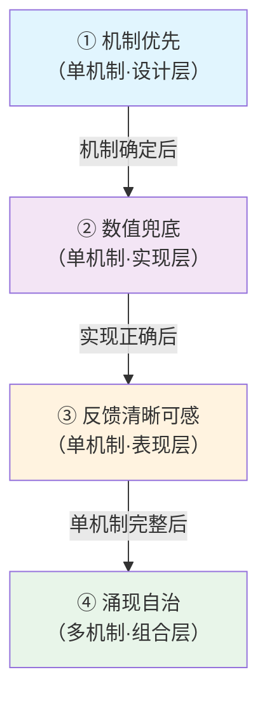

# DamagePipeline — 动作游戏模块化伤害管线

> **一句话本质**：把"攻击命中后发生什么"从一坨巨型函数拆成独立的自洽机制，通过共享上下文自然协作——这是 UE5.7 下的一个 **L3 领域 DSL**（领域特定语言），专为动作游戏伤害流程设计。

> **读者**：团队全员（TD / 策划 / 程序）
> **预期阅读时间**：15 分钟
> **前置阅读**：无（本文就是入口）

---

## §1 文档定位与版本

| 项 | 值 |
|---|---|
| 当前版本 | **v4.7**（代码与模型规范统一） |
| 理论框架 | 领域 DSL（Fowler 定义） + L3 工具阶梯定位 |
| 权威规范位置 | [`全量资料/模块化伤害管线_模型规范文档_v4_7.md`](../../全量资料/模块化伤害管线_模型规范文档_v4_7.md) |
| 本文档目的 | 新人全员入口 + L3=领域 DSL 客观定义论证 + 设计哲学根源 |

**版本状态说明**：v4.6 过渡期的"代码 v4.6 / 模型 v4.7"双端叙事已结束。当前代码与模型规范均维护在 v4.7，所有 v4.6 的实现层决策已反哺回模型或归档。历史决策详情见 [`_archive/已解决决策_v4.3-v4.7.md`](./_archive/已解决决策_v4.3-v4.7.md)。

---

## §2 四件套导航

按读者角色和深度划分：

| 文档 | 内容 | 读者 | 预期时间 |
|---|---|---|---|
| **本文（README）** | 全员入口 / L3=DSL 客观定义论证 / 四条设计思想 / 三大概念定义 | 所有人 | 15 分钟 |
| [`快速入门.md`](./快速入门.md) | 5 分钟跑通示例 / R1-R6 速查卡片 / 蓝图实战三例 / FAQ | TD / 策划 / 新人程序 | 30 分钟 |
| [`架构设计.md`](./架构设计.md) | DSL 七要素纵向深挖 / Build-Execute 算法细节 / 设计哲学→架构的完整推导 | 程序 / TD 深度用户 | 60 分钟 |
| [`术语速查表.md`](./术语速查表.md) | 按 DSL 七要素分类的术语表 / 废弃术语对照 / 版本演进表 | 所有人 | 按需 |

**衍生文档**：

| 文档 | 内容 | 层级 |
|---|---|---|
| [`待讨论问题集.md`](./待讨论问题集.md) | 活跃讨论（Part A/B/C）——未决的模型级问题和待实施项 | L3 活跃议题 |
| [`_archive/`](./_archive/) | 已解决决策历史归档 | L3 历史审计 |
| [`../damagePipelineEditor/`](../damagePipelineEditor/) | Graph 可视化的布局/走线/配色实现 | **L4** 编辑器工具层 |

---

## §3 一分钟速览

**三大领域原语 + 一个共享存储 + 一个执行引擎**：

```
UDamageRule         一条伤害规则（Condition 判定 + OperationClass 计算逻辑）
UDamageOperationBase  规则的计算单元，Execute(Context, OutEffect&) 填字段
DamageEffect          Rule 的结构化产出（USTRUCT，类型即身份）
UDamageCondition + UDamagePredicate  条件原子 + AND/OR 容器

UDamageContext        DC，运行时 TMap<UScriptStruct*, FInstancedStruct> 共享存储

UDamagePipeline       Rule 列表 + Build（Kahn 拓扑排序）+ Execute（按序执行）
```

**一次完整执行**：

```
调用方创建 DC → 预填 AttackContext → Pipeline.Execute(DC)
  │
  └─ 按 SortedRules 顺序遍历每条 Rule：
       ① Predicate 树递归求值 → 通过？
       ② 框架预创建 OutEffect(ProducesType)
       ③ Operation.Execute(Context, OutEffect) 填字段
       ④ 框架 SetEffectByType(OutEffect)
  
→ 调用方从 DC 读出关心的 Effect（Guard / Death / LightningInAir / ...）→ 驱动表现
```

---

## §4 L3 = 领域 DSL 客观定义论证

这不是修辞——按 Fowler 的 DSL 定义四要素逐项对照，DamagePipeline 是**客观定义上的领域 DSL**，而不是"高级一点的可视化配置工具"。

### §4.1 Fowler DSL 四要素对照

Martin Fowler 在《Domain-Specific Languages》中的定义：**"一种受限表达力的、聚焦于特定领域的计算机编程语言。"** 展开为四要素：

| DSL 要素 | DamagePipeline 的对应 | 验证 |
|---|---|---|
| **是编程语言** | DamageRule + Condition 树 + OperationClass + Produces 组成一套可执行的声明 | ✅ 能 Build 成可执行的 SortedRules |
| **具有语言的流畅性** | "这条规则在格挡成功时生效"——TD 用领域语言直接描述 | ✅ Sekiro 的 13 条 Rule 由领域语言写出 |
| **表达力受限** | 只能表达"攻击命中后发生什么"——不能用它写 UI / AI / 关卡 | ✅ OperationClass 严格受限于 DamageOperationBase |
| **聚焦特定领域** | 伤害事件处理 | ✅ 不跨领域 |

**完全符合 Fowler 的学术定义。**

### §4.2 Mernik 生产力数据的佐证

Mernik 等人 2005 年 ACM Computing Surveys 的《When and How to Develop DSLs》给出的数据：

| 语言层级 | 生产力（FP/人月） |
|---|---|
| C 级通用语言 | 10–20 |
| 4GL 语言 | 16–23 |
| **领域 DSL 级（24–55 级）** | **30–50** |

**受限的表达力不但没有降低生产力，反而因为精准匹配领域需求而大幅提升了它。** DamagePipeline 的设计哲学（特别是涌现自治 + 缺失容错）就是这种"精准匹配领域"的具体体现。

Fowler 的原话佐证：
> "通用编程语言给你很多工具——但你的 DSL 只使用其中几种。拥有超过你需要的工具往往使事情更困难——因为你必须先了解所有工具是什么，才能找到你实际使用的那几种。"

### §4.3 L1-L4 工具阶梯定位

DamagePipeline 在 L3。与 L2（可视化编辑）的关键区别：

| 级别 | 特征 | DamagePipeline 是否满足 |
|---|---|---|
| **L1 数据驱动** | 配置文件/表格控制参数 | 超过（Rule 是 DataAsset，但不只是数据） |
| **L2 可视化编辑** | 节点图 / GUI 编辑器包装 C++ 代码 | 超过（Graph Editor 只是 L4 的表现层） |
| **L3 领域 DSL** | 完整语义的专用语言，领域原语 + 类型安全 + 验证 + 组合 + 错误检查 | **✅ 当前位置** |
| **L4 自动化生态** | DSL + 代码生成 + CI/CD | 未来方向（Graph Editor 算 L4 的一步） |

**L3 vs L2 的分水岭**：
- **L2 是"功能包装"**——把 C++ 代码包装成节点让策划拖拽，使用者的思维方式没变（还是"调用什么函数"）
- **L3 是"领域建模"**——分析领域的本质结构，抽象出领域原语（DamageRule / DamageEffect / DamageContext），使用者用领域语言思考

**对照行业经典 L3 案例**（来自 Utrecht 大学 2013 年 IEEE 论文及 GDC 演讲）：

| 系统 | L3 DSL 定位 | 对应 DamagePipeline |
|---|---|---|
| Unreal 行为树 | AI 决策 DSL | 决策树编辑器 + Blackboard |
| Unreal 材质编辑器 | 着色 DSL | 节点图 + HLSL 编译 |
| Niagara | 粒子 DSL | System/Emitter/Module 四层语法 |
| Overwatch Statescript | 网络同步 DSL（GDC 2017） | **最接近的类比**——受限表达力 + 自动化同步 |
| For Honor Modifiers | 战斗域 DSL（GDC 2017） | **另一个接近类比**——数据驱动的战斗效果 |

详细类比见 [`../../全量资料/L3工具的本质_领域DSL_认知成长记录.md`](../../全量资料/L3工具的本质_领域DSL_认知成长记录.md)。

### §4.4 用 DSL 视角看 DamagePipeline 的直接收益

一旦承认"DamagePipeline 是领域 DSL"，下列判断有了理论依据：

- **为什么 Condition 树只有 AND/OR/NOT 而不支持任意代码**——受限表达力是 DSL 的核心优势（Fowler），不是技术局限
- **为什么 Operation 不能互相调用**——DSL 通过"纯数据通信"（DC）保证可组合性，不能穿透到通用语言
- **为什么 Produces 用 CDO 反查而非手动声明**——DSL 的一致性约束应由语言本身强制，不依赖人类纪律
- **为什么 `实现层变更记录_v4.6.md` 不应该继续存在**——v4.7 是单一权威定义，DSL 不应该有"代码事实"和"模型事实"两套版本

---

## §5 四条设计思想（唯一详细展开处）

这四条是 DamagePipeline 的**设计根源**，指导每一个架构决策。本节详细展开，其他文档只做速记+跳转。

### §5.1 ① 机制优先：体验由机制驱动，不由数值驱动

**核心主张**：玩家从动作游戏获得的体验，来自"格挡 / 弹反 / 霸体 / 雷反 / 忍杀"这些**机制**本身，而不是"伤害 100 还是 120"这些数值。机制的存在定义了体验的边界。

**取舍**：

| 选择 | 代价 | 收益 |
|---|---|---|
| 机制优先 ✅ | 需要先想清楚"有哪些机制" | 每个机制独立可验证、可迭代 |
| 数值优先 ❌ | 体验被数值调参牵着走 | 调整快速，但无法沉淀为"游戏的独特身份" |

**反例**：MMO 的战斗流程是数值驱动——攻防差、属性克制、百分比加成。每个新职业 = 数值曲线。**没有机制，只有函数。**

**在 DamagePipeline 的承载**：每条 `UDamageRule` = 一个独立机制。机制是设计单元，数值是实现细节。新增"弹反"=加一条 Rule；调整弹反判定窗口=改该 Rule 的 Condition 或 Operation 内部参数——两件事互不干扰。

### §5.2 ② 数值兜底：数值不驱动体验，但保证数学基础正确

**核心主张**：虽然不让数值主导体验，但数值计算必须**正确可靠**——架势值公式要算对，伤害倍率要一致，HP 扣减要精确。这是基础工程纪律。

**取舍**：

| 选择 | 代价 | 收益 |
|---|---|---|
| 数值结算内聚于 Operation 内部 ✅ | Operation 代码略复杂 | 改公式不牵动管线结构；管线层完全不感知公式 |
| 数值计算散布到管线外部 ❌ | 改公式可能要改多处 | （无收益） |

**关键分工**：
- **策划关心公式参数**：架势扣减系数 / 格挡成功率 / JustGuard 窗口 ms → 这些是 Operation 的 UPROPERTY
- **程序关心公式正确性**：数值不溢出 / 边界情况 / 浮点精度 → 这些是 Operation 内部的实现品质

**反例**：在 Rule 的 Condition 里写 `guard_level >= DmgLevel * 0.8`——数值公式泄漏到管线层，调平衡时要改 Condition 结构。

**在 DamagePipeline 的承载**：数值在 Operation 内部算完，结果以 Effect 的字段形式暴露给下游。管线层只看类型和结构，不看公式。

### §5.3 ③ 反馈清晰可感：每个机制结果必须被玩家感知到

**核心主张**：玩家感知不到的机制等于不存在。每个有玩法意义的机制结果必须通过**多模态表现**（全身动画 + 音效 + 特效 + 位移 + 镜头）被玩家感知到。反馈的本质功能是**告诉玩家现在走了哪条伤害流**——没有这个，动作游戏的策略就不存在。

**架构挑战**：表现资源有限。不能同时播两个全身受击动画。多个机制同时命中时需要按"玩家最应该感知到什么"择优。

**取舍**：

| 选择 | 代价 | 收益 |
|---|---|---|
| Channel / Priority / CombinedPresentation 分级择优 ✅ | 需要表现选取阶段的独立实现 | 机制增加不需要改表现逻辑；表现资源有序复用 |
| 每个机制硬编码自己的表现 ❌ | 多机制冲突时无法择优 | （无收益） |

**CombinedPresentation 的特殊价值**：

```
Death + Lightning 同时生效时：
  不是分别播 death_fall 和 lightning_hit（两个全身动画互斥，只能选一）
  而是播一个专门的 Death_Electrocute（雷电死亡动画）——反馈优化，非机制涌现
```

**当前实现状态**：机制阶段已完整落地；表现选取阶段仍在模型规范，未进入代码（见 [`待讨论问题集.md#B1`](./待讨论问题集.md)）。

### §5.4 ④ 涌现自治：多机制组合不穷举，由各机制在共享上下文上自然产生

**核心主张（四条中架构价值最高的一条）**：多个机制同时生效时，组合效果**不由设计者穷举硬编码**，而由各机制在 DC 上运行后的自然结果产生。

**只狼示例**：

```
完美格挡 + 雷击 → 雷反（不受伤且反击）

  不是设计者写了一条 if(完美格挡 && 雷击) 的特殊规则
  而是：
    DR_Guard(Condition=IsJustGuard)    产出 FGuardEffect(bJustGuard=true)
    DR_LightningInAir(Condition=IsLightning && IsInAir) 产出 FLightningInAirEffect
    DR_Death(Condition=HPZero && !HasLightningInAir)    跳过
  
  "雷反不受伤"这个涌现效果：
  → 不在任何 Rule 内部
  → 由三条 Rule 的 Condition 组合自然表达
  → 各 Rule 内部完全不知道彼此的存在
```

**这直接回答了"玩法耦合 vs 代码解耦"的核心矛盾**：

```
代码层：三个独立模块，互不调用        玩法层：机制之间高度联动
DR_Guard ─┐                         Guard 写入的数据
DR_Lght  ─┤→ DC ←─                  被 LightningInAir 的 Condition 读取
DR_Death ─┘                         LightningInAir 写入的数据
                                    改变 Death 的判断
```

**同一套代码，两层视角。** 这就是 ④ 的架构力量。

**取舍**：

| 选择 | 代价 | 收益 |
|---|---|---|
| 涌现自治 ✅ | 需要纪律——识别出"if 里的条件是不是另一个机制的产出" | 新增机制不破坏已有机制；动态管线可能；肉鸽涌现自然发生 |
| 穷举硬编码 ❌ | 组合爆炸：N 个机制有 2^N 种组合 | （无收益） |

**在 DamagePipeline 的承载**：DC（共享上下文）+ Condition（装配门控）+ 自动拓扑排序。具体机制见 [`架构设计.md §11`](./架构设计.md#11-从设计哲学到架构的推导whyhow-纵向)。

### §5.5 四条思想的关系与完整链路



**①②③** 保证**每个积木块**的质量（纵向全链路），**④** 保证**积木块组合后**的系统质量（横向协作）。删掉任何一条，整套设计哲学的说服力都会下降。

---

## §6 三大概念定义

展开说明三个原语的语义边界。详细 API 见 [`架构设计.md §3`](./架构设计.md#3-要素一领域原语)。

### §6.1 DamageRule — 自洽的积木块

**定义**：一条伤害规则的**声明单元**，由"是否生效"（Condition）+ "生效时怎么算"（OperationClass）组成。

**边界**：
- ✅ Rule 知道自己要做什么
- ✅ Rule 知道自己产出的类型（通过 Operation 子类的 CDO 反查）
- ❌ Rule 不知道自己被谁消费
- ❌ Rule 不知道管线里还有什么其他 Rule

**类比**：Lego 积木块——有形状和接口，但不知道会被拼进什么结构。

### §6.2 DamageEffect — 结构化产出 / 信号

**定义**：Rule 的**产出数据**。以 USTRUCT 的形式存在——**类型即身份**。

**两种形态**：

| 形态 | 典型字段数 | 例子 | 下游判定方式 |
|---|---|---|---|
| 复杂 Effect | 多字段 | `FGuardEffect { PostureDamage, bJustGuard }` | 读字段值 |
| 信号 Effect | 无字段 | `FLightningInAirEffect {}` | 判断"存在与否" |

**边界**：
- ✅ Effect 是**数据**
- ❌ Effect 不是对象——没有行为、没有生命周期、没有标识
- ✅ Effect 可以被复制、序列化、网络同步（UE `FInstancedStruct` 的能力）

**类比**：化学反应的**产物**——有确定的分子式，没有主观意志。

### §6.3 DamageCondition（+ DamagePredicate）— 条件门控

**定义**：Rule 是否执行的**外挂开关**，而不是内部逻辑。

**结构**：

```
UDamagePredicate（容器层）：AND / OR / Single + bReverse
   │
   └─ UDamageCondition（抽象基类）
         ├─ UDamageCondition_Effect   —— 基于 Effect 的判定（贡献 R5 产销依赖）
         └─ UDamageCondition_Context  —— 基于 Context 的判定（不贡献产销依赖）
```

**两种 Condition 形态**（详见 [`架构设计.md §3.4`](./架构设计.md)）：

| 形态 | 签名 | 能读什么 | Graph 节点表现 |
|---|---|---|---|
| `_Effect` | `Evaluate(Context, InEffect)` | 声明的 Effect + Game 扩展字段 | 有输入 Pin + 色块 |
| `_Context` | `Evaluate(Context)` | **只有** Game 扩展字段（编译期禁止读任何 Effect） | 无 Pin、无色块 |

**边界**：
- ✅ Condition 可读**声明的**数据（`_Effect` 读声明的 Effect，两者都可读 Game 扩展字段）
- ❌ Condition 不能写 DC（只读）
- ❌ Condition 不能**越界**读未声明的 Effect（v4.7 通过 DC 访问控制编译期强制，详见 [`架构设计.md §6.4`](./架构设计.md)）
- ✅ 子类即领域方法（如 `UDamageCondition_IsJustGuard` / `UDamageCondition_InTutorial`），实例可配参数
- ✅ 缺失的 Effect 对 `_Effect` Condition 视为 false（R3）

**类比**：电器的外部开关——开关坏了不影响电器本身，换开关不影响电器工作方式。这是 R4"Condition 与 Rule 装配关系"的直接体现。

---

## §7 外部引用索引

**v4.7 权威规范**（仅作外部引用，不搬运到 doc/）：

- [`模块化伤害管线_模型规范文档_v4_7.md`](../../全量资料/模块化伤害管线_模型规范文档_v4_7.md) — 模型规范（WHY + WHAT + HOW）
- [`模块化伤害管线_实现层架构文档.md`](../../全量资料/模块化伤害管线_实现层架构文档.md) — 实现层设计依据
- [`模块化伤害管线_DamageEffect模型设计.md`](../../全量资料/模块化伤害管线_DamageEffect模型设计.md) — Effect 模型设计与三步检验

**理论锚点**：

- [`L3工具的本质_领域DSL_认知成长记录.md`](../../全量资料/L3工具的本质_领域DSL_认知成长记录.md) — DSL 七要素 + Fowler/Mernik 理论 + GDC 案例

**项目内文档**：

- [`快速入门.md`](./快速入门.md) / [`架构设计.md`](./架构设计.md) / [`术语速查表.md`](./术语速查表.md) — 四件套其余三份
- [`待讨论问题集.md`](./待讨论问题集.md) — 活跃讨论（Part A/B/C）
- [`_archive/已解决决策_v4.3-v4.7.md`](./_archive/已解决决策_v4.3-v4.7.md) — 13 条历史决策归档
- [`../damagePipelineEditor/`](../damagePipelineEditor/) — L4 编辑器实现

---

## §8 文档维护说明

本 README 的改动触发条件（定位锚点）：

| 改动触发 | 需要更新的章节 |
|---|---|
| 新增/删除领域原语 | §3 一分钟速览 / §6 三大概念定义 / [`术语速查表.md`](./术语速查表.md) §1 |
| 四条设计思想调整 | §5 唯一展开处（其他文档的速记自动通过跳转同步） |
| 模型规范版本升级 | §1 版本表格 / §7 权威规范链接 |
| 新增/变更 R1-R6 本质约束 | [`架构设计.md §5.2`](./架构设计.md#5-2-r1-r6-本质约束深度解释) + [`快速入门.md §3`](./快速入门.md#3-r1-r6-六条硬约束速查卡) 速查卡片同步 |
| 发现新的 L3 案例或理论来源 | §4.3 对照表 / [`L3工具的本质_领域DSL_认知成长记录.md`](../../全量资料/L3工具的本质_领域DSL_认知成长记录.md) |

**维护原则**：
- **四条设计思想**只在本文 §5 详细展开，其他文档一律速记 + 跳转，避免重复
- **R1-R6** 速查在快速入门 §3、深度在架构设计 §5.2、词条在术语速查表 §3.2——三份分工明确
- 新增术语先进 [`术语速查表.md`](./术语速查表.md)，再决定是否在其他文档展开

---

**文档版本**：2.0（按 L3=DSL 视角重写，v4.6→v4.7 版本统一）
**最后更新**：2026-04-17
