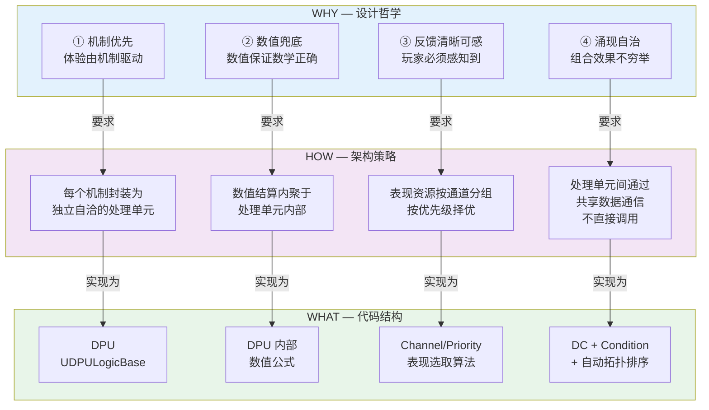
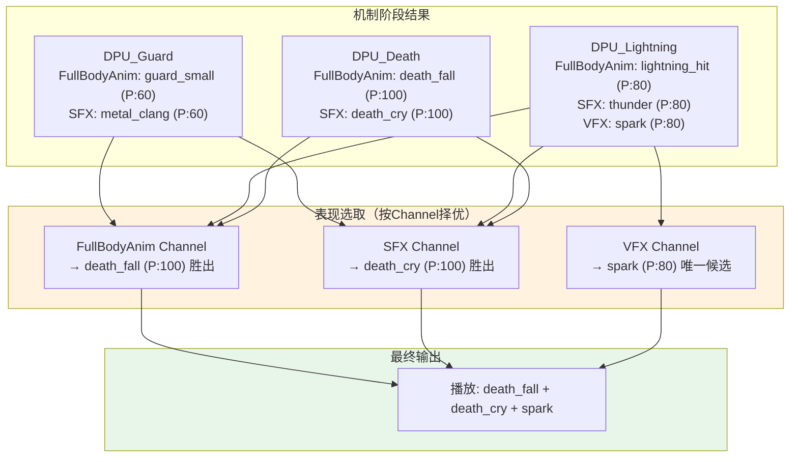
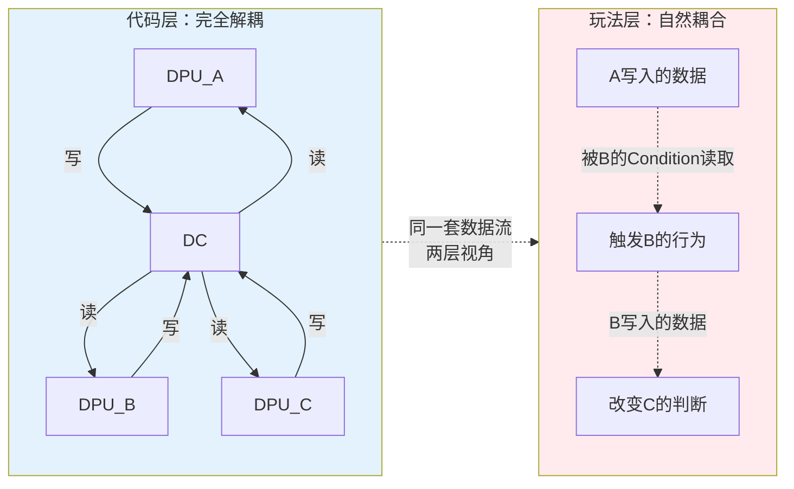
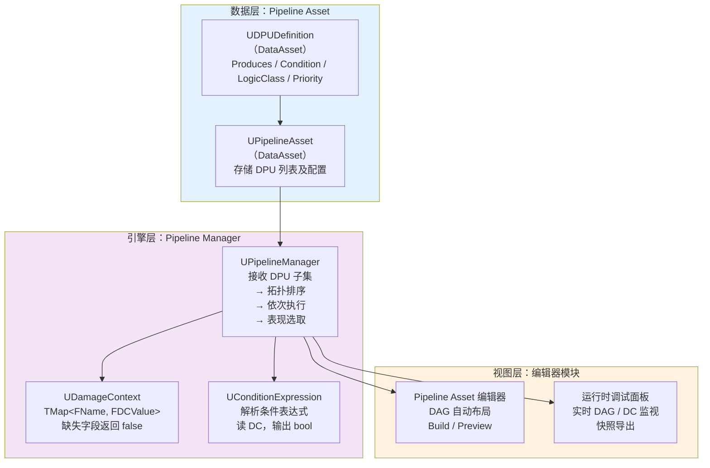
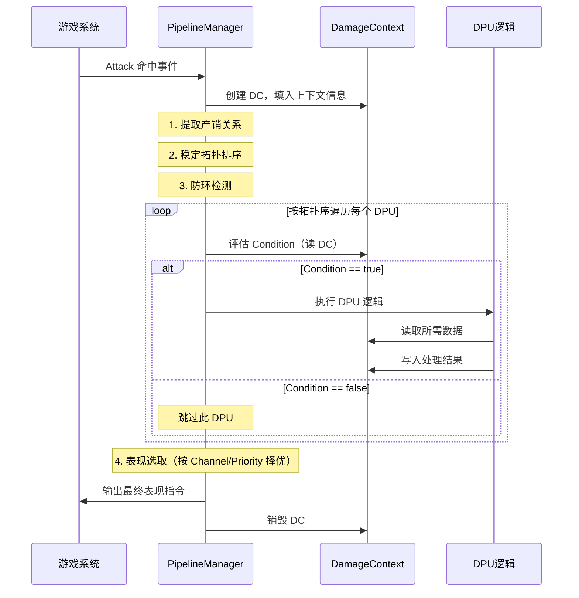
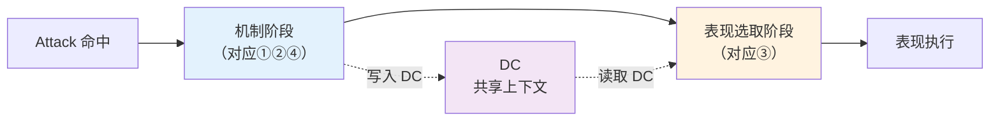
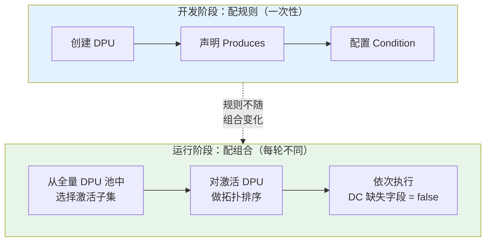
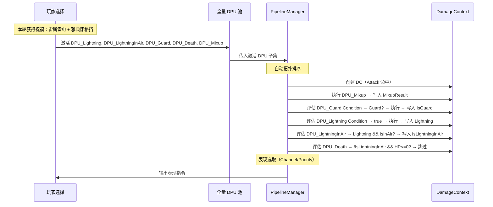
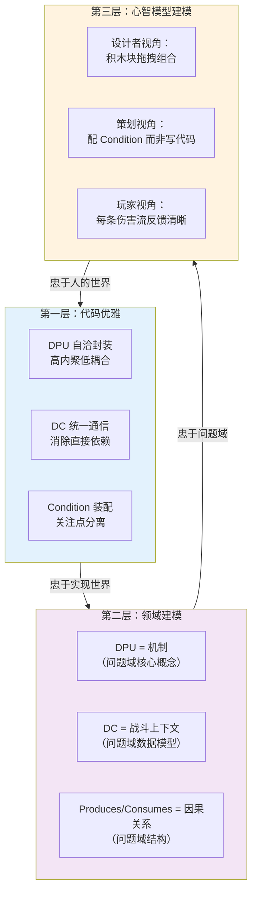

# 模块化伤害管线 — 架构设计

> **本文核心命题**：代码架构如何承载设计哲学？从 WHY（四条设计思想）到 HOW（架构策略）到 WHAT（代码结构），每一层程序抽象都是对设计哲学的忠实投射。

---

## 目录

- [第一部分：从设计哲学到架构策略（WHY→HOW）](#第一部分从设计哲学到架构策略whyhow)
- [第二部分：从架构策略到代码结构（HOW→WHAT）](#第二部分从架构策略到代码结构howwhat)
- [第三部分：两阶段架构的完整链路](#第三部分两阶段架构的完整链路)
- [第四部分：动态管线——架构如何承载涌现自治](#第四部分动态管线架构如何承载涌现自治)
- [第五部分：三层抽象能力的统一](#第五部分三层抽象能力的统一)

---

## 第一部分：从设计哲学到架构策略（WHY→HOW）

### 1.1 核心矛盾的形式化表述

动作游戏战斗架构面对的核心矛盾：

```
玩法层：网状·联动·高耦合
  → 伤害影响弹反，弹反影响硬直，硬直影响状态，状态影响AI

代码层：树状·分层·解耦
  → 模块独立，接口清晰，可测试，可并行开发

矛盾：如何让代码高度解耦，却让玩法高度耦合？
```

这个矛盾是**本质复杂度**——它不是实现选择造成的，而是动作游戏体验本身要求的。任何架构方案都必须正面回答这个矛盾，而非回避。

### 1.2 四条设计思想的架构投影

每条设计思想都对架构提出了具体的、可验证的约束：



### 1.3 每条思想的架构约束详解

#### ① 机制优先 → DPU 自洽封装

**设计要求**：体验由机制驱动。先有"格挡""弹刀""雷反"，再有数值填充。

**架构约束**：
- 每个机制必须是**完整独立的处理单元**，不依赖其他机制的存在
- 处理单元内部逻辑**自洽**——不知道自己被什么条件门控，不知道管线中有什么其他单元
- 机制可以被**独立添加、移除、替换**，不影响其他机制

**代码承载**：DPU（Damage Processing Unit）

```
DPU的自洽性规则：
  ✅ DPU内部可以有复杂逻辑（格挡判定、架势计算、表现选择）
  ✅ DPU从DC中读取需要的数据
  ✅ DPU将结果写回DC
  ❌ DPU不直接调用其他DPU
  ❌ DPU不知道自己被什么Condition门控
  ❌ DPU不知道管线中还有什么其他DPU
```

**为什么这样承载**：自洽性保证了"机制优先"——每个DPU就是一个完整的机制。你可以先设计机制（创建DPU），后配数值（填充DPU内部），后配组合（调整Condition）。设计顺序和代码结构完全一致。

#### ② 数值兜底 → DPU 内部数值结算

**设计要求**：数值不驱动体验，但保证数学基础正确。

**架构约束**：
- 数值计算**内聚于**DPU 内部，不泄露到管线层面
- 管线层面只看到"这个机制生效了/没生效"，不关心内部怎么算的
- 数值公式可以独立修改，不影响管线结构

**代码承载**：DPU 内部的数值逻辑

```
DPU_Guard 内部：
  读取 DC: AttackerPostureDamage, DefenderCurrentPosture, DefenderMaxPosture
  计算: NewPosture = CurrentPosture + PostureDamage * GuardMultiplier
  判断: IsPostureBroken = (NewPosture >= MaxPosture)
  写入 DC: { postureResult: { newPosture, isPostureBroken }, IsGuard: true }

管线层面完全不知道这个公式长什么样。
管线只知道: DPU_Guard 执行后，DC里多了 IsGuard 和 postureResult。
```

**为什么这样承载**：数值被封装在积木块内部，策划改数值公式不需要改管线结构。"数值兜底"在代码中的体现就是——数值是DPU的私有实现细节。

#### ③ 反馈清晰可感 → Channel/Priority 表现选取

**设计要求**：每个机制的结果必须被玩家感知到。但表现手段有限——不能同时播两个全身受击动画。

**架构约束**：
- 表现资源按**通道**分组（全身动画、音效、特效、镜头……）
- 同通道内**互斥**（只能选一个），不同通道间**可叠加**
- 选择标准是**优先级**——"玩家越需要感知到的机制"优先级越高
- 表现选取**不影响机制结果**——它是纯粹的反馈优化

**代码承载**：Channel + Priority + CombinedPresentation



**CombinedPresentation 的特殊价值**：

```
Death + Lightning 都生效时：
  不是分别播 death_fall 和 lightning_hit
  而是播一个专门的 Death_Electrocute（雷电死亡动画）

这不是机制涌现（游戏规则没变），是反馈优化（反馈更清晰）。
```

**为什么这样承载**：Channel 机制让"反馈清晰可感"变成了可配置的数据问题。策划可以调整优先级来控制"玩家最应该看到什么"，不需要改代码。

#### ④ 涌现自治 → DC + Condition + 自动拓扑排序

**设计要求**：多个机制同时生效时，组合效果不由设计者穷举，而由各机制在共享上下文上自然产生。

**这是最核心、最关键、架构价值最高的一条。** 它直接回答了"玩法耦合 vs 代码解耦"的核心矛盾。

**架构约束**：
- 机制之间**不直接调用**（代码解耦）
- 机制之间通过**共享数据**间接通信（玩法耦合）
- 涌现的条件由**外部门控**表达，不由机制内部硬编码
- 执行顺序由**依赖关系自动决定**

**代码承载**：DC（共享上下文）+ Condition（装配门控）+ Produces/Consumes 自动拓扑排序

```
涌现的代码表达方式：

  旧做法（穷举硬编码）：
    DPU_Lightning 内部：
      if (IsInAir) {
        // 空中接雷不受伤
        SetImmune(true);
      }
    问题："IsInAir"是另一个独立机制的产出，不应该藏在Lightning内部。

  新做法（DC + Condition 涌现自治）：
    DPU_Lightning       produces: [Lightning]
    DPU_LightningInAir  produces: [IsLightningInAir]
                        Condition: Lightning && IsInAir
    DPU_Death           Condition: !IsLightningInAir && HP <= 0

    "空中接雷不受伤"这个涌现效果：
    → 不在任何DPU内部
    → 而是由 DPU_LightningInAir 的 Condition + Death 的 Condition 组合表达
    → 各DPU内部完全不知道彼此的存在
```

**为什么这是核心架构价值**：



**代码层看到的**：三个独立模块，各自读写同一个数据结构，互不调用。
**玩法层看到的**：A 的产出影响 B 的行为，B 的产出影响 C 的判断——高度联动。

**同一套代码，两层视角。这就是架构对"玩法耦合 vs 代码解耦"矛盾的精确回答。**

---

## 第二部分：从架构策略到代码结构（HOW→WHAT）

### 2.1 三层架构



### 2.2 Pipeline Manager 执行流程



### 2.3 稳定拓扑排序（Stable Topological Sort）

**问题**：标准拓扑排序对无依赖关系的 DPU 不保证顺序，造成：
- Build 不确定性（什么都没改，每次结果可能不同）
- 漏声明依赖的放大（忘了声明产销关系，算法把顺序排反）

**解决方案**：基于 Kahn 算法的 BFS 变体

```
标准 Kahn 算法：
  候选队列 → 每次取任意一个

稳定变体：
  候选队列改为按 DPU 在原始数组中的下标排序的优先队列
  每次取下标最小的那个

效果：
  有依赖的 DPU → 严格按依赖排（生产者在前）
  无依赖的 DPU → 按数组原始顺序（谁在前就谁先）
  同输入同输出 → 每次 Build 完全一致
```

**三步检验**：删掉"稳定"约束→表达能力不丢失，但使用体验显著下降。**结论：偶然复杂度，但极高价值的实现选择。**

### 2.4 代码类映射

| 模型概念 | UE5 实现类 | 职责 |
|---------|-----------|------|
| DPU 定义 | `UDPUDefinition` (DataAsset) | Produces、Condition 表达式、LogicClass 引用、BasePriority |
| DPU 逻辑 | `UDPULogicBase` (子类) | 虚函数 `Execute(DC)`，子类实现具体机制 |
| DC | `UDamageContext` | `TMap<FName, FDCValue>`，缺失字段返回 false |
| Condition | `UConditionExpression` | 解析条件表达式，读 DC 字段，输出 bool |
| 管线管理器 | `UPipelineManager` | 拓扑排序 + 依次执行 + 表现选取 |
| 管线资产 | `UPipelineAsset` (DataAsset) | 存储一组 DPUDefinition 引用 |

---

## 第三部分：两阶段架构的完整链路

### 3.1 两阶段分离



**关键设计决策**：两阶段通过 DC 连接。表现选取阶段**只读 DC，不写 DC**——表现不影响机制结果。

**为什么分两阶段**：

| 如果不分 | 后果 |
|---------|------|
| 修改动画方案 → 影响机制逻辑 | 美术改表现，策划的机制就变了 |
| 调整音效优先级 → 改变游戏规则 | 不可接受的耦合 |

分两阶段保证了：改表现不影响机制，改机制不影响其他机制的表现。

### 3.2 机制涌现 vs 表现组合：结构相似但语义不同

```
机制涌现（④的产物）：
  Lightning + InAir → 空中接雷不受伤
  → 改变了游戏规则
  → 如果不做 → 游戏逻辑错误

表现组合（③的产物）：
  Death + Lightning → 雷电死亡动画
  → 让反馈更清晰
  → 如果不做 → 游戏逻辑正确，但反馈不够清晰
```

**架构上的隔离**：机制涌现在机制阶段通过 Condition 表达；表现组合在表现选取阶段通过 CombinedPresentation 表达。两者不在同一个代码路径上。

---

## 第四部分：动态管线——架构如何承载涌现自治

### 4.1 静态规则与动态组装的分离

这是整个架构最精妙的设计决策之一：



| 阶段 | 谁做 | 做什么 | 频率 |
|------|------|--------|------|
| 开发阶段 | 设计者 | 创建 DPU、声明 produces、配置 Condition | 一次性 |
| 运行阶段 | 系统/玩家 | 从全量 DPU 池中选激活子集 | 每轮不同 |

### 4.2 Condition 天然容错：缺失字段视为 false

这条规则是动态管线能工作的**关键基石**：

```
场景：Hades 式肉鸽

没有空中感电 Boon → DPU_LightningInAir 不在管线中
  → IsLightningInAir 永远不写入 DC
  → Death 的 Condition 中 !IsLightningInAir
  → DC 中不存在 IsLightningInAir → 视为 false
  → !false = true → Death 正常执行
  → 和没有这个机制的时候一模一样

有空中感电 Boon → DPU_LightningInAir 加入管线
  → 空中被雷击时写入 IsLightningInAir = true
  → Death 跳过
  → 涌现自动生效

两轮中 Death 的 Condition 完全相同，没有任何修改。
```

**架构意义**：Condition 是静态的游戏规则，DPU 子集是动态的玩家选择。两者**完全解耦**。规则写好就不用改了——不管管线里有什么 DPU 组合，规则都正确运作。

### 4.3 Hades 式动态管线的完整流程



### 4.4 固定管线 vs 动态管线：同一套引擎

```
固定管线（只狼）：
  设计时：编辑器手动选 DPU 类 → Build → 保存为 Pipeline Asset
  运行时：加载 Pipeline Asset → PipelineManager 执行

动态管线（Hades）：
  运行时：根据 Boon 确定激活 DPU 子集 → PipelineManager 执行
  （可导出为 Pipeline Asset → 编辑器离线调试）

两种模式的运行时执行逻辑完全相同。
Pipeline Asset 是两种模式之间的数据交换格式。
```

---

## 第五部分：三层抽象能力的统一

### 5.1 代码架构承载设计哲学的三个层次

模块化伤害管线的架构设计，体现了三层抽象能力的统一：



| 层次 | 忠于什么 | 在本架构中的体现 |
|------|---------|----------------|
| **代码优雅** | 实现世界 | DPU 自洽、DC 统一通信、Condition 装配——经典的高内聚低耦合 |
| **领域建模** | 问题域 | DPU = 机制、DC = 战斗上下文、Produces = 因果关系——代码结构忠实镜像问题域结构 |
| **心智模型建模** | 人的世界 | 设计者拖积木、策划配条件、玩家看清晰反馈——工具贴合每种使用者的思维方式 |

### 5.2 涌现识别：架构师的核心价值判断

**每个 DPU 内部的 if-else，都可能是另一个独立机制的产出与当前机制的涌现。**

```
示例：DPU_Lightning 内部的 if(IsInAir)

原始理解：这是 Lightning 的内部规则
深层理解："角色在空中"是动作系统的产出（独立机制）
          "空中 + 雷击"是两个机制的涌现
          → IsInAir 应该是 DC 中的独立事实
          → "空中雷击的特殊处理"应该是独立的 DPU_LightningInAir
```

**判断标准**：这个条件未来是否可能被其他机制独立引用。这个判断**只有设计者能做，不可由工具或 AI 代劳**。

**涌现识别清单**（每次在 DPU 内部写 if-else 时自问）：

> "这个 if 的条件部分，是不是另一个独立机制的产出？"
> - 是 → 提取为 DC 中的独立事实 + 独立 DPU + Condition
> - 不是（只是本 DPU 内部的数值计算中间结果）→ 留在内部

### 5.3 内容域与工具层的清晰区分

| 维度 | 是什么 | 具体内容 | 文档标题应该是 |
|------|--------|---------|--------------|
| **内容域（WHAT）** | 模块化伤害管线 | 四条设计思想、涌现、表现选取 | "模块化伤害管线" ✅ |
| **工具层（HOW）** | L3 声明式编排 | DPU+Condition+DC+拓扑排序 | "声明式机制编排框架" ❌ |

**工具服务于内容域，不是反过来。** 就像你不会把一本关于建筑设计的书命名为"混凝土和钢筋使用指南"——混凝土和钢筋是工具，建筑设计才是内容域。

### 5.4 偶然复杂度的产生规律

| 版本 | 引入的偶然复杂度 | 根因 | 教训 |
|------|----------------|------|------|
| v1.7 | Fact Key 自动 DAG | 抽象过高，超出认知带宽 | 不要用超前的抽象解决当前的问题 |
| v2.0 | 多输出口、连线分流、拦截链 | 用拓扑穷举涌现 | 涌现应该自治产生，不能穷举硬编码 |
| v2.5 | 词缀选取表、缺省逻辑、装饰器 | 用中间层包装本质概念 | 中间层不解决本质问题，只增加认知成本 |
| v2.5→v4.2 | 标题"声明式机制编排框架" | 工具层身份替代内容域 | 文档标题应该是内容域，不是工具层 |
| v3.0-3.1 | 手动线性序列 | 依赖关系是本质的，手动排序是偶然的 | 用自动拓扑排序替代手动排列 |

**核心教训**：设计者的模糊表述会把 AI 带向偶然复杂度。分工原则——
- 本质复杂度的识别和判断：**设计者的工作，不可委托**
- 偶然复杂度的实现：**AI 的工作，设计者做价值判断**

---

## 附录：完整的设计哲学→代码架构映射表

| 设计哲学 | 架构策略 | 代码结构 | 验证标准 |
|---------|---------|---------|---------|
| 机制优先① | 独立自洽封装 | DPU + UDPULogicBase | DPU 可独立添加/移除/替换 |
| 数值兜底② | 数值内聚于处理单元 | DPU 内部数值公式 | 改公式不需要改管线结构 |
| 反馈清晰可感③ | 表现按通道择优 | Channel/Priority/CombinedPresentation | 改表现不影响机制逻辑 |
| 涌现自治④ | 共享数据通信 + 装配门控 | DC + Condition + 自动拓扑 | 新增涌现 = 加 DPU + 配 Condition，不改已有 DPU |
| 玩法耦合 vs 代码解耦 | 同一套数据流，两层视角 | DPU 通过 DC 间接通信 | 代码层看到独立模块，玩法层看到联动网络 |
| 静态规则 vs 动态组合 | 规则与组合解耦 | Condition 天然容错（缺失=false） | 同一套 Condition 在任何 DPU 子集下都正确运作 |
| 本质 vs 偶然复杂度 | 三步检验程序 | 每次引入新概念先做删除测试 | 删掉它丢功能 = 保留，不丢 = 移除 |

---

**文档版本**: 1.0
**最后更新**: 2026-03-25
