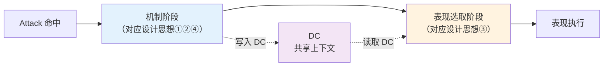
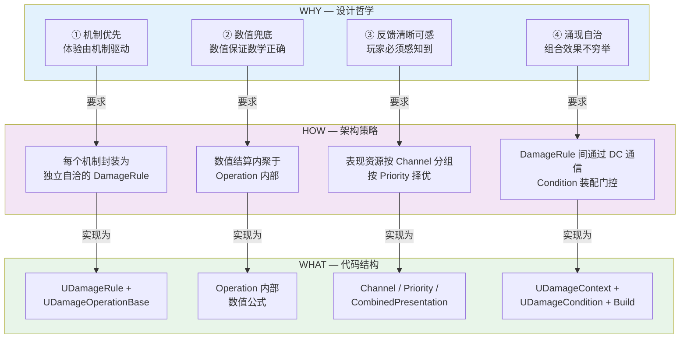
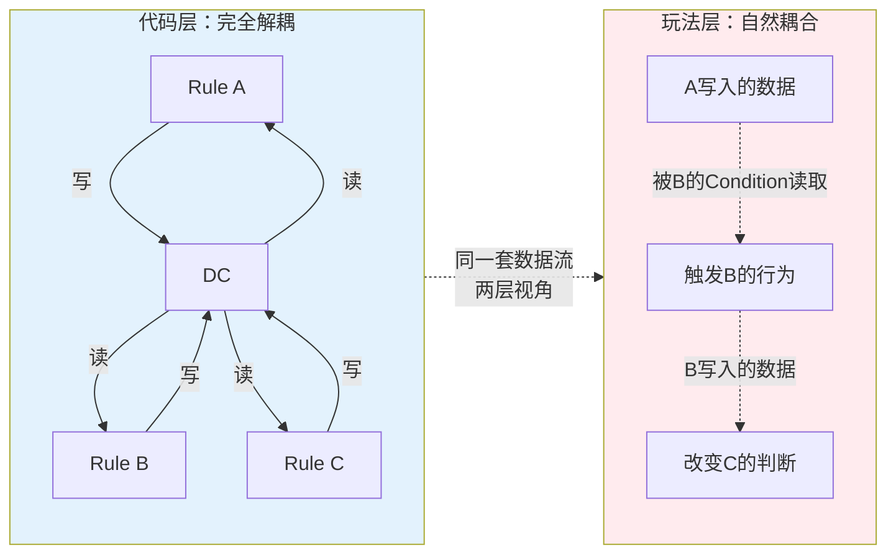

# DamagePipeline 架构设计

> **读者**：程序 / TD 深度用户
> **预期阅读时间**：60 分钟
> **前置阅读**：[`README.md`](./README.md) 全文 + [`快速入门.md`](./快速入门.md) §3

---

## 本文档的组织方式

DamagePipeline 是一个**领域 DSL**（L3 工具层，见 [`README.md §4`](./README.md)）。本文档严格按 **领域 DSL 的七要素** 组织主章节——每一要素一节——这样做的好处：

1. 新人阅读时可以对照"DSL 框架"建立完整心智模型，而不是在零散的类和函数之间拼图
2. 每一节的代码锚点直接指向实现，便于从概念跳到代码
3. 便于把 DamagePipeline 和其他 L3 工具（行为树 / 材质编辑器 / Niagara 等）做横向类比

### 七要素与代码的对应总览

| # | 要素 | 核心问题 | 代码载体 |
|---|---|---|---|
| 1 | 领域原语 | 这个领域里的基本概念有哪些 | `UDamageRule` / `UDamageOperationBase` / DamageEffect USTRUCT / `UDamageCondition` / `UDamagePredicate` / `UDamageContext` / `UDamagePipeline` |
| 2 | 语法 | 怎么把原语拼成合法的声明 | `Produces` 声明 / Condition 树配置 / `OperationClass` 引用 |
| 3 | 语义 | 合法声明执行时意味着什么 | 四条设计思想 + R1-R6 本质约束 |
| 4 | 类型系统 | 怎么保证不同原语能正确对接 | `UScriptStruct*` 作类型标识 + `FInstancedStruct` 多态 |
| 5 | 执行引擎 | 运行时怎么跑起来 | `Build()` Kahn BFS / `Execute()` 主循环 |
| 6 | 运行时 | 执行过程中数据住在哪里 | `UDamageContext` 的 `TMap<UScriptStruct*, FInstancedStruct>` |
| 7 | 验证机制 | 怎么在运行前发现错误 | 拓扑防环 / EffectType 校验 / 缺失容错 |

之外还有：
- §10 Sekiro 实例索引（DSL 用法案例）
- §11 从设计哲学到架构的推导（WHY→HOW 纵向推导，保留了本项目最核心的架构推导）
- §12 延伸阅读

---

## §2 两阶段架构总览

DamagePipeline 的任何一次执行都由两阶段组成：



**两阶段通过 DC 连接**——表现选取阶段**只读 DC，不写 DC**，表现不反过来影响机制结果。

**当前实现状态**：
- ✅ 机制阶段——完整落地（Build + Execute 主循环）
- 🔴 表现选取阶段——模型规范已定义（Channel / Priority / CombinedPresentation），代码尚未实施（见 [`待讨论问题集.md`](./待讨论问题集.md) B1）

本文档后续大部分内容聚焦**机制阶段**（因为这是当前已实现的核心）。表现选取在 §11.3 简要描述模型意图。

---

## §3 要素一：领域原语

### §3.1 DamageRule（聚合根）

**定义**：一条完整的伤害规则，是 DSL 的**声明单元**。

```cpp
// DamageRule.h
class UDamageRule : public UDataAsset
{
    UPROPERTY(EditAnywhere)
    UDamagePredicate* Condition;           // 生效条件树（可选）

    UPROPERTY(EditAnywhere)
    TSubclassOf<UDamageOperationBase> OperationClass;  // 计算逻辑的类引用

    // 从 OperationClass CDO 反查产出类型
    UScriptStruct* GetProducesEffectType() const;

    // 从 Condition 树递归收集消费类型
    TArray<UScriptStruct*> GetConsumedEffectTypes() const;
};
```

**关键设计**：
- **Produces 通过 CDO 反查**，不存冗余字段——Operation 子类声明 `GetProducesEffectType()`，Rule 不重复声明
- **Consumes 通过 Condition 树递归提取**，不手动声明
- **Rule 自身不持有任何状态**——它是纯配置数据

### §3.2 DamageOperation（计算单元）

**定义**：Rule 的执行逻辑，纯函数风格。

```cpp
// DamageOperationBase.h
class UDamageOperationBase : public UObject
{
    UFUNCTION(BlueprintNativeEvent)
    void Execute(UDamageContext* Context, UPARAM(ref) FInstancedStruct& OutEffect);

    // 子类覆盖声明产出类型
    virtual UScriptStruct* GetProducesEffectType() const;
};
```

**关键设计**：
- **`OutEffect` 由框架预创建传入**——Operation 只需填字段，不需要构造
- **Operation 完全不知道自己的身份标识**——满足 R2 自洽性
- **不持久化状态**——每次 Execute 都是独立调用

代码锚点：`Plugins/SagaStats/Source/SagaStats/Public/DamagePipeline/DamageOperationBase.h`

### §3.3 DamageEffect（结构化产出 / 信号）

**定义**：Rule 的产出数据。以 `USTRUCT` 的形式存在。

**两种形态**：

```cpp
// 形态 A：复杂 Effect（多字段结构体）
USTRUCT(BlueprintType)
struct FGuardEffect
{
    GENERATED_BODY()

    UPROPERTY(BlueprintReadOnly)
    float PostureDamage = 0.f;

    UPROPERTY(BlueprintReadOnly)
    bool bJustGuard = false;
};

// 形态 B：信号 Effect（无字段，存在即 true）
USTRUCT(BlueprintType)
struct FLightningInAirEffect
{
    GENERATED_BODY()
    // 空结构——被 Condition 检查"是否存在"即可
};
```

**为什么这样设计**：DamageEffect **是结构化数据，不是对象**。没有行为、没有生命周期、没有标识——只有类型和字段。这保证了 Effect 可以被任意复制、序列化、网络同步。

### §3.4 DamageCondition / Predicate（判定原语）

Condition 采用**三层继承**结构，Predicate 是**容器层**。

#### §3.4.1 Condition 三层体系（v4.7+）

```
UDamageCondition            —— 纯抽象基类（所有 Condition 的公共契约）
├─ UDamageCondition_Effect  —— 基于 Effect 的判定（贡献 R5 产销依赖）
└─ UDamageCondition_Context —— 基于 Context 的判定（不贡献产销依赖）
```

两个具体子类**二选一**继承，对应两种不同的判定语义：

| 对比维度 | `_Effect` 子类 | `_Context` 子类 |
|---|---|---|
| 依赖的数据 | 某条 Rule 产出的 Effect（通过 `EffectType` 声明） | 仅 DamageContext 本身 + Game 扩展子类字段 |
| Evaluate 签名 | `(Context, InEffect)` —— 框架按 EffectType 预取 Effect | `(Context)` —— 不传 Effect |
| 贡献拓扑排序 | ✅ 通过 `GetEffectType()` 返回具体类型 | ❌ 基类默认 nullptr |
| Graph 节点表现 | 有输入 Pin + EffectType 色块 | 无 Pin、无色块 |
| 访问控制 | 可以读声明的 Effect + Game 扩展字段 | **只能**读 Game 扩展字段（签名里没有 InEffect，Context 的 GetEffect 是 protected） |

**何时选哪个**：
- 判定依赖某条 Rule 产出的 Effect → `_Effect` 子类
- 判定只看 Game 全局状态（tutorial 阶段 / boss 阶段 / 调试开关 / 难度等）→ `_Context` 子类
- 需要同时看 Effect + Game 扩展字段 → `_Effect` 子类（Evaluate 里 Cast<GameContextSubclass> 访问扩展）

**_Effect 示例**：

```cpp
UCLASS()
class UDamageCondition_IsLightning : public UDamageCondition_Effect
{
    virtual UScriptStruct* GetEffectType() const override
    {
        return FSekiroAttackContext::StaticStruct();
    }
    virtual bool Evaluate_Implementation(
        const UDamageContext* Context,
        const FInstancedStruct& ConsumedEffect) const override
    {
        const FSekiroAttackContext* Ctx = ConsumedEffect.GetPtr<FSekiroAttackContext>();
        return Ctx && Ctx->bIsLightning;
    }
};
```

**_Context 示例**：

```cpp
UCLASS()
class UDamageCondition_InTutorial : public UDamageCondition_Context
{
    virtual bool Evaluate_Implementation(const UDamageContext* Context) const override
    {
        // 只能读 Game 子类扩展字段
        const USekiroDamageContext* SekiroCtx = Cast<USekiroDamageContext>(Context);
        return SekiroCtx && SekiroCtx->bIsInTutorial;

        // ❌ 下面这行编译失败：Context->GetEffect 是 protected（访问控制见 §6.3）
        // return Context->GetEffect<FGuardEffect>() != nullptr;
    }
};
```

#### §3.4.2 UDamagePredicate（组合容器）

Predicate 负责 **Single / AND / OR + bReverse**。Condition 字段指向抽象基类 `UDamageCondition*`，允许两种子类混用。

```cpp
class UDamagePredicate_Single : public UDamagePredicate
{
    UPROPERTY(EditAnywhere, Instanced)
    TObjectPtr<UDamageCondition> Condition;   // 抽象基类指针，可以是 _Effect 或 _Context 子类

    virtual bool Evaluate(const UDamageContext* Context) const override;
    virtual TArray<UScriptStruct*> GetDependencyEffectTypes() const override;
};
```

**设计要点**：
- **职责清晰**：Condition 是领域知识（单个判定），Predicate 是组合逻辑（AND/OR/NOT）
- **bReverse 只在 Predicate 上**：所有"取反"逻辑只在容器层，不重复
- **叶子容器即刻有意义**：`Predicate_Single(Condition=X)` 表达"条件 X"，不需要"单叶子 AND"退化形式
- **GetDependencyEffectTypes 过滤 null**：_Context 子类返回 nullptr，容器层自动过滤——不贡献产销依赖

### §3.5 DamageContext（运行时载体）

**定义**：Pipeline 执行期的共享存储。

```cpp
// DamageContext.h —— 访问分层设计（详见 §6.3）
class UDamageContext : public UObject
{
    friend class UDamagePipeline;
    friend class UDamagePipelineResults;
    friend class UDamageCondition_Effect;
    friend class UDamageOperationBase;

public:
    // 公开 API（所有人可用）
    UFUNCTION(BlueprintCallable) void Reset();
    UFUNCTION(BlueprintCallable, BlueprintPure) FString DumpToString() const;

protected:
    // Effect 读写 API（protected，只对 friend 开放）
    template<typename T> void SetEffect(const T& Value);
    template<typename T> const T* GetEffect() const;
    template<typename T> bool HasEffect() const;
    void SetEffectByType(const FInstancedStruct& Value);
    FInstancedStruct GetEffectByType(UScriptStruct* Type) const;
    bool HasEffectByType(UScriptStruct* Type) const;

private:
    UPROPERTY()
    TMap<TObjectPtr<UScriptStruct>, FInstancedStruct> DamageEffects;
};
```

**关键设计**：DC 的 Effect 读写 API 全部 protected——违反 R5（越界读其他 Effect）在编译期被拒绝。Game 侧合法访问走 `UDamagePipelineResults`；DSL 内部通过 friend 授权。详见 §6.3 和 §8。

### §3.6 DamagePipeline（执行引擎容器）

**定义**：Rule 列表 + Build + Execute。

```cpp
// DamagePipeline.h
class UDamagePipeline : public UDataAsset
{
    UPROPERTY(EditAnywhere)
    TArray<UDamageRule*> DamageRules;  // 编辑时的无序列表

    UPROPERTY()
    TArray<UDamageRule*> SortedRules;  // Build 后的拓扑有序列表（持久化）

    UPROPERTY()
    bool bIsBaked = false;

    FPipelineSortResult Build();               // 拓扑排序 + 产销校验
    TArray<FRuleExecutionEntry> Execute(UDamageContext*);  // 按 SortedRules 顺序执行

private:
    FPipelineSortResult StableTopologicalSort();  // Kahn BFS 稳定版本
};
```

**关键设计**：Pipeline 既是**数据容器**（TD 编辑的资产），也是**执行引擎**（运行时直接调 Execute）。没有单独的 "PipelineManager"——自洽。

---

## §4 要素二：语法

DSL 的语法就是"怎么把原语组合成合法的声明"。DamagePipeline 的语法有三个层次。

### §4.1 Produces 声明：通过 Operation 子类反查

**语法形式**：

```cpp
class UDamageOperation_Guard : public UDamageOperationBase
{
    virtual UScriptStruct* GetProducesEffectType() const override
    {
        return FGuardEffect::StaticStruct();
    }

    virtual void Execute_Implementation(
        UDamageContext* Context,
        FInstancedStruct& OutEffect) override
    {
        FGuardEffect Effect;
        Effect.PostureDamage = /* 计算 */;
        Effect.bJustGuard    = /* 计算 */;
        OutEffect.InitializeAs<FGuardEffect>(Effect);
    }
};
```

**为什么不在 Rule 上直接声明 Produces**：
- **避免冗余与不一致**：如果 Rule 也存 ProducesType 字段，Operation 也存，两处必然漂移
- **CDO 反查保证一致性**：Rule 只保存 `OperationClass`，产出类型从 CDO 动态查询

### §4.2 Condition 树：递归嵌套 Predicate

**语法形式**（编辑器 Instanced 属性）：

```
DamageRule: DR_GuardSuccess
  Condition:
    UDamagePredicate(Op=AND, bReverse=false)
      Children:
        UDamagePredicate(Op=Single)
          Condition: UDamageCondition_IsGuard  // EffectType=FSekiroAttackContext
        UDamagePredicate(Op=Single, bReverse=true)
          Condition: UDamageCondition_IsJustGuard
```

**递归求值**（`UDamagePredicate::EvaluatePredicate`）：

```
EvaluatePredicate(Context):
  result = match Op:
    Single:  Condition ? Condition->EvaluateCondition(Context) : true
    AND:     all(child.EvaluatePredicate(Context) for child in Children)
    OR:      any(child.EvaluatePredicate(Context) for child in Children)
  return bReverse ? !result : result
```

**Condition 缺失时的默认语义**：Rule 没有 Condition 字段 → 视为 true（无条件触发）。这是 R3 的"缺失视为 false"的反向——单个 Condition 缺失是 false，整个 Condition 字段缺失是 true（无限制）。

### §4.3 OperationClass 引用

**语法形式**：`TSubclassOf<UDamageOperationBase> OperationClass`

**运行时构造**：

```cpp
// 简化版的 Execute 主循环
UDamageOperationBase* OpInstance = NewObject<UDamageOperationBase>(Pipeline, Rule->OperationClass);
FInstancedStruct OutEffect;
OutEffect.InitializeAsScriptStruct(Rule->GetProducesEffectType());
OpInstance->Execute(Context, OutEffect);
Context->SetEffectByType(OutEffect);
```

**关键点**：Operation 是**每次执行都重建的无状态对象**。没有缓存，没有复用。这简化了并发/重入问题。

---

## §5 要素三：语义

### §5.1 四条设计思想（速记）

详细论证见 [`README.md §5`](./README.md)。本节只列名称，说明每条在架构里对应到什么。

| 思想 | 架构投影 |
|---|---|
| ① 机制优先 | 每个机制 = 一条 DamageRule，自洽封装（Operation 内部数值，不外泄） |
| ② 数值兜底 | 数值计算内聚于 Operation 内部，管线层不感知 |
| ③ 反馈清晰可感 | Channel / Priority / CombinedPresentation（表现选取阶段） |
| ④ 涌现自治 | DC 共享通信 + Condition 装配门控 + 自动拓扑排序 |

### §5.2 R1-R6 本质约束（深度解释）

这 6 条是 DSL 的**语义契约**。任何实现必须满足，破坏一条都会让 DSL 的可组合性崩塌。速查卡片见 [`快速入门.md §3`](./快速入门.md)。

#### R1：DC 是唯一通信介质

**陈述**：DamageRule 之间**不直接调用**对方，也不互相持有引用。所有跨 Rule 的数据流动只能通过 DC。

**破坏后果**：
- Rule 之间硬耦合——改一处全线崩
- 运行时顺序依赖变得"隐性"，看 Rule A 的代码不能知道它依赖 Rule B
- 动态管线无法工作（移除 B，A 的直接调用崩溃）

**代码保障**：`UDamageOperationBase::Execute(Context, OutEffect&)` 的签名不暴露其他 Operation——Operation 只能通过 Context 读/写 Effect。

#### R2：Operation 自洽

**陈述**：Operation 不知道自己被什么 Condition 门控，不知道管线里还有什么其他 Rule，是纯函数。

**破坏后果**：
- Operation 依赖"被谁调用"——Rule 不能被独立测试
- Condition 与 Operation 耦合——换 Condition 需要改 Operation
- R4（装配关系）无法维持

**代码保障**：Execute 签名里没有 Rule 引用。Operation 不能查询"我是谁"。

#### R3：Condition 只读 DC，缺失视为 false

**陈述**：Condition 不能写 DC；DC 中不存在的 Effect 类型被查询时默认 false（Condition 作者可覆盖）。

**破坏后果**：
- 若 Condition 可写 DC：Condition 不再是纯判定，而是副作用操作；R4 装配关系崩塌
- 若缺失不容错：动态管线（没有某条 Rule 时）会崩——每条 Condition 都要显式处理"这个 Effect 可能不存在"

**代码保障**：`UDamageCondition::EvaluateCondition` 接收 `const UDamageContext*`（const）；框架为 Condition 自动按 `EffectType` 预取 Effect（不存在时传 invalid InstancedStruct，Condition 作者自选语义）。

#### R4：Condition 与 Rule 是装配关系

**陈述**：Condition 是 Rule 的**外挂门控**，不是内部逻辑；更换 Condition 不需要修改 Operation。

**破坏后果**：
- 如果 Condition 写在 Operation 内部（if-else 判定）：新增涌现需要修改已有 Operation 的代码
- "涌现自治"无法实现——任何新机制都要入侵已有机制

**代码保障**：`UDamageRule::Condition` 是独立的 UPROPERTY，运行时由框架先求值再决定是否调用 Execute。

#### R5：执行顺序由 EffectType 产销关系自动决定

**陈述**：Pipeline 中 Rule 的执行顺序**不由 TD 手动排**，而是由 Build 时从"Rule.Produces → Rule.Consumes"反推拓扑序。

**破坏后果**：
- TD 需要手动维护执行顺序——规模稍大就不可控
- 漏声明产销关系会让执行顺序"看似正确但实际错误"
- 动态管线必须在运行时手动排序——运行时开销 + 错误风险

**代码保障**：`UDamagePipeline::Build` 是唯一能生成 SortedRules 的接口；手动编辑 DamageRules 数组只是编辑时的便利，运行时必须以 SortedRules 为准。

#### R6：禁止循环依赖

**陈述**：Rule 的 Consumes 不能直接或间接引用自己的 Produces。

**破坏后果**：拓扑排序失败——管线无法 Build。

**代码保障**：Kahn BFS 检测：若 `Sorted.Num() < Rules.Num()`，说明环路存在，Build 返回失败。

### §5.3 R1-R6 之间的独立性

这六条不是可以挑选使用的"设计建议"，而是**互相支撑的网**：

- R1 + R4 = 可独立测试 Rule
- R2 + R3 = 动态管线可工作
- R5 + R6 = 执行顺序确定且无环
- 删掉任何一条，其他几条也会连带失效

三步检验（删除测试）对每一条都通过——都是本质复杂度。

---

## §6 要素四：类型系统

### §6.1 UScriptStruct\* 作类型标识

DamagePipeline 的类型系统**不发明新的类型容器**——直接复用 UE 的 `UScriptStruct*` 作为类型标识。

**含义**：
- `FGuardEffect::StaticStruct()` 就是"FGuardEffect 类型"的唯一标识
- DC 用它作 key：`DamageEffects.FindByKey(FGuardEffect::StaticStruct())`
- Condition 用它声明消费：`EffectType = FGuardEffect::StaticStruct()`
- Graph Pin 用它配色：`PinType.PinSubCategoryObject = FGuardEffect::StaticStruct()`
- Operation 用它声明产出：`GetProducesEffectType()` 返回它

**为什么不引入独立的 EffectKey 概念**（v4.6 决策，详见 [`_archive/已解决决策_v4.3-v4.7.md#D10`](./_archive/已解决决策_v4.3-v4.7.md) 和 `#D4`）：
- **三步检验**：删除测试——DSL 功能不丢；来源追溯——Key 是 v1.7 借来的设计；换表达验证——GAS 等同类系统无此层
- **结论**：独立 Key 是偶然复杂度

### §6.2 FInstancedStruct 多态承载

DC 需要存"多种类型的 struct"——这是多态问题。UE 的解决方案：`FInstancedStruct`。

**性质**：
- 内部持有一个 `UScriptStruct*`（类型）+ 一块按类型布局的内存（实例）
- 支持复制、序列化、网络同步、蓝图交互
- `GetPtr<T>()` 在类型不匹配时返回 nullptr（类型安全）

**DamagePipeline 的用法**：
- DC 的 value 类型是 `FInstancedStruct`
- Operation 的 `OutEffect` 参数是 `FInstancedStruct&`（框架预初始化类型，Operation 只填字段）
- 蓝图通过 `UDamagePipelineResults::WriteEffect` / `ReadEffect`（`CustomStructureParam`）自动推断类型——Game 侧唯一入口

### §6.3 类型安全的传递链

```
FGuardEffect::StaticStruct() 这个 UScriptStruct* 在三个位置必须一致：

   Rule.OperationClass CDO.GetProducesEffectType()
            ↓
   Condition (下游 Rule 的 Condition).EffectType
            ↓
   DC.DamageEffects[FGuardEffect::StaticStruct()]

Build 时校验产出一致；Execute 时用同一个 key 写/读；编译期 C++ 模板糖 SetEffect<T>/GetEffect<T> 保证不会错配。
```

### §6.4 DC 访问分层（R5 的编译期强制）

类型系统的一部分职责是**把设计契约落到编译器能检查的层面**。DamagePipeline 的 R5（执行顺序由 EffectType 产销关系自动决定）依赖一个前置契约：**Condition/Operation 内部不得越界读其他 Effect**（否则产销关系推导失真）。v4.7 通过访问控制把这条契约从"文档约束"升级为"编译器强制"。

**分层结构**：

| 场景 | 谁 | 访问路径 | 允许读哪些 Effect |
|---|---|---|---|
| Game 侧（Execute 前填输入 / Execute 后读产出 / 调试遍历） | Game 代码（C++ 或蓝图） | `UDamagePipelineResults::WriteEffect/ReadEffect/HasEffect/GetAllEffects` | **任意** Effect |
| DSL 内部 — Condition_Effect 预取 | 框架 | `UDamageCondition_Effect` 基类通过 friend 调 `Context->GetEffectByType(EffectType)` | 自己声明的那一个 |
| DSL 内部 — Condition_Context 求值 | 子类 Evaluate 实现 | **无任何 Effect 访问路径** —— 签名里不传 InEffect，Context 的 GetEffect 是 protected | **零** |
| DSL 内部 — Operation Execute | 子类实现 | Operation 基类的 `ReadEffect<T>(Context)` 模板（本轮不做产销校验，R5 强制留后续） | 任意（待后续收紧） |
| DSL 内部 — Pipeline Build/Execute | 框架 | 通过 friend 直接调 Context API | 任意（框架职责） |

**代码保障**：
- `UDamageContext::GetEffect<T>()` / `GetEffectByType()` / `HasEffect<T>()` / `GetAllDamageEffects()` 全部 `protected`
- Friend 列表：`UDamagePipeline` / `UDamagePipelineResults` / `UDamageCondition_Effect` / `UDamageOperationBase`
- 旧有 `UDamageContextLibrary`（v4.6 的通用蓝图读写桥）已在 v4.7 删除——不再存在蓝图通用读写节点
- `UDamagePipelineResults` 是 Game 侧**唯一的蓝图节点入口**，节点名明确表达"管线结果"语义

**违反契约的场景（编译期拒绝）**：

```cpp
// ❌ 在 UDamageCondition_Context 子类的 Evaluate 里：
const FGuardEffect* G = Context->GetEffect<FGuardEffect>();
// → 编译错误：GetEffect 是 protected，子类作用域不可访问
```

```
// ❌ 蓝图 Condition 节点面板搜 "Get Effect"：
// → 找不到通用的 DC 读取节点（旧 UDamageContextLibrary 已在 v4.7 删除）
// → 只能找到 UDamagePipelineResults::ReadEffect —— 但它是 Game 侧 API，语义上不该在 Condition 内部用
```

**破窗的边界**：
- C++ friend 是**类级别**授权，不是调用栈级别。理论上作者可以写 Proxy 类注入 friend 关系来绕过——但那是**显式**违反契约，Code review 能抓
- Operation 内部仍保留 `ReadEffect<T>` 通道（通过基类 friend）——本轮不做 Operation 侧的 R5 收紧，留到后续轮次引入 `ConsumesEffectTypes` 声明

---

## §7 要素五：执行引擎

### §7.1 Build：拓扑排序 + 校验

**入口**：`UDamagePipeline::Build()` — `DamagePipeline.cpp:204`

**算法**：Kahn BFS 稳定变体。

```
输入：DamageRules[] （TD 编辑时的无序数组）

Step 1 — 构建 ProducerMap
  for each rule in DamageRules:
      ProducesType = rule.OperationClass CDO.GetProducesEffectType()
      ProducerMap[ProducesType] = rule

Step 2 — 构建依赖图
  for each rule:
      for each consumedType in rule.Condition.GetDependencyEffectTypes():
          if ProducerMap.contains(consumedType):
              Dependencies[rule].add(ProducerMap[consumedType])
              InDegree[rule] += 1

Step 3 — BFS 稳定拓扑排序（StableTopologicalSort, private）
  queue = [rule for rule in DamageRules if InDegree[rule] == 0]
  queue.sort_by(原始索引)
  while queue not empty:
      r = queue.popFront()
      Sorted.append(r)
      for each downstream of r:
          InDegree[downstream] -= 1
          if InDegree[downstream] == 0:
              queue.insert_sorted_by(原始索引, downstream)

Step 4 — 环检测
  if Sorted.Num() < DamageRules.Num():
      Build failure: cycle detected

Step 5 — 持久化
  SortedRules = Sorted
  bIsBaked = true
```

**稳定性的价值**：标准 Kahn 算法对"同入度"节点取队首不保证顺序，导致每次 Build 结果可能不同。稳定变体按原始索引排序入队——保证同入度节点按 TD 在数组里的手工顺序执行。

**三步检验**：删除"稳定"约束→表达能力不丢失，但 TD 手动调整"两条无依赖 Rule 谁先谁后"的能力会丢。**结论**：偶然复杂度但极高价值的实现选择。

### §7.2 Execute：主循环

**入口**：`UDamagePipeline::Execute(UDamageContext*)` — `DamagePipeline.cpp:303-366`

```
输入：UDamageContext* Context （已由调用方预填攻击上下文）
前置：bIsBaked == true

for each sortedRule in SortedRules:
    // 1. 条件判定
    if sortedRule.Condition != nullptr:
        if !sortedRule.Condition.EvaluatePredicate(Context):
            Log: { rule, hit=false }
            continue

    // 2. 框架预创建 OutEffect
    ProducesType = sortedRule.OperationClass.CDO.GetProducesEffectType()
    FInstancedStruct OutEffect(ProducesType)  // 类型已设置，字段空

    // 3. Operation 填字段
    op = NewObject<UDamageOperationBase>(Pipeline, sortedRule.OperationClass)
    op.Execute(Context, OutEffect)

    // 4. 框架写 DC
    Context->SetEffectByType(OutEffect)
    Log: { rule, hit=true, effectType=ProducesType }

return 执行日志
```

**关键点**：
- **Operation 不写 DC**——框架写。R2 自洽（Operation 不需要知道"我产出到哪里"）。
- **每条 Rule 产 0 或 1 个 Effect**——语言被约束在这个形式上。多输出的需求用拆 Rule 实现。
- **失败的 Condition 不影响下游 Rule**——下游可通过"Effect 是否存在"判定该机制是否生效（R3 缺失容错）。

### §7.3 FRuleExecutionEntry 日志

Execute 返回 `TArray<FRuleExecutionEntry>` 日志，方便调试和分析：

```cpp
struct FRuleExecutionEntry
{
    FName RuleName;         // Rule 资产名
    bool  bConditionPassed; // Condition 是否通过
    UScriptStruct* EffectType; // 产出类型（Condition 失败时为 nullptr）
};
```

---

## §8 要素六：运行时

### §8.1 DC 存储模型

**代码锚点**：`DamageContext.h:79`

```cpp
UPROPERTY()
TMap<TObjectPtr<UScriptStruct>, FInstancedStruct> DamageEffects;
```

> 注：UE5 的 `TObjectPtr<UScriptStruct>` 与 `UScriptStruct*` 在语义上等价（运行时是同一个指针，编辑器下提供额外的资产追踪）。本文档其他位置用简洁的 `UScriptStruct*` 表达概念，仅此核心定义处保留代码真实形态。

**为什么是 TMap<UScriptStruct\*, FInstancedStruct>**（而非其他选项）：

| 候选 | 否决理由 |
|---|---|
| `TMap<FName, FInstancedStruct>` | FName 需要手动维护（FactKey），易打字错误、失去类型安全 |
| `TArray<FInstancedStruct>` | 查询需线性扫描，O(n) 不可接受 |
| `TMap<FString, ...>` | 同 FName，且字符串比较开销更大 |
| 分门别类的多个 Map（AttackContext / Effect 各一个） | 对使用者制造伪区别——DC 的目的是"**不关心谁放的，只关心类型**" |

**TMap<UScriptStruct\*, FInstancedStruct>** 同时满足：
- **类型即 Key**，编译时（C++ 模板糖）和配置时（编辑器类型选择器）都类型安全
- **哈希 O(1) 查询**
- **对使用者统一**——攻击上下文和 Rule 产出共用同一存储，读取方只看类型不问来源

### §8.2 生命周期

**DC 由调用方创建，生命周期由调用方管理**。Game 侧访问走 `UDamagePipelineResults`（唯一的外部 API 入口）：

```cpp
// 典型调用者代码（Game 侧 C++）
UDamageContext* Ctx = NewObject<UDamageContext>();

// 预填攻击上下文（Execute 前）
UDamagePipelineResults::WriteEffect<FSekiroAttackContext>(Ctx, AttackContext);

// 执行管线
Pipeline->Execute(Ctx);

// Execute 后读取产出
if (const FGuardEffect* Guard = UDamagePipelineResults::ReadEffect<FGuardEffect>(Ctx))
{
    // 应用格挡效果
}

// Ctx 被 GC 自动回收
```

**不由 Pipeline 持有 DC**——Pipeline 是无状态的（`bIsBaked`/`SortedRules` 是 Build 产物，不是运行时状态）。同一个 Pipeline 可以同时被多个调用者并发 Execute（当然每个调用者要传自己的 DC）。

> 为什么不能直接 `Ctx->GetEffect<T>()`：v4.7 起 DC 的 Effect 读写 API 是 protected——见 §6.4 访问分层。

### §8.3 Game 侧蓝图接口（UDamagePipelineResults）

C++ 模板 `UDamagePipelineResults::ReadEffect<T>(Ctx)` 在蓝图里无法直接使用——蓝图的"通配结构体"需要 CustomThunk + CustomStructureParam。

**方案**：把蓝图接口放在 `UDamagePipelineResults`（UBlueprintFunctionLibrary），作为 Game 侧唯一入口。蓝图节点显示为 "Read Pipeline Result" / "Write Pipeline Input"——名字本身标记"Game 侧消费者"语义。

```cpp
// DamagePipelineResults.h
UCLASS()
class UDamagePipelineResults : public UBlueprintFunctionLibrary
{
    UFUNCTION(BlueprintCallable, CustomThunk,
        meta=(DisplayName = "Write Pipeline Input", CustomStructureParam="Value"))
    static void WriteEffect(UDamageContext* Context, const int32& Value);

    UFUNCTION(BlueprintCallable, CustomThunk,
        meta=(DisplayName = "Read Pipeline Result",
              CustomStructureParam="OutValue", ExpandEnumAsExecs="ExecResult"))
    static void ReadEffect(const UDamageContext* Context,
                           EStructUtilsResult& ExecResult,
                           int32& OutValue);
};
```

**历史备注**：
- 旧有 `UDamageContextLibrary::SetEffect/GetEffect` 是 v4.6 的通用 Effect 读写蓝图通道，但它对 Condition/Operation 内部也可见——是绕过 R5 的漏洞来源
- v4.7 演进：彻底删除 `UDamageContextLibrary`（先移除 `BlueprintCallable`，审计确认无代码引用后删除类本身）；Game 侧统一走 `UDamagePipelineResults`
- 为什么不在 UDamageContext 成员上直接 CustomThunk：UE 没有配套的 K2Node 会导致 Stack 解析错乱崩溃（详见 [`_archive/已解决决策_v4.3-v4.7.md#D8`](./_archive/已解决决策_v4.3-v4.7.md)）

---

## §9 要素七：验证机制

DSL 的**验证机制**是 DSL 成熟度的一个分水岭——L2（可视化编辑）和 L3（领域 DSL）的关键区别之一就是**错误在"配置时"而非"运行时"暴露**。

### §9.1 拓扑防环

`UDamagePipeline::Build()` 内部——若 Kahn BFS 最终 Sorted 少于总 Rule 数，判定存在循环依赖：

```cpp
if (Sorted.Num() < DamageRules.Num())
{
    // Build 失败，SortedRules 不填，bIsBaked 保持 false
    UE_LOG(LogTemp, Error, TEXT("[DamagePipeline] Cycle detected"));
}
```

Graph Editor 在 Build 失败时显示空图 + Error 日志——强制 TD 先修环再看图。

### §9.2 EffectType 校验

Build 前置检查每条 Rule：

- `OperationClass` 非空
- CDO 的 `GetProducesEffectType()` 返回非空 `UScriptStruct*`

任一失败则 Build 失败、日志报错、bIsBaked 保持 false。

### §9.3 缺失容错

**语义**：Condition 消费的 EffectType 如果在 DC 里不存在，默认视为 false（由 Condition 作者决定是否覆盖为其他默认值）。

**为什么这是 DSL 的设计选择**：动态管线（Hades 式）里，不同轮次激活的 Rule 集合不同。没有"空中感电 Boon"时 `DR_LightningInAir` 不在管线里，`FLightningInAirEffect` 永远不写入 DC。此时下游 Rule 的 Condition `!HasEffect<FLightningInAirEffect>()` 应返回 true——"缺失视为 false"自动给出了这个行为。

**代码保障**：`UDamageContext::GetEffectByType(UScriptStruct*)` 在类型不存在时返回 invalid `FInstancedStruct`，`UDamageCondition_Effect::Evaluate_Implementation` 的 ConsumedEffect 参数此时为 invalid——Condition 作者用 `ConsumedEffect.GetPtr<T>() == nullptr` 检测。

**实现保障**：框架在 Evaluate 前按 `UDamageCondition_Effect` 子类的 `EffectType` 预取对应的 Effect 传给 Condition——Condition 不需要自己知道怎么从 DC 取。`UDamageCondition_Context` 子类不经过这个预取机制——它的 Evaluate 签名里根本没有 InEffect 参数。

---

## §10 Sekiro 实例索引（DSL 用法案例）

`Plugins/SagaStats/Source/SagaStats/Public/DamagePipeline/Sekiro/` 下是完整的只狼 MVP 实例，证明本 DSL 能表达复杂动作游戏伤害管线。

| 文件 | 机制 |
|---|---|
| DR_AttackContext | 攻击上下文原语（IsLightning / IsInAir 等基础 Condition 子类） |
| DR_AttackerBound | 攻击者限制（敌方 vs 友方判定） |
| DR_Mixup | 攻击分类：是否格挡、是否弹反判定 |
| DR_Guard | 格挡成功效果（架势伤害、弹反判定） |
| DR_Hurt | 普通命中效果 |
| DR_Collapse | 架势崩溃判定（忍杀机会） |
| DR_CollapseJustGuard | 弹反导致的架势崩溃 |
| DR_Death | 死亡判定（HP <= 0） |
| DR_Poison | 中毒状态应用 |
| DR_LightningOnGround | 地面雷击效果 |
| DR_LightningInAir | 空中雷击效果（不受伤信号） |
| DR_SuperArmor | 霸体状态 |
| DR_Toughness | 韧性扣减 |

每条 DR 都是**独立 DamageRule + Operation + Effect + 专用 Condition 子类**的四件套。测试 Actor：`ADamagePipelineTestActor`（按 1-5 键触发 5 个典型场景）。

---

## §11 从设计哲学到架构的推导（WHY→HOW 纵向）

本节保留了原版架构文档的设计哲学推导核心。与 §5.2 的"R1-R6 本质约束"互补——R1-R6 是**平铺的约束列表**，本节是**动机到选择的推导链**。

### §11.1 核心矛盾的形式化表述

动作游戏战斗架构面对的核心矛盾：

```
玩法层：网状·联动·高耦合
  → 伤害影响弹反，弹反影响硬直，硬直影响状态，状态影响 AI

代码层：树状·分层·解耦
  → 模块独立，接口清晰，可测试，可并行开发

矛盾：如何让代码高度解耦，却让玩法高度耦合？
```

这个矛盾是**本质复杂度**——它不是实现选择造成的，而是动作游戏体验本身要求的。任何架构方案都必须正面回答这个矛盾，而非回避。

### §11.2 四条设计思想的架构投影



### §11.3 涌现自治是核心架构价值

**④ 涌现自治** 是四条中架构价值最高的一条——它直接回答了"玩法耦合 vs 代码解耦"的核心矛盾。



- **代码层看到的**：三个独立模块，各自读写同一个数据结构，互不调用
- **玩法层看到的**：A 的产出影响 B 的行为，B 的产出影响 C 的判断——高度联动

**同一套代码，两层视角。** 这是架构对"玩法耦合 vs 代码解耦"矛盾的精确回答。

### §11.4 表现选取阶段（模型规范，尚未实施）

表现选取是模型规范中的第二阶段（见 §2），当前代码未实施，方向已确定：

```
机制阶段结果         │   表现选取（按 Channel 择优）         │  最终输出
─────────────────────┼─────────────────────────────────────┼──────────
DR_Guard   → P:60   │   FullBodyAnim Channel              │   播放:
DR_Lightn  → P:80   │   → death_fall (P:100) 胜出          │   death_fall
DR_Death   → P:100  │                                      │   + death_cry
                    │   SFX Channel                        │   + spark
                    │   → death_cry (P:100) 胜出           │
                    │                                      │
                    │   VFX Channel                        │
                    │   → spark (P:80) 唯一候选           │
```

**CombinedPresentation 的特殊价值**：Death + Lightning 同时生效时，不是分别播两个动画，而是播一个专门的 `Death_Electrocute`（雷电死亡动画）——反馈优化，非机制涌现。

代码实施追踪：[`待讨论问题集.md#B1`](./待讨论问题集.md)

### §11.5 涌现识别：架构师的核心价值判断

**每个 Operation 内部的 if-else，都可能是另一个独立机制的产出与当前机制的涌现。**

示例：`UDamageOperation_Lightning` 内部的 `if (IsInAir)`

- **表面理解**：这是 Lightning 机制的内部规则
- **深层理解**：
  - "角色在空中"是动作系统的产出（独立机制）
  - "空中 + 雷击"是两个机制的涌现
  - `IsInAir` 应该是 DC 中的独立 Effect 类型
  - "空中雷击的特殊处理"应该是独立的 `DR_LightningInAir` + `FLightningInAirEffect`

**涌现识别清单**（每次在 Operation 内部写 if-else 时自问）：

> 这个 if 的条件部分，是不是另一个独立机制的产出？
>
> - 是 → 提取为 DC 中的独立 Effect 类型 + 独立 DamageRule + Condition
> - 不是（只是本 Operation 内部的数值计算中间结果）→ 留在内部

**判断标准**：这个条件未来是否可能被其他机制独立引用。这个判断**只有设计者能做，不可由工具或 AI 代劳**。

### §11.6 偶然复杂度的产生规律

| 版本 | 引入的偶然复杂度 | 根因 | 教训 |
|---|---|---|---|
| v1.7 | Effect Type 自动 DAG | 抽象过高，超出认知带宽 | 不要用超前的抽象解决当前的问题 |
| v2.0 | 多输出口、连线分流、拦截链 | 用拓扑穷举涌现 | 涌现应该自治产生，不能穷举硬编码 |
| v2.5 | 词缀选取表、缺省逻辑、装饰器 | 用中间层包装本质概念 | 中间层不解决本质问题，只增加认知成本 |
| v2.5→v4.2 | 标题"声明式机制编排框架" | 工具层身份替代内容域 | 文档标题应该是内容域，不是工具层 |
| v3.0-3.1 | 手动线性序列 | 依赖关系是本质的，手动排序是偶然的 | 用自动拓扑排序替代手动排列 |

**核心教训**：设计者的模糊表述会把 AI 带向偶然复杂度。分工原则：
- 本质复杂度的识别和判断——**设计者的工作，不可委托**
- 偶然复杂度的实现——**AI 的工作，设计者做价值判断**

---

## §12 延伸阅读

### 权威规范（全量资料/）

仅作外部引用，不搬运到 doc/：

- [`模块化伤害管线_模型规范文档_v4_7.md`](../../全量资料/模块化伤害管线_模型规范文档_v4_7.md) — 模型层规范：四条设计思想、问题域模型、R1-R6 约束
- [`模块化伤害管线_实现层架构文档.md`](../../全量资料/模块化伤害管线_实现层架构文档.md) — 实现层设计依据
- [`模块化伤害管线_DamageEffect模型设计.md`](../../全量资料/模块化伤害管线_DamageEffect模型设计.md) — Effect 模型的三步检验与论证

### 理论锚点

- [`L3工具的本质_领域DSL_认知成长记录.md`](../../全量资料/L3工具的本质_领域DSL_认知成长记录.md) — DSL 七要素框架、Fowler DSL 定义、GDC 案例映射

### 历史决策

- [`_archive/已解决决策_v4.3-v4.7.md`](./_archive/已解决决策_v4.3-v4.7.md) — 13 条已归档决策（回答"为什么是这样"）

### L4 编辑器实现

- [`../damagePipelineEditor/GraphEditor实现.md`](../damagePipelineEditor/GraphEditor实现.md) — Graph 可视化的布局 / 走线 / 配色实现

---

**文档版本**：2.0（按 DSL 七要素重写）
**最后更新**：2026-04-17
