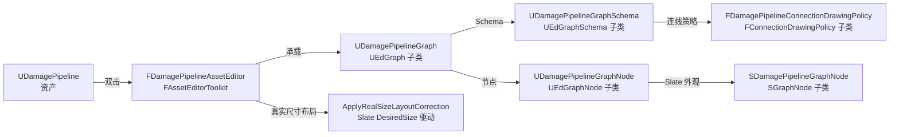

# DamagePipeline Graph Editor — 实现原理与代码清单

> ⚠️ **本文档是 L4 工具层实现细节**，不是 DSL 本体。
> 核心领域模型（DamageRule / DamageEffect / DamageCondition / DamageContext）见 [`../damagePipeline/`](../damagePipeline/)。

> **一句话本质**：DamagePipeline 的 Graph 编辑器是一套**只读 DAG 可视化器**，核心命题是"让 Rule → Effect → Rule 的产销关系一眼可读"。实现上的关键发明是**阶梯 Y + 通道 X 的双重唯一性布局**——通过在**布局层**保证每个 Pin 的 Y 和每条边的垂直段 X 都在全图唯一，**按构造**消除 wire-wire 和 wire-node 的所有叠加冲突，而不是用事后的避让启发式去打补丁。

**文档日期**：2026-04-15（2026-04-17 迁移到本目录）
**关联模块**：`Plugins/SagaStats/Source/SagaStatsEditor/` 下的 Graph/\* 子目录
**前置阅读**：[`../damagePipeline/README.md`](../damagePipeline/README.md)（DamagePipeline 设计哲学）、[`../damagePipeline/架构设计.md`](../damagePipeline/架构设计.md)（运行时模型）

---

## 可调参数速查表

调整 Graph 外观时，先查这张表定位要改的常量，再去源文件改值、重编译。

### 布局常量

> **修改位置**：`Plugins/SagaStats/Source/SagaStatsEditor/Private/Graph/DamagePipelineLayoutConstants.h`

| 常量 | 默认值 | 作用 | 建议范围 | 调大/调小的效果 |
|---|---|---|---|---|
| `BaseGap` | 20 | 节点间的基础 X 间距（纯 padding，不含通道） | 10~60 | 大 → 横向稀疏；小 → 紧凑，但通道仍有 ChannelWidth 保底 |
| `ChannelWidth` | 12 | 每个输入 Pin 独占的垂直走线通道宽度（DrawingPolicy 按此算 DropX） | 8~25 | 大 → 输入多的节点前有更宽通道；小 → 紧凑但 wire 间距缩小 |
| `GapBetweenNodesY` | 10 | 节点底边到下一个节点顶边的 Y 间距 | 0~40 | 大 → 竖向松散；0 → 节点紧贴（无间隙） |

**布局公式**（Slate 真实尺寸驱动，在 `FDamagePipelineAssetEditor::ApplyRealSizeLayoutCorrection` 中执行）：
```
X 方向（等宽节点接续 + 通道区）：
  X[i+1] = X[i] + RealNodeWidth[i] + BaseGap + InputPinCount[i+1] × ChannelWidth

Y 方向（第 5 代：PinArea 接续，表头允许 Y 重叠）：
  PinAreaTop[i+1]  = PinAreaBottom[i] + GapBetweenNodesY
  NodeTop[i+1]     = PinAreaTop[i+1] - HeaderHeight[i+1]
                   = PinAreaTop[i+1] - (RealNodeHeight[i+1] - PinAreaHeight[i+1])

  其中 PinAreaHeight 由 SDamagePipelineGraphNode::GetPinAreaDesiredHeight() 给出
  （查询 Pin 区 SHorizontalBox 的 DesiredSize.Y）
```
节点的真实 width/height 由 Slate `GetDesiredSize()` 提供。Y 方向**只避让 Pin 区**（连线 R1 约束只要求 pin Y 唯一），**表头区在 Y 上和上一节点下半区重叠**——配合 X 方向阶梯，节点的表头不会真的视觉覆盖；整张图垂直紧凑度大幅提升（节点数越多效果越明显）。

### 样式常量

> **修改位置**：`Plugins/SagaStats/Source/SagaStatsEditor/Private/Graph/SDamagePipelineGraphNode.cpp`

| 常量 | 位置 | 默认值 | 作用 |
|---|---|---|---|
| Condition 字体 | `PopulateConditionBox` | `FCoreStyle::GetDefaultFontStyle("Mono", 9)` | 等宽 DroidSansMono 9pt，保证 ASCII 树对齐 |
| Condition 颜色 | `PopulateConditionBox` | `FLinearColor(0.7, 0.7, 0.2)` 黄色 | Condition 行文字颜色 |
| 色块尺寸 | `PopulateConditionBox` | `FVector2D(10, 10)` | Condition leaf 行右侧的 EffectType 色块大小 |
| Description 字体 | `UpdateGraphNode` | `FCoreStyle::GetDefaultFontStyle("Regular", 8)` | 小号灰色描述文字 |
| Description 颜色 | `UpdateGraphNode` | `FLinearColor(0.6, 0.6, 0.6)` 灰色 | — |
| Description 换行宽度 | `UpdateGraphNode` | `WrapTextAt(300.f)` | 软换行安全网宽度（像素），通常 ≤ 节点实际宽度 |
| 节点背景色 | `UpdateGraphNode` | `FLinearColor(0.83, 0.91, 0.99)` 浅蓝 | 节点 Body 的 `BorderBackgroundColor` |

### 调色板（Pin + Condition 色块共享）

> **修改位置**：`Plugins/SagaStats/Source/SagaStatsEditor/Private/Graph/DamagePipelineGraphSchema.cpp` — `GetColorForEffectType()`

12 色固定调色板（沿用 Mermaid 导出色系），按 EffectType 类名哈希分配：

```
#e6194b  #3cb44b  #4363d8  #f58231  #911eb4  #46f0f0
#f032e6  #bcf60c  #fabebe  #008080  #e6beff  #9a6324
```

无 EffectType 时回退色：`(0.42, 0.56, 0.75)` 蓝灰。

---

## 文档导航

本文只讲"如何把运行时 DAG 画成一张易读的图"。如果你想知道：
- DamageRule / DamageContext / DamagePipeline 的运行时语义 → [`../damagePipeline/架构设计.md`](../damagePipeline/架构设计.md)
- 各核心术语（Rule/Effect/Operation/Predicate）→ [`../damagePipeline/术语速查表.md`](../damagePipeline/术语速查表.md)

---

## WHY — 这个 Editor 要解决什么

### 命题一：DAG 可视化的第一要义是"读得懂"

DamagePipeline 是有向无环图（DAG），边代表 Rule 之间的 EffectType 产销关系。一个设计师看到这张图时，心里的问题是：
- "DR_NormalHit 的 DE_Guard 输入是从哪条规则来的？"
- "DR_Guard 的 DE_Guard 输出一共被几条下游消费了？"
- "这个长边横穿了哪些规则？"

UE 默认的 Blueprint Graph 渲染（贝塞尔曲线 + 自由布局）对**几何流畅**有追求，但对**可读性**不友好——曲线相互缠绕、走向不可预测。对我们这种小规模（5~30 节点）、只读、逻辑严格的图，贝塞尔曲线是**反语义**的。

### 命题二：冲突应该在布局层消灭，不是在走线层补救

行业里的 DAG 布局路线有两种：
1. **Sugiyama 层次化布局**（dagre / Graphviz / ELK 等）：层次排序 + 交叉最小化 + dummy 插入 + 边路由。启发式可以降低冲突数，但不是**零冲突**的保证。
2. **构造性布局**（我们选的）：用更强的约束把"两条线可能冲突"这件事从数学上消灭。

我们选后者。具体做法见命题三。

### 命题三：连线的冲突只有两种——水平叠 Y、垂直叠 X

把连线拆开看，Manhattan 折线只会有**水平段**和**垂直段**两种。两条线的"叠在一起"只可能来自：
- 它们的水平段在同一 Y 共享了某个 X 区间 → **水平叠 Y**
- 它们的垂直段在同一 X 共享了某个 Y 区间 → **垂直叠 X**

所以**构造性消灭冲突**的充要条件是：
- 保证任意两条线的水平段 Y 不重叠
- 保证任意两条线的垂直段 X 不重叠

### 命题四：零侵入 UE 源码

整套实现走 UE Graph Editor 的公开扩展点（`FConnectionDrawingPolicy` + `UEdGraphSchema::CreateConnectionDrawingPolicy`），不 fork 引擎、不注册全局 hook，只服务于我们自己的 `UDamagePipelineGraph` 类型，可完全可逆。

---

## HOW — 四个架构决策

### 决策 1：阶梯 Y 布局（解决水平叠 Y）

**约束**：每个 Pin 在全图有**唯一 Y 行**。

**算法**：每个节点的 Y 原点 = 前面所有节点总 Pin 行数的累积。

```
NodeY[k] = Σ(HeaderPadding + TotalPinCount[i] × PinRowHeight + BottomPadding + GapBetweenNodesY)
          for i < k
```

- 节点 0 的首个 pin Y = 0 + HeaderPadding
- 节点 1 的首个 pin Y = NodeY[1] + HeaderPadding > 节点 0 底部
- 每个节点的每个 pin Y = NodeY[k] + HeaderPadding + pinIdx × PinRowHeight

因为 NodeY[k] 单调递增，任何两个 pin 的 Y 都不可能相等。

**后果**：
- 任意两条连线的源 Y 互不相同（来自不同节点的输出 Pin）
- 任意两条连线的目标 Y 互不相同（来自不同节点的输入 Pin）
- **水平段按构造永不叠 Y**

### 决策 2：通道 X 布局（解决垂直叠 X）

**约束**：每条连线的垂直段在全图有**唯一 X 通道**。

**算法**：每个输入 Pin 独占一条 DropX 通道。对目标节点 B 的第 j 个输入 Pin：

```
DropX_j = B.LeftEdge - (j + 1) × ChannelWidth
```

`ChannelWidth = 20px`（常量）。第 0 个输入最靠近节点，第 M-1 个最远。

为了给这些通道腾出空间，节点前的 X gap 要扩展：

```
GapBefore[k] = BaseGap + InputCount[k] × ChannelWidth
```

所以 NodeX 也是累积非等距：

```
NodeX[k] = NodeX[k-1] + NodeWidth + BaseGap + InputCount[k] × ChannelWidth
```

**后果**：
- 不同目标节点的输入通道在不同 X 范围，彼此不相交
- 同一节点的不同输入 Pin 在不同 DropX slot，彼此不相交
- **垂直段按构造永不叠 X**

### 决策 3：3 段 Manhattan 走线

连线渲染极简——每条线只有 3 段：

```
(源 Pin 锚点)
  → (DropX, 源 Y)          — 水平从源 pin 右侧到 DropX
  → (DropX, 目标 Y)        — 垂直从源 Y 到目标 Y
  → (目标 Pin 锚点)        — 水平从 DropX 进入目标 pin 左侧
```

当源 Y == 目标 Y 时退化为单段横线。

不需要避让节点身体——配合阶梯 Y 布局，源 Y 严格在目标 Y 之上（source 在 target 之前 = source 节点在 target 节点上方），source 的水平段 Y 值比所有后续节点的顶部 Y 都小，不会穿身体；DropX 在 target 节点前的 gap 内，垂直段 X 值不在任何节点的 X 范围内。

### 决策 4：按 EffectType 配色

连线颜色直接来自输出 Pin 的 `PinType.PinSubCategoryObject`（UScriptStruct\*），通过 `Schema->GetPinTypeColor` 查 12 色 mmd 调色板，按 `GetTypeHash(TypeObj->GetName())` 取色——**跨会话稳定**。`DE_Mixup` 永远是粉色，`DE_Guard` 永远是蓝色。

---

## WHAT — 代码清单

### 模块骨架



### 关键类速查表

| 类 | 路径 | 继承 | 职责 |
|---|---|---|---|
| `UDamagePipelineGraph` | `Public/Graph/DamagePipelineGraph.h` | `UEdGraph` | 只读 DAG 容器。`RebuildGraph(Pipeline)` 创建节点+连 Pin；位置(0,0)由 AssetEditor 的真实尺寸布局覆盖 |
| `UDamagePipelineGraphNode` | `Public/Graph/DamagePipelineGraphNode.h` | `UEdGraphNode` | 持有 `TWeakObjectPtr<UDamageRule> Rule` + `SortIndex`；`AllocateDefaultPins` 从 Rule 拿 Produces/Consumes 建 Pin |
| `UDamagePipelineGraphSchema` | `Public/Graph/DamagePipelineGraphSchema.h` | `UEdGraphSchema` | 只读 Schema：禁手动连线、按类型配色、挂接自定义 DrawingPolicy |
| `FDamagePipelineConnectionDrawingPolicy` | `Private/Graph/DamagePipelineConnectionDrawingPolicy.h` | `FConnectionDrawingPolicy` | 每帧捕获节点矩形，用 DropX 公式画 3 段 Manhattan |
| `SDamagePipelineGraphNode` | `Private/Graph/SDamagePipelineGraphNode.h` | `SGraphNode` | 节点的 Slate 外观（标题、Condition ASCII 树 + 色块、Description） |

### 关键函数与数据流

#### 入口：`UDamagePipelineGraph::RebuildGraph(Pipeline)`

`Private/Graph/DamagePipelineGraph.cpp` — 整个 Editor 重建图表的单一入口。流程：

```
1. Clear existing nodes
   Modify() + RemoveNode 循环

2. Pipeline->Build()
   拿 SortResult。若有环直接 UE_LOG Error 并退出（图为空状态）

3. Create nodes
   按 SortedRules 顺序 NewObject UDamagePipelineGraphNode
   SetupNode(Rule, Index) + AllocateDefaultPins + AddNode
   同时构造 ProducerMap: UScriptStruct* → Node
   节点位置统一设为 (0, 0)——真实位置由 AssetEditor 的 ApplyRealSizeLayoutCorrection 用 Slate DesiredSize 计算

4. Create connections
   遍历每个 Consumer 的 Input Pin，按 PinName 匹配 Producer 的 Output Pin，MakeLinkTo

5. 等待 AssetEditor 一帧后调用 ApplyRealSizeLayoutCorrection
   通过 FTSTicker 注册 one-shot 回调，等 Slate widget 就绪后用真实 DesiredSize 算最终 NodePosX/Y
```

#### 布局：`FDamagePipelineAssetEditor::ApplyRealSizeLayoutCorrection`

`Private/DamagePipelineAssetEditor.cpp` — Slate 真实尺寸驱动的布局。通过 `SGraphPanel::GetNodeWidgetFromGuid` 查节点 Slate widget，调 `SlatePrepass(1.0f)` 强制 DesiredSize 缓存，然后逐节点按公式累加 X/Y：

```cpp
double CurX = 0.0, CurY = 0.0;
for (int32 i = 0; i < SortedNodes.Num(); ++i)
{
    const FVector2f DesiredSize = Widgets[i]->GetDesiredSize();
    const float RealW = FMath::Max(DesiredSize.X, 50.f);
    const float RealH = FMath::Max(DesiredSize.Y, 50.f);
    Node->NodePosX = FMath::RoundToInt(CurX);
    Node->NodePosY = FMath::RoundToInt(CurY);
    CurY += RealH + DamagePipelineLayoutConstants::GapBetweenNodesY;
    const int32 NextInputCount = InputCounts.IsValidIndex(i + 1) ? InputCounts[i + 1] : 0;
    CurX += RealW + DamagePipelineLayoutConstants::BaseGap
          + (double)NextInputCount * (double)DamagePipelineLayoutConstants::ChannelWidth;
}
```

常量定义（`DamagePipelineLayoutConstants` 命名空间，`Private/Graph/DamagePipelineLayoutConstants.h`）：
- `BaseGap = 20.f` — 节点之间 X 基础 gap
- `ChannelWidth = 12.f` — 每条输入通道宽度
- `GapBetweenNodesY = 10.f` — 节点 Y 间距

#### 挂接：`UDamagePipelineGraphSchema::CreateConnectionDrawingPolicy`

`Private/Graph/DamagePipelineGraphSchema.cpp` — UE 调用这个 override 决定"谁来画这张图的连线"。

```cpp
return new FDamagePipelineConnectionDrawingPolicy(
    InBackLayerID, InFrontLayerID, InZoomFactor,
    InClippingRect, InDrawElements, this);
```

`new` 出的 policy 对象的释放由 UE 的 SGraphPanel 接管（UE 标准约定）。

#### 绘制：`FDamagePipelineConnectionDrawingPolicy`

`Private/Graph/DamagePipelineConnectionDrawingPolicy.cpp` — 本 Editor 的核心。

**成员状态**：
- `TMap<UDamagePipelineGraphNode*, FBox2D> NodeRectByObject` — 本帧节点矩形映射

**流程**（被 UE 每帧调用一次）：

```
Draw(InPinGeometries, ArrangedNodes)
  ↓ 扫描 ArrangedNodes 填充 NodeRectByObject
  ↓ super::Draw() → 触发每条边的 DetermineWiringStyle + DrawSplineWithArrow

DetermineWiringStyle(OutputPin, InputPin, Params)
  ↓ 设置 AssociatedPin1/2（后面 DrawSplineWithArrow 要查）
  ↓ WireColor = Schema->GetPinTypeColor(OutputPin->PinType)

DrawSplineWithArrow(StartAnchor, EndAnchor, Params)
  ↓ 查 Params.AssociatedPin2 的 owning node = DstNode
  ↓ 在 DstNode->Pins 里找 InputPin 的 InputIdx（第几个 EGPD_Input Pin）
  ↓ 查 NodeRectByObject[DstNode] = DstRect
  ↓ DropX = DstRect.Min.X - (InputIdx + 1) × ChannelWidth
  ↓ Path = { Start, (DropX, Start.Y), (DropX, End.Y), End }
  ↓ DrawManhattanPath(Path, Params)

DrawManhattanPath(Path, Params)
  ↓ FSlateDrawElement::MakeLines 画折线
  ↓ 终点用 MakeRotatedBox 画箭头（朝向来自最后一段方向）
```

#### 节点 Pin 建立：`UDamagePipelineGraphNode::AllocateDefaultPins`

`Private/Graph/DamagePipelineGraphNode.cpp` — 从 Rule 的 `GetProducesEffectType()` 和 `GetConsumedEffectTypes()` 创建 Pin：

```cpp
// 输出 Pin（这条 Rule 产出的 Effect）
UScriptStruct* ProducesType = Rule->GetProducesEffectType();
if (ProducesType)
{
    UEdGraphPin* OutPin = CreatePin(EGPD_Output, TEXT("DamageEffect"), ProducesType->GetFName());
    OutPin->PinType.PinSubCategoryObject = ProducesType; // 关键：让 Schema 的 GetPinTypeColor 能按类型查颜色
}

// 输入 Pin（这条 Rule 依赖的 Effect）
for (UScriptStruct* Type : Rule->GetConsumedEffectTypes())
{
    UEdGraphPin* InPin = CreatePin(EGPD_Input, TEXT("DamageEffect"), Type->GetFName());
    InPin->PinType.PinSubCategoryObject = Type;
}
```

**关键点**：Pin 的 `PinSubCategoryObject` 存 `UScriptStruct*`——这是连接到布局和 DrawingPolicy 的唯一桥梁。配色、通道分配、Producer/Consumer 匹配都依赖这个字段。

### 文件清单

```
Source/SagaStatsEditor/
├── Public/Graph/
│   ├── DamagePipelineGraph.h              — UEdGraph 容器 + RebuildGraph 声明
│   ├── DamagePipelineGraphNode.h          — UEdGraphNode + Rule 引用
│   └── DamagePipelineGraphSchema.h        — UEdGraphSchema + 连线配色 / DrawingPolicy 挂接
├── Private/Graph/
│   ├── DamagePipelineGraph.cpp            — RebuildGraph 主流程
│   ├── DamagePipelineGraphNode.cpp        — SetupNode / GetNodeTitle / AllocateDefaultPins
│   ├── DamagePipelineGraphSchema.cpp      — GetPinTypeColor 12 色调色板 + CreateConnectionDrawingPolicy
│   ├── DamagePipelineLayoutConstants.h    — 布局常量命名空间（BaseGap/ChannelWidth/GapBetweenNodesY）
│   ├── DamagePipelineConnectionDrawingPolicy.h  — 连线策略类声明
│   ├── DamagePipelineConnectionDrawingPolicy.cpp — Draw / DrawSplineWithArrow / DrawManhattanPath
│   ├── SDamagePipelineGraphNode.h         — 节点 Slate 外观
│   └── SDamagePipelineGraphNode.cpp       — Condition ASCII 树 + 色块 + Description
└── DamagePipelineAssetEditor.{h,cpp}      — 资产编辑器 Toolkit，Build 按钮触发 RebuildGraph + ApplyRealSizeLayoutCorrection
```

---

## 核心约定（R1-R5）

实现层约束，改动前先看：

- **R1** — `AllocateDefaultPins` 必须设 `PinSubCategoryObject = UScriptStruct*`，这是配色和通道映射的唯一入口
- **R2** — 布局用 Slate 真实 DesiredSize 驱动，不使用节点尺寸估计值——避免实测与估计偏差导致连线穿身
- **R3** — DrawingPolicy 的 `NodeRectByObject` 是 frame-local 裸指针映射，生命周期严格在一次 Draw 调用栈内
- **R4** — 新增 Rule / 新增 Effect 不需要改 Graph Editor 代码，只需 `AllocateDefaultPins` 正确建 Pin、`GetPinTypeColor` 的哈希调色板自动分配颜色
- **R5** — Cycle detection 在 `Pipeline->Build()` 里，Graph Editor 只显示 Error 日志并保持空图，不尝试部分绘制

---

## 调试与故障排查

### 连线不按 EffectType 上色
- 检查 `AllocateDefaultPins` 是否漏了 `PinSubCategoryObject`
- 检查 `GetPinTypeColor` 里 `PinCategory == "DamageEffect"` 是否命中

### 连线穿过节点身体
- 真实尺寸驱动下理论上不应发生
- 如果发生，检查 `ApplyRealSizeLayoutCorrection` 里的 DesiredSize 是否是 0（Slate widget 没准备好）
- 临时加大 `BaseGap` 或 `ChannelWidth` 常量做应急

### 连线叠线
- 不应该发生。如果发生了，两种可能：
  1. 同一个源 Pin 多条下游——这是预期行为（它们共享"离开源的短段"，分叉后各走各的）
  2. 真正 bug——检查 `InputIdx` 计算是否从 0 开始、`DropX` 公式是否用的 `DstRect.Min.X`

### Build 按钮点了图空了
- 查 Output Log，应该有 `[DamagePipeline] RebuildGraph aborted: cycle detected` 错误——说明 Pipeline 有环依赖，检查 `UDamageRule` 的 `GetConsumedEffectTypes()` 是否引用了自己下游的产出

---

## 历史决策备忘

这套实现走到当前形态经历了四代：

- **第 1 代**：简单 XSpacing + zigzag Y（`i % 3`）。布局无语义基础、边穿节点。
- **第 2 代**：Sugiyama-lite（dummy 插入 + barycenter 迭代 + Real 锚定 Y=0 + per-edge MidX hash + NodeBounds 避让）。算法正确但"启发式叠启发式"，每次遇到新冲突就加一层补丁，wire congestion 无法根治。~500 行代码。
- **第 3 代**：阶梯 Y + 通道 X（静态常量估算节点尺寸）。**把冲突消灭在布局层**，但节点尺寸是估计值，实际 Slate 尺寸偏差导致间距不紧凑。
- **第 4 代**：阶梯 Y + 通道 X + **Slate 真实尺寸驱动**。`ApplyRealSizeLayoutCorrection` 用 `GetDesiredSize()` 取节点真实宽高，FTSTicker 延迟一帧等 Slate 就绪。LayoutEngine 整个被删除，布局代码融入 AssetEditor 一次性完成。
- **第 5 代（当前）**：**PinArea 驱动 Y**。识别到"连线 R1 只要求 pin Y 唯一，表头 Y 不受约束"后，把 Y 累加公式从"避让整节点高度"改为"避让 PinArea 高度"。`SDamagePipelineGraphNode` 给 Pin 区 SHorizontalBox 起名 `PinAreaBox`，暴露 `GetPinAreaDesiredHeight()`；`ApplyRealSizeLayoutCorrection` 按 `PinAreaTop[i+1] = PinAreaBottom[i] + Gap` 反推 `NodePosY`。节点表头和上一节点下半区在 Y 上重叠——因为 X 方向阶梯所以视觉上仍错开——图变紧凑。

**教训**：算法的优雅来自约束，不是来自启发式；架构的优雅来自使用系统真实数据，不是自己维护一套估计值。

---

**文档版本**：1.1（迁移到 damagePipelineEditor/ 子目录 + Slate 真实尺寸驱动章节对齐）
**最后更新**：2026-04-17
