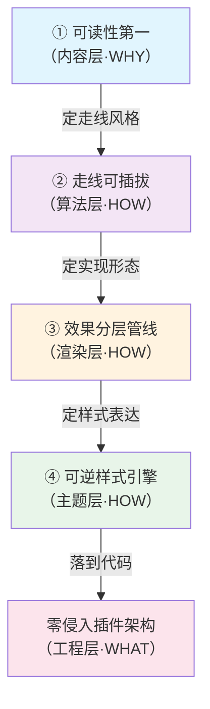
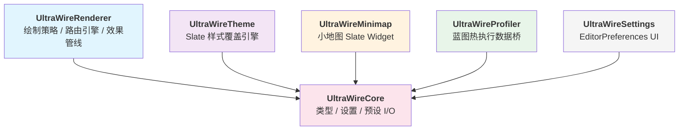

# UltraWire 插件 — 代码架构如何承载设计哲学 深度调研

> **一句话本质**：UltraWire 不是"把连线画得更好看的插件"——它是把"PCB 电路板的可读性美学"用一套**可插拔走线算法 + 分层效果管线 + 可逆样式引擎**植入 UE Graph Editor 的一次完整工程实践。

**调研日期**: 2026-04-14
**调研对象**: UltraWire v1.0.0 / StraySpark / UE 5.5–5.7
**Fab 地址**: https://www.fab.com/listings/e6966745-d898-4226-8022-2e2b31f7dda9
**本地源码**: `D:\MyWorkSpace\MySagaStats\Plugins\UltraWire\`
**调研方法**: 认知云梯 Research 模式 — 黄金圈法则（WHY→HOW→WHAT）
**调研纯度**: 纯设计哲学调研，不含使用者视角 / 竞品对比 / 风险评估

---

## 文档导航

| 文档 | 内容 | 适读角色 |
|------|------|---------|
| **本文** | 总览：设计命题与架构策略的逻辑链路 | 所有人 |
| [架构设计](./架构设计.md) | **重点文档**：HOW → WHAT 纵向深挖，每条架构策略对应的代码承载 | 程序、架构师 |
| [术语速查表](./术语速查表.md) | 模块 / 关键类 / 数据结构 / 走线风格速查 | 所有人 |

---

## WHY — UltraWire 要解决的核心命题

### 命题一：连线的第一要义是可读性，不是数学优雅

UE 原生 `FConnectionDrawingPolicy` 用贝塞尔曲线画连线，这是一个**几何学上优雅、工程学上灾难**的选择：

| 维度 | 贝塞尔曲线 | PCB 折线 |
|------|-----------|---------|
| **走向可预测性** | 自由曲率 → 用户无法预测走线路径 | 直角/45° → 走向一眼可读 |
| **大图可读性** | 几十条曲线纠缠成"面条汤" | 规整如工程蓝图 |
| **视觉信息密度** | 全图只有"是否连接"一个信息 | 折点 / 干线 / 交叉 表达层次 |
| **本质隐喻** | "自然流体"——美但无结构 | "电路走线"——可读即真理 |

**核心洞察**：Graph Editor 是**代码的可视化**，不是艺术作品。可读性不是锦上添花，是第一性原理。

### 命题二：走线风格要解耦，不能写死

一个插件要同时满足 Blueprint、Material、Niagara、Behavior Tree、PCG…… 12 种图编辑器的审美诉求，还要允许用户自由切换 Manhattan / Subway / Freeform / Bezier，**"硬编码一套走线"是绝路**。

这就要求架构层面把"走线算法"抽象成可插拔的策略对象，而不是埋在 `DrawConnection` 里。

### 命题三：效果分层，每层可独立开关

连线渲染其实是 **5 层独立效果的叠加**：核心线段 / 发光 / 流动气泡 / 标签 / 交叉符号。它们天然解耦——视觉上可以任意组合，实现上也不应互相耦合。如果把这 5 层写成一团，任何一个效果的修改都会牵动整体，维护成本爆炸。

### 命题四：零侵入 UE 源码

插件要在商城上卖，就不能 fork 引擎。所有扩展必须通过 UE 公开的扩展点实现——`FGraphPanelPinConnectionFactory`、`FConnectionDrawingPolicy`、Slate 样式系统——绝不动引擎 CPP。这是**可卸载即可逆**的工程底线。

---

## HOW — 四条设计思想如何转化为架构策略

**架构策略映射**：

| 设计命题 | 架构策略 | 代码承载 |
|---------|---------|---------|
| 可读性第一 | 4 种走线风格 + A\* 智能避障 | `FUltraWireGeometry`（O(1) 几何）+ `FUltraWireRouteEngine`（A\*） |
| 走线可插拔 | 策略模式 + 风格枚举 | `ComputeWirePath()` 分发器，运行时按 `EUltraWireStyle` 切换 |
| 效果分层 | 5 个独立静态服务类 | `FUltraWireGlowRenderer` / `BubbleSystem` / `LabelRenderer` / `CrossingDetector` 按配置逐层叠加 |
| 可逆样式引擎 | Slate 样式快照 + 替换 | `FUltraWireThemeEngine::ApplyTheme` 对 10+ 个 `Graph.Node.*` 样式键做 snapshot-then-replace |
| 零侵入 | 工厂注册替代修改引擎 | `FUltraWirePinConnectionFactory` 注册 12 种 GraphType，劫持 `CreateConnectionDrawingPolicy` |

详见 → [架构设计](./架构设计.md)

---

## WHAT — 核心解决方案：六模块分层架构

**关键设计点**：

| 模块 | 是什么 | 承载什么设计思想 |
|------|--------|----------------|
| **Renderer** | 走线算法 + 效果管线 | 可读性第一 + 走线可插拔 + 效果分层 |
| **Theme** | 样式快照/替换引擎 | 可逆样式引擎 + 零侵入 |
| **Core** | 类型 + 配置 + 委托 | 跨模块共享数据 + 热重载总线 |
| **Minimap / Profiler / Settings** | 辅助特性模块 | 效果分层的横向延伸 |

**三层骨架**：

1. **Routing 层（算法）** — `ComputeWirePath` 分发到 4 种几何风格或 A\* 路由，输出 `TArray<FVector2D>` 折线路径
2. **Rendering 层（绘制）** — `DrawConnection` 按配置逐层叠加 Glow / Line / Bubble / Label，帧尾聚合 `DrawCrossings`
3. **Theme 层（样式）** — `ApplyTheme` 在配置变化时对 Slate 样式做 snapshot-then-replace，支持完全回滚

详见 → [架构设计](./架构设计.md) / [术语速查表](./术语速查表.md)

---

## 核心叙事

UltraWire 的架构由**四条设计命题**驱动——可读性第一、走线可插拔、效果分层、零侵入。可读性通过 PCB 折线替换贝塞尔曲线实现；可插拔通过策略模式下的风格分发实现；分层通过 5 个独立的静态服务类实现；零侵入通过 `FGraphPanelPinConnectionFactory` 的工厂注册和 Slate 样式的快照/回滚实现。整个插件是**六个模块**的组合——Core 提供类型与设置总线，Renderer 承载走线与效果管线，Theme 封装样式覆盖，Minimap/Profiler/Settings 是横向辅助特性。核心循环是"配置变更 → 多播委托 → 下一帧 DrawConnection 查询活跃 Profile → 重新走线/重绘效果"——零侵入 UE 源码、热重载、可完全卸载。

---

## 参考文献

| # | 来源 | 路径 / URL | 说明 |
|---|------|-----------|------|
| 1 | UltraWire 官方文档 | `Plugins/UltraWire/Docs/README.md` | 官方自述的 WHY/HOW/WHAT，用于交叉验证代码 |
| 2 | Fab 商城页面 | https://www.fab.com/listings/e6966745-d898-4226-8022-2e2b31f7dda9 | 产品定位、特性清单 |
| 3 | UltraWireRenderer 源码 | `Plugins/UltraWire/Source/UltraWireRenderer/` | 主绘制策略、路由引擎、5 个效果子系统 |
| 4 | UltraWireCore 源码 | `Plugins/UltraWire/Source/UltraWireCore/` | `FUltraWireProfile` / `UUltraWireSettings` / 预设 I/O |
| 5 | UltraWireTheme 源码 | `Plugins/UltraWire/Source/UltraWireTheme/` | `FUltraWireThemeEngine` 样式快照/覆盖引擎 |
| 6 | UltraWireMinimap 源码 | `Plugins/UltraWire/Source/UltraWireMinimap/` | `SUltraWireMinimap` Slate Widget + 拓扑缓存 |
| 7 | UltraWireProfiler 源码 | `Plugins/UltraWire/Source/UltraWireProfiler/` | `FUltraWireHeatmapBridge` 蓝图分析器桥 |
| 8 | UltraWireSettings 源码 | `Plugins/UltraWire/Source/UltraWireSettings/` | EditorPreferences UI / 细节定制 |
| 9 | UE `FConnectionDrawingPolicy` | `Engine/Source/Editor/GraphEditor/` | 插件继承的基类，理解扩展点 |
| 10 | UE `FGraphPanelPinConnectionFactory` | `Engine/Source/Editor/GraphEditor/Public/EdGraphUtilities.h` | 连线工厂注册入口 |

---

**文档版本**: 1.0
**最后更新**: 2026-04-14
