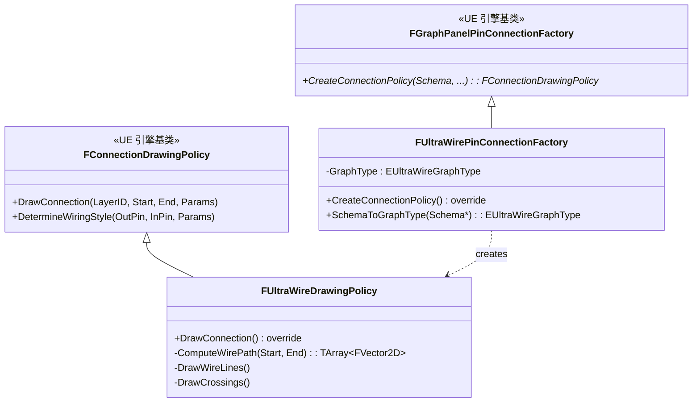
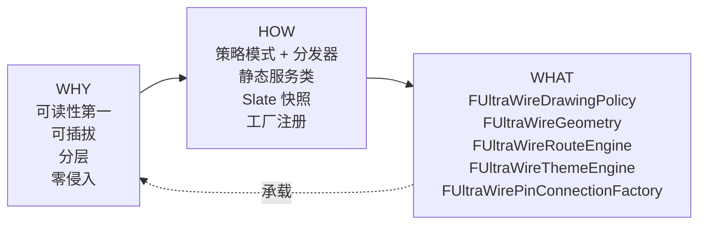

# UltraWire 架构设计 — 代码架构如何承载设计哲学

> 本文是 UltraWire 调研的**核心交付文档**。聚焦 HOW → WHAT 的纵向映射：每一条架构策略，对应的代码承载（文件路径 / 类名 / 函数签名）分别是什么。
>
> 读前先读 → [README](./README.md)（WHY 设计命题）

---

## WHY 快速回顾

四条设计命题（详见 README）：
1. **可读性第一** — 连线存在的目的是表达"代码的控制流/数据流"，贝塞尔曲线的几何优雅无法服务这个目的
2. **走线可插拔** — 不同图编辑器、不同用户口味需要不同走线风格，必须运行时切换
3. **效果分层** — 5 种视觉效果（Line / Glow / Bubble / Label / Crossing）天然解耦，实现上也必须解耦
4. **零侵入** — 作为商城插件必须通过 UE 公开扩展点实现，严禁修改引擎

---

## HOW → WHAT 映射

### 策略 1：扩展点选择 — 接管 UE 连线渲染的最小侵入路径

**HOW：** UE 提供两个层级的扩展点：
- **底层**：`SGraphPanel` / `SGraphNode` / `SGraphPin` —— 这层要改需要继承 Slate 控件，工作量大且会和其他插件冲突
- **高层**：`FConnectionDrawingPolicy` + `FGraphPanelPinConnectionFactory` —— 这层只负责连线绘制，粒度刚好

UltraWire 选择**高层**扩展点。

**WHAT：**



**注册流程** — `FUltraWireRendererModule::StartupModule()`：
1. 为 12 种 GraphType（Blueprint / Material / Niagara / AnimBP / BehaviorTree / PCG / SoundCue / MetaSound / EQS / ControlRig / GameplayAbility / Other）各创建一个 `FUltraWirePinConnectionFactory` 实例
2. 逐个调用 `FEdGraphUtilities::RegisterVisualPinConnectionFactory` 注册到全局
3. 当 UE 任何 `SGraphPanel` 需要画连线时，按顺序询问工厂 → 命中的 Factory 返回 `new FUltraWireDrawingPolicy(...)`

**关键文件：**

| 路径 | 内容 |
|------|------|
| `Source/UltraWireRenderer/Public/UltraWirePinConnectionFactory.h` | `FUltraWirePinConnectionFactory` 类声明 |
| `Source/UltraWireRenderer/Private/UltraWirePinConnectionFactory.cpp` | `CreateConnectionPolicy()` / `SchemaToGraphType()` 实现 |
| `Source/UltraWireRenderer/Public/UltraWireDrawingPolicy.h` | `FUltraWireDrawingPolicy` 类声明 |
| `Source/UltraWireRenderer/Private/UltraWireDrawingPolicy.cpp` | `DrawConnection()` 约 400 行实现 |
| `Source/UltraWireRenderer/Private/UltraWireRendererModule.cpp` | `StartupModule()` 注册 12 个工厂 |

**为什么不选 SGraphPanel**：
- Slate 控件继承会影响交互、布局、热键——所有这些都要重新接住
- 工厂注册是**可叠加**的——UE 按注册顺序尝试每个工厂，UltraWire 不会阻止其他插件共存
- 工厂+策略的粒度刚好是"只画连线"——符合**最小知识原则**（Least Knowledge Principle）

---

### 策略 2：走线算法可插拔 — 策略模式 + 分发器

**HOW：** 4 种纯几何走线 + 1 种 A\* 智能路由，共 5 种算法。通过一个配置枚举 `EUltraWireStyle` 统一切换，`DrawConnection` 不感知具体算法。

**WHAT：**

**分发器核心 — `FUltraWireDrawingPolicy::ComputeWirePath`** (Private:87-124 行级)

```cpp
TArray<FVector2D> ComputeWirePath(const FVector2D& Start, const FVector2D& End) const
{
    if (ActiveProfile.bEnableSmartRouting) {
        return FUltraWireRouteEngine::ComputeSmartRoute(
            Start, End, NodeRects,
            ActiveProfile.RoutingGridSize,
            ActiveProfile.RoutingNodePadding,
            ActiveProfile.WireStyle);
    }
    switch (ActiveProfile.WireStyle) {
        case EUltraWireStyle::Default:   return { Start, End }; // passthrough to bezier
        case EUltraWireStyle::Manhattan: return FUltraWireGeometry::ComputeManhattanPath(Start, End);
        case EUltraWireStyle::Subway:    return FUltraWireGeometry::ComputeSubwayPath(Start, End);
        case EUltraWireStyle::Freeform:  return FUltraWireGeometry::ComputeFreeformPath(Start, End, Profile.FreeformAngle);
    }
    return { Start, End };
}
```

**几何工具类 — `FUltraWireGeometry`**

| 方法 | 风格 | 复杂度 | 规则 |
|------|------|--------|------|
| `ComputeManhattanPath` | 90° 折线 | O(1) | 水平出 → 垂直 → 水平进。处理反向连接（输入在输出左侧）用"U 形绕回" |
| `ComputeSubwayPath` | 45° 折线 | O(1) | 水平出 → 45° 对角 → 水平进 |
| `ComputeFreeformPath` | 自定义角度 5°-85° | O(1) | 水平出 → 用户指定角度对角 → 水平进 |
| `ApplyCornerRounding` | 转角样式后处理 | O(N) | 对折线节点按 Sharp / Rounded(8 段弧) / Chamfered(45° 切角) 处理 |
| `ComputeRibbonOffset` | 干线合并 | O(1) | 同源多线按 Pin 索引垂直于走线方向偏移 |

**A\* 路由引擎 — `FUltraWireRouteEngine::ComputeSmartRoute`** (RouteEngine.h:184-190)

```cpp
static TArray<FVector2D> ComputeSmartRoute(
    FVector2D Start, FVector2D End,
    const TArray<FBox2D>& NodeRects,
    float GridSize, float NodePadding,
    EUltraWireStyle PreferredStyle);
```

**五步走：**
1. **`BuildGrid()`** — 把画布离散化为网格（5-50px/格可配，上限 512×512），生成 `FRouteGrid { Cols, Rows, CellSize, Cells[] }`
2. **`MarkOccupiedCells()`** — 所有 NodeRect 外扩 `NodePadding` 后栅格化成障碍位图
3. **`FindPath()`** — A\* 搜索
   - Manhattan 风格：4 方向 + Manhattan 启发
   - Subway/Freeform：8 方向 + Octile 启发，对角移动校验防止"切角穿节点"
4. **`SmoothPath()`** — 共线点合并，网格坐标 → 世界坐标
5. **`ApplyCornerRounding()`** — 接入 Geometry 的转角后处理

**性能兜底三件套：**
- **50ms 超时**：A\* 跑超时直接返回空数组，上层回退到简单几何走线
- **路由缓存 `FCachedRoute`**：key = hash(Start, End, NodeRects)，节点移动时按 AABB 增量失效
- **网格上限 512×512**：防止超大画布吃爆内存

**关键文件：**

| 路径 | 内容 |
|------|------|
| `Source/UltraWireRenderer/Public/UltraWireGeometry.h` | `FUltraWireGeometry` 静态工具类 |
| `Source/UltraWireRenderer/Private/UltraWireGeometry.cpp` | 4 种几何走线 + 转角 + Ribbon 实现，~500 行 |
| `Source/UltraWireRenderer/Public/UltraWireRouteEngine.h` | `FUltraWireRouteEngine` + `FRouteGrid` + `FCachedRoute` |
| `Source/UltraWireRenderer/Private/UltraWireRouteEngine.cpp` | A\* 实现 + 缓存管理，~600 行 |

**设计亮点：**
- **分发器无状态**：`ComputeWirePath` 只是 switch，不持有任何中间状态——符合策略模式的经典形态
- **几何算法纯函数**：`FUltraWireGeometry` 所有方法是 `static`，无类成员——易测试、易并行
- **A\* 和几何算法同层**：都是 `TArray<FVector2D>` 输入输出，可以互相替换，`DrawConnection` 完全不感知差异

---

### 策略 3：效果分层 — 5 个独立静态服务类

**HOW：** 连线渲染分为 5 个独立的视觉层，它们在配置上可以任意组合，在实现上应该**互不依赖**。

```
核心层：DrawWireLines                 ← 必画
发光层：FUltraWireGlowRenderer        ← 可选，背景层
线段层：DrawWireLines                 ← 主层
气泡层：FUltraWireBubbleSystem        ← 可选，前景层
标签层：FUltraWireLabelRenderer       ← 可选，前景层
交叉层：FUltraWireCrossingDetector    ← 可选，帧尾聚合
```

**WHAT：**

**主入口 `FUltraWireDrawingPolicy::DrawConnection`** 按层次调度：

```cpp
void FUltraWireDrawingPolicy::DrawConnection(
    int32 LayerID, const FVector2f& Start, const FVector2f& End,
    const FConnectionParams& Params) override
{
    // 1. 路由计算（策略 2）
    TArray<FVector2D> Path = ComputeWirePath(Start, End);

    // 2. 可选：发光背景层
    if (ActiveProfile.bEnableGlow) {
        FUltraWireGlowRenderer::DrawGlowPass(
            DrawElementsList, BackLayerID, Path,
            Params.WireColor, ActiveProfile.GlowIntensity,
            ActiveProfile.GlowWidth, bPulse, PulsePhase);
    }

    // 3. 主线段（处理 Gap 交叉模式）
    DrawWireLines(LayerID, Path, Params.WireColor, ActiveProfile.WireThickness);

    // 4. 可选：气泡动画
    if (ActiveProfile.bEnableBubbles) {
        FUltraWireBubbleSystem::DrawBubbles(
            DrawElementsList, FrontLayerID, Path,
            CurrentTime, ActiveProfile.BubbleSpeed, BubbleSize, Spacing);
    }

    // 5. 可选：自动标签
    if (ActiveProfile.bEnableAutoLabels && IsGetSetVariableWire(Params)) {
        FUltraWireLabelRenderer::DrawLabel(
            DrawElementsList, FrontLayerID, Path, VariableName);
    }

    // 6. 路径存入 WirePaths[] 供帧尾交叉检测
    WirePaths.Add(Path);
}

// 所有连线都画完后
void FUltraWireDrawingPolicy::DrawCrossings()
{
    TArray<FUltraWireCrossing> Crossings =
        FUltraWireCrossingDetector::DetectCrossings(WirePaths);
    for (const auto& C : Crossings) {
        FUltraWireCrossingDetector::DrawCrossingSymbol(
            DrawElementsList, TopLayerID, C, ActiveProfile.CrossingStyle);
    }
}
```

**5 个效果服务类 — 全部是静态工具类，无成员状态：**

| 类 | 路径 | 行数 | 核心函数 | 职责 |
|---|------|------|---------|------|
| **FUltraWireGlowRenderer** | `Public/UltraWireGlowRenderer.h` | ~200 | `DrawGlowPass()` | 4 层同心线加法混合，生成 bloom 光晕；可选正弦脉冲调制 [0.25, 1.0] |
| **FUltraWireBubbleSystem** | `Public/UltraWireBubbleSystem.h` | ~200 | `DrawBubbles()` | 按 `Time × Speed` 偏移沿路径参数化采样，画流动气泡点 |
| **FUltraWireLabelRenderer** | `Public/UltraWireLabelRenderer.h` | ~150 | `DrawLabel()` | 路径中点排版文字标签，半透明黑底 + 白字 |
| **FUltraWireCrossingDetector** | `Public/UltraWireCrossingDetector.h` | ~300 | `DetectCrossings()` / `DrawCrossingSymbol()` | 线段相交检测（O(W²·S²) + AABB 预裁剪），画 Gap / Arc / Circle 指示符 |

**设计亮点：**
- **5 层完全解耦**：每层只读取 `Path` 和 `Profile` 配置，不相互调用——加新效果只要加一个静态类，完全不改原有代码
- **静态类 + 无状态**：所有效果类都是纯函数形态，便于测试和并行
- **帧尾聚合 `DrawCrossings`**：交叉检测需要知道**所有**连线的路径，必须延迟到帧尾——通过 `WirePaths[]` 成员缓存实现
- **多 LayerID 分层渲染**：`BackLayerID` 画发光、主 `LayerID` 画线、`FrontLayerID` 画气泡/标签、`TopLayerID` 画交叉——Slate 层级系统天然分离

**关键文件：**

| 路径 | 内容 |
|------|------|
| `Source/UltraWireRenderer/Public/UltraWireGlowRenderer.h` | 发光渲染器 |
| `Source/UltraWireRenderer/Public/UltraWireBubbleSystem.h` | 气泡动画系统 |
| `Source/UltraWireRenderer/Public/UltraWireLabelRenderer.h` | 文字标签渲染器 |
| `Source/UltraWireRenderer/Public/UltraWireCrossingDetector.h` | 交叉检测 + 符号绘制 |

---

### 策略 4：可逆样式引擎 — 快照 + 替换 + 回滚

**HOW：** 节点主题化要改 UE 的 Slate 全局样式（`Graph.Node.Body`、`Graph.Node.TitleGloss` 等 10+ 个 key），但**绝不能永久修改**——插件禁用或卸载时必须完全回滚。

**WHAT：**

**主题引擎 — `FUltraWireThemeEngine`** (`UltraWireTheme` 模块)

核心函数：
```cpp
void ApplyTheme(const FUltraWireProfile& Profile);
```

**三步走：**

1. **Snapshot** — 首次修改前，遍历以下 Slate 样式键并调用 `SnapshotBrushIfNeeded`：
   ```
   Graph.Node.Body              ← 节点主体背景
   Graph.Node.TitleGloss        ← 标题栏光泽
   Graph.Node.ColorSpill        ← 标题色溢出
   Graph.Node.TitleHighlight    ← 标题高亮
   Graph.Node.Shadow            ← 阴影
   Graph.Node.ShadowSize        ← 阴影尺寸
   Graph.Node.PinPoint          ← Pin 连接点形状
   Graph.CommentBubble.Body     ← 注释框背景
   Graph.CommentBubble.Border   ← 注释框边框
   ```
   每个键首次替换前保存到 `TMap<FName, FSlateBrush> OriginalBrushes`

2. **Replace** — 根据 Profile 参数（`NodeBodyOpacity` / `NodeHeaderTintColor` / `NodeCornerRadius` / `PinShape`）生成修改后的 `FSlateBrush`，通过 `SetStyleBrush()` 写入全局 `FAppStyle`，然后调用 `FSlateApplication::InvalidateAllWidgets()` 触发重绘

3. **Rollback** — 插件禁用或用户关闭 Theming 时，遍历 `OriginalBrushes` 逐个恢复原值

**热重载总线 — `UUltraWireSettings`** (`UltraWireCore` 模块)

```cpp
UCLASS(Config=EditorPerProjectUserSettings)
class UUltraWireSettings : public UDeveloperSettings
{
    // 活跃 Profile，Per-GraphType 覆盖，全部预设 ...

    // 配置变更多播委托
    DECLARE_MULTICAST_DELEGATE(FOnUltraWireSettingsChanged);
    static FOnUltraWireSettingsChanged OnSettingsChanged;

    virtual void PostEditChangeProperty(FPropertyChangedEvent&) override
    {
        Super::PostEditChangeProperty(Event);
        OnSettingsChanged.Broadcast();
    }
};
```

**热重载链路：**
```
用户改 EditorPreferences
    → PostEditChangeProperty 触发
    → OnSettingsChanged.Broadcast()
    → FUltraWireThemeEngine 接收 → ApplyTheme() 重新 snapshot/replace
    → FUltraWireDrawingPolicy 下一帧 DrawConnection 查询新 ActiveProfile
    → 全局样式 + 连线渲染同步刷新，无需重启编辑器
```

**配置数据结构 — `FUltraWireProfile` USTRUCT** (`UltraWireCore/Public/UltraWireTypes.h:70`)

打包 ~25 个视觉参数为一个结构体：`WireStyle` / `CornerRadius` / `WireThickness` / `bEnableGlow` / `GlowIntensity` / `bEnableBubbles` / `BubbleSpeed` / `bEnableSmartRouting` / `RoutingGridSize` / `NodeBodyOpacity` / ... 

这个 USTRUCT 就是"一套完整的视觉预设"的最小单元，可以：
- 序列化为 `.ultrawire` JSON 文件导出/导入
- 按 Per-GraphType 存储不同覆盖（`TMap<EUltraWireGraphType, FUltraWireProfile>`）
- 由 5 个内置预设（Default / Circuit Board / Neon Cyberpunk / Clean Professional / Retro Terminal）提供默认值

**关键文件：**

| 路径 | 内容 |
|------|------|
| `Source/UltraWireTheme/Public/UltraWireThemeEngine.h` | `FUltraWireThemeEngine` 类声明 |
| `Source/UltraWireTheme/Private/UltraWireThemeEngine.cpp` | snapshot/replace/rollback 实现，~350 行 |
| `Source/UltraWireCore/Public/UltraWireSettings.h` | `UUltraWireSettings` + `OnSettingsChanged` 委托 |
| `Source/UltraWireCore/Public/UltraWireTypes.h` | `FUltraWireProfile` USTRUCT，~25 参数 |

**设计亮点：**
- **Snapshot-then-replace 是可逆性的关键**：没有快照就没有回滚
- **Slate 全局样式修改触达性极强**：不需要 hook 每个 `SGraphNode`，改 FAppStyle 就全图生效
- **`OnSettingsChanged` 多播委托是"热重载总线"**：所有模块只需订阅一个事件就能感知配置变化，解耦充分

---

### 策略 5：性能策略 — 缓存 / 超时 / 预裁剪

**HOW：** 图编辑器每帧重绘，性能是硬约束。UltraWire 的策略是**按特性分级施策**：一次性计算的用缓存，连续计算的用增量更新，昂贵操作加 AABB 预裁剪和超时兜底。

**WHAT — 分级策略表：**

| 特性 | 每帧开销 | 缓存策略 | 兜底 |
|------|---------|---------|------|
| 几何走线（Manhattan/Subway/Freeform） | O(1)，可忽略 | 无缓存，每帧重算 | 无需 |
| A\* 智能路由 | 中~高（50ms 上限） | 路由缓存 `FCachedRoute`，按 AABB 增量失效 | 50ms 超时 → 回退到简单几何走线 |
| 交叉检测 | O(W²·S²) | 无缓存，每帧运行 | AABB 预裁剪，先过滤掉不可能相交的对 |
| 发光渲染 | 低（每线 4 条额外线） | 无 | 无需 |
| 气泡动画 | 低（参数化采样） | 无 | 无需 |
| Minimap | 低 | 拓扑缓存 100ms（10 Hz）刷新 | 无需 |
| Heatmap | 极低（Profiler 未开时零开销） | 4 Hz 轮询 | 零开销设计：`FBlueprintCoreDelegates` 未激活时完全不运行 |
| Theming | 仅配置变更时 | `OriginalBrushes` 快照缓存 | 无需 |

**路由缓存数据结构 — `FCachedRoute`** (`UltraWireRouteEngine.h:341`)

```cpp
struct FCachedRoute
{
    TArray<FVector2D> Path;      // 已计算的折线路径
    TArray<FBox2D> NodeRects;    // 生成这条路径时的节点矩形快照
};

// 缓存键
TMap<uint32, FCachedRoute> RouteCache;
// uint32 key = hash(Start, End, 参与节点的 Rect 集合)
```

**增量失效逻辑：**
```
当节点 N 移动 →
  1. 遍历 RouteCache 中所有 FCachedRoute
  2. 对每条路径，检查 NodeRects 是否包含 N 的旧矩形
  3. 命中的条目从缓存中删除
  4. 下次 DrawConnection 时自动重算
```

**Heatmap 零开销设计 — `FUltraWireHeatmapBridge`** (`UltraWireProfiler` 模块)

```cpp
void UpdateProfilingData() // 每 ~250ms 轮询一次（4 Hz）
{
    if (!FBlueprintCoreDelegates::IsProfilerActive()) {
        return; // 早退，零开销
    }
    // 读取 per-Pin 执行计数 → 归一化 [0,1] → 存入 PinHeatMap
}

// DetermineWiringStyle 中调用
float Heat = HeatmapBridge.GetHeatForPin(OutPin);
if (Heat > 0) {
    Params.WireColor = HSVLerp(ColdColor, HotColor, Heat);
}
```

**关键文件：**

| 路径 | 内容 |
|------|------|
| `Source/UltraWireRenderer/Public/UltraWireRouteEngine.h` | `FCachedRoute` 定义 + 缓存管理 |
| `Source/UltraWireRenderer/Public/UltraWireCrossingDetector.h` | AABB 预裁剪 + O(W²·S²) 相交检测 |
| `Source/UltraWireProfiler/Public/UltraWireHeatmapBridge.h` | 零开销 4 Hz Heatmap 桥 |
| `Source/UltraWireMinimap/Private/SUltraWireMinimap.cpp` | 10 Hz 拓扑快照 |

**设计亮点：**
- **性能策略按特性分级**：不是"一刀切"全上缓存，而是对每个特性单独判断开销和收益
- **零开销设计是最高境界**：Heatmap 默认未激活时**完全不运行**，不是"运行得快"而是"根本不运行"
- **超时兜底是稳健性底线**：A\* 的 50ms 超时意味着"最坏情况下也不会冻结编辑器"，这是**正确性重于性能**的体现

---

## 关键函数签名总览

| 函数 | 路径 | 行数 | 职责 |
|------|------|-----|------|
| `FUltraWireDrawingPolicy::DrawConnection` | `UltraWireDrawingPolicy.cpp:79-83` | ~80 | 主绘制入口，调度所有层 |
| `FUltraWireDrawingPolicy::ComputeWirePath` | `UltraWireDrawingPolicy.cpp:87-124` | ~40 | 路由分发器 |
| `FUltraWireRouteEngine::ComputeSmartRoute` | `UltraWireRouteEngine.h:184-190` | ~200 | A\* 主入口 |
| `FUltraWireGeometry::ComputeManhattanPath` | `UltraWireGeometry.cpp` | ~50 | 90° 几何走线 |
| `FUltraWireGeometry::ApplyCornerRounding` | `UltraWireGeometry.cpp` | ~80 | 转角后处理 |
| `FUltraWireCrossingDetector::DetectCrossings` | `UltraWireCrossingDetector.cpp` | ~100 | 帧尾交叉检测 |
| `FUltraWireThemeEngine::ApplyTheme` | `UltraWireThemeEngine.cpp:51` | ~150 | 样式快照 + 替换 |
| `FUltraWireHeatmapBridge::UpdateProfilingData` | `UltraWireHeatmapBridge.cpp:94` | ~80 | 4 Hz 蓝图分析器轮询 |

---

## 总结：承载逻辑的闭环



四条设计命题 → 五条架构策略 → 六个模块 / 十余个关键类。每条命题都能在代码里找到**具体的承载点**，每个承载点都能追溯回**某条命题**。这就是"代码架构承载设计哲学"的范本形态。

---

**文档版本**: 1.0
**最后更新**: 2026-04-14
