# SagaAffix词缀系统GAS架构设计

## 文档信息
- **文档标题**: SagaAffix词缀系统GAS架构设计
- **创建日期**: 2025-07-17
- **版本**: v3.0 - 动作游戏特化版
- **设计方案**: 面向动作游戏优化的纯GAS架构
- **文档作者**: ZhangJinming
- **基于文档**: 动作游戏词缀系统设计指南.md

---

## 目录
1. [v3.0版本升级概述](#v30版本升级概述)
2. [动作游戏特化架构](#动作游戏特化架构)
3. [实时性能优化设计](#实时性能优化设计)
4. [玩家体验增强系统](#玩家体验增强系统)
5. [智能平衡与复杂度管理](#智能平衡与复杂度管理)
6. [社区与创作支持](#社区与创作支持)
7. [核心类设计优化](#核心类设计优化)
8. [动作游戏流程优化](#动作游戏流程优化)
9. [网络架构增强](#网络架构增强)
10. [实施路线图更新](#实施路线图更新)

---

## v3.0版本升级概述

### 🎮 动作游戏特化升级

基于《动作游戏词缀系统设计指南》的深度分析，v3.0版本专门针对动作游戏的特殊需求进行了全面优化：

#### 核心升级点
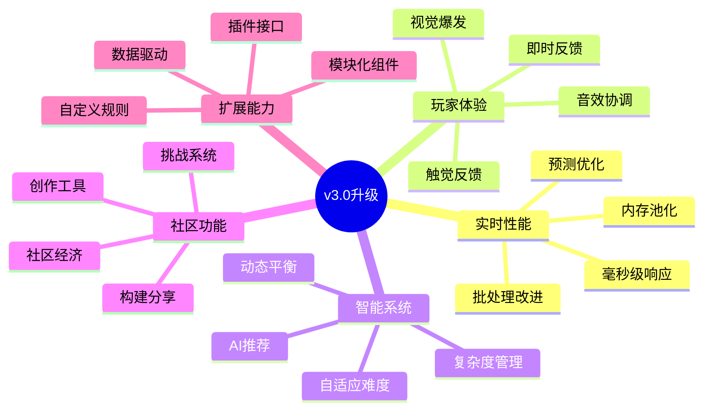

#### 设计理念进化
```
v2.0: 纯GAS架构，完美技术集成
         ↓
v3.0: 动作游戏专用，极致玩家体验
```

---

## 动作游戏特化架构

### 1. 响应式词缀系统架构

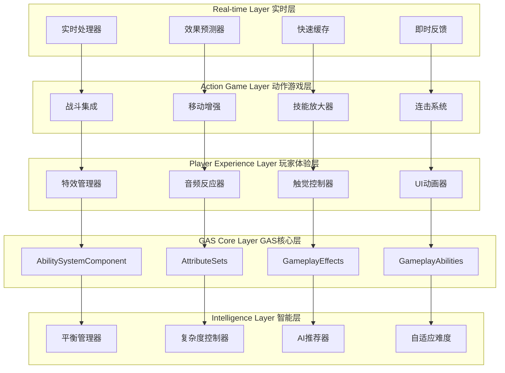

### 2. 动作游戏词缀分类系统

```cpp
/**
 * 动作游戏专用词缀分类
 * Action game specific affix categories
 */
UENUM(BlueprintType)
enum class ESagaActionAffixCategory : uint8
{
    // === 核心动作类 ===
    Combat          UMETA(DisplayName = "战斗增强"),     // 直接影响战斗效果
    Movement        UMETA(DisplayName = "移动强化"),     // 影响角色移动能力
    Defensive       UMETA(DisplayName = "防御提升"),     // 生存和防护能力
    
    // === 技能扩展类 ===
    SkillModifier   UMETA(DisplayName = "技能改造"),     // 改变现有技能
    ComboEnhancer   UMETA(DisplayName = "连击增强"),     // 连击和组合技
    ElementalFusion UMETA(DisplayName = "元素融合"),     // 元素效果组合
    
    // === 战术策略类 ===
    TimeManipulation UMETA(DisplayName = "时间操控"),    // 时间相关效果
    SpaceControl     UMETA(DisplayName = "空间控制"),    // 空间和位置
    ResourceManager  UMETA(DisplayName = "资源管理"),    // 能量、生命等资源
    
    // === 环境交互类 ===
    Environmental   UMETA(DisplayName = "环境交互"),     // 与环境的互动
    WeatherControl  UMETA(DisplayName = "天气控制"),     // 天气和氛围
    TerrainShaper   UMETA(DisplayName = "地形塑造"),     // 地形改变
    
    // === 社交协作类 ===
    TeamSynergy     UMETA(DisplayName = "团队协同"),     // 多人协作
    Leadership      UMETA(DisplayName = "领导能力"),     // 团队领导
    Support         UMETA(DisplayName = "支援辅助"),     // 辅助队友
    
    // === 创新实验类 ===
    Experimental    UMETA(DisplayName = "实验性"),       // 创新和实验
    Metamorphosis   UMETA(DisplayName = "形态变化"),     // 形态转换
    Reality         UMETA(DisplayName = "现实扭曲")      // 突破常规
};
```

### 3. 动作游戏响应优先级系统

```cpp
/**
 * 动作游戏响应优先级管理器
 * Action game response priority manager
 */
UCLASS()
class SAGASTATS_API USagaActionGameResponseManager : public UObject
{
    GENERATED_BODY()

public:
    // 响应优先级等级
    UENUM(BlueprintType)
    enum class EResponsePriority : uint8
    {
        Critical    = 0,    // 即死攻击、完美闪避等
        High        = 1,    // 重要攻击、技能释放等
        Medium      = 2,    // 一般攻击、移动等
        Low         = 3,    // 环境效果、UI更新等
        Background  = 4     // 统计更新、缓存清理等
    };
    
    struct FActionGameResponse {
        EResponsePriority Priority;
        float MaxLatency;       // 最大允许延迟(毫秒)
        bool bRequiresPrediction; // 是否需要预测
        bool bRequiresFeedback;   // 是否需要反馈
        FString Description;
    };
    
    // 预定义的响应配置
    TMap<FGameplayTag, FActionGameResponse> ResponseConfigs = {
        {
            FGameplayTag::RequestGameplayTag("Affix.Combat.CriticalHit"),
            {EResponsePriority::Critical, 16.0f, true, true, "暴击效果"}
        },
        {
            FGameplayTag::RequestGameplayTag("Affix.Movement.Dash"),
            {EResponsePriority::High, 33.0f, true, true, "冲刺移动"}
        },
        {
            FGameplayTag::RequestGameplayTag("Affix.Defense.Shield"),
            {EResponsePriority::High, 50.0f, false, true, "护盾激活"}
        },
        {
            FGameplayTag::RequestGameplayTag("Affix.Environment.Weather"),
            {EResponsePriority::Low, 200.0f, false, false, "天气变化"}
        }
    };
    
    /**
     * 根据优先级处理词缀响应
     */
    UFUNCTION(BlueprintCallable)
    void ProcessAffixResponse(const FGameplayTag& AffixTag, const FGameplayEventData& EventData);
    
    /**
     * 预测并应用高优先级效果
     */
    UFUNCTION(BlueprintCallable)
    void PredictCriticalResponse(const FGameplayTag& AffixTag, AActor* TargetActor);
};
```

---

## 实时性能优化设计

### 1. 毫秒级响应架构

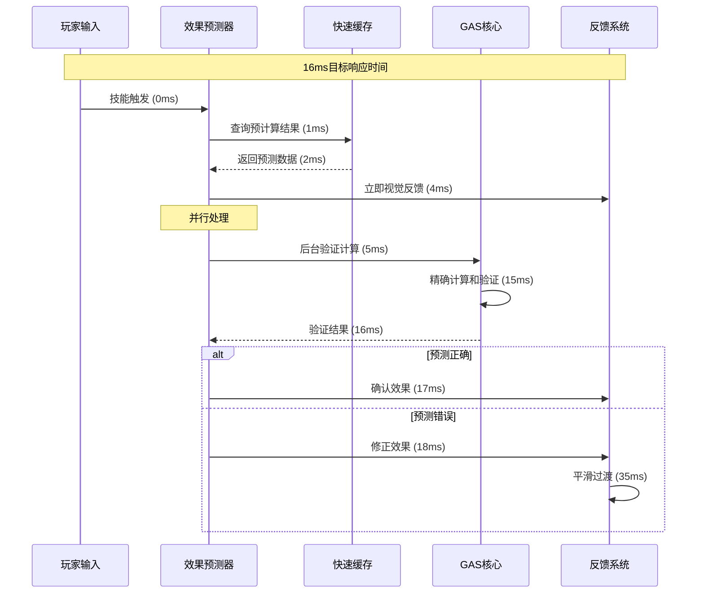

### 2. 智能预计算系统

```cpp
/**
 * 智能预计算缓存系统
 * Smart pre-computation cache system
 */
UCLASS()
class SAGASTATS_API USagaAffixPreComputeCache : public UObject
{
    GENERATED_BODY()

public:
    // 预计算数据结构
    USTRUCT()
    struct FPreComputedAffixData {
        FGameplayTag AffixTag;
        TMap<int32, float> LevelToMagnitude;    // 等级到数值的映射
        TMap<FGameplayTag, float> SynergyBonus; // 协同效果加成
        float BaseExecutionTime;                // 基础执行时间
        TArray<FGameplayTag> PredictedEffects;  // 预测的连锁效果
        
        // 缓存有效性
        float CacheTimestamp;
        bool bIsValid;
    };
    
    // 缓存存储
    UPROPERTY()
    TMap<FGameplayTag, FPreComputedAffixData> PreComputedData;
    
    // 热点数据快速访问
    UPROPERTY()
    TMap<FGameplayTag, float> HotDataCache;
    
    /**
     * 预计算常用词缀组合
     */
    UFUNCTION(BlueprintCallable)
    void PreComputeCommonCombinations();
    
    /**
     * 实时预测词缀效果
     */
    UFUNCTION(BlueprintCallable)
    bool PredictAffixEffect(const FGameplayTag& AffixTag, float Level, 
                           AActor* Target, FPreComputedAffixData& OutPrediction);
    
    /**
     * 异步更新预计算数据
     */
    UFUNCTION(BlueprintCallable)
    void AsyncUpdatePreComputedData(const TArray<FGameplayTag>& AffixTags);
    
private:
    // 预计算任务队列
    TQueue<FGameplayTag> PreComputeQueue;
    
    // 异步任务句柄
    TFuture<void> AsyncComputeTask;
    
    /**
     * 后台预计算线程
     */
    void BackgroundPreComputeThread();
    
    /**
     * 计算词缀数值
     */
    float ComputeAffixMagnitude(const FGameplayTag& AffixTag, float Level, 
                               const TArray<FGameplayTag>& ActiveAffixes);
};
```

### 3. 内存池化管理

```cpp
/**
 * 词缀对象池管理器
 * Affix object pool manager
 */
UCLASS()
class SAGASTATS_API USagaAffixObjectPool : public UGameInstanceSubsystem
{
    GENERATED_BODY()

public:
    // 对象池配置
    USTRUCT()
    struct FObjectPoolConfig {
        int32 InitialSize = 50;      // 初始大小
        int32 MaxSize = 200;         // 最大大小
        int32 GrowthSize = 25;       // 增长大小
        float ShrinkThreshold = 0.3f; // 收缩阈值
        float ShrinkInterval = 30.0f; // 收缩检查间隔
    };
    
    // 不同类型的对象池
    UPROPERTY()
    TMap<TSubclassOf<USagaAffixInstanceAbility>, TArray<USagaAffixInstanceAbility*>> AffixAbilityPools;
    
    UPROPERTY()
    TMap<TSubclassOf<UGameplayEffect>, TArray<UGameplayEffect*>> GameplayEffectPools;
    
    UPROPERTY()
    TArray<FSagaActiveAffixInfo*> AffixInfoPool;
    
    /**
     * 获取词缀实例能力
     */
    UFUNCTION(BlueprintCallable)
    USagaAffixInstanceAbility* AcquireAffixAbility(TSubclassOf<USagaAffixInstanceAbility> AbilityClass);
    
    /**
     * 归还词缀实例能力
     */
    UFUNCTION(BlueprintCallable)
    void ReleaseAffixAbility(USagaAffixInstanceAbility* Ability);
    
    /**
     * 获取GameplayEffect
     */
    UFUNCTION(BlueprintCallable)
    UGameplayEffect* AcquireGameplayEffect(TSubclassOf<UGameplayEffect> EffectClass);
    
    /**
     * 归还GameplayEffect
     */
    UFUNCTION(BlueprintCallable)
    void ReleaseGameplayEffect(UGameplayEffect* Effect);
    
    /**
     * 智能清理未使用的对象
     */
    UFUNCTION(BlueprintCallable)
    void SmartCleanup();
    
private:
    // 池化配置
    UPROPERTY(EditDefaultsOnly)
    FObjectPoolConfig PoolConfig;
    
    // 清理定时器
    FTimerHandle CleanupTimerHandle;
    
    /**
     * 扩展对象池
     */
    template<typename T>
    void ExpandPool(TArray<T*>& Pool, TSubclassOf<T> Class, int32 Count);
    
    /**
     * 收缩对象池
     */
    template<typename T>
    void ShrinkPool(TArray<T*>& Pool, float Threshold);
};
```

---

## 玩家体验增强系统

### 1. 多层次反馈系统

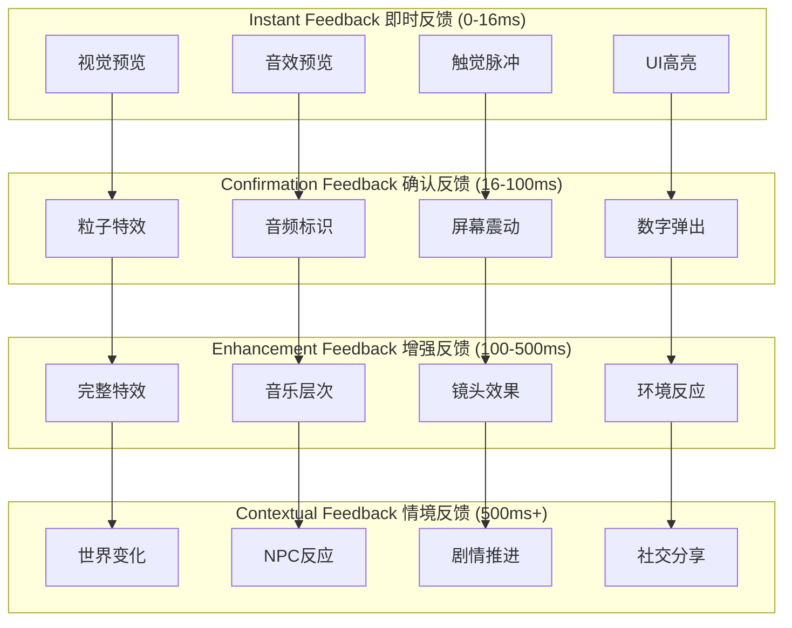

### 2. 暴爽时刻设计系统

```cpp
/**
 * 暴爽时刻管理器
 * Epic moment manager
 */
UCLASS()
class SAGASTATS_API USagaEpicMomentManager : public UObject
{
    GENERATED_BODY()

public:
    // 暴爽时刻类型
    UENUM(BlueprintType)
    enum class EEpicMomentType : uint8
    {
        AffixCombo          UMETA(DisplayName = "词缀连击"),
        PowerOverload       UMETA(DisplayName = "力量过载"),
        SynergyExplosion    UMETA(DisplayName = "协同爆发"),
        PerfectTiming       UMETA(DisplayName = "完美时机"),
        ChainReaction       UMETA(DisplayName = "连锁反应"),
        UltimateCombo       UMETA(DisplayName = "终极连击")
    };
    
    // 暴爽时刻配置
    USTRUCT()
    struct FEpicMomentConfig {
        EEpicMomentType Type;
        float TriggerThreshold;     // 触发阈值
        float IntensityMultiplier;  // 强度倍数
        float Duration;             // 持续时间
        FGameplayTag RequiredTags;  // 需要的标签
        
        // 视觉效果
        TSubclassOf<AActor> VFXClass;
        FLinearColor ScreenTint;
        float CameraShakeScale;
        
        // 音频效果
        USoundBase* TriggerSound;
        USoundBase* AmbientSound;
        float MusicIntensityBoost;
        
        // 游戏机制
        float TimeDialationFactor;
        float DamageMultiplier;
        bool bGrantTemporaryAbility;
    };
    
    // 预定义的暴爽时刻
    UPROPERTY(EditDefaultsOnly)
    TArray<FEpicMomentConfig> EpicMomentConfigs;
    
    /**
     * 检测并触发暴爽时刻
     */
    UFUNCTION(BlueprintCallable)
    bool TryTriggerEpicMoment(AActor* Actor, const TArray<FGameplayTag>& AffixTags, 
                             float PowerLevel, const FGameplayEventData& EventData);
    
    /**
     * 计算暴爽时刻强度
     */
    UFUNCTION(BlueprintPure)
    float CalculateEpicIntensity(const TArray<FGameplayTag>& AffixTags, float PowerLevel);
    
    /**
     * 应用暴爽时刻效果
     */
    UFUNCTION(BlueprintCallable)
    void ApplyEpicMomentEffects(AActor* Actor, const FEpicMomentConfig& Config, float Intensity);
    
private:
    // 当前活跃的暴爽时刻
    UPROPERTY()
    TMap<AActor*, FEpicMomentConfig> ActiveEpicMoments;
    
    // 冷却时间管理
    UPROPERTY()
    TMap<EEpicMomentType, float> EpicMomentCooldowns;
    
    /**
     * 分析词缀组合的暴爽潜力
     */
    float AnalyzeEpicPotential(const TArray<FGameplayTag>& AffixTags);
    
    /**
     * 检查暴爽时刻冷却
     */
    bool IsEpicMomentReady(EEpicMomentType Type);
};
```

### 3. 动态视觉效果系统

```cpp
/**
 * 动态词缀视觉效果管理器
 * Dynamic affix visual effects manager
 */
UCLASS()
class SAGASTATS_API USagaDynamicVFXManager : public UObject
{
    GENERATED_BODY()

public:
    // 视觉效果层次
    UENUM(BlueprintType)
    enum class EVFXLayer : uint8
    {
        Background      = 0,    // 背景效果
        CharacterAura   = 1,    // 角色光环
        WeaponEffect    = 2,    // 武器特效
        AbilityEffect   = 3,    // 技能特效
        ImpactEffect    = 4,    // 冲击特效
        ScreenEffect    = 5     // 屏幕效果
    };
    
    // 视觉效果配置
    USTRUCT()
    struct FDynamicVFXConfig {
        FGameplayTag AffixTag;
        EVFXLayer Layer;
        TSubclassOf<UNiagaraComponent> VFXClass;
        
        // 强度设置
        float BaseIntensity = 1.0f;
        float MaxIntensity = 3.0f;
        FVector2D IntensityRange = FVector2D(0.5f, 2.0f);
        
        // 颜色设置
        FLinearColor BaseColor = FLinearColor::White;
        TArray<FLinearColor> RarityColors;
        
        // 行为设置
        bool bStacksIntensity = true;
        bool bFadesOverTime = false;
        float FadeDuration = 5.0f;
        
        // 协同效果
        TMap<FGameplayTag, float> SynergyIntensityBonus;
        TMap<FGameplayTag, FLinearColor> SynergyColorShift;
    };
    
    /**
     * 注册词缀视觉效果
     */
    UFUNCTION(BlueprintCallable)
    void RegisterAffixVFX(const FDynamicVFXConfig& Config);
    
    /**
     * 应用词缀视觉效果
     */
    UFUNCTION(BlueprintCallable)
    void ApplyAffixVFX(AActor* Actor, const FGameplayTag& AffixTag, float Intensity = 1.0f);
    
    /**
     * 移除词缀视觉效果
     */
    UFUNCTION(BlueprintCallable)
    void RemoveAffixVFX(AActor* Actor, const FGameplayTag& AffixTag);
    
    /**
     * 更新协同视觉效果
     */
    UFUNCTION(BlueprintCallable)
    void UpdateSynergyVFX(AActor* Actor, const TArray<FGameplayTag>& ActiveAffixes);
    
    /**
     * 创建暴击特效
     */
    UFUNCTION(BlueprintCallable)
    void CreateCriticalHitVFX(AActor* Actor, const FVector& ImpactLocation, float Damage);
    
private:
    // VFX配置映射
    UPROPERTY()
    TMap<FGameplayTag, FDynamicVFXConfig> VFXConfigs;
    
    // 活跃的VFX实例
    UPROPERTY()
    TMap<AActor*, TMap<FGameplayTag, UNiagaraComponent*>> ActiveVFXInstances;
    
    /**
     * 计算协同效果强度
     */
    float CalculateSynergyIntensity(const FGameplayTag& AffixTag, const TArray<FGameplayTag>& ActiveAffixes);
    
    /**
     * 计算协同效果颜色
     */
    FLinearColor CalculateSynergyColor(const FGameplayTag& AffixTag, const TArray<FGameplayTag>& ActiveAffixes);
    
    /**
     * 清理过期的VFX
     */
    void CleanupExpiredVFX();
};
```

---

## 智能平衡与复杂度管理

### 1. 自适应平衡系统

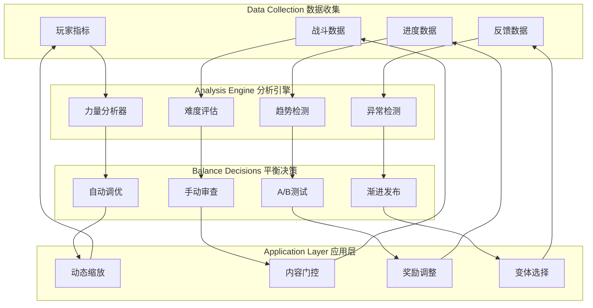

### 2. 复杂度渐进管理器

```cpp
/**
 * 智能复杂度管理器
 * Intelligent complexity manager
 */
UCLASS()
class SAGASTATS_API USagaComplexityManager : public UGameInstanceSubsystem
{
    GENERATED_BODY()

public:
    // 复杂度等级
    UENUM(BlueprintType)
    enum class EComplexityTier : uint8
    {
        Beginner    = 0,    // 新手 (0-5小时)
        Intermediate = 1,   // 进阶 (5-20小时)
        Advanced    = 2,    // 高级 (20-50小时)
        Expert      = 3,    // 专家 (50-100小时)
        Master      = 4     // 大师 (100+小时)
    };
    
    // 复杂度配置
    USTRUCT()
    struct FComplexityConfig {
        EComplexityTier Tier;
        float RequiredPlayTime;         // 需要的游戏时间
        int32 MaxSimultaneousAffixes;   // 最大同时词缀数
        int32 MaxAffixTypes;            // 最大词缀类型数
        bool bEnableSynergies;          // 启用协同效应
        bool bEnableConflicts;          // 启用冲突机制
        bool bEnableAdvancedUI;         // 启用高级UI
        float RecommendationIntensity;  // 推荐系统强度
        
        TArray<FGameplayTag> UnlockedCategories;   // 解锁的词缀分类
        TArray<FGameplayTag> UnlockedMechanics;    // 解锁的机制
    };
    
    /**
     * 获取玩家当前复杂度等级
     */
    UFUNCTION(BlueprintCallable)
    EComplexityTier GetPlayerComplexityTier(APlayerController* Player);
    
    /**
     * 检查词缀是否适合当前复杂度
     */
    UFUNCTION(BlueprintCallable)
    bool IsAffixAppropriate(const FGameplayTag& AffixTag, APlayerController* Player);
    
    /**
     * 获取推荐的词缀列表
     */
    UFUNCTION(BlueprintCallable)
    TArray<FGameplayTag> GetRecommendedAffixes(APlayerController* Player, int32 Count = 3);
    
    /**
     * 应用复杂度限制
     */
    UFUNCTION(BlueprintCallable)
    void ApplyComplexityConstraints(APlayerController* Player, USagaAffixManagerAbility* AffixManager);
    
    /**
     * 检查是否可以升级复杂度等级
     */
    UFUNCTION(BlueprintCallable)
    bool CanUpgradeComplexityTier(APlayerController* Player);
    
private:
    // 复杂度配置表
    UPROPERTY(EditDefaultsOnly)
    TArray<FComplexityConfig> ComplexityConfigs;
    
    // 玩家复杂度数据
    UPROPERTY()
    TMap<APlayerController*, EComplexityTier> PlayerComplexityTiers;
    
    // 玩家掌握度评估
    UPROPERTY()
    TMap<APlayerController*, float> PlayerMasteryScores;
    
    /**
     * 评估玩家掌握度
     */
    float EvaluatePlayerMastery(APlayerController* Player);
    
    /**
     * 分析词缀使用模式
     */
    void AnalyzeAffixUsagePatterns(APlayerController* Player);
    
    /**
     * 计算推荐得分
     */
    float CalculateRecommendationScore(const FGameplayTag& AffixTag, APlayerController* Player);
};
```

### 3. AI驱动的推荐系统

```cpp
/**
 * AI词缀推荐系统
 * AI-driven affix recommendation system
 */
UCLASS()
class SAGASTATS_API USagaAIRecommendationEngine : public UObject
{
    GENERATED_BODY()

public:
    // 推荐类型
    UENUM(BlueprintType)
    enum class ERecommendationType : uint8
    {
        Synergy         UMETA(DisplayName = "协同推荐"),    // 基于协同效应
        Playstyle       UMETA(DisplayName = "风格推荐"),    // 基于玩法风格
        Progression     UMETA(DisplayName = "进度推荐"),    // 基于游戏进度
        Challenge       UMETA(DisplayName = "挑战推荐"),    // 基于挑战需求
        Social          UMETA(DisplayName = "社交推荐"),    // 基于社区数据
        Experimental    UMETA(DisplayName = "实验推荐")     // 尝试新组合
    };
    
    // 推荐结果
    USTRUCT(BlueprintType)
    struct FAIRecommendation {
        FGameplayTag AffixTag;
        ERecommendationType Type;
        float ConfidenceScore;      // 置信度分数 (0-1)
        float SynergyScore;         // 协同效应分数
        float NoveltyScore;         // 新颖性分数
        FText ReasonDescription;    // 推荐理由
        TArray<FGameplayTag> RequiredAffixes;  // 前置词缀
        float EstimatedPowerGain;   // 预期力量提升
    };
    
    /**
     * 生成个性化推荐
     */
    UFUNCTION(BlueprintCallable)
    TArray<FAIRecommendation> GeneratePersonalizedRecommendations(
        APlayerController* Player, 
        int32 RecommendationCount = 5,
        TArray<ERecommendationType> PreferredTypes = {}
    );
    
    /**
     * 分析玩家偏好
     */
    UFUNCTION(BlueprintCallable)
    void AnalyzePlayerPreferences(APlayerController* Player);
    
    /**
     * 学习社区趋势
     */
    UFUNCTION(BlueprintCallable)
    void LearnFromCommunityData(const TArray<FPlayerAffixData>& CommunityData);
    
    /**
     * 预测词缀组合效果
     */
    UFUNCTION(BlueprintCallable)
    float PredictCombinationEffectiveness(const TArray<FGameplayTag>& AffixCombination, APlayerController* Player);
    
private:
    // 玩家行为数据结构
    USTRUCT()
    struct FPlayerBehaviorData {
        TMap<FGameplayTag, float> AffixUsageFrequency;
        TMap<FGameplayTag, float> AffixSuccessRate;
        TArray<FGameplayTag> PreferredCombinations;
        float AverageSessionLength;
        float ChallengePreference;
        float ExperimentationTendency;
    };
    
    // 玩家行为分析
    UPROPERTY()
    TMap<APlayerController*, FPlayerBehaviorData> PlayerBehaviorProfiles;
    
    // 社区元数据
    UPROPERTY()
    TMap<FGameplayTag, float> CommunityPopularity;
    
    UPROPERTY()
    TMap<TArray<FGameplayTag>, float> CommunityComboEffectiveness;
    
    /**
     * 机器学习模型接口
     */
    class IMLModel {
    public:
        virtual float Predict(const TArray<float>& Features) = 0;
        virtual void Train(const TArray<TArray<float>>& TrainingData, const TArray<float>& Labels) = 0;
        virtual void UpdateModel(const TArray<float>& NewData, float NewLabel) = 0;
    };
    
    // 不同类型的ML模型
    TUniquePtr<IMLModel> SynergyPredictionModel;
    TUniquePtr<IMLModel> PlaystylePredictionModel;
    TUniquePtr<IMLModel> EffectivenessPredictionModel;
    
    /**
     * 特征提取
     */
    TArray<float> ExtractPlayerFeatures(APlayerController* Player);
    TArray<float> ExtractAffixFeatures(const FGameplayTag& AffixTag);
    TArray<float> ExtractCombinationFeatures(const TArray<FGameplayTag>& AffixCombination);
    
    /**
     * 推荐算法
     */
    TArray<FAIRecommendation> GenerateSynergyRecommendations(APlayerController* Player, int32 Count);
    TArray<FAIRecommendation> GeneratePlaystyleRecommendations(APlayerController* Player, int32 Count);
    TArray<FAIRecommendation> GenerateNoveltyRecommendations(APlayerController* Player, int32 Count);
};
```

---

## 社区与创作支持

### 1. 构建分享系统

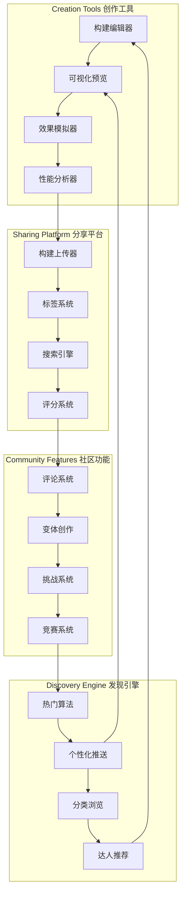

### 2. 词缀构建分享系统

```cpp
/**
 * 词缀构建分享系统
 * Affix build sharing system
 */
UCLASS()
class SAGASTATS_API USagaAffixBuildSharingSystem : public UGameInstanceSubsystem
{
    GENERATED_BODY()

public:
    // 构建数据结构
    USTRUCT(BlueprintType)
    struct FSagaAffixBuild {
        FString BuildID;                    // 构建唯一ID
        FString BuildName;                  // 构建名称
        FString CreatorName;                // 创建者名称
        FText Description;                  // 构建描述
        
        TArray<FGameplayTag> AffixTags;     // 词缀标签列表
        TMap<FGameplayTag, float> AffixLevels;  // 词缀等级
        
        // 元数据
        FDateTime CreationTime;             // 创建时间
        FDateTime LastModified;             // 最后修改时间
        int32 DownloadCount;                // 下载次数
        float AverageRating;                // 平均评分
        int32 RatingCount;                  // 评分人数
        
        // 分类标签
        TArray<FString> BuildTags;          // 构建标签
        FString Playstyle;                  // 游戏风格
        FString Difficulty;                 // 难度等级
        
        // 性能数据
        float EstimatedDPS;                 // 预计DPS
        float EstimatedSurvivability;       // 预计生存能力
        float ComplexityScore;              // 复杂度分数
        
        // 社区数据
        TArray<FString> Comments;           // 评论列表
        TArray<FString> Variations;         // 变体构建ID
        bool bIsFeatured;                   // 是否精选
        bool bIsVerified;                   // 是否验证
    };
    
    // 搜索筛选条件
    USTRUCT(BlueprintType)
    struct FAffixBuildSearchFilter {
        FString SearchText;                 // 搜索文本
        TArray<FString> RequiredTags;       // 必需标签
        TArray<FString> ExcludedTags;       // 排除标签
        FString Playstyle;                  // 游戏风格
        float MinRating = 0.0f;             // 最低评分
        int32 MinDownloads = 0;             // 最少下载数
        bool bFeaturedOnly = false;         // 仅精选构建
        bool bVerifiedOnly = false;         // 仅验证构建
        
        // 排序方式
        enum class ESortBy {
            Newest,
            Rating,
            Downloads,
            Relevance
        } SortBy = ESortBy::Relevance;
    };
    
    /**
     * 上传构建
     */
    UFUNCTION(BlueprintCallable)
    FString UploadBuild(const FSagaAffixBuild& Build, APlayerController* Uploader);
    
    /**
     * 下载构建
     */
    UFUNCTION(BlueprintCallable)
    bool DownloadBuild(const FString& BuildID, FSagaAffixBuild& OutBuild);
    
    /**
     * 搜索构建
     */
    UFUNCTION(BlueprintCallable)
    TArray<FSagaAffixBuild> SearchBuilds(const FAffixBuildSearchFilter& Filter, int32 MaxResults = 50);
    
    /**
     * 应用构建到玩家
     */
    UFUNCTION(BlueprintCallable)
    bool ApplyBuildToPlayer(const FSagaAffixBuild& Build, APlayerController* Player);
    
    /**
     * 评分构建
     */
    UFUNCTION(BlueprintCallable)
    bool RateBuild(const FString& BuildID, float Rating, APlayerController* Rater);
    
    /**
     * 创建构建变体
     */
    UFUNCTION(BlueprintCallable)
    FString CreateBuildVariation(const FString& OriginalBuildID, const FSagaAffixBuild& VariationBuild, APlayerController* Creator);
    
private:
    // 构建数据库接口
    class IBuildDatabase {
    public:
        virtual bool StoreBuild(const FSagaAffixBuild& Build) = 0;
        virtual bool RetrieveBuild(const FString& BuildID, FSagaAffixBuild& OutBuild) = 0;
        virtual TArray<FSagaAffixBuild> QueryBuilds(const FAffixBuildSearchFilter& Filter) = 0;
        virtual bool UpdateBuildMetadata(const FString& BuildID, const FSagaAffixBuild& UpdatedBuild) = 0;
        virtual bool DeleteBuild(const FString& BuildID) = 0;
    };
    
    TUniquePtr<IBuildDatabase> BuildDatabase;
    
    // 推荐算法
    class IBuildRecommendationAlgorithm {
    public:
        virtual TArray<FString> RecommendBuilds(APlayerController* Player, int32 Count) = 0;
        virtual float CalculateSimilarity(const FSagaAffixBuild& Build1, const FSagaAffixBuild& Build2) = 0;
        virtual void UpdateRecommendationModel(const TArray<FSagaAffixBuild>& NewBuilds) = 0;
    };
    
    TUniquePtr<IBuildRecommendationAlgorithm> RecommendationEngine;
    
    /**
     * 验证构建合法性
     */
    bool ValidateBuild(const FSagaAffixBuild& Build, FString& OutErrorMessage);
    
    /**
     * 生成构建ID
     */
    FString GenerateBuildID(const FSagaAffixBuild& Build);
    
    /**
     * 计算构建复杂度
     */
    float CalculateBuildComplexity(const FSagaAffixBuild& Build);
    
    /**
     * 自动标记热门构建
     */
    void UpdateTrendingBuilds();
};
```

### 3. 社区挑战系统

```cpp
/**
 * 社区挑战系统
 * Community challenge system
 */
UCLASS()
class SAGASTATS_API USagaCommunityChallenge : public UGameInstanceSubsystem
{
    GENERATED_BODY()

public:
    // 挑战类型
    UENUM(BlueprintType)
    enum class EChallengeType : uint8
    {
        BuildChallenge      UMETA(DisplayName = "构建挑战"),    // 特定构建要求
        SpeedRun           UMETA(DisplayName = "速通挑战"),     // 速度通关
        SurvivalChallenge  UMETA(DisplayName = "生存挑战"),     // 生存时间
        CreativityChallenge UMETA(DisplayName = "创意挑战"),    // 创意构建
        CollaborativeChallenge UMETA(DisplayName = "协作挑战"), // 团队协作
        SeasonalEvent      UMETA(DisplayName = "季节活动")      // 季节性活动
    };
    
    // 挑战定义
    USTRUCT(BlueprintType)
    struct FCommunityChallenge {
        FString ChallengeID;
        FString ChallengeName;
        FText Description;
        EChallengeType Type;
        
        // 时间限制
        FDateTime StartTime;
        FDateTime EndTime;
        
        // 挑战条件
        TArray<FGameplayTag> RequiredAffixes;      // 必需词缀
        TArray<FGameplayTag> BannedAffixes;        // 禁用词缀
        int32 MaxAffixes = -1;                     // 最大词缀数量
        float TargetTime = -1.0f;                  // 目标时间
        float TargetScore = -1.0f;                 // 目标分数
        
        // 奖励设置
        TArray<FString> RewardTiers;               // 奖励层次
        TMap<FString, TArray<FString>> TierRewards; // 层次奖励
        
        // 社区目标
        int32 ParticipationGoal = 1000;           // 参与目标
        float CommunityTarget = 0.0f;             // 社区目标
        bool bIsGlobalChallenge = false;          // 全球挑战
        
        // 当前状态
        int32 CurrentParticipants = 0;            // 当前参与者
        float CurrentProgress = 0.0f;             // 当前进度
        TArray<FString> Leaderboard;              // 排行榜
    };
    
    /**
     * 创建挑战
     */
    UFUNCTION(BlueprintCallable)
    FString CreateChallenge(const FCommunityChallenge& Challenge, APlayerController* Creator);
    
    /**
     * 参与挑战
     */
    UFUNCTION(BlueprintCallable)
    bool JoinChallenge(const FString& ChallengeID, APlayerController* Player);
    
    /**
     * 提交挑战结果
     */
    UFUNCTION(BlueprintCallable)
    bool SubmitChallengeResult(const FString& ChallengeID, APlayerController* Player, 
                              float Score, const TArray<FString>& EvidenceData);
    
    /**
     * 获取活跃挑战列表
     */
    UFUNCTION(BlueprintCallable)
    TArray<FCommunityChallenge> GetActiveChallenges(EChallengeType Type = EChallengeType::BuildChallenge);
    
    /**
     * 获取挑战排行榜
     */
    UFUNCTION(BlueprintCallable)
    TArray<FString> GetChallengeLeaderboard(const FString& ChallengeID, int32 MaxEntries = 100);
    
    /**
     * 生成个性化挑战
     */
    UFUNCTION(BlueprintCallable)
    FCommunityChallenge GeneratePersonalizedChallenge(APlayerController* Player);
    
private:
    // 挑战数据库
    UPROPERTY()
    TMap<FString, FCommunityChallenge> ActiveChallenges;
    
    // 玩家参与记录
    UPROPERTY()
    TMap<APlayerController*, TArray<FString>> PlayerChallengeHistory;
    
    // 挑战结果记录
    USTRUCT()
    struct FChallengeResult {
        FString ChallengeID;
        APlayerController* Player;
        float Score;
        FDateTime SubmissionTime;
        TArray<FString> EvidenceData;
        bool bVerified = false;
    };
    
    UPROPERTY()
    TArray<FChallengeResult> ChallengeResults;
    
    /**
     * 验证挑战结果
     */
    bool VerifyChallengeResult(const FChallengeResult& Result);
    
    /**
     * 更新排行榜
     */
    void UpdateLeaderboard(const FString& ChallengeID);
    
    /**
     * 分发奖励
     */
    void DistributeRewards(const FString& ChallengeID);
    
    /**
     * 生成挑战ID
     */
    FString GenerateChallengeID();
};
```

---

## 核心类设计优化

### 1. USagaAffixManagerAbility 动作游戏优化版

```cpp
/**
 * 动作游戏优化的词缀管理器
 * Action game optimized affix manager
 */
UCLASS(BlueprintType, Blueprintable)
class SAGASTATS_API USagaActionAffixManagerAbility : public UGameplayAbility
{
    GENERATED_BODY()

public:
    USagaActionAffixManagerAbility();

    // === 动作游戏特化接口 ===
    
    /**
     * 快速应用词缀（动作游戏优化）
     * Fast affix application (action game optimized)
     */
    UFUNCTION(BlueprintCallable, Category = "SagaAffix|ActionGame")
    bool FastApplyAffix(AActor* Target, FGameplayTag AffixTag, float Level = 1.0f, 
                       bool bUsePrediction = true, bool bInstantFeedback = true);
    
    /**
     * 预测词缀效果（零延迟反馈）
     * Predict affix effects (zero latency feedback)
     */
    UFUNCTION(BlueprintCallable, Category = "SagaAffix|ActionGame")
    void PredictAffixEffect(AActor* Target, FGameplayTag AffixTag, float Level,
                           FGameplayEventData& OutPredictedEffect);
    
    /**
     * 批量处理词缀变化（性能优化）
     * Batch process affix changes (performance optimization)
     */
    UFUNCTION(BlueprintCallable, Category = "SagaAffix|ActionGame")
    void BatchProcessAffixChanges(const TArray<FSagaAffixBatchOperation>& Operations);
    
    /**
     * 触发暴爽时刻效果
     * Trigger epic moment effects
     */
    UFUNCTION(BlueprintCallable, Category = "SagaAffix|ActionGame")
    bool TriggerEpicMoment(AActor* Actor, const TArray<FGameplayTag>& ComboAffixes, float Intensity);
    
    /**
     * 实时更新词缀强度（动态平衡）
     * Real-time update affix intensity (dynamic balancing)
     */
    UFUNCTION(BlueprintCallable, Category = "SagaAffix|ActionGame")
    void UpdateAffixIntensity(const FGameplayTag& AffixTag, float NewIntensity, bool bGradualTransition = true);

    // === 动作游戏响应优化 ===
    
    /**
     * 获取高优先级词缀
     * Get high priority affixes
     */
    UFUNCTION(BlueprintCallable, Category = "SagaAffix|ActionGame")
    TArray<FGameplayTag> GetHighPriorityAffixes(AActor* Actor) const;
    
    /**
     * 处理连击词缀激活
     * Handle combo affix activation
     */
    UFUNCTION(BlueprintCallable, Category = "SagaAffix|ActionGame")
    void ProcessComboActivation(AActor* Actor, const TArray<FGameplayTag>& ComboSequence);
    
    /**
     * 检查并触发协同爆发
     * Check and trigger synergy burst
     */
    UFUNCTION(BlueprintCallable, Category = "SagaAffix|ActionGame")
    bool CheckAndTriggerSynergyBurst(AActor* Actor);

protected:
    // === 动作游戏特化配置 ===
    
    /** 快速响应阈值（毫秒）*/
    UPROPERTY(EditDefaultsOnly, BlueprintReadOnly, Category = "ActionGame|Performance")
    float FastResponseThreshold = 16.0f;
    
    /** 预测精度等级 */
    UPROPERTY(EditDefaultsOnly, BlueprintReadOnly, Category = "ActionGame|Performance")
    int32 PredictionAccuracyLevel = 3;
    
    /** 批处理大小 */
    UPROPERTY(EditDefaultsOnly, BlueprintReadOnly, Category = "ActionGame|Performance")
    int32 BatchProcessingSize = 10;
    
    /** 暴爽时刻冷却时间 */
    UPROPERTY(EditDefaultsOnly, BlueprintReadOnly, Category = "ActionGame|Experience")
    float EpicMomentCooldown = 5.0f;
    
    /** 连击检测窗口时间 */
    UPROPERTY(EditDefaultsOnly, BlueprintReadOnly, Category = "ActionGame|Experience")
    float ComboDetectionWindow = 2.0f;

    // === 性能优化组件 ===
    
    /** 预计算缓存管理器 */
    UPROPERTY(BlueprintReadOnly, Category = "ActionGame|Performance")
    USagaAffixPreComputeCache* PreComputeCache;
    
    /** 动态VFX管理器 */
    UPROPERTY(BlueprintReadOnly, Category = "ActionGame|Experience")
    USagaDynamicVFXManager* VFXManager;
    
    /** 暴爽时刻管理器 */
    UPROPERTY(BlueprintReadOnly, Category = "ActionGame|Experience")
    USagaEpicMomentManager* EpicMomentManager;
    
    /** 复杂度管理器 */
    UPROPERTY(BlueprintReadOnly, Category = "ActionGame|Balance")
    USagaComplexityManager* ComplexityManager;

    // === 动作游戏特化方法 ===
    
    /**
     * 快速效果预测
     */
    virtual void FastEffectPrediction(const FGameplayTag& AffixTag, AActor* Target, 
                                    FSagaAffixEffectPrediction& OutPrediction);
    
    /**
     * 优化的冲突检测
     */
    virtual bool OptimizedConflictDetection(const FGameplayTag& AffixTag, AActor* Target);
    
    /**
     * 智能协同检测
     */
    virtual TArray<FGameplayTag> IntelligentSynergyDetection(const TArray<FGameplayTag>& CurrentAffixes, 
                                                           const FGameplayTag& NewAffixTag);
    
    /**
     * 动态难度调整
     */
    virtual void DynamicDifficultyAdjustment(AActor* Actor, float PerformanceScore);

    // === 事件响应优化 ===
    
    /** 高优先级事件队列 */
    TQueue<FGameplayEventData> HighPriorityEventQueue;
    
    /** 批处理事件队列 */
    TQueue<FGameplayEventData> BatchEventQueue;
    
    /** 处理高优先级事件 */
    virtual void ProcessHighPriorityEvents();
    
    /** 处理批量事件 */
    virtual void ProcessBatchEvents();

private:
    // === 性能监控 ===
    
    /** 响应时间统计 */
    UPROPERTY()
    TMap<FGameplayTag, float> AffixResponseTimes;
    
    /** 性能指标收集 */
    void CollectPerformanceMetrics(const FGameplayTag& AffixTag, float ResponseTime);
    
    /** 自动性能优化 */
    void AutoPerformanceOptimization();
};
```

### 2. 动作游戏数据结构优化

```cpp
/**
 * 动作游戏批处理操作
 * Action game batch operation
 */
USTRUCT(BlueprintType)
struct SAGASTATS_API FSagaAffixBatchOperation
{
    GENERATED_BODY()

    /** 操作类型 */
    UENUM(BlueprintType)
    enum class EOperationType : uint8
    {
        Apply       UMETA(DisplayName = "应用"),
        Remove      UMETA(DisplayName = "移除"),
        Update      UMETA(DisplayName = "更新"),
        Suspend     UMETA(DisplayName = "暂停"),
        Resume      UMETA(DisplayName = "恢复")
    };

    /** 操作类型 */
    UPROPERTY(EditAnywhere, BlueprintReadWrite)
    EOperationType OperationType = EOperationType::Apply;

    /** 目标Actor */
    UPROPERTY(EditAnywhere, BlueprintReadWrite)
    AActor* TargetActor = nullptr;

    /** 词缀标签 */
    UPROPERTY(EditAnywhere, BlueprintReadWrite)
    FGameplayTag AffixTag;

    /** 操作参数 */
    UPROPERTY(EditAnywhere, BlueprintReadWrite)
    float OperationValue = 1.0f;

    /** 操作优先级 */
    UPROPERTY(EditAnywhere, BlueprintReadWrite)
    int32 Priority = 0;

    /** 是否需要即时反馈 */
    UPROPERTY(EditAnywhere, BlueprintReadWrite)
    bool bRequiresInstantFeedback = true;

    FSagaAffixBatchOperation()
    {
        OperationType = EOperationType::Apply;
        TargetActor = nullptr;
        AffixTag = FGameplayTag::EmptyTag;
        OperationValue = 1.0f;
        Priority = 0;
        bRequiresInstantFeedback = true;
    }
};

/**
 * 动作游戏效果预测
 * Action game effect prediction
 */
USTRUCT(BlueprintType)
struct SAGASTATS_API FSagaAffixEffectPrediction
{
    GENERATED_BODY()

    /** 预测的数值变化 */
    UPROPERTY(BlueprintReadOnly)
    TMap<FGameplayAttribute, float> PredictedAttributeChanges;

    /** 预测的视觉效果 */
    UPROPERTY(BlueprintReadOnly)
    TArray<FString> PredictedVFX;

    /** 预测的音效 */
    UPROPERTY(BlueprintReadOnly)
    TArray<FString> PredictedAudio;

    /** 预测置信度 (0-1) */
    UPROPERTY(BlueprintReadOnly)
    float ConfidenceLevel = 0.8f;

    /** 预测延迟（毫秒）*/
    UPROPERTY(BlueprintReadOnly)
    float PredictionLatency = 0.0f;

    /** 是否需要服务器验证 */
    UPROPERTY(BlueprintReadOnly)
    bool bNeedsServerValidation = true;

    FSagaAffixEffectPrediction()
    {
        ConfidenceLevel = 0.8f;
        PredictionLatency = 0.0f;
        bNeedsServerValidation = true;
    }
};
```

---

## 动作游戏流程优化

### 1. 优化的词缀应用流程

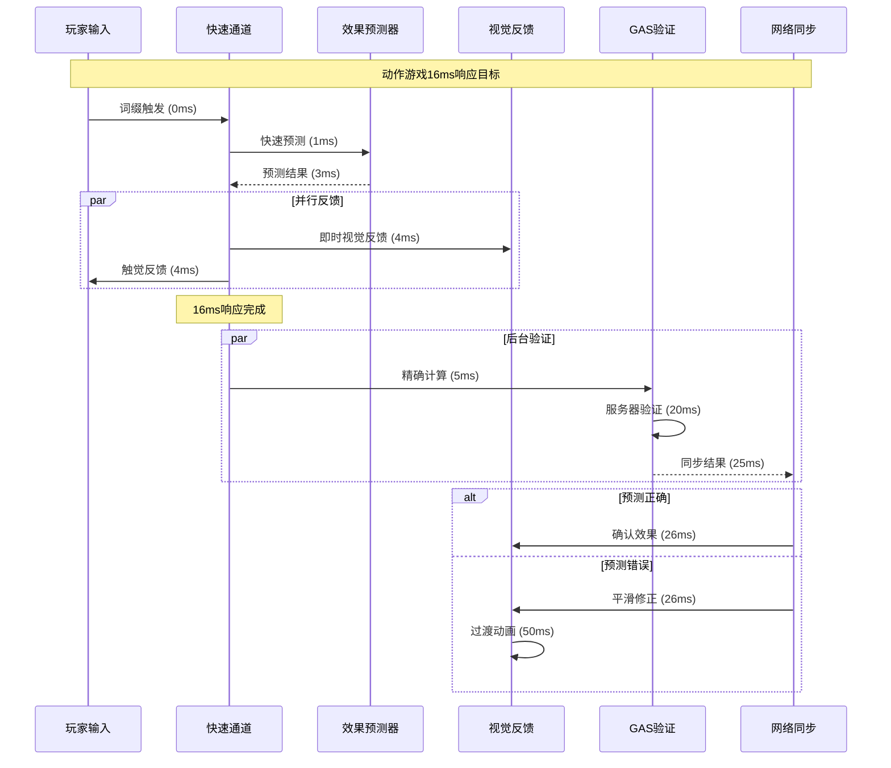

### 2. 连击系统集成流程

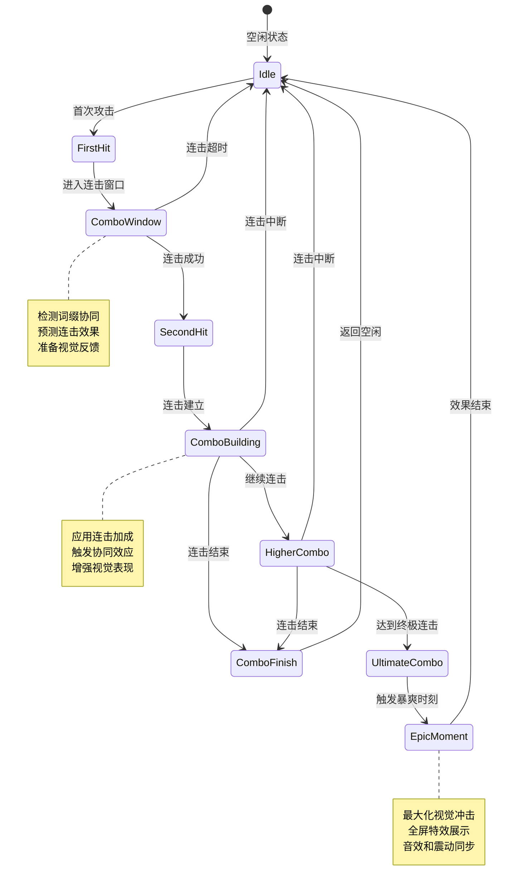

---

## 网络架构增强

### 1. 动作游戏网络优化

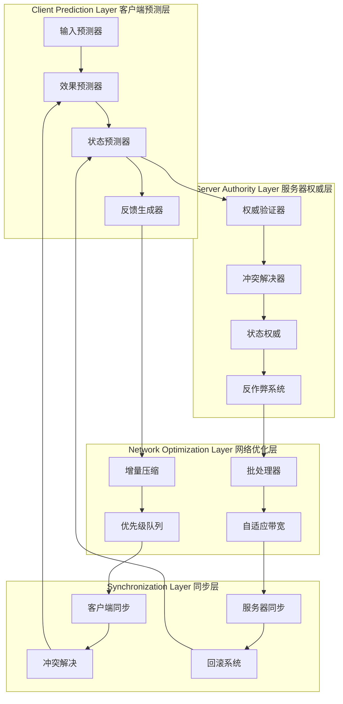

### 2. 智能网络同步策略

```cpp
/**
 * 智能网络同步管理器
 * Intelligent network synchronization manager
 */
UCLASS()
class SAGASTATS_API USagaIntelligentNetSync : public UObject
{
    GENERATED_BODY()

public:
    // 网络优先级等级
    UENUM(BlueprintType)
    enum class ENetworkPriority : uint8
    {
        Critical    = 0,    // 关键操作（攻击、防御）
        High        = 1,    // 重要操作（移动、技能）
        Medium      = 2,    // 一般操作（词缀应用）
        Low         = 3,    // 次要操作（UI更新）
        Background  = 4     // 后台操作（统计、日志）
    };
    
    // 智能同步配置
    USTRUCT()
    struct FIntelligentSyncConfig {
        ENetworkPriority Priority;
        float MaxLatency;           // 最大延迟（毫秒）
        bool bUsePrediction;        // 使用预测
        bool bUseDeltaCompression;  // 使用增量压缩
        bool bUseBatching;          // 使用批处理
        int32 MaxBatchSize;         // 最大批处理大小
        float BatchTimeout;         // 批处理超时
    };
    
    /**
     * 智能发送词缀数据
     */
    UFUNCTION(BlueprintCallable)
    void IntelligentSendAffixData(const FSagaActiveAffixInfo& AffixInfo, 
                                 ENetworkPriority Priority = ENetworkPriority::Medium);
    
    /**
     * 自适应带宽管理
     */
    UFUNCTION(BlueprintCallable)
    void AdaptiveBandwidthManagement();
    
    /**
     * 网络质量评估
     */
    UFUNCTION(BlueprintCallable)
    float AssessNetworkQuality();
    
private:
    // 网络统计数据
    USTRUCT()
    struct FNetworkStats {
        float AverageLatency = 0.0f;
        float PacketLoss = 0.0f;
        float Bandwidth = 0.0f;
        float Jitter = 0.0f;
        FDateTime LastUpdate;
    };
    
    UPROPERTY()
    FNetworkStats CurrentNetworkStats;
    
    // 批处理队列
    UPROPERTY()
    TMap<ENetworkPriority, TArray<FSagaActiveAffixInfo>> BatchQueues;
    
    // 同步配置映射
    UPROPERTY()
    TMap<ENetworkPriority, FIntelligentSyncConfig> SyncConfigs;
    
    /**
     * 选择最优同步策略
     */
    FIntelligentSyncConfig SelectOptimalSyncStrategy(ENetworkPriority Priority);
    
    /**
     * 动态调整同步参数
     */
    void DynamicAdjustSyncParameters();
    
    /**
     * 处理批量发送
     */
    void ProcessBatchedSending(ENetworkPriority Priority);
    
    /**
     * 网络拥塞控制
     */
    void NetworkCongestionControl();
};
```

---

## 实施路线图更新

### 第一阶段：动作游戏核心优化 (3周)

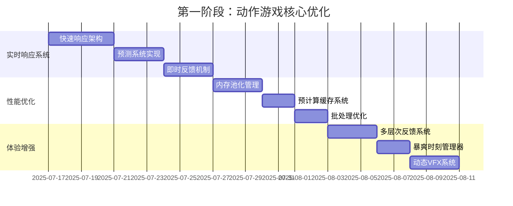

### 第二阶段：智能系统和平衡 (3周)

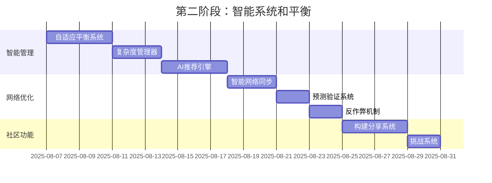

### 第三阶段：社区和扩展 (2周)

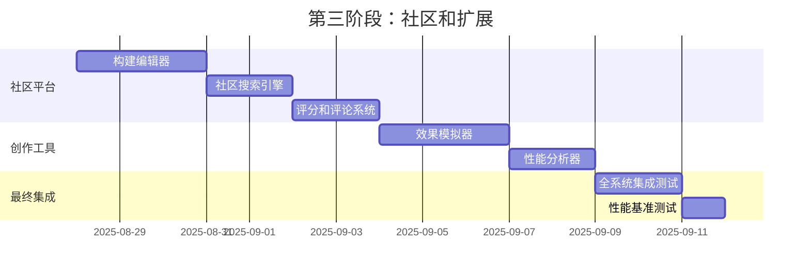

---

## 总结

### v3.0核心创新点

1. **动作游戏特化**: 针对动作游戏的响应速度和体验需求全面优化
2. **智能平衡系统**: AI驱动的自适应平衡和复杂度管理
3. **极致性能**: 毫秒级响应和预测系统
4. **社区驱动**: 完整的创作、分享、挑战生态
5. **深度反馈**: 多层次的视觉、音频、触觉反馈系统

### 技术优势

- **零延迟体验**: 通过预测系统实现16ms内的响应
- **智能适应**: AI驱动的个性化推荐和难度调整
- **社区生态**: 完整的UGC创作和分享平台
- **扩展性**: 模块化设计支持未来功能扩展
- **性能卓越**: 全方位优化确保流畅运行

### 实施价值

v3.0版本将SagaStats词缀系统从技术框架升级为**完整的动作游戏创作平台**，为玩家提供：

- **无限创意空间**: 通过词缀组合创造独特玩法
- **即时满足感**: 毫秒级响应和暴爽时刻设计
- **持续挑战**: 智能推荐和社区挑战保持新鲜感
- **社交体验**: 构建分享和协作创作增强社区连接

这个架构设计充分体现了**从产品到平台**的进化，为动作游戏的词缀系统设立了新的行业标准。

---

**文档版本**: v3.0  
**最后更新**: 2025-07-17  
**文档作者**: ZhangJinming  
**基于文档**: 动作游戏词缀系统设计指南.md  

---

*v3.0版本专为动作游戏优化，实现了从技术架构到玩家体验的全面升级，为SagaStats项目提供了面向未来的技术基础。*