# SagaAffix词缀系统技术实现规范

## 文档信息
- **文档标题**: SagaAffix词缀系统技术实现规范
- **创建日期**: 2025-07-17
- **版本**: v1.0
- **文档作者**: ZhangJinming
- **用途**: 为开发团队提供详细的技术实现标准和规范

---

## 目录
1. [代码规范](#代码规范)
2. [配置管理规范](#配置管理规范)
3. [GameplayTags体系设计](#GameplayTags体系设计)
4. [DataTable结构规范](#DataTable结构规范)
5. [GameplayEffect设计模板](#GameplayEffect设计模板)
6. [蓝图接口规范](#蓝图接口规范)
7. [调试和监控体系](#调试和监控体系)
8. [本地化支持规范](#本地化支持规范)

---

## 代码规范

### 1. 命名约定

#### 类命名规范
```cpp
// 词缀相关类统一使用 USaga + Affix + 功能描述
USagaAffixManagerAbility      // 管理器能力
USagaAffixInstanceAbility     // 实例能力  
USagaAffixAttributeSet        // 属性集
USagaAffixComponent           // 组件类
USagaAffixSubsystem          // 子系统类

// 蓝图类建议命名
BP_SagaAffixManager          // 蓝图管理器
BP_SagaAffixUI               // UI蓝图
BP_SagaAffixDebugger         // 调试器蓝图
```

#### 结构体和枚举命名
```cpp
// 结构体使用 FSaga + Affix + 描述
FSagaAffixDefinition         // 词缀定义
FSagaActiveAffixInfo         // 活跃词缀信息
FSagaAffixApplicationRequest // 应用请求
FSagaAffixCondition         // 条件结构

// 枚举使用 ESaga + Affix + 描述
ESagaAffixRarity            // 稀有度枚举
ESagaAffixEffectType        // 效果类型枚举
ESagaAffixStackingMode      // 叠加模式枚举
ESagaAffixState             // 状态枚举
```

#### 函数命名规范
```cpp
// 公共接口使用动词开头的清晰描述
ApplyAffix()                 // 应用词缀
RemoveAffix()               // 移除词缀
GetActiveAffixes()          // 获取活跃词缀
HasAffix()                  // 检查是否拥有
ValidateAffixApplication()  // 验证应用

// 事件回调使用 On + 动作 + 对象
OnAffixApplied()            // 词缀应用时
OnAffixRemoved()            // 词缀移除时
OnAffixUpdated()            // 词缀更新时
OnAffixExpired()            // 词缀过期时

// 内部方法使用具体描述
CheckConflicts()            // 检查冲突
LoadAffixDefinitions()      // 加载定义
UpdateAttributeStatistics() // 更新属性统计
```

### 2. 注释规范

#### 头文件注释模板
```cpp
// Copyright ZhangJinming. All Rights Reserved.

#pragma once

#include "CoreMinimal.h"
// ... 其他includes

/**
 * 词缀系统[具体功能]类
 * [详细功能描述]
 * 
 * [English Description]
 * [Detailed English description]
 */
UCLASS(BlueprintType, Blueprintable)
class SAGASTATS_API USagaAffixExampleClass : public UParentClass
{
    GENERATED_BODY()

public:
    /**
     * [中文功能描述]
     * [English function description]
     * @param Parameter [参数说明]
     * @return [返回值说明]
     */
    UFUNCTION(BlueprintCallable, Category = "SagaAffix|Category")
    ReturnType FunctionName(ParameterType Parameter);

protected:
    /** [中文属性描述] / [English property description] */
    UPROPERTY(EditDefaultsOnly, BlueprintReadOnly, Category = "SagaAffix|Config")
    PropertyType PropertyName;
};
```

### 3. 错误处理规范

#### 错误代码定义
```cpp
// 统一的错误代码枚举
UENUM(BlueprintType)
enum class ESagaAffixErrorCode : uint8
{
    Success                 UMETA(DisplayName = "成功"),
    
    // 验证错误 (100-199)
    InvalidRequest         UMETA(DisplayName = "无效请求"),
    InvalidTarget          UMETA(DisplayName = "无效目标"),
    InvalidAffix           UMETA(DisplayName = "无效词缀"),
    
    // 状态错误 (200-299) 
    AlreadyExists          UMETA(DisplayName = "已存在"),
    NotFound               UMETA(DisplayName = "未找到"),
    InvalidState           UMETA(DisplayName = "无效状态"),
    
    // 资源错误 (300-399)
    InsufficientSlots      UMETA(DisplayName = "槽位不足"),
    ResourceNotFound       UMETA(DisplayName = "资源未找到"),
    LoadFailure           UMETA(DisplayName = "加载失败"),
    
    // 网络错误 (400-499)
    NetworkError          UMETA(DisplayName = "网络错误"),
    AuthorizationFailed   UMETA(DisplayName = "权限验证失败"),
    
    // 系统错误 (500-599)
    SystemError           UMETA(DisplayName = "系统错误"),
    UnknownError          UMETA(DisplayName = "未知错误")
};
```

#### 错误处理宏定义
```cpp
// 错误检查宏
#define SAGA_AFFIX_CHECK_RETURN(Condition, ErrorCode, ErrorMessage) \
    if (!(Condition)) \
    { \
        UE_LOG(LogSagaStats, Warning, TEXT("SagaAffix Error: %s"), *ErrorMessage); \
        return ErrorCode; \
    }

// 错误记录宏  
#define SAGA_AFFIX_LOG_ERROR(ErrorCode, Context, Message) \
    UE_LOG(LogSagaStats, Error, TEXT("SagaAffix [%s]: %s (Code: %d)"), \
           *Context, *Message, static_cast<int32>(ErrorCode))
```

---

## 配置管理规范

### 1. 配置文件结构

#### DefaultSagaAffixConfig.ini
```ini
[/Script/SagaStats.SagaAffixSettings]
; 基础配置
bEnableAffixSystem=true
bEnableDebugLogging=false
bEnablePerformanceTracking=true

; 性能配置
MaxActiveAffixesPerActor=50
AffixExpirationCheckInterval=1.0
AffixCacheSize=1000
BatchProcessingThreshold=10

; 网络配置
bReplicateAffixEvents=true
AffixReplicationBatchSize=20
NetworkUpdateInterval=0.1

; 调试配置
bShowDebugMessages=false
DebugMessageDuration=3.0
bLogAffixStatistics=false
```

### 2. 运行时配置类

```cpp
/**
 * 词缀系统运行时设置类
 * Runtime settings for affix system
 */
UCLASS(Config=Game, DefaultConfig)
class SAGASTATS_API USagaAffixSettings : public UObject
{
    GENERATED_BODY()

public:
    /** 是否启用词缀系统 / Enable affix system */
    UPROPERTY(Config, EditAnywhere, Category = "Basic")
    bool bEnableAffixSystem = true;

    /** 每个Actor最大词缀数量 / Max affixes per actor */
    UPROPERTY(Config, EditAnywhere, Category = "Performance", meta = (ClampMin = 1, ClampMax = 200))
    int32 MaxActiveAffixesPerActor = 50;

    /** 过期检查间隔 / Expiration check interval */
    UPROPERTY(Config, EditAnywhere, Category = "Performance", meta = (ClampMin = 0.1, ClampMax = 10.0))
    float AffixExpirationCheckInterval = 1.0f;

    /** 词缀缓存大小 / Affix cache size */
    UPROPERTY(Config, EditAnywhere, Category = "Performance", meta = (ClampMin = 100, ClampMax = 10000))
    int32 AffixCacheSize = 1000;

    /** 是否启用调试日志 / Enable debug logging */
    UPROPERTY(Config, EditAnywhere, Category = "Debug")
    bool bEnableDebugLogging = false;

    /** 调试消息持续时间 / Debug message duration */
    UPROPERTY(Config, EditAnywhere, Category = "Debug", meta = (ClampMin = 1.0, ClampMax = 10.0))
    float DebugMessageDuration = 3.0f;
};
```

---

## GameplayTags体系设计

### 1. 标签层次结构

```mermaid
graph TD
    Root[SagaAffix] --> Category[SagaAffix.Category]
    Root --> Effect[SagaAffix.Effect] 
    Root --> Condition[SagaAffix.Condition]
    Root --> Event[SagaAffix.Event]
    Root --> State[SagaAffix.State]
    
    Category --> Combat[SagaAffix.Category.Combat]
    Category --> Defense[SagaAffix.Category.Defense]
    Category --> Utility[SagaAffix.Category.Utility]
    Category --> Magic[SagaAffix.Category.Magic]
    
    Effect --> Attribute[SagaAffix.Effect.Attribute]
    Effect --> Behavior[SagaAffix.Effect.Behavior]
    Effect --> Ability[SagaAffix.Effect.Ability]
    
    Attribute --> Health[SagaAffix.Effect.Attribute.Health]
    Attribute --> Damage[SagaAffix.Effect.Attribute.Damage]
    Attribute --> Speed[SagaAffix.Effect.Attribute.Speed]
    
    Condition --> HealthLow[SagaAffix.Condition.Health.Low]
    Condition --> EnemyNear[SagaAffix.Condition.Enemy.Near]
    Condition --> InCombat[SagaAffix.Condition.Combat.Active]
    
    Event --> Applied[SagaAffix.Event.Applied]
    Event --> Removed[SagaAffix.Event.Removed]
    Event --> Expired[SagaAffix.Event.Expired]
    Event --> Stacked[SagaAffix.Event.Stacked]
    
    State --> Active[SagaAffix.State.Active]
    State --> Suspended[SagaAffix.State.Suspended]
    State --> Expired[SagaAffix.State.Expired]
```



### 2. 标签使用规范

#### 词缀分类标签
```ini
; 战斗相关词缀
SagaAffix.Category.Combat.Offensive    ; 攻击性词缀
SagaAffix.Category.Combat.Defensive    ; 防御性词缀
SagaAffix.Category.Combat.Support      ; 支援性词缀

; 属性修饰标签
SagaAffix.Effect.Attribute.Health.Increase    ; 生命值增加
SagaAffix.Effect.Attribute.Health.Regeneration ; 生命值回复
SagaAffix.Effect.Attribute.Damage.Physical     ; 物理伤害
SagaAffix.Effect.Attribute.Damage.Magical      ; 魔法伤害

; 条件触发标签
SagaAffix.Condition.Health.Below50     ; 生命值低于50%
SagaAffix.Condition.Enemy.InRange      ; 敌人在范围内
SagaAffix.Condition.Time.DayTime       ; 白天时间
```

#### 互斥和前置标签使用
```cpp
// 词缀定义中的标签使用示例
FSagaAffixDefinition HealthBoostAffix;
HealthBoostAffix.AffixID = FGameplayTag::RequestGameplayTag("SagaAffix.HealthBoost");

// 互斥标签：与其他生命值词缀互斥
HealthBoostAffix.ExclusiveTags.AddTag(FGameplayTag::RequestGameplayTag("SagaAffix.Category.Health"));

// 前置标签：需要战斗专精
HealthBoostAffix.PrerequisiteTags.AddTag(FGameplayTag::RequestGameplayTag("SagaAffix.Prerequisite.CombatSpecialization"));

// 增强标签：被治疗词缀增强
HealthBoostAffix.EnhancementTags.AddTag(FGameplayTag::RequestGameplayTag("SagaAffix.Category.Healing"));
```

---

## DataTable结构规范

### 1. 主要DataTable定义

#### DT_SagaAffixDefinitions表结构
```cpp
// CSV文件示例结构
RowName,AffixID,DisplayName,Description,Rarity,Category,bIsUnique,Weight,RequiredLevel,IconPath,EffectType1,Magnitude1,Duration1,StackingMode1,MaxStacks1,GameplayEffectClass1,ExclusiveTags,PrerequisiteTags

HealthBoost_T1,SagaAffix.HealthBoost.Tier1,"生命强化 I","增加25点最大生命值",Common,SagaAffix.Category.Combat.Defensive,false,1.0,1,"/Game/UI/Icons/HealthBoost",AttributeModifier,25.0,-1.0,Replace,1,"/Game/GameplayEffects/GE_HealthBoost","SagaAffix.Category.Health","",""

DamageBoost_T1,SagaAffix.DamageBoost.Tier1,"攻击强化 I","增加10%物理伤害",Common,SagaAffix.Category.Combat.Offensive,false,1.0,1,"/Game/UI/Icons/DamageBoost",AttributeModifier,0.1,-1.0,Multiplicative,3,"/Game/GameplayEffects/GE_DamageBoost","","",""
```

#### DT_SagaAffixRaritySettings表结构  
```cpp
// 稀有度配置表
RowName,Rarity,BaseWeight,ColorCode,EffectMultiplier,MaxLevel
Common,Common,1.0,"#FFFFFF",1.0,10
Rare,Rare,0.3,"#0080FF",1.5,15  
Epic,Epic,0.1,"#8000FF",2.0,20
Legendary,Legendary,0.03,"#FF8000",3.0,25
Mythic,Mythic,0.01,"#FF0080",5.0,30
```

### 2. DataTable加载和验证

```cpp
/**
 * DataTable验证器类
 */
UCLASS()
class SAGASTATS_API USagaAffixDataValidator : public UObject
{
    GENERATED_BODY()

public:
    /**
     * 验证词缀定义DataTable
     */
    UFUNCTION(BlueprintCallable, Category = "SagaAffix|Validation")
    static bool ValidateAffixDefinitions(UDataTable* AffixTable, TArray<FString>& OutErrors);

    /**
     * 验证单个词缀定义
     */
    static bool ValidateSingleAffix(const FSagaAffixDefinition& Definition, FString& OutError);

    /**
     * 检查标签引用完整性
     */
    static bool ValidateTagReferences(const FSagaAffixDefinition& Definition, FString& OutError);

private:
    // 验证规则常量
    static const int32 MaxDescriptionLength = 500;
    static const int32 MaxDisplayNameLength = 100;
    static const float MinWeight = 0.01f;
    static const float MaxWeight = 100.0f;
};
```

---

## GameplayEffect设计模板

### 1. 标准词缀GameplayEffect模板

#### 属性修饰型GameplayEffect
```cpp
// GE_SagaAffix_AttributeModifier_Template 类设计
UCLASS(BlueprintType)
class SAGASTATS_API UGE_SagaAffixAttributeModifier : public UGameplayEffect
{
    GENERATED_BODY()

public:
    UGE_SagaAffixAttributeModifier()
    {
        // 基础设置
        DurationPolicy = EGameplayEffectDurationType::Infinite;
        
        // 标签设置
        InheritableOwnedTagsContainer.AddTag(FGameplayTag::RequestGameplayTag("SagaAffix.Effect.Attribute"));
        
        // 修饰符设置 - 将在蓝图中配置具体属性
        FGameplayModifierInfo ModifierInfo;
        ModifierInfo.ModifierMagnitude = FScalableFloat(1.0f);
        ModifierInfo.ModifierOp = EGameplayModOp::Additive;
        Modifiers.Add(ModifierInfo);
        
        // 应用标签要求
        ApplicationTagRequirements.RequireTags.AddTag(FGameplayTag::RequestGameplayTag("SagaAffix.CanApply"));
    }
};
```

#### 周期性效果GameplayEffect
```cpp
// GE_SagaAffix_Periodic_Template 类设计
UCLASS(BlueprintType)
class SAGASTATS_API UGE_SagaAffixPeriodic : public UGameplayEffect
{
    GENERATED_BODY()

public:
    UGE_SagaAffixPeriodic()
    {
        // 周期性设置
        DurationPolicy = EGameplayEffectDurationType::Infinite;
        Period = FScalableFloat(1.0f); // 每秒触发一次
        bExecutePeriodicEffectOnApplication = false;
        
        // 周期性修饰符
        FGameplayModifierInfo PeriodicModifier;
        PeriodicModifier.ModifierMagnitude = FScalableFloat(10.0f);
        PeriodicModifier.ModifierOp = EGameplayModOp::Additive;
        Modifiers.Add(PeriodicModifier);
        
        // 标签
        InheritableOwnedTagsContainer.AddTag(FGameplayTag::RequestGameplayTag("SagaAffix.Effect.Periodic"));
    }
};
```

### 2. GameplayEffect命名规范

```cpp
// 命名模式: GE_SagaAffix_[类型]_[具体功能]_[层级]
GE_SagaAffix_Attribute_HealthBoost_T1      // 属性型-生命值提升-1级
GE_SagaAffix_Periodic_HealthRegen_T2       // 周期型-生命值回复-2级  
GE_SagaAffix_Conditional_DamageBoost_Elite // 条件型-伤害提升-精英
GE_SagaAffix_Stacking_SpeedBoost_Base      // 叠加型-速度提升-基础
```

---

## 蓝图接口规范

### 1. 核心蓝图接口定义

#### ISagaAffixInterface蓝图接口
```cpp
/**
 * 词缀系统蓝图接口
 * 定义Actor与词缀系统交互的标准方法
 */
UINTERFACE(BlueprintType)
class SAGASTATS_API USagaAffixInterface : public UInterface
{
    GENERATED_BODY()
};

class SAGASTATS_API ISagaAffixInterface
{
    GENERATED_BODY()

public:
    /**
     * 检查是否可以应用指定词缀
     */
    UFUNCTION(BlueprintImplementableEvent, Category = "SagaAffix|Interface")
    bool CanApplyAffix(const FGameplayTag& AffixID, AActor* SourceActor);

    /**
     * 词缀应用前的自定义逻辑
     */
    UFUNCTION(BlueprintImplementableEvent, Category = "SagaAffix|Interface")
    void OnAffixAboutToApply(const FGameplayTag& AffixID, const FSagaAffixApplicationRequest& Request);

    /**
     * 词缀应用后的自定义逻辑
     */
    UFUNCTION(BlueprintImplementableEvent, Category = "SagaAffix|Interface")
    void OnAffixApplied(const FSagaActiveAffixInfo& AffixInfo);

    /**
     * 词缀移除后的自定义逻辑
     */
    UFUNCTION(BlueprintImplementableEvent, Category = "SagaAffix|Interface")
    void OnAffixRemoved(const FGameplayTag& AffixID, const FGuid& InstanceID);

    /**
     * 获取词缀UI显示信息
     */
    UFUNCTION(BlueprintImplementableEvent, Category = "SagaAffix|Interface")
    void GetAffixDisplayInfo(const FGameplayTag& AffixID, FText& OutDisplayName, FText& OutDescription, UTexture2D*& OutIcon);
};
```

### 2. 蓝图函数库

```cpp
/**
 * 词缀系统蓝图函数库
 * 提供便捷的蓝图调用接口
 */
UCLASS()
class SAGASTATS_API USagaAffixBlueprintLibrary : public UBlueprintFunctionLibrary
{
    GENERATED_BODY()

public:
    /**
     * 快速应用词缀
     */
    UFUNCTION(BlueprintCallable, Category = "SagaAffix|Utility", meta = (CallInEditor = "true"))
    static FGuid ApplyAffixToActor(AActor* TargetActor, const FGameplayTag& AffixID, AActor* SourceActor = nullptr, float OverrideDuration = -1.0f);

    /**
     * 获取Actor的词缀管理器
     */
    UFUNCTION(BlueprintCallable, BlueprintPure, Category = "SagaAffix|Utility")
    static USagaAffixManagerAbility* GetAffixManager(AActor* Actor);

    /**
     * 检查Actor是否拥有指定词缀
     */
    UFUNCTION(BlueprintCallable, BlueprintPure, Category = "SagaAffix|Query")
    static bool ActorHasAffix(AActor* Actor, const FGameplayTag& AffixID);

    /**
     * 获取词缀剩余时间百分比
     */
    UFUNCTION(BlueprintCallable, BlueprintPure, Category = "SagaAffix|Query")
    static float GetAffixDurationPercent(AActor* Actor, const FGuid& InstanceID);

    /**
     * 格式化词缀描述文本
     */
    UFUNCTION(BlueprintCallable, BlueprintPure, Category = "SagaAffix|Utility")
    static FText FormatAffixDescription(const FSagaAffixDefinition& Definition, int32 StackCount = 1, float CustomMagnitude = -1.0f);

    /**
     * 获取稀有度颜色
     */
    UFUNCTION(BlueprintCallable, BlueprintPure, Category = "SagaAffix|Utility")
    static FLinearColor GetRarityColor(ESagaAffixRarity Rarity);

    /**
     * 创建词缀应用请求
     */
    UFUNCTION(BlueprintCallable, BlueprintPure, Category = "SagaAffix|Utility")
    static FSagaAffixApplicationRequest MakeAffixApplicationRequest(const FGameplayTag& AffixID, AActor* TargetActor, AActor* SourceActor = nullptr);
};
```

---

## 调试和监控体系

### 1. 调试可视化系统

#### 调试显示组件
```cpp
/**
 * 词缀调试显示组件
 * 提供运行时词缀状态可视化
 */
UCLASS(BlueprintType, meta = (BlueprintSpawnableComponent))
class SAGASTATS_API USagaAffixDebugComponent : public UActorComponent
{
    GENERATED_BODY()

public:
    /** 是否显示调试信息 */
    UPROPERTY(EditAnywhere, BlueprintReadWrite, Category = "Debug")
    bool bShowDebugInfo = false;

    /** 调试信息显示位置偏移 */
    UPROPERTY(EditAnywhere, BlueprintReadWrite, Category = "Debug")
    FVector DebugOffset = FVector(0, 0, 100);

    /** 调试文本颜色 */
    UPROPERTY(EditAnywhere, BlueprintReadWrite, Category = "Debug")
    FColor DebugTextColor = FColor::White;

protected:
    virtual void BeginPlay() override;
    virtual void TickComponent(float DeltaTime, ELevelTick TickType, FActorComponentTickFunction* ThisTickFunction) override;

private:
    /**
     * 绘制词缀调试信息
     */
    void DrawAffixDebugInfo();

    /**
     * 格式化调试文本
     */
    FString FormatDebugText(const FSagaActiveAffixInfo& AffixInfo);
};
```

### 2. 性能监控系统

```cpp
/**
 * 词缀性能监控器
 */
UCLASS()
class SAGASTATS_API USagaAffixPerformanceMonitor : public UObject
{
    GENERATED_BODY()

public:
    /**
     * 开始性能监控
     */
    UFUNCTION(BlueprintCallable, Category = "SagaAffix|Performance")
    void StartMonitoring();

    /**
     * 停止性能监控
     */
    UFUNCTION(BlueprintCallable, Category = "SagaAffix|Performance")
    void StopMonitoring();

    /**
     * 获取性能统计
     */
    UFUNCTION(BlueprintCallable, Category = "SagaAffix|Performance")
    void GetPerformanceStats(float& OutAverageUpdateTime, int32& OutActiveAffixCount, float& OutMemoryUsage);

protected:
    // 性能数据收集
    TArray<float> UpdateTimes;
    float TotalUpdateTime = 0.0f;
    int32 UpdateCount = 0;
    bool bIsMonitoring = false;
    FTimerHandle MonitoringTimer;

    /**
     * 收集性能数据
     */
    UFUNCTION()
    void CollectPerformanceData();
};
```

### 3. 日志分类系统

```cpp
// 日志分类定义
DEFINE_LOG_CATEGORY_STATIC(LogSagaAffixSystem, Log, All);      // 系统级日志
DEFINE_LOG_CATEGORY_STATIC(LogSagaAffixApply, Log, All);       // 应用操作日志
DEFINE_LOG_CATEGORY_STATIC(LogSagaAffixRemove, Log, All);      // 移除操作日志
DEFINE_LOG_CATEGORY_STATIC(LogSagaAffixPerformance, Log, All); // 性能日志
DEFINE_LOG_CATEGORY_STATIC(LogSagaAffixValidation, Log, All);  // 验证日志
DEFINE_LOG_CATEGORY_STATIC(LogSagaAffixNetwork, Log, All);     // 网络日志

// 日志宏定义
#define SAGA_AFFIX_LOG(CategoryName, Verbosity, Format, ...) \
    UE_LOG(LogSagaAffix##CategoryName, Verbosity, TEXT("[SagaAffix::" #CategoryName "] " Format), ##__VA_ARGS__)

// 使用示例
SAGA_AFFIX_LOG(Apply, Warning, "Failed to apply affix %s to actor %s", *AffixID.ToString(), *Actor->GetName());
SAGA_AFFIX_LOG(Performance, VeryVerbose, "Affix update took %f ms", UpdateTime);
```

---

## 本地化支持规范

### 1. 文本本地化结构

#### 本地化命名空间
```cpp
// 本地化命名空间定义
#define LOCTEXT_NAMESPACE "SagaAffix"

// 词缀名称本地化
LOCTEXT("AffixName_HealthBoost", "生命强化")
LOCTEXT("AffixName_DamageBoost", "攻击强化") 
LOCTEXT("AffixName_SpeedBoost", "速度强化")

// 词缀描述本地化
LOCTEXT("AffixDesc_HealthBoost", "增加 {Magnitude} 点最大生命值")
LOCTEXT("AffixDesc_DamageBoost", "增加 {Magnitude}% 物理伤害")

// 稀有度本地化
LOCTEXT("Rarity_Common", "普通")
LOCTEXT("Rarity_Rare", "稀有")
LOCTEXT("Rarity_Epic", "史诗")
LOCTEXT("Rarity_Legendary", "传奇")
LOCTEXT("Rarity_Mythic", "神话")

// 状态本地化
LOCTEXT("State_Active", "活跃")
LOCTEXT("State_Suspended", "暂停")
LOCTEXT("State_Expired", "过期")

#undef LOCTEXT_NAMESPACE
```

### 2. 动态文本格式化

```cpp
/**
 * 词缀文本格式化工具
 */
UCLASS()
class SAGASTATS_API USagaAffixTextFormatter : public UObject
{
    GENERATED_BODY()

public:
    /**
     * 格式化词缀描述文本
     * 支持动态参数替换
     */
    UFUNCTION(BlueprintCallable, Category = "SagaAffix|Localization")
    static FText FormatAffixDescription(const FText& DescriptionTemplate, const FSagaAffixDefinition& Definition, int32 StackCount = 1);

    /**
     * 格式化持续时间显示
     */
    UFUNCTION(BlueprintCallable, Category = "SagaAffix|Localization")
    static FText FormatDurationText(float RemainingDuration);

    /**
     * 格式化叠加层数显示
     */
    UFUNCTION(BlueprintCallable, Category = "SagaAffix|Localization")
    static FText FormatStackCountText(int32 StackCount, int32 MaxStacks);

private:
    // 文本格式化参数映射
    static TMap<FString, FString> CreateParameterMap(const FSagaAffixDefinition& Definition, int32 StackCount);
};
```

### 3. 多语言资源管理

```cpp
// 本地化资源配置
// Config/Localization/SagaAffix/SagaAffix.ini
[CommonSettings]
SourcePath=Content/Localization/SagaAffix/Source
DestinationPath=Content/Localization/SagaAffix

[GatherTextFromSource]
SearchDirectoryPaths=Source/SagaStats
ExcludePathWildcards=*.Build.cs;*.Target.cs
FileExtensions=*.cpp;*.h

[GatherTextFromAssets]
PackageExtensions=*.uasset;*.umap
Collections=Game

; 支持的语言列表
NativeCulture=zh-Hans
CulturesToGenerate=zh-Hans;en-US;ja-JP;ko-KR
```

---

## 总结

本技术实现规范为SagaStats词缀系统提供了全面的开发标准：

### 规范特点
- **统一命名**: 清晰一致的类、函数、变量命名规范
- **配置驱动**: 完善的配置文件和运行时设置系统
- **标签体系**: 结构化的GameplayTags分类和使用规范
- **数据标准**: 规范的DataTable结构和验证机制

### 质量保障
- **错误处理**: 统一的错误代码和处理机制
- **调试支持**: 完整的调试可视化和性能监控体系
- **本地化**: 标准的多语言支持和文本格式化
- **蓝图集成**: 友好的蓝图接口和函数库

### 开发效率
- **模板复用**: 标准的GameplayEffect和类设计模板
- **工具支持**: 验证工具和调试组件
- **文档完备**: 详细的使用说明和示例代码

该规范确保了开发团队能够高效、一致地实现词缀系统的各个功能模块，同时保证了代码质量和系统的可维护性。

---

**文档版本**: v1.0  
**最后更新**: 2025-07-17  
**文档作者**: ZhangJinming  
**项目路径**: D:\UnrealEngine\UnrealEngine\Projects\SagaStats