# SagaAffix词缀系统程序设计文档

## 文档信息
- **文档标题**: SagaAffix词缀系统程序设计文档
- **创建日期**: 2025-07-17
- **版本**: v1.0
- **文档作者**: ZhangJinming
- **用途**: 为SagaAffix词缀系统的具体实现提供详细的程序设计规范

---

## 目录
1. [系统概述](#系统概述)
2. [核心类设计](#核心类设计)
3. [数据结构设计](#数据结构设计)
4. [API接口设计](#API接口设计)
5. [系统架构图](#系统架构图)
6. [类关系图](#类关系图)
7. [流程设计](#流程设计)
8. [状态机设计](#状态机设计)
9. [网络架构设计](#网络架构设计)
10. [性能优化设计](#性能优化设计)
11. [错误处理设计](#错误处理设计)
12. [测试策略设计](#测试策略设计)

---

## 系统概述

### 设计目标
基于分层架构设计SagaStats词缀系统，实现：
- **核心框架与业务分离**: 稳定的核心框架 + 灵活的业务扩展
- **完全GAS集成**: 零桥接成本，深度利用GAS生态
- **模块化设计**: 高内聚低耦合的组件架构
- **数据驱动**: 通过DataTable配置词缀定义
- **网络友好**: 基于GAS原生复制机制
- **高性能**: 优化的事件驱动和缓存策略

### 核心设计原则
1. **分层架构**: 核心框架层、接口层、业务逻辑层的清晰分离
2. **依赖倒置**: 核心不依赖具体实现，具体实现依赖核心抽象
3. **PassiveAbility模式**: 所有管理器作为被动能力运行
4. **事件驱动架构**: 基于GameplayEvents的松耦合通信
5. **属性集集中管理**: 统一的状态和统计信息存储

### 架构分层原则
参考 `词缀系统架构分层设计文档.md` 中的详细分层定义：
- **基础设施层**: GAS集成、数据结构、枚举常量
- **核心框架层**: 生命周期管理、状态机、依赖验证、网络复制
- **接口层**: 抽象基类、扩展点、事件回调
- **业务逻辑层**: 具体词缀实现、游戏规则、UI表现

---

## 核心类设计

### 1. USagaAffixManagerAbility（核心框架层）
**作用**: 词缀系统核心管理器，提供稳定的框架服务

```cpp
// 核心框架职责 - 所有子类共享的稳定功能
class SAGASTATS_API USagaAffixManagerAbility : public UGameplayAbility
{
protected:
    // 核心生命周期管理 - 框架提供
    virtual void ActivateAbility(...) override;
    virtual void EndAbility(...) override;
    
    // 核心功能接口 - 框架的稳定API
    UFUNCTION(BlueprintCallable, Category = "Saga Affix Core")
    FGuid ApplyAffix(const FSagaAffixApplicationRequest& Request);
    
    UFUNCTION(BlueprintCallable, Category = "Saga Affix Core")
    bool RemoveAffix(const FGuid& InstanceID);
    
    UFUNCTION(BlueprintCallable, BlueprintPure, Category = "Saga Affix Core")
    TArray<FSagaActiveAffixInfo> GetActiveAffixes() const;
    
    // 业务扩展点 - 子类可重写的接口
    virtual bool CanApplyAffix(const FSagaAffixApplicationRequest& Request) { return true; }
    virtual void OnAffixApplied(const FGuid& InstanceID, const FSagaActiveAffixInfo& AffixInfo) {}
    virtual void OnAffixRemoved(const FGuid& InstanceID, const FSagaActiveAffixInfo& AffixInfo) {}
    
private:
    // 核心数据 - 框架管理，业务层不直接访问
    UPROPERTY(Replicated)
    TMap<FGuid, FSagaActiveAffixInfo> ActiveAffixInstances;
    
    UPROPERTY()
    TMap<FGameplayTag, FSagaAffixDefinitionCore> CachedAffixDefinitions;
};
```

### 2. USagaAffixInstanceAbility（核心框架层 + 业务接口）
**作用**: 词缀实例的抽象基类，定义核心行为和业务扩展点

```cpp
// 核心框架 + 业务接口的混合设计
class SAGASTATS_API USagaAffixInstanceAbility : public UGameplayAbility
{
protected:
    // 核心生命周期 - 框架管理，final防止重写
    virtual void ActivateAbility(...) override final;
    virtual void EndAbility(...) override final;
    
    // 核心状态管理 - 框架提供的通用功能
    UFUNCTION(BlueprintCallable, Category = "Saga Affix Core")
    bool UpdateInstanceState(ESagaAffixState NewState);
    
    UFUNCTION(BlueprintCallable, Category = "Saga Affix Core")
    bool AddStack(int32 StacksToAdd = 1);
    
    UFUNCTION(BlueprintCallable, Category = "Saga Affix Core")
    bool RemoveStack(int32 StacksToRemove = 1);
    
public:
    // 业务扩展接口 - 子类必须实现
    UFUNCTION(BlueprintImplementableEvent, Category = "Saga Affix Business")
    void OnAffixActivated();
    
    UFUNCTION(BlueprintImplementableEvent, Category = "Saga Affix Business")
    void OnAffixDeactivated();
    
    UFUNCTION(BlueprintImplementableEvent, Category = "Saga Affix Business")
    void OnStackCountChanged(int32 OldCount, int32 NewCount);
    
    // 业务扩展接口 - 子类可选择实现
    UFUNCTION(BlueprintNativeEvent, Category = "Saga Affix Business")
    float CalculateEffectMagnitude(float BaseMagnitude);
    virtual float CalculateEffectMagnitude_Implementation(float BaseMagnitude) { return BaseMagnitude; }
    
    UFUNCTION(BlueprintNativeEvent, Category = "Saga Affix Business")
    bool ShouldAffixExpire() const;
    virtual bool ShouldAffixExpire_Implementation() const { return GetRemainingDuration() <= 0.0f; }
    
protected:
    // 核心数据 - 框架管理
    UPROPERTY(BlueprintReadOnly, Category = "Saga Affix Core")
    FSagaAffixDefinitionCore AffixDefinition;
    
    UPROPERTY(BlueprintReadOnly, Category = "Saga Affix Core")
    FSagaActiveAffixInfo InstanceInfo;
    
private:
    // 内部状态 - 框架私有
    FTimerHandle DurationTimerHandle;
    FTimerHandle PeriodicEffectTimerHandle;
};
```

### 3. USagaAffixAttributeSet
**作用**: 词缀系统专用属性集

```cpp
// 关键职责
class USagaAffixAttributeSet : public USagaAttributeSet
{
    // 统计属性
    - ActiveAffixCount: 当前活跃词缀数
    - MaxAffixSlots: 最大词缀槽位
    - TotalAffixPower: 总词缀强度
    
    // 分类计数
    - 按类型计数(AttributeModifier, BehaviorModifier等)
    - 按稀有度计数(Common, Rare, Epic等)
    - 按状态计数(Active, Suspended, Expired等)
    
    // 系统属性
    - AffixEfficiency: 词缀效率系数
    - AffixChangeCounter: 变化计数器
}
```

---

## 数据结构设计

### 1. 核心枚举类型（基础设施层）

#### 系统核心枚举 - 不可变更
```cpp
// 核心状态枚举 - 框架必需，版本间保持稳定
UENUM(BlueprintType)
enum class ESagaAffixState : uint8
{
    None        UMETA(DisplayName = "None"),
    Pending     UMETA(DisplayName = "Pending"),     // 等待应用
    Active      UMETA(DisplayName = "Active"),      // 正常运行
    Suspended   UMETA(DisplayName = "Suspended"),   // 临时暂停
    Expired     UMETA(DisplayName = "Expired"),     // 已过期
    Removed     UMETA(DisplayName = "Removed")      // 已移除
};

// 核心叠加模式 - 框架提供的通用叠加逻辑
UENUM(BlueprintType)
enum class ESagaAffixStackingMode : uint8
{
    None            UMETA(DisplayName = "None"),            // 不叠加
    Replace         UMETA(DisplayName = "Replace"),         // 替换
    Additive        UMETA(DisplayName = "Additive"),        // 加法叠加
    Multiplicative  UMETA(DisplayName = "Multiplicative"),  // 乘法叠加
    MaxValue        UMETA(DisplayName = "MaxValue"),        // 取最大值
    Independent     UMETA(DisplayName = "Independent")      // 独立实例
};
```

#### 业务扩展枚举 - 可自定义
```cpp
// 稀有度枚举 - 业务层定义，游戏可自由扩展
UENUM(BlueprintType)
enum class ESagaAffixRarity : uint8
{
    None        UMETA(DisplayName = "None"),
    Common      UMETA(DisplayName = "Common"),
    Rare        UMETA(DisplayName = "Rare"),
    Epic        UMETA(DisplayName = "Epic"),
    Legendary   UMETA(DisplayName = "Legendary"),
    // 游戏可以添加更多稀有度类型
    Mythic      UMETA(DisplayName = "Mythic")
};

// 效果类型 - 业务层定义，用于分类管理
UENUM(BlueprintType)
enum class ESagaAffixEffectType : uint8
{
    None                UMETA(DisplayName = "None"),
    AttributeModifier   UMETA(DisplayName = "Attribute Modifier"),
    BehaviorModifier    UMETA(DisplayName = "Behavior Modifier"),
    AbilityGrant        UMETA(DisplayName = "Ability Grant"),
    ConditionalEffect   UMETA(DisplayName = "Conditional Effect"),
    // 游戏可以添加更多效果类型
    StackingEffect      UMETA(DisplayName = "Stacking Effect")
};
```

### 2. 分层数据结构设计

#### 核心数据结构（基础设施层）
```cpp
// 核心定义 - 系统必需字段，所有词缀都需要
USTRUCT(BlueprintType)
struct SAGASTATS_API FSagaAffixDefinitionCore
{
    GENERATED_BODY()

    // 系统必需字段 - 框架要求，不可删除
    UPROPERTY(EditAnywhere, BlueprintReadWrite, Category = "Core", meta = (Categories = "Saga.Affix"))
    FGameplayTag AffixID;

    UPROPERTY(EditAnywhere, BlueprintReadWrite, Category = "Core")
    TSubclassOf<USagaAffixInstanceAbility> ImplementationClass;

    UPROPERTY(EditAnywhere, BlueprintReadWrite, Category = "Core")
    ESagaAffixState InitialState = ESagaAffixState::Pending;

    UPROPERTY(EditAnywhere, BlueprintReadWrite, Category = "Core")
    float BaseDuration = -1.0f; // -1表示永久
    
    UPROPERTY(EditAnywhere, BlueprintReadWrite, Category = "Core")
    bool bCanStack = false;
    
    UPROPERTY(EditAnywhere, BlueprintReadWrite, Category = "Core", meta = (EditCondition = "bCanStack"))
    int32 MaxStackCount = 1;
    
    UPROPERTY(EditAnywhere, BlueprintReadWrite, Category = "Core")
    ESagaAffixStackingMode StackingMode = ESagaAffixStackingMode::None;
};

// 核心依赖结构 - 基于Hades分析的通用依赖模式
USTRUCT(BlueprintType)
struct SAGASTATS_API FSagaAffixDependencyCore
{
    GENERATED_BODY()

    // OneOf模式：需要其中任意一个
    UPROPERTY(EditAnywhere, BlueprintReadWrite, Category = "Core Dependencies")
    TArray<FGameplayTag> OneOfRequired;
    
    // OneFromEachSet模式：需要每个集合中至少一个
    UPROPERTY(EditAnywhere, BlueprintReadWrite, Category = "Core Dependencies")
    TArray<FSagaAffixSet> OneFromEachSetRequired;
    
    // 基础互斥标签
    UPROPERTY(EditAnywhere, BlueprintReadWrite, Category = "Core Dependencies")
    FGameplayTagContainer ExclusiveTags;
};

USTRUCT(BlueprintType)
struct SAGASTATS_API FSagaAffixSet
{
    GENERATED_BODY()
    
    UPROPERTY(EditAnywhere, BlueprintReadWrite)
    TArray<FGameplayTag> AffixesInSet;
};
```

#### 业务扩展数据结构示例
```cpp
// 业务扩展定义 - 游戏特定字段，可自由添加
USTRUCT(BlueprintType)
struct MYGAME_API FMyGameAffixDefinition : public FSagaAffixDefinitionCore
{
    GENERATED_BODY()

    // 显示相关 - 游戏特定
    UPROPERTY(EditAnywhere, BlueprintReadWrite, Category = "Display")
    FText DisplayName;
    
    UPROPERTY(EditAnywhere, BlueprintReadWrite, Category = "Display")
    FText Description;
    
    UPROPERTY(EditAnywhere, BlueprintReadWrite, Category = "Display")
    TSoftObjectPtr<UTexture2D> Icon;
    
    // 游戏规则 - 游戏特定
    UPROPERTY(EditAnywhere, BlueprintReadWrite, Category = "Game Rules")
    ESagaAffixRarity Rarity = ESagaAffixRarity::Common;
    
    UPROPERTY(EditAnywhere, BlueprintReadWrite, Category = "Game Rules")
    int32 RequiredLevel = 1;
    
    UPROPERTY(EditAnywhere, BlueprintReadWrite, Category = "Game Rules")
    float Weight = 1.0f;
    
    // 业务依赖扩展
    UPROPERTY(EditAnywhere, BlueprintReadWrite, Category = "Business Dependencies")
    FMyGameAffixDependencies BusinessDependencies;
};
```
    
    class FSagaAffixEffectConfig {
        +ESagaAffixEffectType EffectType
        +float Magnitude
        +float Duration
        +ESagaAffixStackingMode StackingMode
        +int32 MaxStacks
        +bool bIsInstant
        +bool bIsPeriodic
        +float Period
        +TSoftClassPtr GameplayEffectClass
        +TArray Conditions
    }
    
    class FSagaAffixCondition {
        +FGameplayTag ConditionType
        +float RequiredValue
        +bool bInvertCondition
        +FText ConditionDescription
    }
    
    class FSagaActiveAffixInfo {
        +FGameplayTag AffixID
        +FGuid InstanceID
        +ESagaAffixState State
        +int32 StackCount
        +float RemainingDuration
        +float AppliedTimestamp
        +TWeakObjectPtr SourceActorWeak
        +TArray ActiveEffectHandles
        +TMap CustomData
    }
    
    class FSagaAffixApplicationRequest {
        +FGameplayTag AffixID
        +TObjectPtr TargetActor
        +TObjectPtr SourceActor
        +float OverrideDuration
        +float OverrideMagnitude
        +bool bForceApplication
        +bool bSuppressEvents
        +int32 RequestPriority
        +TMap CustomParameters
    }
    
    FSagaAffixDefinition --> FSagaAffixEffectConfig : contains
    FSagaAffixEffectConfig --> FSagaAffixCondition : contains
    FSagaAffixDefinition ..> FSagaActiveAffixInfo : references
    FSagaActiveAffixInfo ..> FSagaAffixApplicationRequest : creates
```

---

## API接口设计

### 1. 管理器API设计

#### 核心API接口（框架层 - 稳定接口）
```cpp
// 基础CRUD操作 - 核心框架提供的稳定API
namespace SagaStats::Core 
{
    // 词缀应用 - 核心功能
    UFUNCTION(BlueprintCallable, Category = "Saga Affix Core")
    FGuid ApplyAffix(const FSagaAffixApplicationRequest& Request);
    
    UFUNCTION(BlueprintCallable, Category = "Saga Affix Core")
    FGuid ApplyAffixSimple(const FGameplayTag& AffixID, AActor* TargetActor, AActor* SourceActor = nullptr);
    
    // 词缀移除 - 核心功能
    UFUNCTION(BlueprintCallable, Category = "Saga Affix Core")
    bool RemoveAffix(const FGuid& InstanceID);
    
    UFUNCTION(BlueprintCallable, Category = "Saga Affix Core")
    int32 RemoveAffixesByID(const FGameplayTag& AffixID, AActor* TargetActor = nullptr);
    
    // 基础查询 - 核心功能
    UFUNCTION(BlueprintCallable, BlueprintPure, Category = "Saga Affix Core")
    TArray<FSagaActiveAffixInfo> GetActiveAffixes(AActor* TargetActor = nullptr) const;
    
    UFUNCTION(BlueprintCallable, BlueprintPure, Category = "Saga Affix Core")
    bool HasAffix(const FGameplayTag& AffixID, AActor* TargetActor = nullptr) const;
    
    UFUNCTION(BlueprintCallable, BlueprintPure, Category = "Saga Affix Core")
    int32 GetAffixCount(AActor* TargetActor = nullptr) const;
    
    // 依赖验证 - 核心功能
    UFUNCTION(BlueprintCallable, Category = "Saga Affix Core")
    static bool ValidateAffixDependencies(const FSagaAffixDependencyCore& Dependencies, const USagaAbilitySystemComponent* ASC);
    
    UFUNCTION(BlueprintCallable, Category = "Saga Affix Core")
    static bool CheckAffixConflicts(const FGameplayTag& AffixID, const USagaAbilitySystemComponent* ASC);
}
```

#### 业务扩展API示例（业务层 - 可扩展）
```cpp
// 游戏特定功能 - 业务层实现
namespace MyGame::Affixes
{
    // 游戏规则检查
    UFUNCTION(BlueprintCallable, Category = "My Game Affixes")
    bool CanPlayerAffordAffix(const FGameplayTag& AffixID, AActor* Player);
    
    UFUNCTION(BlueprintCallable, Category = "My Game Affixes")
    bool CheckLevelRequirement(const FGameplayTag& AffixID, AActor* Player);
    
    // UI相关
    UFUNCTION(BlueprintCallable, Category = "My Game Affixes")
    void ShowAffixSelectionUI(const TArray<FGameplayTag>& AvailableAffixes);
    
    // 特效系统
    UFUNCTION(BlueprintCallable, Category = "My Game Affixes")
    void PlayAffixAcquisitionEffects(const FGameplayTag& AffixID, AActor* TargetActor);
    
    // 游戏特定查询
    UFUNCTION(BlueprintCallable, BlueprintPure, Category = "My Game Affixes")
    ESagaAffixRarity GetAffixRarity(const FGameplayTag& AffixID);
    
    UFUNCTION(BlueprintCallable, BlueprintPure, Category = "My Game Affixes")
    int32 GetRequiredLevel(const FGameplayTag& AffixID);
}
```

#### 词缀移除接口
```cpp
// 按实例ID移除
bool RemoveAffix(const FGuid& InstanceID, AActor* TargetActor = nullptr);

// 按词缀类型移除
int32 RemoveAffixesByID(const FGameplayTag& AffixID, AActor* TargetActor = nullptr);

// 按标签移除
int32 RemoveAffixesByTags(const FGameplayTagContainer& Tags, AActor* TargetActor = nullptr, bool bRequireAll = false);

// 移除所有词缀
int32 RemoveAllAffixes(AActor* TargetActor = nullptr);
```

#### 词缀查询接口
```cpp
// 获取活跃词缀
TArray<FSagaActiveAffixInfo> GetActiveAffixes(AActor* TargetActor = nullptr) const;

// 按条件查询
TArray<FSagaActiveAffixInfo> GetAffixesByID(const FGameplayTag& AffixID, AActor* TargetActor = nullptr) const;
TArray<FSagaActiveAffixInfo> GetAffixesByTags(const FGameplayTagContainer& Tags, AActor* TargetActor = nullptr, bool bRequireAll = false) const;
TArray<FSagaActiveAffixInfo> GetAffixesByState(ESagaAffixState State, AActor* TargetActor = nullptr) const;

// 存在性检查
bool HasAffix(const FGameplayTag& AffixID, AActor* TargetActor = nullptr) const;
bool HasAnyAffixWithTags(const FGameplayTagContainer& Tags, AActor* TargetActor = nullptr) const;

// 统计查询
int32 GetAffixCount(AActor* TargetActor = nullptr) const;
int32 GetAffixCountByRarity(ESagaAffixRarity Rarity, AActor* TargetActor = nullptr) const;
float GetTotalAffixPower(AActor* TargetActor = nullptr) const;
```

### 2. 实例API设计

#### 实例控制接口
```cpp
// 状态控制
bool UpdateInstanceState(ESagaAffixState NewState);
bool SuspendAffixEffects();
bool ResumeAffixEffects();

// 叠加控制
bool AddStack(int32 StacksToAdd = 1);
bool RemoveStack(int32 StacksToRemove = 1);
bool SetStackCount(int32 NewStackCount);

// 时间控制
bool RefreshDuration(float NewDuration = -1.0f);
bool ExtendDuration(float AdditionalTime);
```

#### 实例查询接口
```cpp
// 状态查询
bool IsActive() const;
bool IsSuspended() const;
bool IsExpired() const;
ESagaAffixState GetCurrentState() const;

// 时间查询
float GetRemainingDuration() const;
float GetElapsedTime() const;
float GetProgress() const; // 0.0-1.0

// 叠加查询
int32 GetCurrentStackCount() const;
int32 GetMaxStackCount() const;
bool CanAddStack() const;
```

---

## 分层系统架构图

### 1. 分层架构总览

```mermaid
graph TB
    subgraph "业务逻辑层 Business Logic Layer"
        BL1[具体词缀实现<br/>UFireDamageAffixAbility]
        BL2[游戏规则管理器<br/>UMyGameAffixManager]
        BL3[UI和表现系统<br/>词缀选择界面]
        BL4[业务配置<br/>FMyGameAffixDefinition]
    end
    
    subgraph "接口层 Interface Layer"
        IL1[抽象基类<br/>USagaAffixInstanceAbility]
        IL2[扩展点接口<br/>OnAffixActivated()]
        IL3[事件回调<br/>CalculateEffectMagnitude()]
        IL4[配置扩展<br/>FSagaAffixDefinitionCore]
    end
    
    subgraph "核心框架层 Core Framework Layer"
        CL1[生命周期管理<br/>词缀创建/销毁]
        CL2[状态机系统<br/>ESagaAffixState转换]
        CL3[依赖验证系统<br/>OneOf/OneFromEachSet]
        CL4[网络复制框架<br/>GAS集成复制]
        CL5[缓存管理系统<br/>定义缓存/实例缓存]
    end
    
    subgraph "基础设施层 Infrastructure Layer"
        IL_1[GAS集成层<br/>UGameplayAbility基类]
        IL_2[数据结构定义<br/>FSagaActiveAffixInfo]
        IL_3[核心枚举<br/>ESagaAffixState]
        IL_4[工具函数<br/>依赖验证函数]
    end
    
    %% 依赖关系
    BL1 --> IL1
    BL2 --> IL2
    BL3 --> IL3
    BL4 --> IL4
    
    IL1 --> CL1
    IL2 --> CL2
    IL3 --> CL3
    IL4 --> CL4
    
    CL1 --> IL_1
    CL2 --> IL_2
    CL3 --> IL_3
    CL4 --> IL_4
    CL5 --> IL_1
    
    %% 样式
    classDef businessLayer fill:#e1f5fe
    classDef interfaceLayer fill:#f3e5f5
    classDef coreLayer fill:#e8f5e8
    classDef infraLayer fill:#fff3e0
    
    class BL1,BL2,BL3,BL4 businessLayer
    class IL1,IL2,IL3,IL4 interfaceLayer
    class CL1,CL2,CL3,CL4,CL5 coreLayer
    class IL_1,IL_2,IL_3,IL_4 infraLayer
```

### 2. 核心框架内部架构

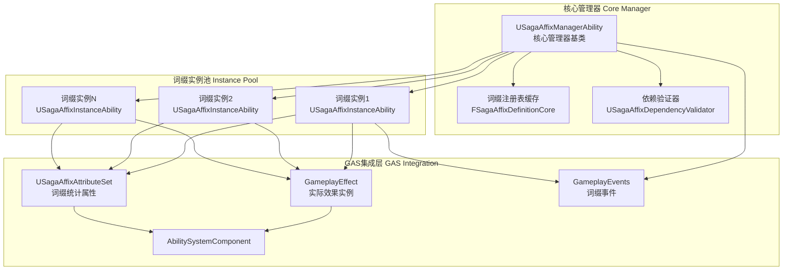

### 3. 分层交互时序图

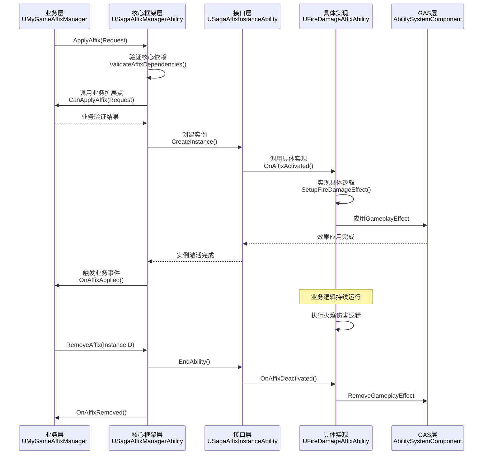

---

## 类关系图

### 1. 分层类继承关系图

```mermaid
classDiagram
    %% 基础设施层
    class UGameplayAbility {
        <<GAS Base Class>>
        +ActivateAbility()
        +EndAbility()
        +CanActivateAbility()
    }
    
    class USagaAttributeSet {
        <<SagaStats Base>>
        +GetLifetimeReplicatedProps()
        +PreAttributeChange()
        +PostGameplayEffectExecute()
    }
    
    %% 核心框架层
    class USagaAffixManagerAbility {
        <<Core Framework>>
        +ApplyAffix() : FGuid
        +RemoveAffix() : bool
        +GetActiveAffixes() : TArray
        #CanApplyAffix() : bool {业务扩展点}
        #OnAffixApplied() {业务扩展点}
        #OnAffixRemoved() {业务扩展点}
        -ActiveAffixInstances : TMap
        -CachedDefinitions : TMap
    }
    
    class USagaAffixInstanceAbility {
        <<Core Framework + Interface>>
        +UpdateInstanceState() : bool
        +AddStack() : bool
        +RemoveStack() : bool
        +OnAffixActivated() {业务接口}
        +OnAffixDeactivated() {业务接口}
        +CalculateEffectMagnitude() {业务接口}
        #AffixDefinition : FSagaAffixDefinitionCore
        #InstanceInfo : FSagaActiveAffixInfo
    }
    
    class USagaAffixAttributeSet {
        <<Core Framework>>
        +ActiveAffixCount : FSagaClampedGameplayAttributeData
        +MaxAffixSlots : FSagaClampedGameplayAttributeData
        +TotalAffixPower : FSagaClampedGameplayAttributeData
        +OnRep_ActiveAffixCount()
        +UpdateDerivedAttributes()
    }
    
    %% 业务逻辑层
    class UMyGameAffixManager {
        <<Business Implementation>>
        +CanApplyAffix() override
        +OnAffixApplied() override
        +CheckLevelRequirement() : bool
        +CheckClassRestriction() : bool
        +GetMaxAffixSlots() : int32
    }
    
    class UFireDamageAffixAbility {
        <<Business Implementation>>
        +OnAffixActivated() override
        +OnAffixDeactivated() override
        +CalculateEffectMagnitude() override
        +ApplyBurnEffect()
        +GetFireAffinityBonus() : float
    }
    
    %% 继承关系
    UGameplayAbility <|-- USagaAffixManagerAbility : 核心框架继承
    UGameplayAbility <|-- USagaAffixInstanceAbility : 核心框架继承
    USagaAttributeSet <|-- USagaAffixAttributeSet : 核心框架继承
    
    USagaAffixManagerAbility <|-- UMyGameAffixManager : 业务层继承
    USagaAffixInstanceAbility <|-- UFireDamageAffixAbility : 业务层继承
    
    %% 组合关系
    USagaAffixManagerAbility --o USagaAffixInstanceAbility : 管理实例
    USagaAffixInstanceAbility --> USagaAffixAttributeSet : 修改属性
    
    %% 样式
    classDef coreFramework fill:#e8f5e8,stroke:#4caf50
    classDef businessLogic fill:#e1f5fe,stroke:#2196f3
    classDef infrastructure fill:#fff3e0,stroke:#ff9800
    
    class USagaAffixManagerAbility,USagaAffixInstanceAbility,USagaAffixAttributeSet coreFramework
    class UMyGameAffixManager,UFireDamageAffixAbility businessLogic
    class UGameplayAbility,USagaAttributeSet infrastructure
```

### 2. 分层数据结构关系图

```mermaid
classDiagram
    %% 基础设施层 - 核心数据结构
    class FSagaAffixDefinitionCore {
        <<Core Framework>>
        +AffixID : FGameplayTag
        +ImplementationClass : TSubclassOf
        +InitialState : ESagaAffixState
        +BaseDuration : float
        +bCanStack : bool
        +MaxStackCount : int32
        +StackingMode : ESagaAffixStackingMode
    }
    
    class FSagaAffixDependencyCore {
        <<Core Framework>>
        +OneOfRequired : TArray~FGameplayTag~
        +OneFromEachSetRequired : TArray~FSagaAffixSet~
        +ExclusiveTags : FGameplayTagContainer
    }
    
    class FSagaActiveAffixInfo {
        <<Core Framework>>
        +AffixID : FGameplayTag
        +InstanceID : FGuid
        +State : ESagaAffixState
        +StackCount : int32
        +RemainingDuration : float
        +AppliedTimestamp : float
        +SourceActorWeak : TWeakObjectPtr
        +ActiveEffectHandles : TArray
    }
    
    class FSagaAffixApplicationRequest {
        <<Core Framework>>
        +AffixID : FGameplayTag
        +TargetActor : TObjectPtr~AActor~
        +SourceActor : TObjectPtr~AActor~
        +OverrideDuration : float
        +OverrideMagnitude : float
        +bForceApplication : bool
        +CustomParameters : TMap
    }
    
    %% 业务逻辑层 - 扩展数据结构
    class FMyGameAffixDefinition {
        <<Business Extension>>
        +DisplayName : FText
        +Description : FText
        +Icon : TSoftObjectPtr~UTexture2D~
        +Rarity : ESagaAffixRarity
        +RequiredLevel : int32
        +Weight : float
        +BusinessDependencies : FMyGameDependencies
    }
    
    class FMyGameAffixDependencies {
        <<Business Extension>>
        +QualityRequirements : TMap
        +MinimumLevel : int32
        +AllowedClasses : TArray~FGameplayTag~
        +RequiredItems : TArray~FGameplayTag~
    }
    
    %% 依赖关系
    FSagaAffixDefinitionCore <|-- FMyGameAffixDefinition : 业务层继承核心定义
    FSagaAffixDependencyCore <|-- FMyGameAffixDependencies : 业务层扩展核心依赖
    
    FSagaAffixDefinitionCore --> FSagaAffixDependencyCore : 包含核心依赖
    FMyGameAffixDefinition --> FMyGameAffixDependencies : 包含业务依赖
    
    FSagaAffixDefinitionCore ..> FSagaActiveAffixInfo : 生成运行时信息
    FSagaAffixApplicationRequest ..> FSagaActiveAffixInfo : 创建实例信息
    
    %% 样式
    classDef coreData fill:#e8f5e8,stroke:#4caf50
    classDef businessData fill:#e1f5fe,stroke:#2196f3
    
    class FSagaAffixDefinitionCore,FSagaAffixDependencyCore,FSagaActiveAffixInfo,FSagaAffixApplicationRequest coreData
    class FMyGameAffixDefinition,FMyGameAffixDependencies businessData
```

---

## 流程设计

### 1. 词缀应用流程图


### 2. 词缀移除流程图


### 3. 过期检查流程图

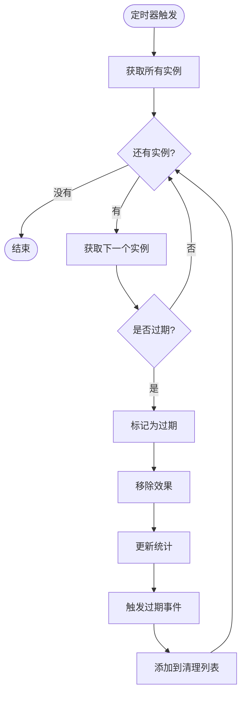

---

## 状态机设计

### 1. 词缀实例状态机

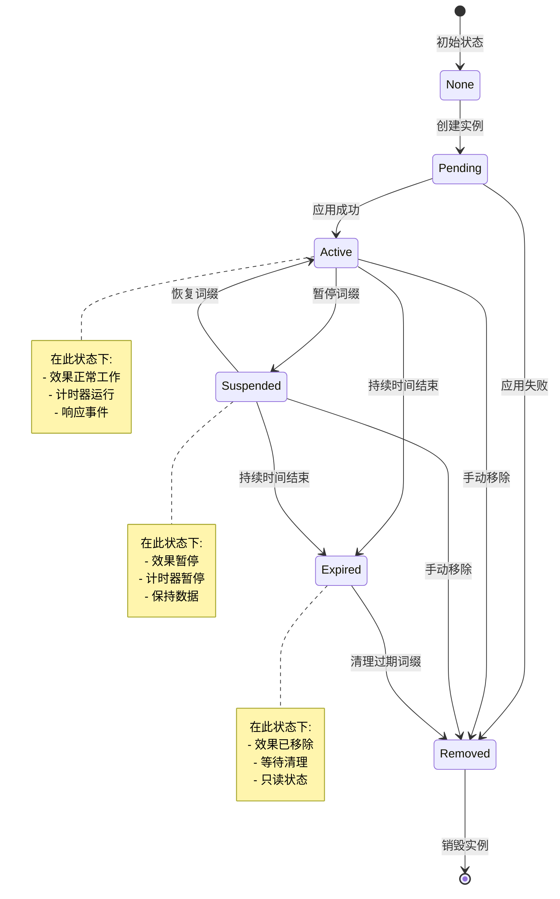

### 2. 系统管理器状态机

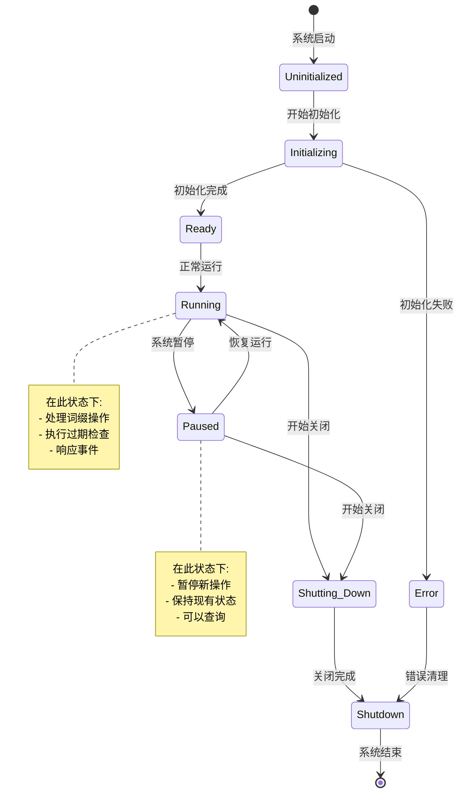

---

## 网络架构设计

### 1. 分层网络架构设计

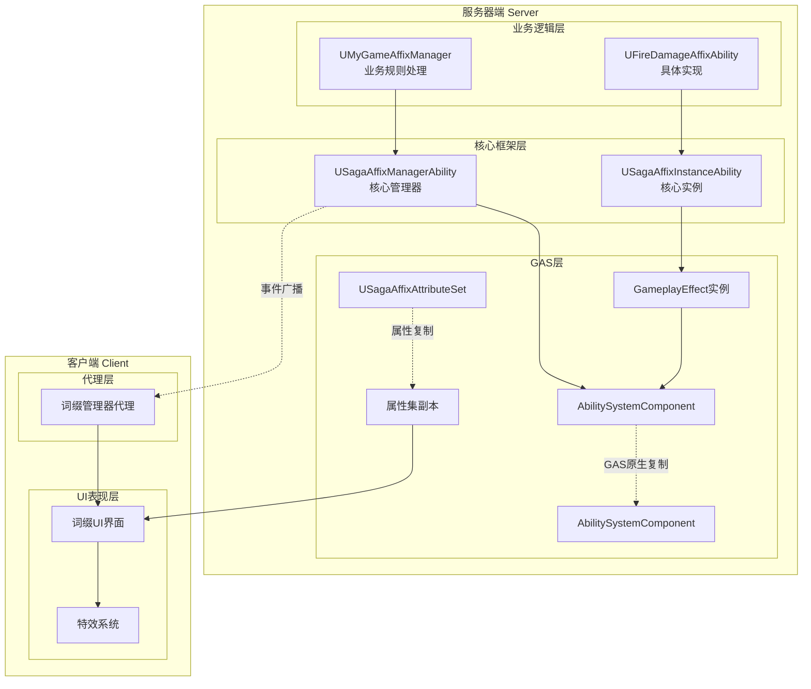

### 2. 分层网络交互时序图

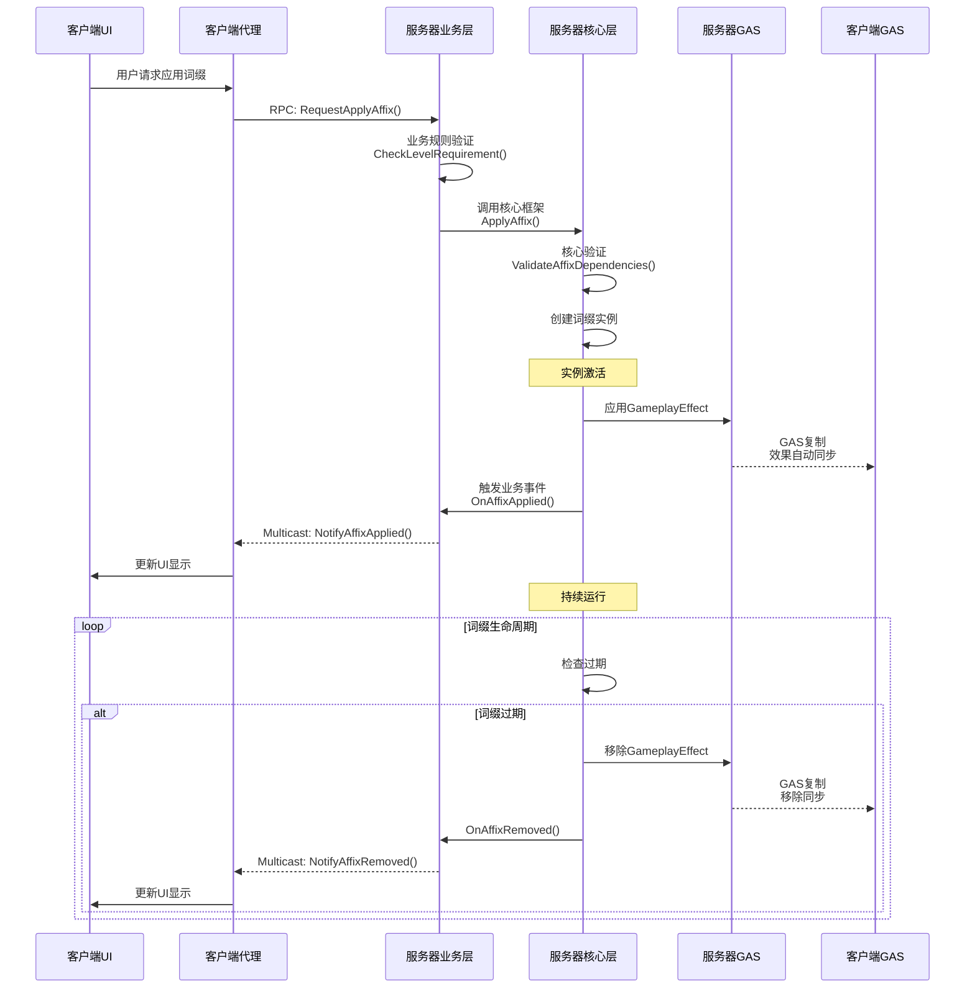

---

## 性能优化设计

### 1. 缓存策略

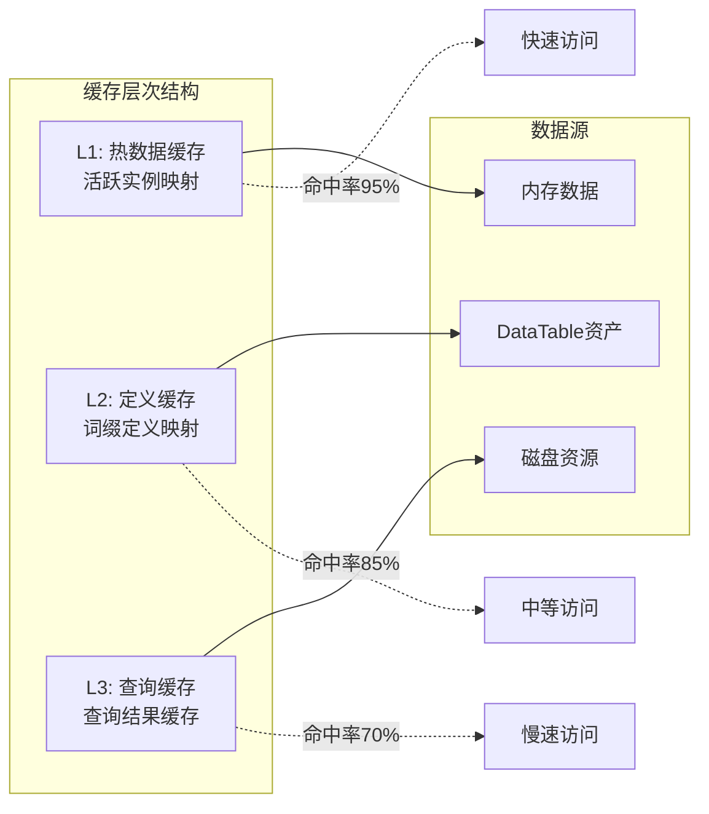

### 2. 批处理优化

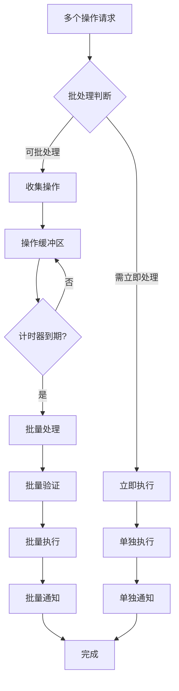

### 3. 内存管理策略

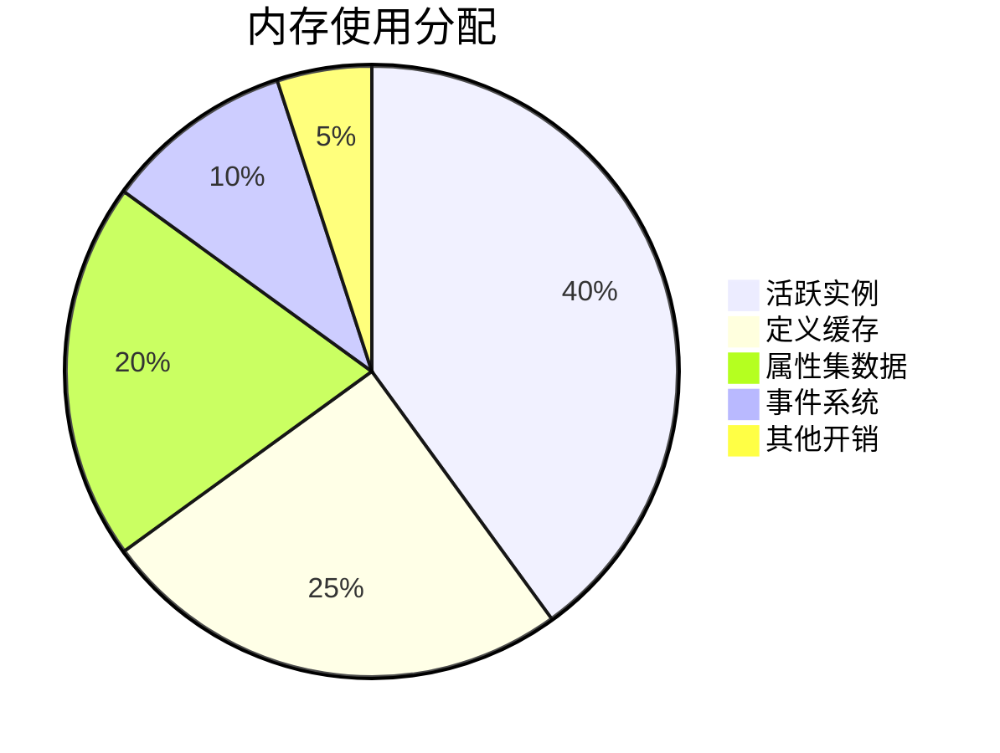

---

## 错误处理设计

### 1. 错误分类体系

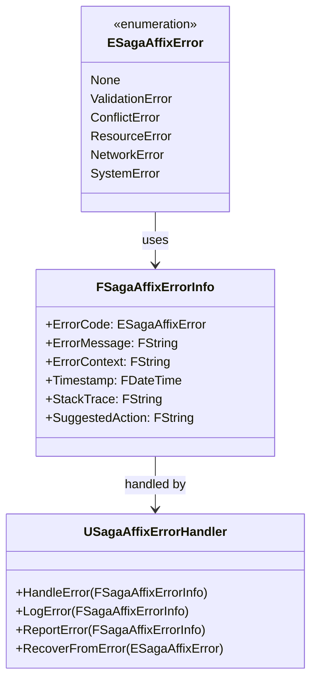

### 2. 错误恢复流程

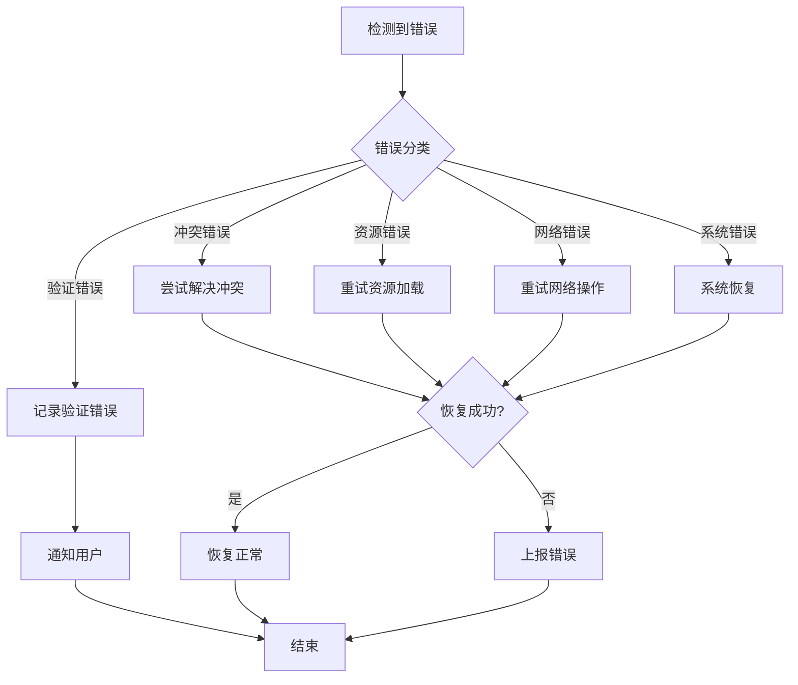

---

## 分层测试策略设计

### 1. 分层测试金字塔

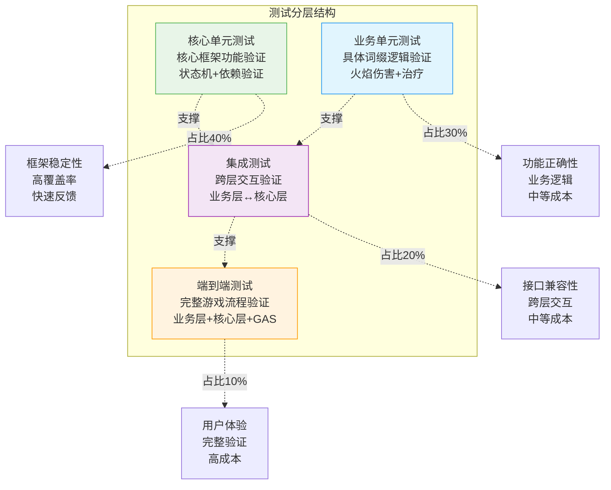

### 2. 分层测试用例设计

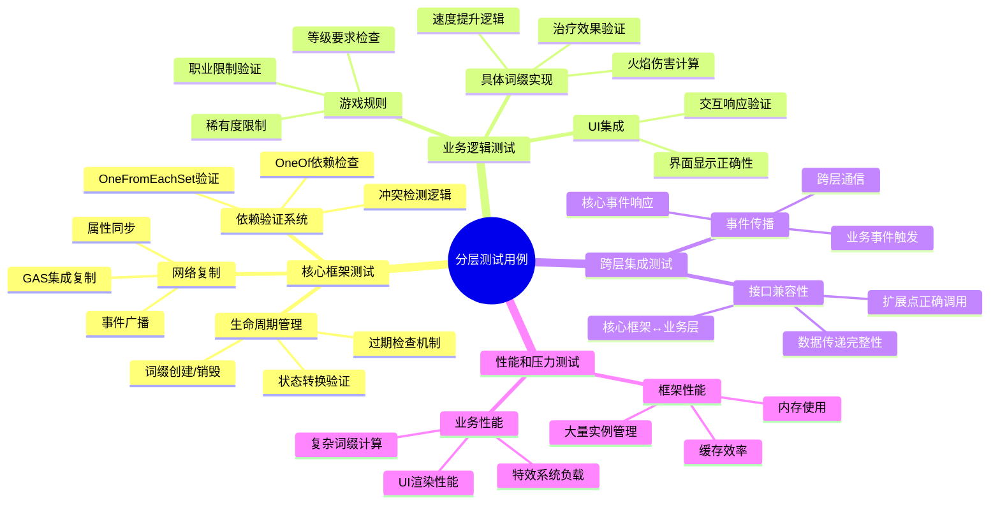

---

## 总结

本详细程序设计文档为SagaStats词缀系统提供了完整的分层架构技术规范：

### 核心架构特性
- **分层架构**: 核心框架与业务逻辑的清晰分离，确保高复用性和可扩展性
- **纯GAS集成**: 深度集成GameplayAbility系统，无缝利用GAS生态
- **依赖倒置设计**: 核心框架不依赖具体实现，通过接口定义扩展点
- **Hades经验借鉴**: 基于对Hades源码的深入分析，实现经过实战验证的依赖验证系统

### 设计亮点
- **四层架构**: 基础设施层、核心框架层、接口层、业务逻辑层的明确分工
- **双重配置系统**: 核心配置（稳定不变）+ 业务配置（灵活扩展）
- **分层测试策略**: 针对不同层次的专门化测试方案
- **网络架构优化**: 分层网络设计，核心数据自动同步，业务事件精准广播

### 实施路径
1. **第一阶段**: 基础设施层和核心框架层实现
   - 核心数据结构和枚举定义
   - 生命周期管理和状态机系统
   - 基于Hades经验的依赖验证系统

2. **第二阶段**: 接口层和基础API实现
   - 抽象基类和扩展点定义
   - 核心API接口实现
   - GAS集成和网络复制框架

3. **第三阶段**: 业务示例和高级特性
   - 具体词缀实现示例
   - 游戏特定规则系统
   - UI集成和表现系统

4. **第四阶段**: 全面测试和性能优化
   - 分层测试体系建设
   - 性能监控和调优
   - 文档完善和用例示例

### 架构价值
这种分层设计确保了SagaStats词缀系统：
- **高复用性**: 核心框架可在多个项目间复用
- **强扩展性**: 业务层可以自由扩展而不影响核心稳定性
- **易维护性**: 清晰的职责边界，便于定位和修复问题
- **测试友好**: 分层测试策略，确保各层次的质量

该分层设计文档为后续的代码实现提供了详细的技术指导，确保系统既能作为稳定的框架基础，又能满足不同游戏的个性化需求。

---

**文档版本**: v1.0  
**最后更新**: 2025-07-17  
**文档作者**: ZhangJinming  
**项目路径**: D:\UnrealEngine\UnrealEngine\Projects\SagaStats