# SagaAffix词缀系统程序设计文档

## 文档信息
- **文档标题**: SagaAffix词缀系统程序设计文档
- **创建日期**: 2025-07-17
- **版本**: v1.0
- **文档作者**: ZhangJinming
- **用途**: 为SagaAffix词缀系统的具体实现提供详细的程序设计规范

---

## 目录
1. [系统概述](#系统概述)
2. [核心类设计](#核心类设计)
3. [数据结构设计](#数据结构设计)
4. [API接口设计](#API接口设计)
5. [系统架构图](#系统架构图)
6. [类关系图](#类关系图)
7. [流程设计](#流程设计)
8. [状态机设计](#状态机设计)
9. [网络架构设计](#网络架构设计)
10. [性能优化设计](#性能优化设计)
11. [错误处理设计](#错误处理设计)
12. [测试策略设计](#测试策略设计)

---

## 系统概述

### 设计目标
基于纯GameplayAbility架构设计SagaStats词缀系统，实现：
- **完全GAS集成**: 零桥接成本，深度利用GAS生态
- **模块化设计**: 高内聚低耦合的组件架构
- **数据驱动**: 通过DataTable配置词缀定义
- **网络友好**: 基于GAS原生复制机制
- **高性能**: 优化的事件驱动和缓存策略

### 核心设计原则
1. **PassiveAbility模式**: 所有管理器作为被动能力运行
2. **事件驱动架构**: 基于GameplayEvents的松耦合通信
3. **属性集集中管理**: 统一的状态和统计信息存储
4. **分层责任**: 明确的管理层、实例层、数据层分离

---

## 核心类设计

### 1. USagaAffixManagerAbility
**作用**: 词缀系统核心管理器，作为PassiveAbility运行

```cpp
// 关键职责
class USagaAffixManagerAbility : public UGameplayAbility
{
    // 生命周期管理
    - 词缀实例创建/销毁
    - 过期检查和清理
    - 系统初始化和配置加载
    
    // 业务逻辑
    - 词缀应用/移除
    - 冲突检测和协同效应
    - 叠加规则处理
    
    // 查询服务
    - 活跃词缀查询
    - 定义查询和过滤
    - 统计信息获取
}
```

### 2. USagaAffixInstanceAbility
**作用**: 单个词缀实例的具体实现

```cpp
// 关键职责
class USagaAffixInstanceAbility : public UGameplayAbility
{
    // 实例管理
    - 效果应用/移除
    - 状态转换控制
    - 持续时间管理
    
    // 效果处理
    - GameplayEffect管理
    - 周期性效果执行
    - 条件检查和验证
    
    // 叠加机制
    - 层数增减控制
    - 叠加规则执行
    - 效果强度计算
}
```

### 3. USagaAffixAttributeSet
**作用**: 词缀系统专用属性集

```cpp
// 关键职责
class USagaAffixAttributeSet : public USagaAttributeSet
{
    // 统计属性
    - ActiveAffixCount: 当前活跃词缀数
    - MaxAffixSlots: 最大词缀槽位
    - TotalAffixPower: 总词缀强度
    
    // 分类计数
    - 按类型计数(AttributeModifier, BehaviorModifier等)
    - 按稀有度计数(Common, Rare, Epic等)
    - 按状态计数(Active, Suspended, Expired等)
    
    // 系统属性
    - AffixEfficiency: 词缀效率系数
    - AffixChangeCounter: 变化计数器
}
```

---

## 数据结构设计

### 1. 核心枚举类型

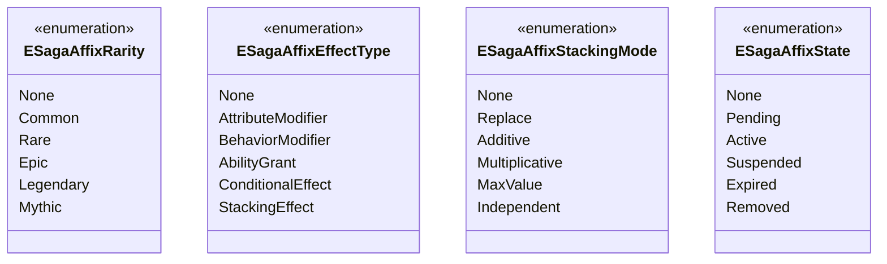
```mermaid
classDiagram
    class ESagaAffixRarity {
        <<enumeration>>
        None
        Common
        Rare
        Epic
        Legendary
        Mythic
    }
    
    class ESagaAffixEffectType {
        <<enumeration>>
        None
        AttributeModifier
        BehaviorModifier
        AbilityGrant
        ConditionalEffect
        StackingEffect
    }
    
    class ESagaAffixStackingMode {
        <<enumeration>>
        None
        Replace
        Additive
        Multiplicative
        MaxValue
        Independent
    }
    
    class ESagaAffixState {
        <<enumeration>>
        None
        Pending
        Active
        Suspended
        Expired
        Removed
    }
```

### 2. 数据结构层次关系

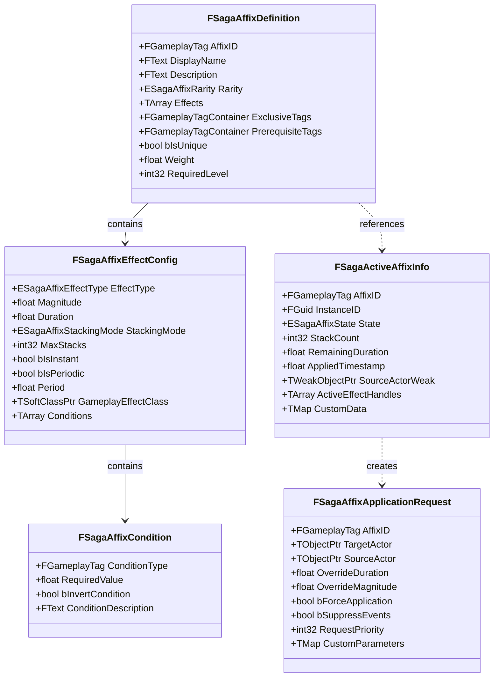
```mermaid
classDiagram
    class FSagaAffixDefinition {
        +FGameplayTag AffixID
        +FText DisplayName
        +FText Description
        +ESagaAffixRarity Rarity
        +TArray Effects
        +FGameplayTagContainer ExclusiveTags
        +FGameplayTagContainer PrerequisiteTags
        +bool bIsUnique
        +float Weight
        +int32 RequiredLevel
    }
    
    class FSagaAffixEffectConfig {
        +ESagaAffixEffectType EffectType
        +float Magnitude
        +float Duration
        +ESagaAffixStackingMode StackingMode
        +int32 MaxStacks
        +bool bIsInstant
        +bool bIsPeriodic
        +float Period
        +TSoftClassPtr GameplayEffectClass
        +TArray Conditions
    }
    
    class FSagaAffixCondition {
        +FGameplayTag ConditionType
        +float RequiredValue
        +bool bInvertCondition
        +FText ConditionDescription
    }
    
    class FSagaActiveAffixInfo {
        +FGameplayTag AffixID
        +FGuid InstanceID
        +ESagaAffixState State
        +int32 StackCount
        +float RemainingDuration
        +float AppliedTimestamp
        +TWeakObjectPtr SourceActorWeak
        +TArray ActiveEffectHandles
        +TMap CustomData
    }
    
    class FSagaAffixApplicationRequest {
        +FGameplayTag AffixID
        +TObjectPtr TargetActor
        +TObjectPtr SourceActor
        +float OverrideDuration
        +float OverrideMagnitude
        +bool bForceApplication
        +bool bSuppressEvents
        +int32 RequestPriority
        +TMap CustomParameters
    }
    
    FSagaAffixDefinition --> FSagaAffixEffectConfig : contains
    FSagaAffixEffectConfig --> FSagaAffixCondition : contains
    FSagaAffixDefinition ..> FSagaActiveAffixInfo : references
    FSagaActiveAffixInfo ..> FSagaAffixApplicationRequest : creates
```

---

## API接口设计

### 1. 管理器API设计

#### 词缀应用接口
```cpp
// 基础应用接口
FGuid ApplyAffix(const FSagaAffixApplicationRequest& Request);

// 便捷应用接口  
FGuid ApplyAffixSimple(const FGameplayTag& AffixID, AActor* TargetActor, AActor* SourceActor = nullptr);

// 批量应用接口
TArray<FGuid> ApplyMultipleAffixes(const TArray<FSagaAffixApplicationRequest>& Requests);
```

#### 词缀移除接口
```cpp
// 按实例ID移除
bool RemoveAffix(const FGuid& InstanceID, AActor* TargetActor = nullptr);

// 按词缀类型移除
int32 RemoveAffixesByID(const FGameplayTag& AffixID, AActor* TargetActor = nullptr);

// 按标签移除
int32 RemoveAffixesByTags(const FGameplayTagContainer& Tags, AActor* TargetActor = nullptr, bool bRequireAll = false);

// 移除所有词缀
int32 RemoveAllAffixes(AActor* TargetActor = nullptr);
```

#### 词缀查询接口
```cpp
// 获取活跃词缀
TArray<FSagaActiveAffixInfo> GetActiveAffixes(AActor* TargetActor = nullptr) const;

// 按条件查询
TArray<FSagaActiveAffixInfo> GetAffixesByID(const FGameplayTag& AffixID, AActor* TargetActor = nullptr) const;
TArray<FSagaActiveAffixInfo> GetAffixesByTags(const FGameplayTagContainer& Tags, AActor* TargetActor = nullptr, bool bRequireAll = false) const;
TArray<FSagaActiveAffixInfo> GetAffixesByState(ESagaAffixState State, AActor* TargetActor = nullptr) const;

// 存在性检查
bool HasAffix(const FGameplayTag& AffixID, AActor* TargetActor = nullptr) const;
bool HasAnyAffixWithTags(const FGameplayTagContainer& Tags, AActor* TargetActor = nullptr) const;

// 统计查询
int32 GetAffixCount(AActor* TargetActor = nullptr) const;
int32 GetAffixCountByRarity(ESagaAffixRarity Rarity, AActor* TargetActor = nullptr) const;
float GetTotalAffixPower(AActor* TargetActor = nullptr) const;
```

### 2. 实例API设计

#### 实例控制接口
```cpp
// 状态控制
bool UpdateInstanceState(ESagaAffixState NewState);
bool SuspendAffixEffects();
bool ResumeAffixEffects();

// 叠加控制
bool AddStack(int32 StacksToAdd = 1);
bool RemoveStack(int32 StacksToRemove = 1);
bool SetStackCount(int32 NewStackCount);

// 时间控制
bool RefreshDuration(float NewDuration = -1.0f);
bool ExtendDuration(float AdditionalTime);
```

#### 实例查询接口
```cpp
// 状态查询
bool IsActive() const;
bool IsSuspended() const;
bool IsExpired() const;
ESagaAffixState GetCurrentState() const;

// 时间查询
float GetRemainingDuration() const;
float GetElapsedTime() const;
float GetProgress() const; // 0.0-1.0

// 叠加查询
int32 GetCurrentStackCount() const;
int32 GetMaxStackCount() const;
bool CanAddStack() const;
```

---

## 系统架构图

### 1. 总体架构图

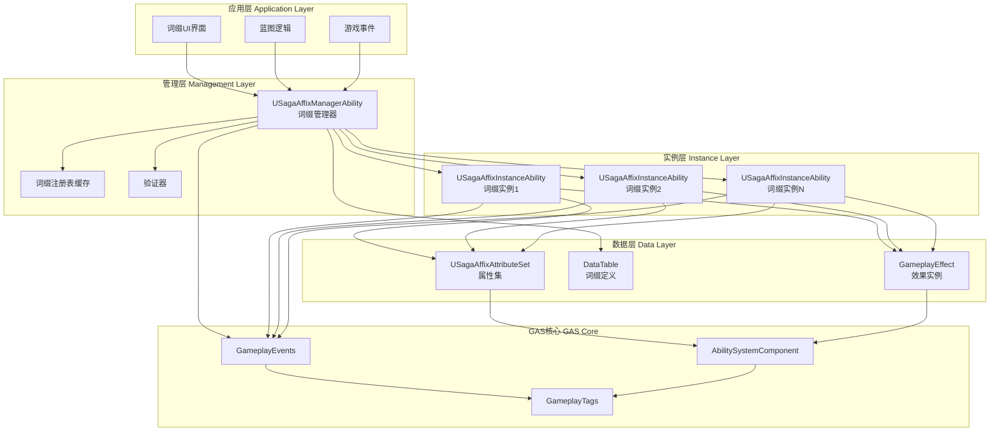
```mermaid
graph TB
    subgraph "应用层 Application Layer"
        UI[词缀UI界面]
        BP[蓝图逻辑]
        Event[游戏事件]
    end
    
    subgraph "管理层 Management Layer"
        Manager[USagaAffixManagerAbility<br/>词缀管理器]
        Registry[词缀注册表缓存]
        Validator[验证器]
    end
    
    subgraph "实例层 Instance Layer"
        Instance1[USagaAffixInstanceAbility<br/>词缀实例1]
        Instance2[USagaAffixInstanceAbility<br/>词缀实例2]
        InstanceN[USagaAffixInstanceAbility<br/>词缀实例N]
    end
    
    subgraph "数据层 Data Layer"
        AttributeSet[USagaAffixAttributeSet<br/>属性集]
        DataTable[DataTable<br/>词缀定义]
        GameplayEffect[GameplayEffect<br/>效果实例]
    end
    
    subgraph "GAS核心 GAS Core"
        ASC[AbilitySystemComponent]
        GAS_Events[GameplayEvents]
        GAS_Tags[GameplayTags]
    end
    
    UI --> Manager
    BP --> Manager
    Event --> Manager
    
    Manager --> Registry
    Manager --> Validator
    Manager --> Instance1
    Manager --> Instance2
    Manager --> InstanceN
    
    Instance1 --> AttributeSet
    Instance2 --> AttributeSet
    InstanceN --> AttributeSet
    
    Instance1 --> GameplayEffect
    Instance2 --> GameplayEffect
    InstanceN --> GameplayEffect
    
    Manager --> DataTable
    AttributeSet --> ASC
    GameplayEffect --> ASC
    
    Manager --> GAS_Events
    Instance1 --> GAS_Events
    Instance2 --> GAS_Events
    InstanceN --> GAS_Events
    
    GAS_Events --> GAS_Tags
    ASC --> GAS_Tags
```

### 2. 组件交互图

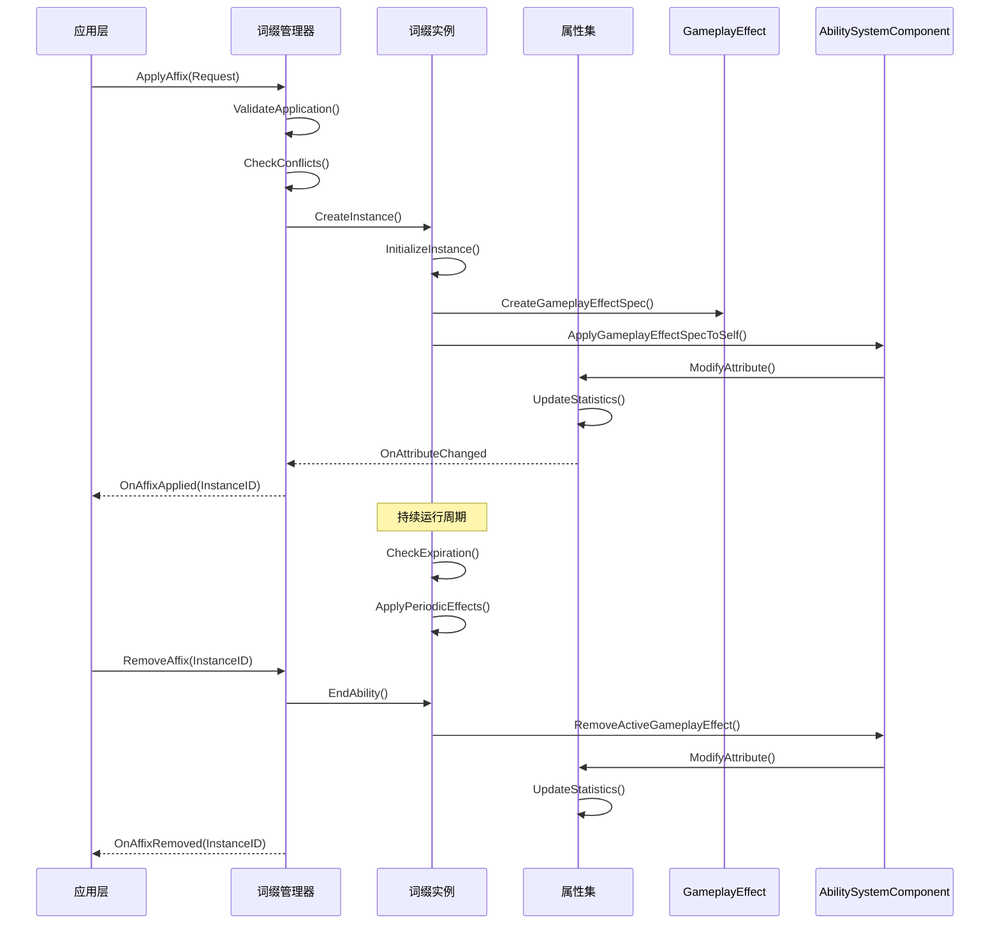
```mermaid
sequenceDiagram
    participant App as 应用层
    participant Manager as 词缀管理器
    participant Instance as 词缀实例
    participant AttributeSet as 属性集
    participant GE as GameplayEffect
    participant ASC as AbilitySystemComponent
    
    App->>Manager: ApplyAffix(Request)
    Manager->>Manager: ValidateApplication()
    Manager->>Manager: CheckConflicts()
    Manager->>Instance: CreateInstance()
    Instance->>Instance: InitializeInstance()
    Instance->>GE: CreateGameplayEffectSpec()
    Instance->>ASC: ApplyGameplayEffectSpecToSelf()
    ASC->>AttributeSet: ModifyAttribute()
    AttributeSet->>AttributeSet: UpdateStatistics()
    AttributeSet-->>Manager: OnAttributeChanged
    Manager-->>App: OnAffixApplied(InstanceID)
    
    Note over Instance: 持续运行周期
    Instance->>Instance: CheckExpiration()
    Instance->>Instance: ApplyPeriodicEffects()
    
    App->>Manager: RemoveAffix(InstanceID)
    Manager->>Instance: EndAbility()
    Instance->>ASC: RemoveActiveGameplayEffect()
    ASC->>AttributeSet: ModifyAttribute()
    AttributeSet->>AttributeSet: UpdateStatistics()
    Manager-->>App: OnAffixRemoved(InstanceID)
```

---

## 类关系图

### 1. 核心类继承关系

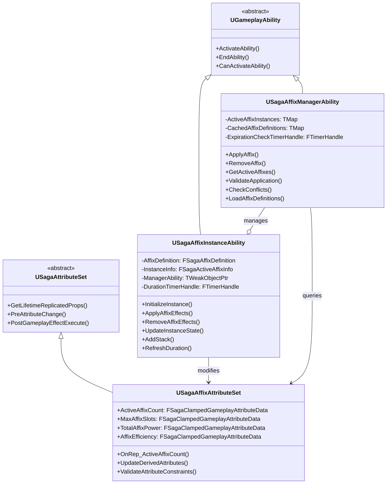
```mermaid
classDiagram
    class UGameplayAbility {
        <<abstract>>
        +ActivateAbility()
        +EndAbility()
        +CanActivateAbility()
    }
    
    class USagaAttributeSet {
        <<abstract>>
        +GetLifetimeReplicatedProps()
        +PreAttributeChange()
        +PostGameplayEffectExecute()
    }
    
    class USagaAffixManagerAbility {
        +ApplyAffix()
        +RemoveAffix()
        +GetActiveAffixes()
        +ValidateApplication()
        +CheckConflicts()
        +LoadAffixDefinitions()
        -ActiveAffixInstances: TMap
        -CachedAffixDefinitions: TMap
        -ExpirationCheckTimerHandle: FTimerHandle
    }
    
    class USagaAffixInstanceAbility {
        +InitializeInstance()
        +ApplyAffixEffects()
        +RemoveAffixEffects()
        +UpdateInstanceState()
        +AddStack()
        +RefreshDuration()
        -AffixDefinition: FSagaAffixDefinition
        -InstanceInfo: FSagaActiveAffixInfo
        -ManagerAbility: TWeakObjectPtr
        -DurationTimerHandle: FTimerHandle
    }
    
    class USagaAffixAttributeSet {
        +ActiveAffixCount: FSagaClampedGameplayAttributeData
        +MaxAffixSlots: FSagaClampedGameplayAttributeData
        +TotalAffixPower: FSagaClampedGameplayAttributeData
        +AffixEfficiency: FSagaClampedGameplayAttributeData
        +OnRep_ActiveAffixCount()
        +UpdateDerivedAttributes()
        +ValidateAttributeConstraints()
    }
    
    UGameplayAbility <|-- USagaAffixManagerAbility
    UGameplayAbility <|-- USagaAffixInstanceAbility
    USagaAttributeSet <|-- USagaAffixAttributeSet
    
    USagaAffixManagerAbility --o USagaAffixInstanceAbility : manages
    USagaAffixInstanceAbility --> USagaAffixAttributeSet : modifies
    USagaAffixManagerAbility --> USagaAffixAttributeSet : queries
```

### 2. 数据结构关系图

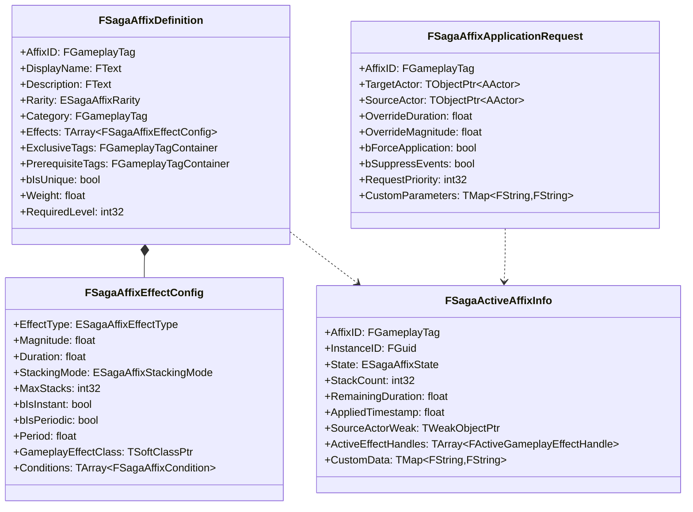
```mermaid
classDiagram
    class FSagaAffixDefinition {
        +AffixID: FGameplayTag
        +DisplayName: FText
        +Description: FText
        +Rarity: ESagaAffixRarity
        +Category: FGameplayTag
        +Effects: TArray~FSagaAffixEffectConfig~
        +ExclusiveTags: FGameplayTagContainer
        +PrerequisiteTags: FGameplayTagContainer
        +bIsUnique: bool
        +Weight: float
        +RequiredLevel: int32
    }
    
    class FSagaAffixEffectConfig {
        +EffectType: ESagaAffixEffectType
        +Magnitude: float
        +Duration: float
        +StackingMode: ESagaAffixStackingMode
        +MaxStacks: int32
        +bIsInstant: bool
        +bIsPeriodic: bool
        +Period: float
        +GameplayEffectClass: TSoftClassPtr
        +Conditions: TArray~FSagaAffixCondition~
    }
    
    class FSagaActiveAffixInfo {
        +AffixID: FGameplayTag
        +InstanceID: FGuid
        +State: ESagaAffixState
        +StackCount: int32
        +RemainingDuration: float
        +AppliedTimestamp: float
        +SourceActorWeak: TWeakObjectPtr
        +ActiveEffectHandles: TArray~FActiveGameplayEffectHandle~
        +CustomData: TMap~FString,FString~
    }
    
    class FSagaAffixApplicationRequest {
        +AffixID: FGameplayTag
        +TargetActor: TObjectPtr~AActor~
        +SourceActor: TObjectPtr~AActor~
        +OverrideDuration: float
        +OverrideMagnitude: float
        +bForceApplication: bool
        +bSuppressEvents: bool
        +RequestPriority: int32
        +CustomParameters: TMap~FString,FString~
    }
    
    FSagaAffixDefinition *-- FSagaAffixEffectConfig
    FSagaAffixDefinition ..> FSagaActiveAffixInfo
    FSagaAffixApplicationRequest ..> FSagaActiveAffixInfo
```

---

## 流程设计

### 1. 词缀应用流程图

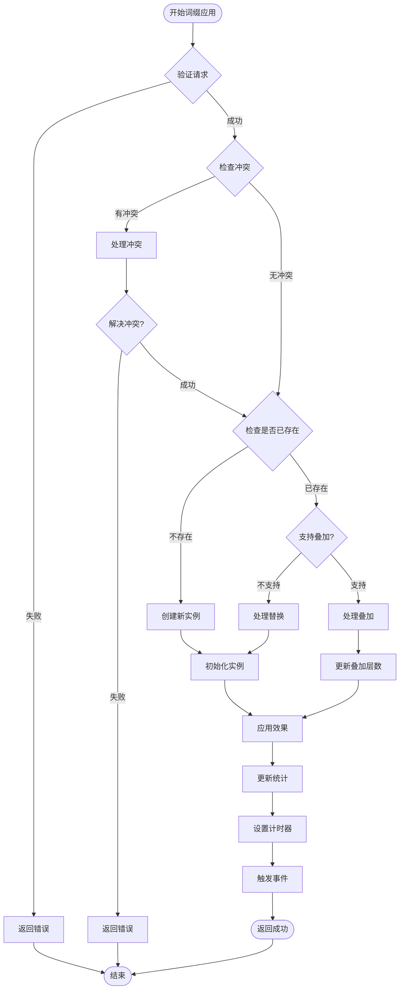
```mermaid
flowchart TD
    Start([开始词缀应用]) --> Validate{验证请求}
    Validate -->|失败| Error1[返回错误]
    Validate -->|成功| CheckConflict{检查冲突}
    
    CheckConflict -->|有冲突| HandleConflict[处理冲突]
    CheckConflict -->|无冲突| CheckExisting{检查是否已存在}
    
    HandleConflict --> ResolveConflict{解决冲突?}
    ResolveConflict -->|失败| Error2[返回错误]
    ResolveConflict -->|成功| CheckExisting
    
    CheckExisting -->|不存在| CreateInstance[创建新实例]
    CheckExisting -->|已存在| CheckStacking{支持叠加?}
    
    CheckStacking -->|不支持| HandleReplace[处理替换]
    CheckStacking -->|支持| HandleStack[处理叠加]
    
    CreateInstance --> InitInstance[初始化实例]
    HandleReplace --> InitInstance
    HandleStack --> UpdateStack[更新叠加层数]
    
    InitInstance --> ApplyEffects[应用效果]
    UpdateStack --> ApplyEffects
    
    ApplyEffects --> UpdateStats[更新统计]
    UpdateStats --> SetTimers[设置计时器]
    SetTimers --> NotifyEvents[触发事件]
    NotifyEvents --> Success([返回成功])
    
    Error1 --> End([结束])
    Error2 --> End
    Success --> End
```

### 2. 词缀移除流程图

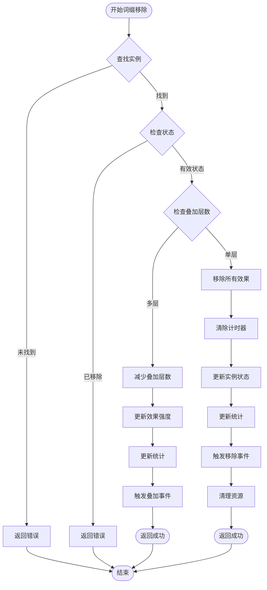
```mermaid
flowchart TD
    Start([开始词缀移除]) --> FindInstance{查找实例}
    FindInstance -->|未找到| Error1[返回错误]
    FindInstance -->|找到| CheckState{检查状态}
    
    CheckState -->|已移除| Error2[返回错误]
    CheckState -->|有效状态| CheckStack{检查叠加层数}
    
    CheckStack -->|多层| ReduceStack[减少叠加层数]
    CheckStack -->|单层| RemoveEffects[移除所有效果]
    
    ReduceStack --> UpdateEffects[更新效果强度]
    UpdateEffects --> UpdateStats1[更新统计]
    UpdateStats1 --> NotifyStack[触发叠加事件]
    NotifyStack --> Success1([返回成功])
    
    RemoveEffects --> ClearTimers[清除计时器]
    ClearTimers --> UpdateInstance[更新实例状态]
    UpdateInstance --> UpdateStats2[更新统计]
    UpdateStats2 --> NotifyRemove[触发移除事件]
    NotifyRemove --> Cleanup[清理资源]
    Cleanup --> Success2([返回成功])
    
    Error1 --> End([结束])
    Error2 --> End
    Success1 --> End
    Success2 --> End
```

### 3. 过期检查流程图


```mermaid
flowchart TD
    Start([定时器触发]) --> GetAllInstances[获取所有实例]
    GetAllInstances --> CheckNext{还有实例?}
    
    CheckNext -->|没有| End([结束])
    CheckNext -->|有| GetInstance[获取下一个实例]
    
    GetInstance --> CheckExpired{是否过期?}
    CheckExpired -->|否| CheckNext
    CheckExpired -->|是| MarkExpired[标记为过期]
    
    MarkExpired --> RemoveEffects[移除效果]
    RemoveEffects --> UpdateStats[更新统计]
    UpdateStats --> NotifyExpired[触发过期事件]
    NotifyExpired --> AddToCleanup[添加到清理列表]
    AddToCleanup --> CheckNext
```

---

## 状态机设计

### 1. 词缀实例状态机

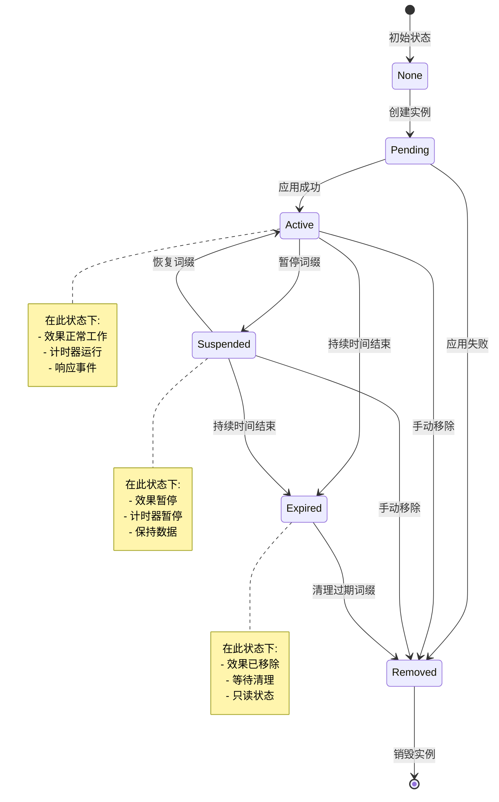
```mermaid
stateDiagram-v2
    [*] --> None : 初始状态
    
    None --> Pending : 创建实例
    Pending --> Active : 应用成功
    Pending --> Removed : 应用失败
    
    Active --> Suspended : 暂停词缀
    Active --> Expired : 持续时间结束
    Active --> Removed : 手动移除
    
    Suspended --> Active : 恢复词缀
    Suspended --> Expired : 持续时间结束
    Suspended --> Removed : 手动移除
    
    Expired --> Removed : 清理过期词缀
    
    Removed --> [*] : 销毁实例
    
    note right of Active
        在此状态下:
        - 效果正常工作
        - 计时器运行
        - 响应事件
    end note
    
    note right of Suspended
        在此状态下:
        - 效果暂停
        - 计时器暂停
        - 保持数据
    end note
    
    note right of Expired
        在此状态下:
        - 效果已移除
        - 等待清理
        - 只读状态
    end note
```

### 2. 系统管理器状态机

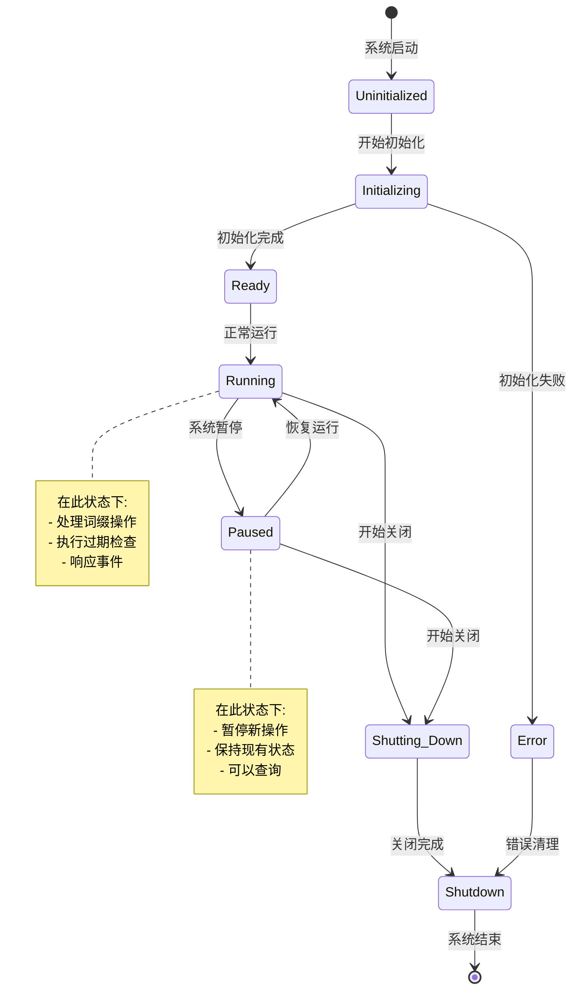
```mermaid
stateDiagram-v2
    [*] --> Uninitialized : 系统启动
    
    Uninitialized --> Initializing : 开始初始化
    Initializing --> Ready : 初始化完成
    Initializing --> Error : 初始化失败
    
    Ready --> Running : 正常运行
    Running --> Paused : 系统暂停
    Running --> Shutting_Down : 开始关闭
    
    Paused --> Running : 恢复运行
    Paused --> Shutting_Down : 开始关闭
    
    Shutting_Down --> Shutdown : 关闭完成
    Error --> Shutdown : 错误清理
    
    Shutdown --> [*] : 系统结束
    
    note right of Running
        在此状态下:
        - 处理词缀操作
        - 执行过期检查
        - 响应事件
    end note
    
    note right of Paused
        在此状态下:
        - 暂停新操作
        - 保持现有状态
        - 可以查询
    end note
```

---

## 网络架构设计

### 1. 网络复制架构

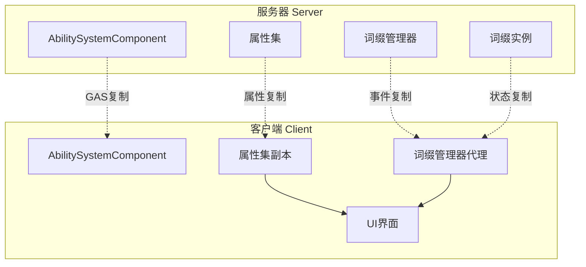
```mermaid
graph TB
    subgraph "服务器 Server"
        ServerASC[AbilitySystemComponent]
        ServerManager[词缀管理器]
        ServerInstance[词缀实例]
        ServerAttributeSet[属性集]
    end
    
    subgraph "客户端 Client"
        ClientASC[AbilitySystemComponent]
        ClientManager[词缀管理器代理]
        ClientAttributeSet[属性集副本]
        ClientUI[UI界面]
    end
    
    ServerASC -.->|GAS复制| ClientASC
    ServerAttributeSet -.->|属性复制| ClientAttributeSet
    ServerManager -.->|事件复制| ClientManager
    ServerInstance -.->|状态复制| ClientManager
    
    ClientAttributeSet --> ClientUI
    ClientManager --> ClientUI
    
    %% 基于GAS原生复制机制
```

### 2. 网络事件流程

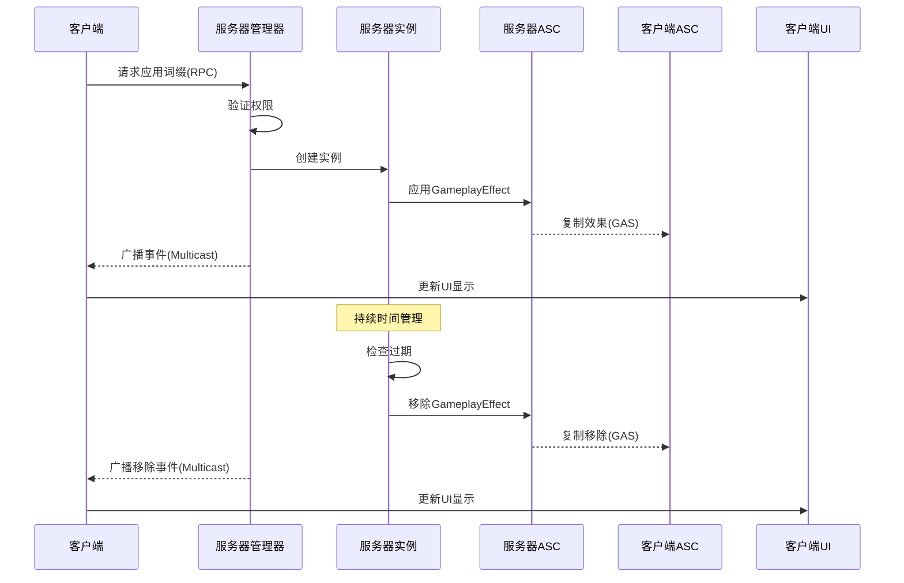
```mermaid
sequenceDiagram
    participant Client as 客户端
    participant ServerManager as 服务器管理器
    participant ServerInstance as 服务器实例
    participant ServerASC as 服务器ASC
    participant ClientASC as 客户端ASC
    participant ClientUI as 客户端UI
    
    Client->>ServerManager: 请求应用词缀(RPC)
    ServerManager->>ServerManager: 验证权限
    ServerManager->>ServerInstance: 创建实例
    ServerInstance->>ServerASC: 应用GameplayEffect
    ServerASC-->>ClientASC: 复制效果(GAS)
    ServerManager-->>Client: 广播事件(Multicast)
    Client->>ClientUI: 更新UI显示
    
    Note over ServerInstance: 持续时间管理
    ServerInstance->>ServerInstance: 检查过期
    ServerInstance->>ServerASC: 移除GameplayEffect
    ServerASC-->>ClientASC: 复制移除(GAS)
    ServerManager-->>Client: 广播移除事件(Multicast)
    Client->>ClientUI: 更新UI显示
```

---

## 性能优化设计

### 1. 缓存策略

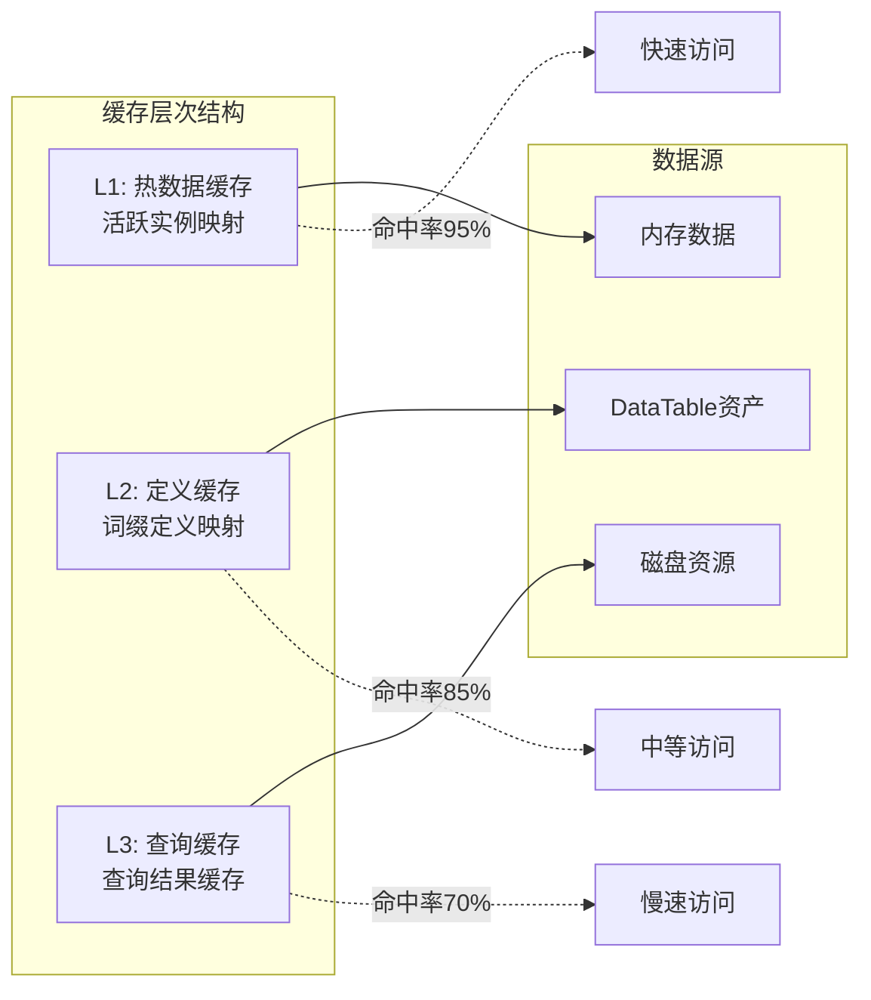
```mermaid
graph LR
    subgraph "缓存层次结构"
        L1[L1: 热数据缓存<br/>活跃实例映射]
        L2[L2: 定义缓存<br/>词缀定义映射]
        L3[L3: 查询缓存<br/>查询结果缓存]
    end
    
    subgraph "数据源"
        Memory[内存数据]
        DataTable[DataTable资产]
        Disk[磁盘资源]
    end
    
    L1 --> Memory
    L2 --> DataTable
    L3 --> Disk
    
    L1 -.->|命中率95%| FastAccess[快速访问]
    L2 -.->|命中率85%| MediumAccess[中等访问]
    L3 -.->|命中率70%| SlowAccess[慢速访问]
```

### 2. 批处理优化

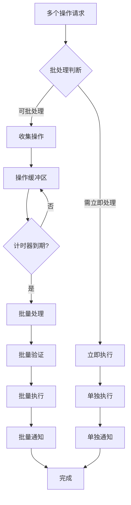
```mermaid
flowchart TD
    Multiple[多个操作请求] --> Batch{批处理判断}
    Batch -->|可批处理| Collect[收集操作]
    Batch -->|需立即处理| Immediate[立即执行]
    
    Collect --> Buffer[操作缓冲区]
    Buffer --> Timer{计时器到期?}
    Timer -->|否| Buffer
    Timer -->|是| Process[批量处理]
    
    Process --> Validate[批量验证]
    Validate --> Execute[批量执行]
    Execute --> Notify[批量通知]
    
    Immediate --> SingleExecute[单独执行]
    SingleExecute --> SingleNotify[单独通知]
    
    Notify --> Complete[完成]
    SingleNotify --> Complete
```

### 3. 内存管理策略

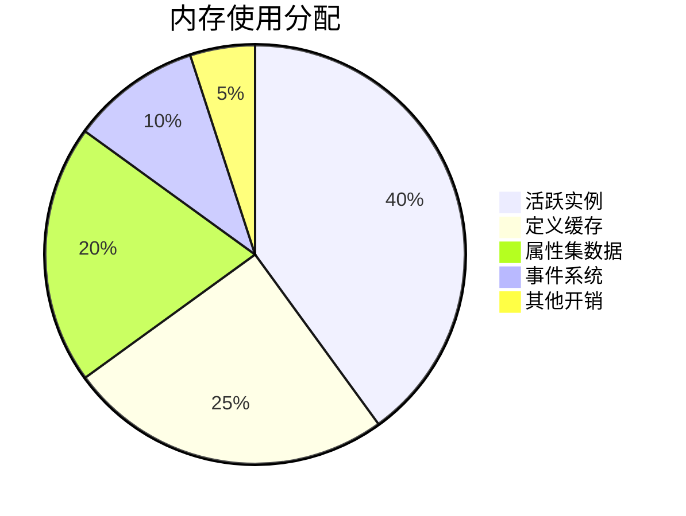
```mermaid
pie title 内存使用分配
    "活跃实例" : 40
    "定义缓存" : 25
    "属性集数据" : 20
    "事件系统" : 10
    "其他开销" : 5
```

---

## 错误处理设计

### 1. 错误分类体系

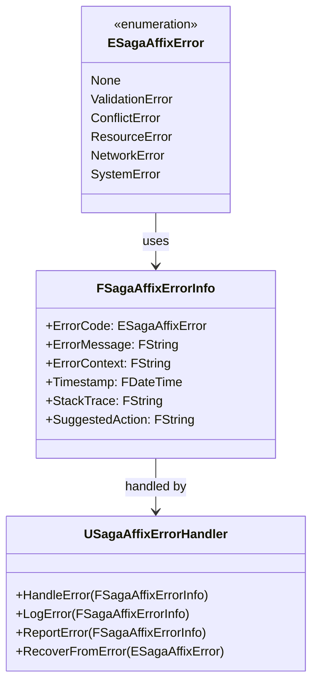
```mermaid
classDiagram
    class ESagaAffixError {
        <<enumeration>>
        None
        ValidationError
        ConflictError
        ResourceError
        NetworkError
        SystemError
    }
    
    class FSagaAffixErrorInfo {
        +ErrorCode: ESagaAffixError
        +ErrorMessage: FString
        +ErrorContext: FString
        +Timestamp: FDateTime
        +StackTrace: FString
        +SuggestedAction: FString
    }
    
    class USagaAffixErrorHandler {
        +HandleError(FSagaAffixErrorInfo)
        +LogError(FSagaAffixErrorInfo)
        +ReportError(FSagaAffixErrorInfo)
        +RecoverFromError(ESagaAffixError)
    }
    
    ESagaAffixError --> FSagaAffixErrorInfo : uses
    FSagaAffixErrorInfo --> USagaAffixErrorHandler : handled by
```

### 2. 错误恢复流程

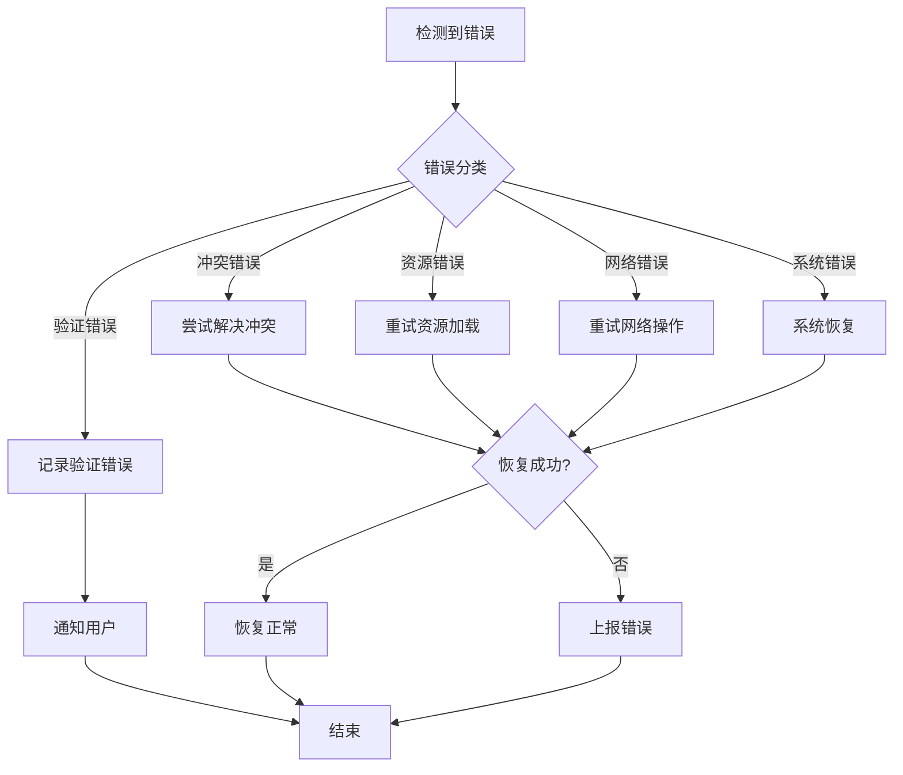
```mermaid
flowchart TD
    Error[检测到错误] --> Classify{错误分类}
    
    Classify -->|验证错误| LogValidation[记录验证错误]
    Classify -->|冲突错误| ResolveConflict[尝试解决冲突]
    Classify -->|资源错误| RetryResource[重试资源加载]
    Classify -->|网络错误| RetryNetwork[重试网络操作]
    Classify -->|系统错误| SystemRecovery[系统恢复]
    
    LogValidation --> UserNotify[通知用户]
    ResolveConflict --> Success{恢复成功?}
    RetryResource --> Success
    RetryNetwork --> Success
    SystemRecovery --> Success
    
    Success -->|是| Recovery[恢复正常]
    Success -->|否| Escalate[上报错误]
    
    UserNotify --> End[结束]
    Recovery --> End
    Escalate --> End
```

---

## 测试策略设计

### 1. 测试金字塔

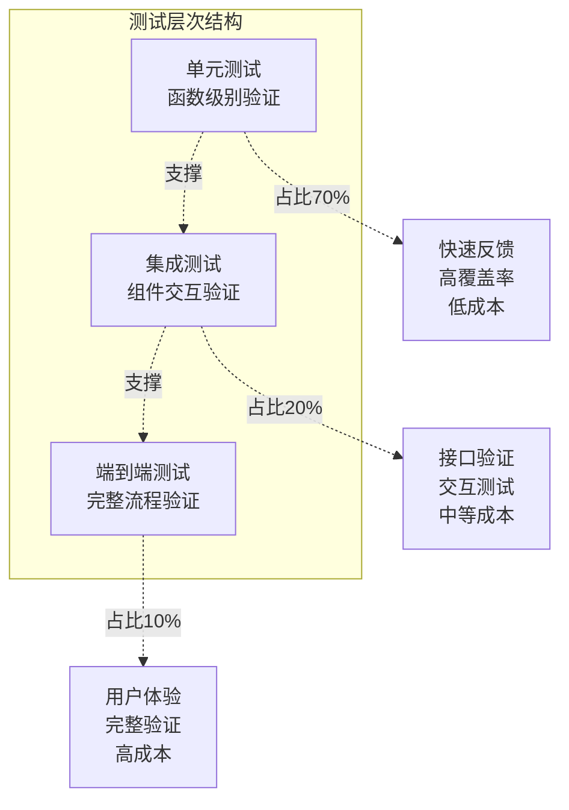
```mermaid
graph TD
    subgraph "测试层次结构"
        E2E[端到端测试<br/>完整流程验证]
        Integration[集成测试<br/>组件交互验证]
        Unit[单元测试<br/>函数级别验证]
    end
    
    Unit -.->|支撑| Integration
    Integration -.->|支撑| E2E
    
    Unit -.->|占比70%| UnitDesc[快速反馈<br/>高覆盖率<br/>低成本]
    Integration -.->|占比20%| IntDesc[接口验证<br/>交互测试<br/>中等成本]
    E2E -.->|占比10%| E2EDesc[用户体验<br/>完整验证<br/>高成本]
```

### 2. 测试用例设计

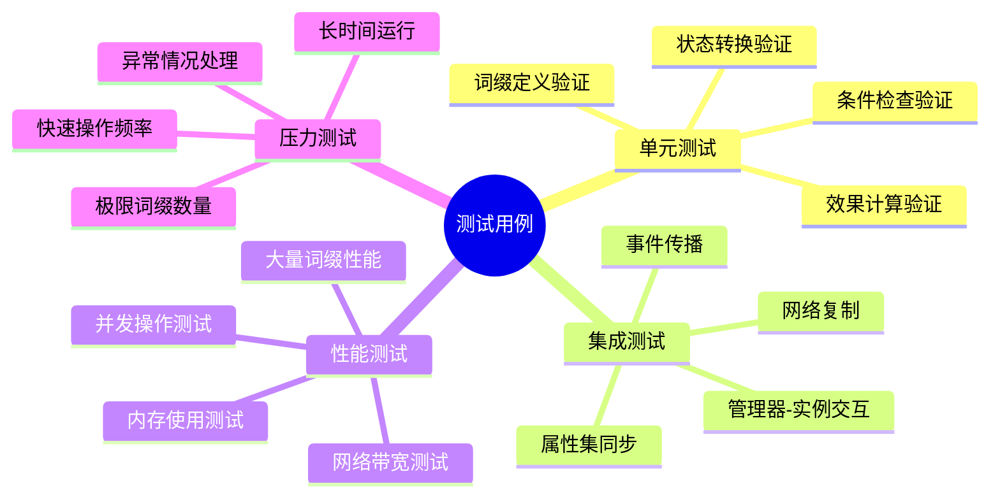
```mermaid
mindmap
  root((测试用例))
    单元测试
      词缀定义验证
      效果计算验证
      状态转换验证
      条件检查验证
    集成测试
      管理器-实例交互
      属性集同步
      网络复制
      事件传播
    性能测试
      大量词缀性能
      内存使用测试
      网络带宽测试
      并发操作测试
    压力测试
      极限词缀数量
      快速操作频率
      长时间运行
      异常情况处理
```

---

## 总结

本详细程序设计文档为SagaStats词缀系统提供了完整的技术规范：

### 核心特性
- **纯GAS架构**: 深度集成GameplayAbility系统
- **事件驱动**: 基于GameplayEvents的松耦合设计
- **数据驱动**: DataTable配置的灵活定义系统
- **网络优化**: 基于GAS原生复制的高效网络架构

### 设计亮点
- **分层架构**: 清晰的管理层、实例层、数据层分离
- **状态机**: 完善的实例和系统状态管理
- **性能优化**: 多层次缓存和批处理策略
- **错误处理**: 完整的错误分类和恢复机制

### 实施路径
1. **第一阶段**: 核心类和数据结构实现
2. **第二阶段**: 基础功能和API接口
3. **第三阶段**: 高级特性和优化
4. **第四阶段**: 测试验证和性能调优

该设计文档为后续的代码实现提供了详细的技术指导，确保系统的可维护性、可扩展性和高性能。

---

**文档版本**: v1.0  
**最后更新**: 2025-07-17  
**文档作者**: ZhangJinming  
**项目路径**: D:\UnrealEngine\UnrealEngine\Projects\SagaStats