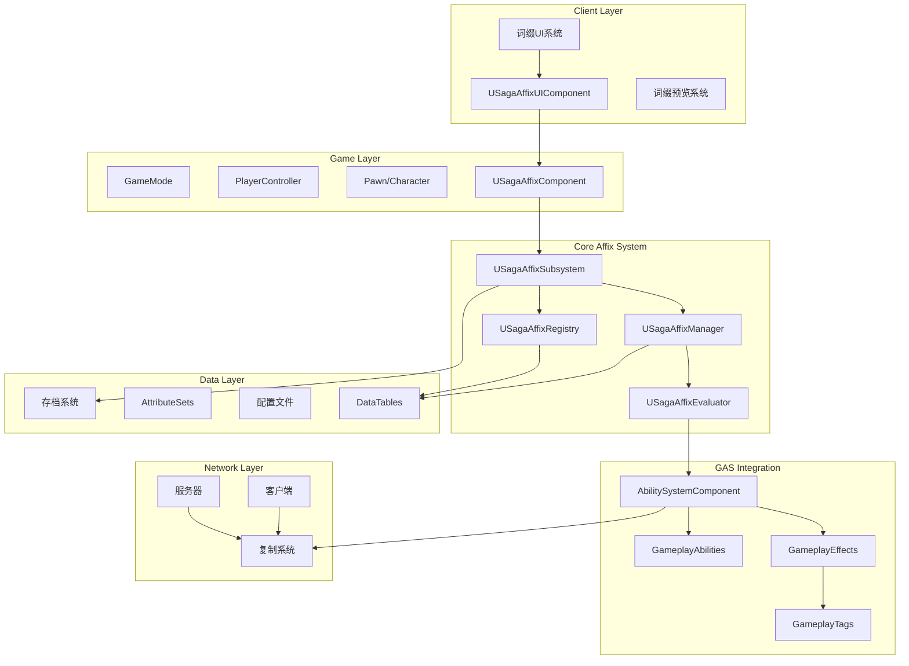
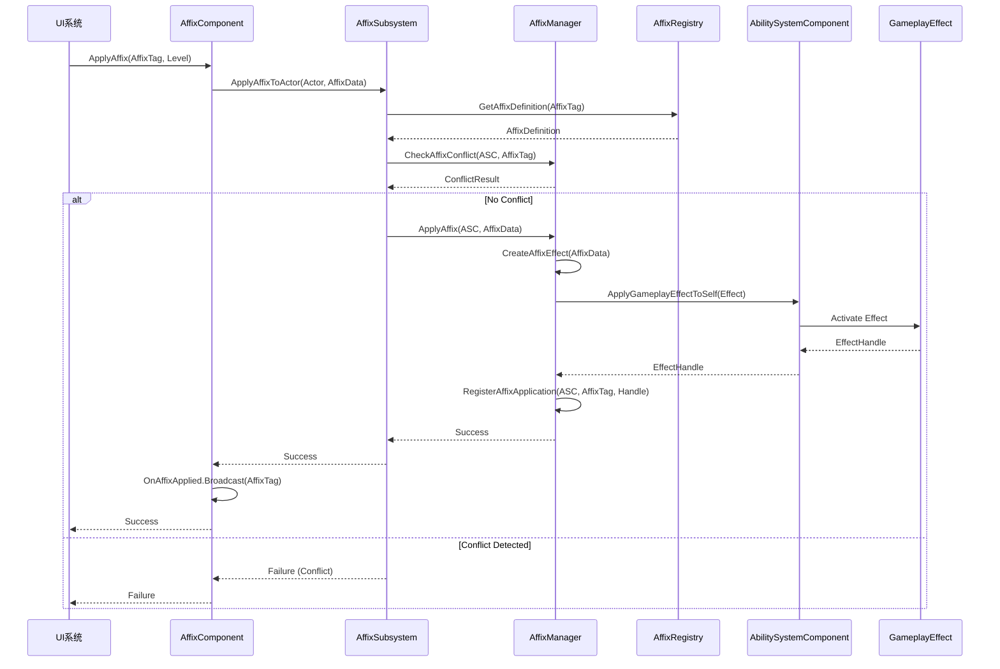
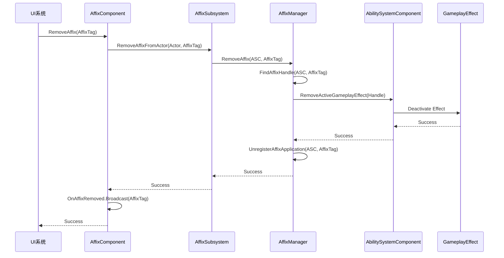
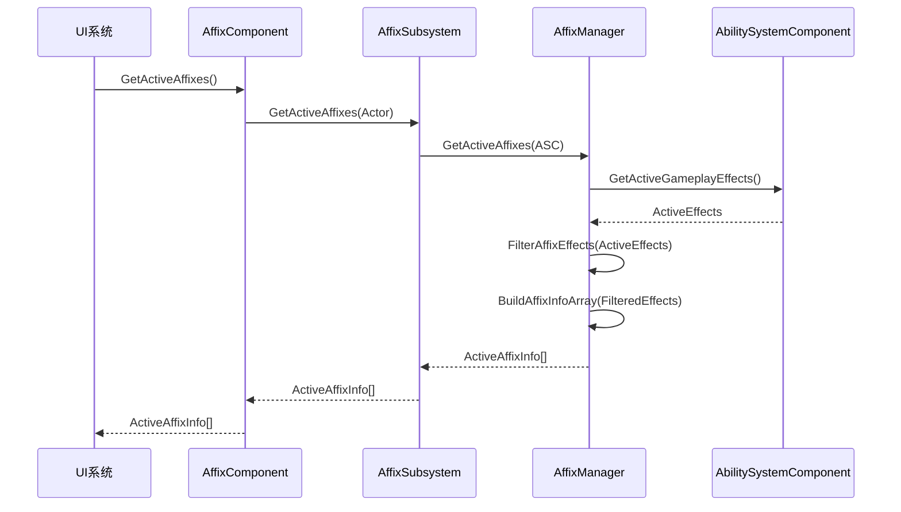
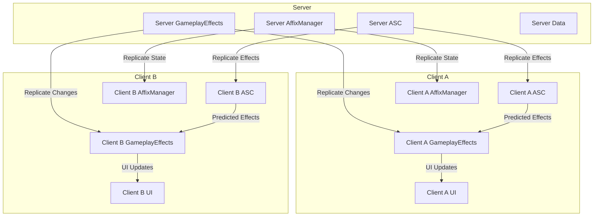
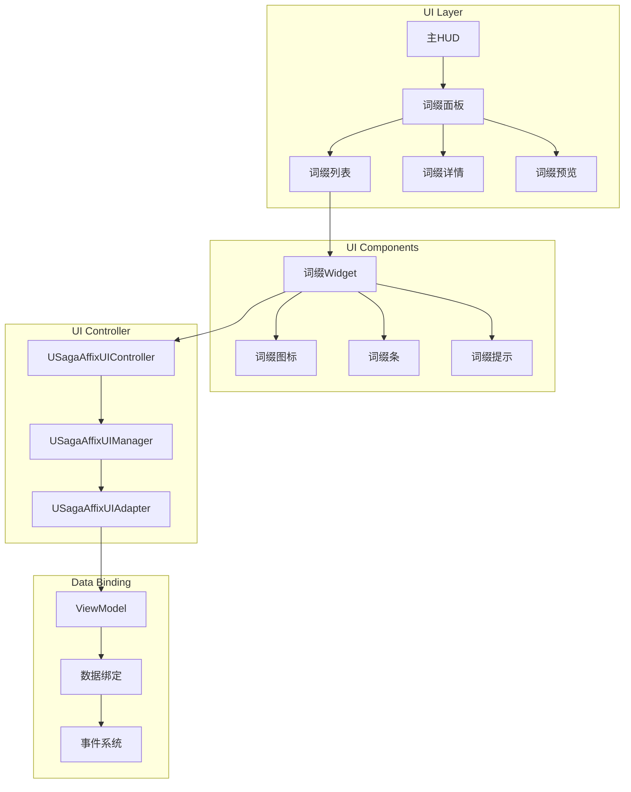
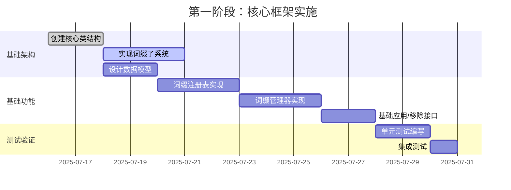
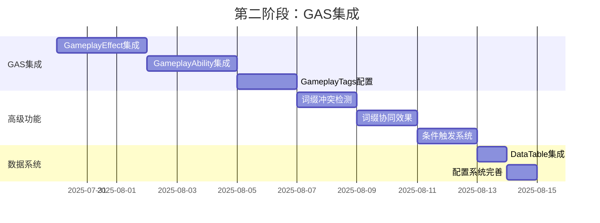
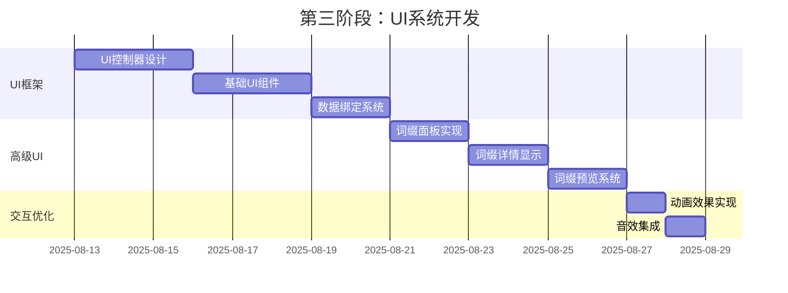
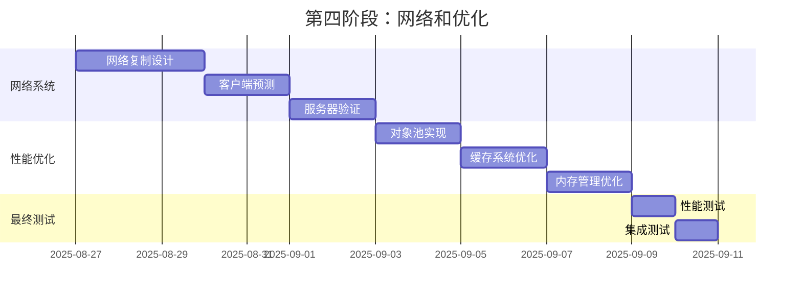

# SagaStats词缀系统架构设计

## 文档信息
- **文档标题**: SagaStats词缀系统架构设计 (方案A: GAS为核心)
- **创建日期**: 2025-07-16
- **版本**: v1.0
- **设计方案**: 基于GameplayAbilities的核心词缀系统
- **用途**: 为SagaStats插件的词缀系统实现提供详细的架构设计

---

## 目录
1. [架构概览](#架构概览)
2. [核心组件设计](#核心组件设计)
3. [数据模型设计](#数据模型设计)
4. [交互流程设计](#交互流程设计)
5. [网络架构设计](#网络架构设计)
6. [存储架构设计](#存储架构设计)
7. [UI架构设计](#UI架构设计)
8. [性能优化设计](#性能优化设计)
9. [实施路线图](#实施路线图)
10. [技术风险评估](#技术风险评估)

---

## 架构概览

### 设计理念
SagaStats词缀系统采用**分层模块化架构**，以GameplayAbilities System (GAS)为核心，实现高度可扩展、可维护的词缀管理系统。

### 核心特点
- **GAS原生集成**: 充分利用GAS的所有特性
- **模块化设计**: 各组件职责清晰，松耦合
- **数据驱动**: 词缀配置通过数据表管理
- **网络友好**: 原生支持多人游戏同步
- **性能优化**: 合理的缓存和对象池机制

### 总体架构图



---

## 核心组件设计

### 1. **USagaAffixSubsystem** - 词缀系统核心
全局词缀系统管理器，负责系统初始化和全局控制。

```cpp
UCLASS()
class SAGASTATS_API USagaAffixSubsystem : public UGameInstanceSubsystem
{
    GENERATED_BODY()

public:
    // 系统初始化
    virtual void Initialize(FSubsystemCollectionBase& Collection) override;
    virtual void Deinitialize() override;
    
    // 全局词缀操作
    UFUNCTION(BlueprintCallable, Category = "SagaAffix")
    bool ApplyAffixToActor(AActor* TargetActor, const FSagaAffixApplicationData& AffixData);
    
    UFUNCTION(BlueprintCallable, Category = "SagaAffix")
    bool RemoveAffixFromActor(AActor* TargetActor, FGameplayTag AffixTag);
    
    // 词缀查询
    UFUNCTION(BlueprintCallable, Category = "SagaAffix")
    TArray<FSagaActiveAffixInfo> GetActiveAffixes(AActor* TargetActor) const;
    
    // 词缀验证
    UFUNCTION(BlueprintCallable, Category = "SagaAffix")
    bool CanApplyAffix(AActor* TargetActor, FGameplayTag AffixTag) const;
    
    // 获取子系统
    UFUNCTION(BlueprintCallable, Category = "SagaAffix")
    USagaAffixManager* GetAffixManager() const { return AffixManager; }
    
    UFUNCTION(BlueprintCallable, Category = "SagaAffix")
    USagaAffixRegistry* GetAffixRegistry() const { return AffixRegistry; }

protected:
    // 核心组件
    UPROPERTY()
    USagaAffixManager* AffixManager;
    
    UPROPERTY()
    USagaAffixRegistry* AffixRegistry;
    
    UPROPERTY()
    USagaAffixEvaluator* AffixEvaluator;
    
    // 系统配置
    UPROPERTY(EditDefaultsOnly, Category = "Config")
    FSagaAffixSystemConfig SystemConfig;
    
    // 事件委托
    UPROPERTY(BlueprintAssignable, Category = "Events")
    FOnAffixSystemInitialized OnSystemInitialized;
    
    // 初始化函数
    void InitializeAffixRegistry();
    void InitializeAffixManager();
    void InitializeAffixEvaluator();
    void LoadSystemConfiguration();
};
```

### 2. **USagaAffixManager** - 词缀管理器
负责词缀的生命周期管理和状态控制。

```cpp
UCLASS()
class SAGASTATS_API USagaAffixManager : public UObject
{
    GENERATED_BODY()

public:
    // 词缀应用管理
    UFUNCTION(BlueprintCallable, Category = "AffixManager")
    FActiveGameplayEffectHandle ApplyAffix(UAbilitySystemComponent* ASC, 
                                          const FSagaAffixApplicationData& AffixData);
    
    UFUNCTION(BlueprintCallable, Category = "AffixManager")
    bool RemoveAffix(UAbilitySystemComponent* ASC, FGameplayTag AffixTag);
    
    // 词缀状态管理
    UFUNCTION(BlueprintCallable, Category = "AffixManager")
    void UpdateAffixState(UAbilitySystemComponent* ASC, FGameplayTag AffixTag, 
                         const FSagaAffixStateData& NewState);
    
    // 词缀冲突检测
    UFUNCTION(BlueprintCallable, Category = "AffixManager")
    bool CheckAffixConflict(UAbilitySystemComponent* ASC, FGameplayTag AffixTag) const;
    
    // 词缀协同检测
    UFUNCTION(BlueprintCallable, Category = "AffixManager")
    TArray<FGameplayTag> FindSynergyAffixes(UAbilitySystemComponent* ASC, 
                                           FGameplayTag AffixTag) const;
    
    // 词缀效果计算
    UFUNCTION(BlueprintCallable, Category = "AffixManager")
    float CalculateAffixMagnitude(const FSagaAffixApplicationData& AffixData, 
                                 UAbilitySystemComponent* ASC) const;

protected:
    // 活跃词缀追踪
    UPROPERTY()
    TMap<TWeakObjectPtr<UAbilitySystemComponent>, FSagaAffixContainer> ActiveAffixes;
    
    // 词缀模板库
    UPROPERTY()
    TMap<FGameplayTag, TSubclassOf<UGameplayEffect>> AffixTemplates;
    
    // 冲突规则
    UPROPERTY(EditDefaultsOnly, Category = "Rules")
    TMap<FGameplayTag, FSagaAffixConflictRule> ConflictRules;
    
    // 协同规则
    UPROPERTY(EditDefaultsOnly, Category = "Rules")
    TMap<FGameplayTag, FSagaAffixSynergyRule> SynergyRules;
    
    // 内部方法
    UGameplayEffect* CreateAffixEffect(const FSagaAffixApplicationData& AffixData);
    void RegisterAffixApplication(UAbilitySystemComponent* ASC, FGameplayTag AffixTag, 
                                 const FActiveGameplayEffectHandle& Handle);
    void UnregisterAffixApplication(UAbilitySystemComponent* ASC, FGameplayTag AffixTag);
    
    // 事件处理
    UFUNCTION()
    void OnGameplayEffectApplied(UAbilitySystemComponent* ASC, const FGameplayEffectSpec& Spec,
                                FActiveGameplayEffectHandle Handle);
    
    UFUNCTION()
    void OnGameplayEffectRemoved(const FActiveGameplayEffect& RemovedEffect);
};
```

### 3. **USagaAffixRegistry** - 词缀注册表
词缀定义的中央存储库，负责词缀数据的管理和查询。

```cpp
UCLASS()
class SAGASTATS_API USagaAffixRegistry : public UObject
{
    GENERATED_BODY()

public:
    // 词缀注册
    UFUNCTION(BlueprintCallable, Category = "AffixRegistry")
    void RegisterAffix(const FSagaAffixDefinition& AffixDefinition);
    
    UFUNCTION(BlueprintCallable, Category = "AffixRegistry")
    void UnregisterAffix(FGameplayTag AffixTag);
    
    // 词缀查询
    UFUNCTION(BlueprintCallable, Category = "AffixRegistry")
    bool GetAffixDefinition(FGameplayTag AffixTag, FSagaAffixDefinition& OutDefinition) const;
    
    UFUNCTION(BlueprintCallable, Category = "AffixRegistry")
    TArray<FSagaAffixDefinition> GetAffixesByType(ESagaAffixType AffixType) const;
    
    UFUNCTION(BlueprintCallable, Category = "AffixRegistry")
    TArray<FSagaAffixDefinition> GetAffixesByRarity(ESagaAffixRarity Rarity) const;
    
    // 词缀分类
    UFUNCTION(BlueprintCallable, Category = "AffixRegistry")
    TArray<FGameplayTag> GetAffixTags() const;
    
    UFUNCTION(BlueprintCallable, Category = "AffixRegistry")
    bool IsValidAffix(FGameplayTag AffixTag) const;
    
    // 数据表集成
    UFUNCTION(BlueprintCallable, Category = "AffixRegistry")
    void LoadFromDataTable(UDataTable* AffixDataTable);
    
    UFUNCTION(BlueprintCallable, Category = "AffixRegistry")
    void SaveToDataTable(UDataTable* AffixDataTable);

protected:
    // 词缀定义存储
    UPROPERTY()
    TMap<FGameplayTag, FSagaAffixDefinition> AffixDefinitions;
    
    // 分类索引
    UPROPERTY()
    TMap<ESagaAffixType, TArray<FGameplayTag>> TypeIndex;
    
    UPROPERTY()
    TMap<ESagaAffixRarity, TArray<FGameplayTag>> RarityIndex;
    
    // 数据表引用
    UPROPERTY(EditDefaultsOnly, Category = "Data")
    UDataTable* DefaultAffixDataTable;
    
    // 索引维护
    void RebuildIndices();
    void UpdateTypeIndex(FGameplayTag AffixTag, ESagaAffixType Type);
    void UpdateRarityIndex(FGameplayTag AffixTag, ESagaAffixRarity Rarity);
};
```

### 4. **USagaAffixComponent** - 词缀组件
Actor级别的词缀管理组件，提供便捷的词缀操作接口。

```cpp
UCLASS(ClassGroup=(Custom), meta=(BlueprintSpawnableComponent))
class SAGASTATS_API USagaAffixComponent : public UActorComponent
{
    GENERATED_BODY()

public:
    USagaAffixComponent();

    // 词缀操作
    UFUNCTION(BlueprintCallable, Category = "SagaAffix")
    bool ApplyAffix(FGameplayTag AffixTag, float Level = 1.0f, float Duration = -1.0f);
    
    UFUNCTION(BlueprintCallable, Category = "SagaAffix")
    bool RemoveAffix(FGameplayTag AffixTag);
    
    UFUNCTION(BlueprintCallable, Category = "SagaAffix")
    bool HasAffix(FGameplayTag AffixTag) const;
    
    // 词缀查询
    UFUNCTION(BlueprintCallable, Category = "SagaAffix")
    TArray<FSagaActiveAffixInfo> GetActiveAffixes() const;
    
    UFUNCTION(BlueprintCallable, Category = "SagaAffix")
    int32 GetAffixCount() const;
    
    UFUNCTION(BlueprintCallable, Category = "SagaAffix")
    float GetAffixLevel(FGameplayTag AffixTag) const;
    
    // 词缀分组操作
    UFUNCTION(BlueprintCallable, Category = "SagaAffix")
    bool ApplyAffixGroup(const FSagaAffixGroup& AffixGroup);
    
    UFUNCTION(BlueprintCallable, Category = "SagaAffix")
    bool RemoveAffixGroup(FGameplayTag GroupTag);
    
    // 事件委托
    UPROPERTY(BlueprintAssignable, Category = "Events")
    FOnAffixApplied OnAffixApplied;
    
    UPROPERTY(BlueprintAssignable, Category = "Events")
    FOnAffixRemoved OnAffixRemoved;
    
    UPROPERTY(BlueprintAssignable, Category = "Events")
    FOnAffixLevelChanged OnAffixLevelChanged;

protected:
    // 组件初始化
    virtual void BeginPlay() override;
    virtual void EndPlay(const EEndPlayReason::Type EndPlayReason) override;
    
    // 词缀数据存储
    UPROPERTY(ReplicatedUsing = OnRep_ActiveAffixes)
    TArray<FSagaActiveAffixInfo> ActiveAffixes;
    
    // 词缀组数据
    UPROPERTY(Replicated)
    TArray<FSagaAffixGroup> AffixGroups;
    
    // 网络复制
    virtual void GetLifetimeReplicatedProps(TArray<FLifetimeProperty>& OutLifetimeProps) const override;
    
    UFUNCTION()
    void OnRep_ActiveAffixes();
    
    // 内部方法
    UAbilitySystemComponent* GetAbilitySystemComponent() const;
    void UpdateAffixDisplay();
    
    // 事件处理
    void HandleAffixApplied(FGameplayTag AffixTag, const FSagaActiveAffixInfo& AffixInfo);
    void HandleAffixRemoved(FGameplayTag AffixTag);
    void HandleAffixLevelChanged(FGameplayTag AffixTag, float OldLevel, float NewLevel);
};
```

### 5. **USagaAffixEvaluator** - 词缀评估器
负责词缀效果的计算和评估。

```cpp
UCLASS()
class SAGASTATS_API USagaAffixEvaluator : public UObject
{
    GENERATED_BODY()

public:
    // 词缀效果计算
    UFUNCTION(BlueprintCallable, Category = "AffixEvaluator")
    float EvaluateAffixMagnitude(const FSagaAffixApplicationData& AffixData, 
                                UAbilitySystemComponent* ASC) const;
    
    UFUNCTION(BlueprintCallable, Category = "AffixEvaluator")
    float EvaluateAffixDuration(const FSagaAffixApplicationData& AffixData, 
                               UAbilitySystemComponent* ASC) const;
    
    // 词缀兼容性检查
    UFUNCTION(BlueprintCallable, Category = "AffixEvaluator")
    bool EvaluateAffixCompatibility(UAbilitySystemComponent* ASC, 
                                   FGameplayTag AffixTag) const;
    
    // 词缀权重计算
    UFUNCTION(BlueprintCallable, Category = "AffixEvaluator")
    float CalculateAffixWeight(const FSagaAffixDefinition& AffixDefinition, 
                              UAbilitySystemComponent* ASC) const;
    
    // 词缀价值评估
    UFUNCTION(BlueprintCallable, Category = "AffixEvaluator")
    float EvaluateAffixValue(const FSagaActiveAffixInfo& AffixInfo, 
                            UAbilitySystemComponent* ASC) const;
    
    // 词缀组合评估
    UFUNCTION(BlueprintCallable, Category = "AffixEvaluator")
    float EvaluateSynergyBonus(const TArray<FGameplayTag>& AffixTags, 
                              UAbilitySystemComponent* ASC) const;

protected:
    // 评估配置
    UPROPERTY(EditDefaultsOnly, Category = "Config")
    FSagaAffixEvaluationConfig EvaluationConfig;
    
    // 计算公式
    UPROPERTY(EditDefaultsOnly, Category = "Formulas")
    TMap<FGameplayTag, FSagaAffixFormula> MagnitudeFormulas;
    
    UPROPERTY(EditDefaultsOnly, Category = "Formulas")
    TMap<FGameplayTag, FSagaAffixFormula> DurationFormulas;
    
    // 兼容性规则
    UPROPERTY(EditDefaultsOnly, Category = "Rules")
    TArray<FSagaAffixCompatibilityRule> CompatibilityRules;
    
    // 内部计算方法
    float ExecuteFormula(const FSagaAffixFormula& Formula, const FSagaAffixApplicationData& AffixData,
                        UAbilitySystemComponent* ASC) const;
    
    bool CheckCompatibilityRule(const FSagaAffixCompatibilityRule& Rule, 
                               UAbilitySystemComponent* ASC, FGameplayTag AffixTag) const;
};
```

---

## 数据模型设计

### 核心数据结构

```cpp
// 词缀定义
USTRUCT(BlueprintType)
struct SAGASTATS_API FSagaAffixDefinition : public FTableRowBase
{
    GENERATED_BODY()

    // 基础信息
    UPROPERTY(EditAnywhere, BlueprintReadOnly, Category = "Basic")
    FGameplayTag AffixTag;
    
    UPROPERTY(EditAnywhere, BlueprintReadOnly, Category = "Basic")
    FText DisplayName;
    
    UPROPERTY(EditAnywhere, BlueprintReadOnly, Category = "Basic")
    FText Description;
    
    UPROPERTY(EditAnywhere, BlueprintReadOnly, Category = "Basic")
    UTexture2D* Icon;
    
    // 分类信息
    UPROPERTY(EditAnywhere, BlueprintReadOnly, Category = "Classification")
    ESagaAffixType AffixType;
    
    UPROPERTY(EditAnywhere, BlueprintReadOnly, Category = "Classification")
    ESagaAffixRarity Rarity;
    
    UPROPERTY(EditAnywhere, BlueprintReadOnly, Category = "Classification")
    ESagaAffixCategory Category;
    
    // 效果配置
    UPROPERTY(EditAnywhere, BlueprintReadOnly, Category = "Effect")
    TSubclassOf<UGameplayEffect> EffectClass;
    
    UPROPERTY(EditAnywhere, BlueprintReadOnly, Category = "Effect")
    TSubclassOf<UGameplayAbility> GrantedAbility;
    
    // 数值配置
    UPROPERTY(EditAnywhere, BlueprintReadOnly, Category = "Values")
    float BaseMagnitude;
    
    UPROPERTY(EditAnywhere, BlueprintReadOnly, Category = "Values")
    float LevelScaling;
    
    UPROPERTY(EditAnywhere, BlueprintReadOnly, Category = "Values")
    float BaseDuration;
    
    UPROPERTY(EditAnywhere, BlueprintReadOnly, Category = "Values")
    int32 MaxLevel;
    
    // 应用条件
    UPROPERTY(EditAnywhere, BlueprintReadOnly, Category = "Conditions")
    FGameplayTagContainer RequiredTags;
    
    UPROPERTY(EditAnywhere, BlueprintReadOnly, Category = "Conditions")
    FGameplayTagContainer BlockedTags;
    
    UPROPERTY(EditAnywhere, BlueprintReadOnly, Category = "Conditions")
    TSubclassOf<USagaAffixApplicationRequirement> ApplicationRequirement;
    
    // 冲突和协同
    UPROPERTY(EditAnywhere, BlueprintReadOnly, Category = "Interactions")
    FGameplayTagContainer ConflictingAffixes;
    
    UPROPERTY(EditAnywhere, BlueprintReadOnly, Category = "Interactions")
    FGameplayTagContainer SynergyAffixes;
    
    // 视觉效果
    UPROPERTY(EditAnywhere, BlueprintReadOnly, Category = "Visual")
    TSubclassOf<AActor> VisualEffect;
    
    UPROPERTY(EditAnywhere, BlueprintReadOnly, Category = "Visual")
    USoundBase* ApplySound;
    
    UPROPERTY(EditAnywhere, BlueprintReadOnly, Category = "Visual")
    USoundBase* RemoveSound;
    
    // 元数据
    UPROPERTY(EditAnywhere, BlueprintReadOnly, Category = "Meta")
    bool bIsHidden;
    
    UPROPERTY(EditAnywhere, BlueprintReadOnly, Category = "Meta")
    bool bIsStackable;
    
    UPROPERTY(EditAnywhere, BlueprintReadOnly, Category = "Meta")
    int32 MaxStacks;
    
    UPROPERTY(EditAnywhere, BlueprintReadOnly, Category = "Meta")
    float Weight;
};

// 词缀应用数据
USTRUCT(BlueprintType)
struct SAGASTATS_API FSagaAffixApplicationData
{
    GENERATED_BODY()

    UPROPERTY(EditAnywhere, BlueprintReadWrite, Category = "Application")
    FGameplayTag AffixTag;
    
    UPROPERTY(EditAnywhere, BlueprintReadWrite, Category = "Application")
    float Level;
    
    UPROPERTY(EditAnywhere, BlueprintReadWrite, Category = "Application")
    float Duration;
    
    UPROPERTY(EditAnywhere, BlueprintReadWrite, Category = "Application")
    AActor* Instigator;
    
    UPROPERTY(EditAnywhere, BlueprintReadWrite, Category = "Application")
    FGameplayEffectContextHandle Context;
    
    UPROPERTY(EditAnywhere, BlueprintReadWrite, Category = "Application")
    TMap<FString, float> CustomParameters;
};

// 活跃词缀信息
USTRUCT(BlueprintType)
struct SAGASTATS_API FSagaActiveAffixInfo
{
    GENERATED_BODY()

    UPROPERTY(EditAnywhere, BlueprintReadWrite, Category = "Active")
    FGameplayTag AffixTag;
    
    UPROPERTY(EditAnywhere, BlueprintReadWrite, Category = "Active")
    float Level;
    
    UPROPERTY(EditAnywhere, BlueprintReadWrite, Category = "Active")
    float RemainingDuration;
    
    UPROPERTY(EditAnywhere, BlueprintReadWrite, Category = "Active")
    int32 StackCount;
    
    UPROPERTY(EditAnywhere, BlueprintReadWrite, Category = "Active")
    FActiveGameplayEffectHandle EffectHandle;
    
    UPROPERTY(EditAnywhere, BlueprintReadWrite, Category = "Active")
    TWeakObjectPtr<AActor> Instigator;
    
    UPROPERTY(EditAnywhere, BlueprintReadWrite, Category = "Active")
    float AppliedTime;
};

// 词缀组
USTRUCT(BlueprintType)
struct SAGASTATS_API FSagaAffixGroup
{
    GENERATED_BODY()

    UPROPERTY(EditAnywhere, BlueprintReadWrite, Category = "Group")
    FGameplayTag GroupTag;
    
    UPROPERTY(EditAnywhere, BlueprintReadWrite, Category = "Group")
    FText GroupName;
    
    UPROPERTY(EditAnywhere, BlueprintReadWrite, Category = "Group")
    TArray<FSagaAffixApplicationData> Affixes;
    
    UPROPERTY(EditAnywhere, BlueprintReadWrite, Category = "Group")
    bool bApplySimultaneously;
    
    UPROPERTY(EditAnywhere, BlueprintReadWrite, Category = "Group")
    float GroupBonus;
};
```

### 数据表结构

```cpp
// 词缀数据表结构
USTRUCT(BlueprintType)
struct SAGASTATS_API FSagaAffixDataTableRow : public FTableRowBase
{
    GENERATED_BODY()

    UPROPERTY(EditAnywhere, BlueprintReadOnly)
    FGameplayTag AffixTag;
    
    UPROPERTY(EditAnywhere, BlueprintReadOnly)
    FText DisplayName;
    
    UPROPERTY(EditAnywhere, BlueprintReadOnly)
    FText Description;
    
    UPROPERTY(EditAnywhere, BlueprintReadOnly)
    FSoftObjectPath IconPath;
    
    UPROPERTY(EditAnywhere, BlueprintReadOnly)
    ESagaAffixType AffixType;
    
    UPROPERTY(EditAnywhere, BlueprintReadOnly)
    ESagaAffixRarity Rarity;
    
    UPROPERTY(EditAnywhere, BlueprintReadOnly)
    FSoftClassPath EffectClass;
    
    UPROPERTY(EditAnywhere, BlueprintReadOnly)
    float BaseMagnitude;
    
    UPROPERTY(EditAnywhere, BlueprintReadOnly)
    float LevelScaling;
    
    UPROPERTY(EditAnywhere, BlueprintReadOnly)
    float BaseDuration;
    
    UPROPERTY(EditAnywhere, BlueprintReadOnly)
    int32 MaxLevel;
    
    UPROPERTY(EditAnywhere, BlueprintReadOnly)
    FString RequiredTags;
    
    UPROPERTY(EditAnywhere, BlueprintReadOnly)
    FString BlockedTags;
    
    UPROPERTY(EditAnywhere, BlueprintReadOnly)
    FString ConflictingAffixes;
    
    UPROPERTY(EditAnywhere, BlueprintReadOnly)
    FString SynergyAffixes;
    
    UPROPERTY(EditAnywhere, BlueprintReadOnly)
    bool bIsStackable;
    
    UPROPERTY(EditAnywhere, BlueprintReadOnly)
    int32 MaxStacks;
    
    UPROPERTY(EditAnywhere, BlueprintReadOnly)
    float Weight;
};
```

---

## 交互流程设计

### 词缀应用流程



### 词缀移除流程



### 词缀查询流程



---

## 网络架构设计

### 网络复制架构



### 网络同步策略

```cpp
// 网络复制配置
UCLASS()
class SAGASTATS_API USagaAffixNetworkManager : public UObject
{
    GENERATED_BODY()

public:
    // 复制策略配置
    UPROPERTY(EditDefaultsOnly, Category = "Network")
    ESagaAffixReplicationMode ReplicationMode;
    
    UPROPERTY(EditDefaultsOnly, Category = "Network")
    float ReplicationFrequency;
    
    // 客户端预测
    UFUNCTION(BlueprintCallable, Category = "Network")
    void PredictAffixApplication(const FSagaAffixApplicationData& AffixData);
    
    // 服务器验证
    UFUNCTION(Server, Reliable, WithValidation, Category = "Network")
    void ServerApplyAffix(const FSagaAffixApplicationData& AffixData);
    
    // 回滚机制
    UFUNCTION(BlueprintCallable, Category = "Network")
    void RollbackPrediction(FGameplayTag AffixTag);

protected:
    // 预测状态管理
    UPROPERTY()
    TArray<FSagaPredictedAffixState> PredictedStates;
    
    // 网络延迟补偿
    UPROPERTY()
    float NetworkLatency;
    
    // 同步处理
    void HandleReplicationConflict(const FSagaAffixApplicationData& ServerData,
                                  const FSagaAffixApplicationData& ClientData);
};
```

---

## 存储架构设计

### 持久化策略

```cpp
// 词缀存档系统
UCLASS()
class SAGASTATS_API USagaAffixSaveGame : public USaveGame
{
    GENERATED_BODY()

public:
    // 存档数据版本
    UPROPERTY()
    int32 SaveVersion;
    
    // 玩家词缀数据
    UPROPERTY()
    TMap<FString, FSagaPlayerAffixData> PlayerAffixes;
    
    // 世界词缀数据
    UPROPERTY()
    FSagaWorldAffixData WorldAffixes;
    
    // 时间戳
    UPROPERTY()
    FDateTime SaveTime;
    
    // 数据完整性检查
    UPROPERTY()
    FString DataChecksum;
};

// 词缀持久化管理器
UCLASS()
class SAGASTATS_API USagaAffixPersistenceManager : public UGameInstanceSubsystem
{
    GENERATED_BODY()

public:
    // 保存和加载
    UFUNCTION(BlueprintCallable, Category = "Persistence")
    bool SaveAffixData(const FString& SlotName);
    
    UFUNCTION(BlueprintCallable, Category = "Persistence")
    bool LoadAffixData(const FString& SlotName);
    
    // 数据迁移
    UFUNCTION(BlueprintCallable, Category = "Persistence")
    bool MigrateAffixData(int32 FromVersion, int32 ToVersion);
    
    // 数据验证
    UFUNCTION(BlueprintCallable, Category = "Persistence")
    bool ValidateAffixData(const USagaAffixSaveGame* SaveGame);

protected:
    // 当前存档
    UPROPERTY()
    USagaAffixSaveGame* CurrentSaveGame;
    
    // 版本迁移器
    UPROPERTY()
    TMap<int32, USagaAffixDataMigrator*> DataMigrators;
    
    // 数据序列化
    void SerializeAffixData(const FSagaActiveAffixInfo& AffixInfo, FArchive& Ar);
    void DeserializeAffixData(FSagaActiveAffixInfo& AffixInfo, FArchive& Ar);
    
    // 数据完整性
    FString CalculateDataChecksum(const USagaAffixSaveGame* SaveGame);
};
```

---

## UI架构设计

### UI组件架构



### UI控制器设计

```cpp
// 词缀UI控制器
UCLASS()
class SAGASTATS_API USagaAffixUIController : public UObject
{
    GENERATED_BODY()

public:
    // UI初始化
    UFUNCTION(BlueprintCallable, Category = "UI")
    void InitializeUI(UUserWidget* ParentWidget);
    
    // 词缀显示控制
    UFUNCTION(BlueprintCallable, Category = "UI")
    void ShowAffixPanel(bool bShow);
    
    UFUNCTION(BlueprintCallable, Category = "UI")
    void UpdateAffixList(const TArray<FSagaActiveAffixInfo>& Affixes);
    
    UFUNCTION(BlueprintCallable, Category = "UI")
    void ShowAffixDetail(FGameplayTag AffixTag);
    
    // 词缀预览
    UFUNCTION(BlueprintCallable, Category = "UI")
    void PreviewAffixApplication(FGameplayTag AffixTag, float Level);
    
    UFUNCTION(BlueprintCallable, Category = "UI")
    void ClearAffixPreview();
    
    // 交互控制
    UFUNCTION(BlueprintCallable, Category = "UI")
    void HandleAffixClick(FGameplayTag AffixTag);
    
    UFUNCTION(BlueprintCallable, Category = "UI")
    void HandleAffixHover(FGameplayTag AffixTag, bool bIsHovered);

protected:
    // UI组件引用
    UPROPERTY()
    UUserWidget* MainWidget;
    
    UPROPERTY()
    USagaAffixPanelWidget* AffixPanel;
    
    UPROPERTY()
    USagaAffixListWidget* AffixList;
    
    UPROPERTY()
    USagaAffixDetailWidget* AffixDetail;
    
    // 数据适配器
    UPROPERTY()
    USagaAffixUIAdapter* DataAdapter;
    
    // 事件绑定
    void BindUIEvents();
    void UnbindUIEvents();
    
    // UI更新
    void RefreshUI();
    void UpdateAffixDisplay(const FSagaActiveAffixInfo& AffixInfo);
};
```

---

## 性能优化设计

### 对象池管理

```cpp
// 词缀对象池
UCLASS()
class SAGASTATS_API USagaAffixObjectPool : public UObject
{
    GENERATED_BODY()

public:
    // 对象池操作
    UFUNCTION(BlueprintCallable, Category = "ObjectPool")
    UGameplayEffect* GetPooledEffect(TSubclassOf<UGameplayEffect> EffectClass);
    
    UFUNCTION(BlueprintCallable, Category = "ObjectPool")
    void ReturnPooledEffect(UGameplayEffect* Effect);
    
    // 预热对象池
    UFUNCTION(BlueprintCallable, Category = "ObjectPool")
    void PrewarmPool(TSubclassOf<UGameplayEffect> EffectClass, int32 Count);
    
    // 清理对象池
    UFUNCTION(BlueprintCallable, Category = "ObjectPool")
    void CleanupPool();

protected:
    // 对象池存储
    UPROPERTY()
    TMap<TSubclassOf<UGameplayEffect>, TArray<UGameplayEffect*>> EffectPools;
    
    // 池配置
    UPROPERTY(EditDefaultsOnly, Category = "Config")
    int32 MaxPoolSize;
    
    UPROPERTY(EditDefaultsOnly, Category = "Config")
    float CleanupInterval;
    
    // 池管理
    void EnsurePoolExists(TSubclassOf<UGameplayEffect> EffectClass);
    void TrimPool(TSubclassOf<UGameplayEffect> EffectClass);
    
    // 定时清理
    FTimerHandle CleanupTimer;
    void PerformCleanup();
};
```

### 缓存策略

```cpp
// 词缀缓存管理器
UCLASS()
class SAGASTATS_API USagaAffixCacheManager : public UObject
{
    GENERATED_BODY()

public:
    // 缓存操作
    UFUNCTION(BlueprintCallable, Category = "Cache")
    void CacheAffixDefinition(FGameplayTag AffixTag, const FSagaAffixDefinition& Definition);
    
    UFUNCTION(BlueprintCallable, Category = "Cache")
    bool GetCachedAffixDefinition(FGameplayTag AffixTag, FSagaAffixDefinition& OutDefinition);
    
    // 缓存管理
    UFUNCTION(BlueprintCallable, Category = "Cache")
    void PreloadAffixCache(const TArray<FGameplayTag>& AffixTags);
    
    UFUNCTION(BlueprintCallable, Category = "Cache")
    void ClearAffixCache();
    
    // 缓存统计
    UFUNCTION(BlueprintCallable, Category = "Cache")
    FSagaCacheStatistics GetCacheStatistics();

protected:
    // 缓存存储
    UPROPERTY()
    TMap<FGameplayTag, FSagaAffixDefinition> DefinitionCache;
    
    UPROPERTY()
    TMap<FGameplayTag, UGameplayEffect*> EffectCache;
    
    // 缓存配置
    UPROPERTY(EditDefaultsOnly, Category = "Config")
    int32 MaxCacheSize;
    
    UPROPERTY(EditDefaultsOnly, Category = "Config")
    float CacheExpirationTime;
    
    // LRU管理
    UPROPERTY()
    TArray<FGameplayTag> LRUOrder;
    
    void UpdateLRU(FGameplayTag AffixTag);
    void EvictLRU();
    
    // 缓存清理
    FTimerHandle CacheCleanupTimer;
    void PerformCacheCleanup();
};
```

---

## 实施路线图

### 第一阶段：核心框架 (2周)



**具体任务**：
- ✅ 创建USagaAffixSubsystem基础框架
- ✅ 实现USagaAffixRegistry词缀注册功能
- ✅ 设计FSagaAffixDefinition数据结构
- ✅ 实现基础的词缀应用和移除功能
- ✅ 创建USagaAffixComponent组件
- ✅ 编写基础单元测试

### 第二阶段：GAS集成 (2周)



**具体任务**：
- 🔄 完成GameplayEffect模板系统
- 🔄 实现词缀效果的GAS集成
- 🔄 设计词缀标签结构
- 🔄 实现词缀冲突检测机制
- 🔄 创建词缀协同效果系统
- 🔄 完成DataTable配置集成

### 第三阶段：UI系统 (2周)



**具体任务**：
- ⏳ 创建USagaAffixUIController
- ⏳ 实现词缀列表UI组件
- ⏳ 设计词缀详情面板
- ⏳ 实现词缀预览功能
- ⏳ 添加UI动画和音效
- ⏳ 完成UI数据绑定系统

### 第四阶段：网络和优化 (2周)



**具体任务**：
- ⏳ 实现网络复制机制
- ⏳ 添加客户端预测功能
- ⏳ 完成服务器验证系统
- ⏳ 实现对象池管理
- ⏳ 优化缓存策略
- ⏳ 进行性能测试和优化

---

## 技术风险评估

### 高风险项目 🔴

#### 1. **GAS复杂性管理**
- **风险描述**: GAS系统复杂，大量词缀可能导致性能问题
- **影响程度**: 高
- **概率**: 中等
- **缓解措施**:
  - 实施对象池管理
  - 限制同时活跃的词缀数量
  - 优化GameplayEffect创建流程
  - 实现智能缓存策略

#### 2. **网络同步挑战**
- **风险描述**: 大量词缀的网络同步可能造成带宽和延迟问题
- **影响程度**: 高
- **概率**: 中等
- **缓解措施**:
  - 实现增量同步机制
  - 使用压缩和批量传输
  - 客户端预测和服务器验证
  - 优化复制频率

### 中等风险项目 🟡

#### 3. **数据一致性问题**
- **风险描述**: 词缀数据在多个系统间可能出现不一致
- **影响程度**: 中等
- **概率**: 中等
- **缓解措施**:
  - 设计单一数据源
  - 实现数据验证机制
  - 添加数据同步检查
  - 建立错误恢复流程

#### 4. **UI性能问题**
- **风险描述**: 大量词缀显示可能导致UI卡顿
- **影响程度**: 中等
- **概率**: 低
- **缓解措施**:
  - 实现UI虚拟化
  - 使用异步UI更新
  - 优化渲染批次
  - 实现延迟加载

### 低风险项目 🟢

#### 5. **扩展性限制**
- **风险描述**: 架构设计可能限制未来扩展
- **影响程度**: 低
- **概率**: 低
- **缓解措施**:
  - 采用模块化设计
  - 预留扩展接口
  - 定期架构审查
  - 文档化扩展指南

---

## 总结

SagaStats词缀系统的架构设计基于以下核心原则：

1. **模块化设计**: 清晰的组件职责划分，便于维护和扩展
2. **GAS深度集成**: 充分利用GAS的强大功能，实现复杂的词缀效果
3. **数据驱动**: 通过配置文件管理词缀，支持热更新和平衡调整
4. **网络优化**: 原生支持多人游戏，优化网络性能
5. **性能优先**: 合理的缓存和对象池策略，确保系统性能

该架构设计为SagaStats提供了一个强大、灵活且高性能的词缀系统基础，能够支持复杂的游戏需求和未来的扩展需要。

---

## 版本历史

### v1.0 (2025-07-16)
- ✅ 完成核心架构设计
- ✅ 设计主要组件接口
- ✅ 定义数据模型结构
- ✅ 规划交互流程
- ✅ 设计网络架构
- ✅ 制定实施路线图
- ✅ 评估技术风险

### 后续规划
- 🔄 详细的API文档编写
- 🔄 性能基准测试计划
- 🔄 单元测试框架设计
- 🔄 集成测试方案制定
- 🔄 部署和运维指南

---

## 联系信息

- **项目位置**: `D:\UnrealEngine\UnrealEngine\Projects\SagaStats`
- **文档位置**: `docs/SagaStats词缀系统架构设计.md`
- **文档维护**: Claude Code
- **创建日期**: 2025-07-16

---

*本架构设计文档将随着项目的发展和实际实施情况不断更新和完善。*