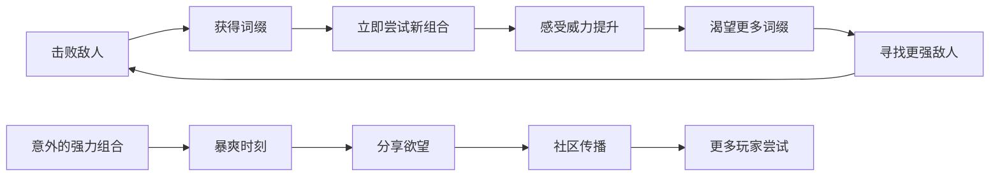
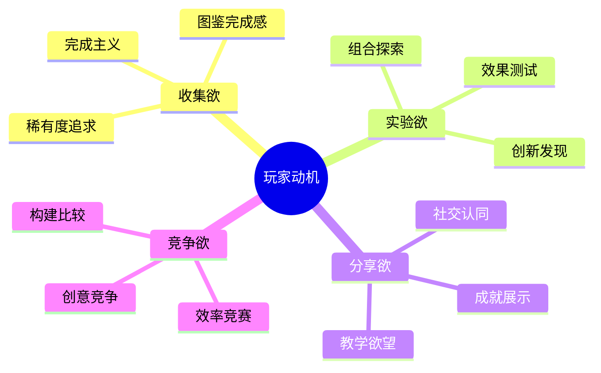
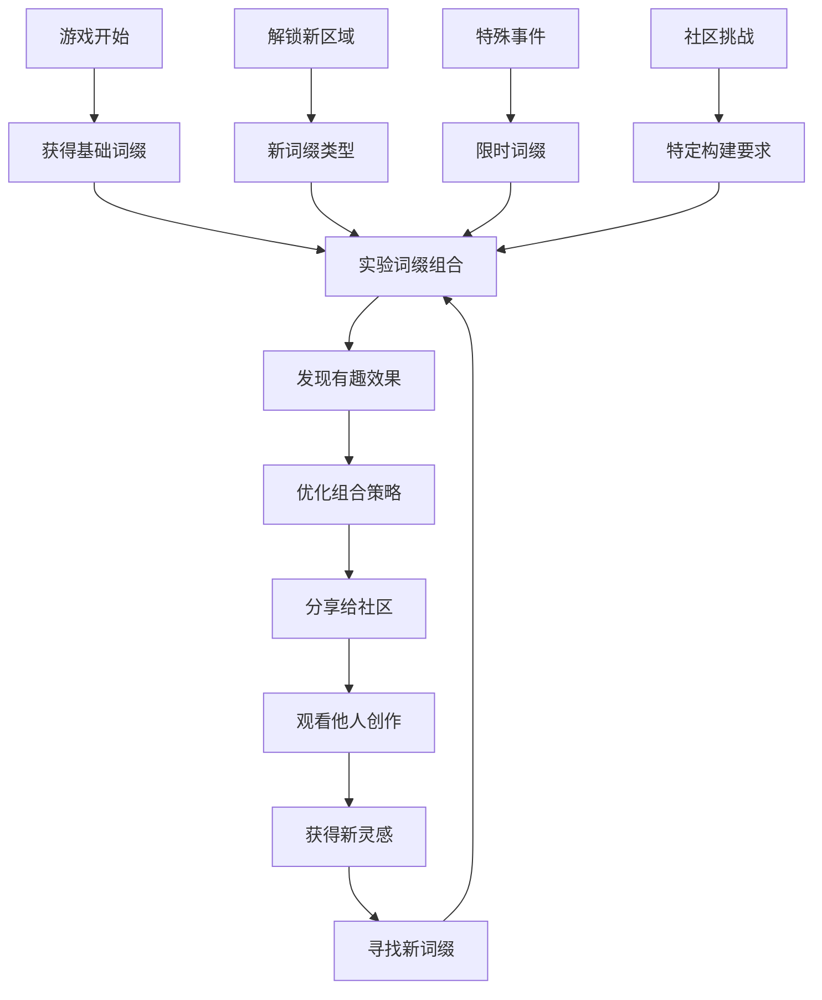

# 动作游戏词缀系统设计指南

## 文档信息
- **文档标题**: 动作游戏词缀系统设计指南
- **创建日期**: 2025-07-17
- **版本**: v1.0
- **文档作者**: ZhangJinming
- **用途**: 为动作游戏开发者提供词缀系统设计的全面指导

---

## 目录
1. [引言：化学反应的开始](#引言化学反应的开始)
2. [核心玩法的化学反应](#核心玩法的化学反应)
3. [游戏节奏的重塑](#游戏节奏的重塑)
4. [玩家心理的深层变化](#玩家心理的深层变化)
5. [怪物设计的革新](#怪物设计的革新)
6. [关卡设计的进化](#关卡设计的进化)
7. [游戏叙事的新可能](#游戏叙事的新可能)
8. [视听表现的动态化](#视听表现的动态化)
9. [游戏世界的生态响应](#游戏世界的生态响应)
10. [经济系统的重构](#经济系统的重构)
11. [游戏循环的根本变革](#游戏循环的根本变革)
12. [设计挑战与解决方案](#设计挑战与解决方案)
13. [实施建议与最佳实践](#实施建议与最佳实践)

---

## 引言：化学反应的开始

当动作游戏遇见词缀系统，产生的不是简单的功能叠加，而是**游戏设计DNA的重组**。这种结合创造了从"掌握"到"创造"的范式转变，让每个玩家都能成为游戏世界中的"设计师"。

### 核心价值公式
```
动作游戏 + 词缀系统 = 从"一次性体验"到"无限创作平台"

传统动作游戏价值 = 内容量 × 重玩价值
词缀动作游戏价值 = 内容量 × 词缀组合数 × 玩家创意 × 社区分享
```

---

## 核心玩法的化学反应

### 1. 战斗深度的指数级增长

#### 技能变体的爆发性增长
```cpp
// 一个基础技能的无限可能
基础"冲刺攻击"：
+ "冰霜词缀" = 冲刺路径留下冰痕，减速敌人
+ "连锁词缀" = 冲刺可以在敌人间弹跳
+ "时间词缀" = 冲刺时触发子弹时间
+ "分身词缀" = 冲刺时留下攻击性残影
+ "元素爆炸词缀" = 冲刺结束时产生范围爆炸

组合效果：
"冰霜" + "连锁" + "爆炸" = 冰霜连锁爆炸冲刺
```

#### 战斗复杂度公式
```
传统动作游戏: 固定技能数量 × 玩家操作技巧
词缀动作游戏: (技能数量 × 词缀组合数) × 玩家操作技巧

示例计算：
- 10个基础技能
- 50个词缀
- 每个技能可搭配5个词缀
= 10 × C(50,5) = 10 × 2,118,760 = 21,187,600种技能变体
```

### 2. 即时反馈的强化循环

#### 完美的心流体验设计


#### 多层次反馈机制
- **视觉反馈**: 词缀效果的粒子特效
- **听觉反馈**: 独特的音效标识
- **触觉反馈**: 手柄震动的差异化
- **数值反馈**: 伤害数字的视觉强化
- **系统反馈**: 解锁新内容的提示

---

## 游戏节奏的重塑

### 3. 动态平衡的自适应难度

#### 智能难度调节系统
```cpp
// 自适应难度算法示例
class AdaptiveDifficulty {
public:
    void AdjustDifficulty(Player* player) {
        float playerPower = CalculatePlayerPower(player->GetAffixes());
        float targetDifficulty = baseDifficulty * (1.0f + playerPower * scalingFactor);
        
        // 动态调整敌人数量和强度
        SpawnManager::SetEnemyDensity(targetDifficulty);
        SpawnManager::SetEnemyAffixProbability(playerPower);
        
        // 调整奖励掉落率
        LootManager::SetAffixDropRate(CalculateDropRate(playerPower));
    }
    
private:
    float CalculatePlayerPower(const TArray<Affix>& affixes) {
        float totalPower = 0.0f;
        for (const auto& affix : affixes) {
            totalPower += affix.GetPowerLevel();
            // 考虑词缀间的协同效应
            totalPower += CalculateSynergyBonus(affix, affixes);
        }
        return totalPower;
    }
};
```

### 4. "暴爽时刻"的精心设计

#### 爆发性体验的构建要素
```
暴爽时刻的组成 = 词缀叠加 + 视觉冲击 + 音效配合 + 完美时机

具体实现：
1. 多重词缀同时触发的瞬间
2. 连锁反应的视觉展现
3. 完美组合发现的"啊哈时刻"
4. 一招清屏的成就感
5. 意外组合产生的惊喜效果
```

#### 暴爽时刻的频率控制
```
设计原则：
- 每10-15分钟至少一次中等强度的暴爽时刻
- 每30-45分钟一次高强度的暴爽时刻  
- 每2-3小时一次史诗级的暴爽时刻
- 通过词缀获得频率和强度控制节奏
```

---

## 玩家心理的深层变化

### 5. 创造性表达的释放

#### 思维模式的根本转变
```
传统动作游戏玩家思维：
"我要学会开发者设计的最优玩法"
↓
词缀系统动作游戏玩家思维：
"我要创造属于自己的独特玩法"
```

#### 创造性表达的具体形式
```cpp
// 玩家创造的经典组合示例
struct PlayerBuild {
    string buildName;
    vector<Affix> affixes;
    string playstyle;
    string description;
};

// 社区经典构建
PlayerBuild builds[] = {
    {
        "割草机战士",
        {"吸血", "范围攻击", "移动速度", "攻击频率"},
        "快速移动 + 持续攻击",
        "在敌群中高速移动，通过吸血保持生存"
    },
    {
        "子弹时间刺客", 
        {"闪避反击", "时间减缓", "精准射击", "致命一击"},
        "完美闪避 + 精准反击",
        "利用慢动作精准打击敌人弱点"
    },
    {
        "元素法师",
        {"火焰", "冰霜", "闪电", "元素融合", "法力回复"},
        "元素组合攻击",
        "通过不同元素的组合创造强力法术"
    }
};
```

### 6. 收集欲与实验欲的双重驱动

#### 心理驱动机制分析


#### 持续参与的心理循环
```
发现新词缀 → 想象可能的组合 → 实际测试效果 → 
记录有趣结果 → 分享给他人 → 看到他人反馈 → 
获得新灵感 → 寻找新词缀
```

---

## 怪物设计的革新

### 7. 从静态设计到动态适应

#### 传统vs词缀时代的怪物设计思路
```
传统怪物设计流程：
1. 设计怪物外观和基础行为
2. 设定固定的属性数值
3. 平衡测试并调整数值
4. 完成设计

词缀时代怪物设计流程：
1. 设计怪物外观和基础行为
2. 分析玩家可能的词缀组合
3. 设计针对性的反制机制
4. 创建动态数值调整系统
5. 设计怪物自身的词缀系统
6. 测试各种组合下的平衡性
7. 建立持续调整机制
```

### 8. "反制型"怪物的设计哲学

#### 反制机制设计原则
```cpp
// 反制型怪物的设计模板
class CounterMonster : public Monster {
public:
    // 检测玩家词缀并动态调整
    void OnPlayerApproach(Player* player) {
        auto playerAffixes = player->GetActiveAffixes();
        
        // 分析玩家主要词缀类型
        AffixType dominantType = AnalyzeDominantAffixType(playerAffixes);
        
        // 动态激活相应的反制能力
        switch(dominantType) {
            case AffixType::Fire:
                ActivateAbility("FireImmunity");
                ActivateAbility("IceAura");
                break;
            case AffixType::Speed:
                ActivateAbility("TimeDistortion");
                ActivateAbility("AreaDenial");
                break;
            case AffixType::Range:
                ActivateAbility("ForceField");
                ActivateAbility("Teleport");
                break;
        }
    }
};
```

#### 经典反制型怪物设计
```
1. 抗火史莱姆
   - 对火焰词缀完全免疫
   - 被冰霜词缀额外伤害
   - 死亡时有概率掉落"火焰抗性"词缀

2. 镜像幽灵
   - 复制玩家最近使用的3个词缀效果
   - 迫使玩家改变战斗策略
   - 击败后掉落"镜像"或"反射"类词缀

3. 词缀吞噬者
   - 每承受一次词缀效果就变强
   - 鼓励玩家使用基础攻击
   - 掉落"词缀强化"类稀有词缀

4. 分裂水母
   - 受到范围攻击时分裂成更多小怪
   - 对单体攻击脆弱
   - 教育玩家适应性战斗的重要性
```

### 9. 怪物词缀系统的设计

#### 怪物词缀的实现机制
```cpp
// 怪物词缀系统
class MonsterAffixSystem {
private:
    struct MonsterAffix {
        string name;
        Color visualIndicator;
        function<void(Monster*)> effect;
        float dropChance; // 击败后掉落玩家版本的概率
    };
    
    vector<MonsterAffix> monsterAffixes = {
        {
            "狂暴", 
            Color::Red,
            [](Monster* m) { m->ModifyDamage(1.5f); m->ModifySpeed(1.3f); },
            0.15f
        },
        {
            "再生",
            Color::Green, 
            [](Monster* m) { m->EnableRegeneration(0.05f); },
            0.10f
        },
        {
            "分身",
            Color::Purple,
            [](Monster* m) { m->CreateShadowClones(2); },
            0.05f
        }
    };
    
public:
    void ApplyRandomAffixes(Monster* monster, int count) {
        // 根据区域等级和玩家进度确定词缀数量和强度
        for (int i = 0; i < count; i++) {
            auto affix = SelectRandomAffix(monster->GetLevel());
            monster->ApplyAffix(affix);
        }
    }
};
```

### 10. 精英怪物的重新定义

#### 精英怪物 = 基础怪物 + 多重词缀组合
```
精英怪物设计公式：
精英怪物 = 基础怪物 + 2-4个词缀 + 独特AI行为

设计目标：
1. 让玩家提前预览高级词缀效果
2. 成为"我也想要这个词缀"的展示台  
3. 词缀组合越复杂，掉落奖励越丰厚
4. 提供tactical challenge而非numerical challenge
```

#### 精英怪物的分级系统
```
普通精英（2个词缀）：
- 常见词缀组合
- 中等奖励
- 较高出现频率

稀有精英（3个词缀）：
- 有趣的词缀协同
- 丰厚奖励
- 中等出现频率

传奇精英（4+个词缀）：
- 独特的词缀组合
- 史诗级奖励
- 极低出现频率
- 可能触发特殊事件或剧情
```

---

## 关卡设计的进化

### 11. 从线性关卡到"词缀实验室"

#### 智能关卡生成系统
```cpp
class IntelligentLevelGenerator {
public:
    Level GenerateLevel(Player* player) {
        auto playerAffixes = AnalyzePlayerAffixes(player);
        
        // 基于玩家词缀生成对应的关卡主题
        LevelTheme theme = SelectTheme(playerAffixes);
        
        // 生成关卡布局
        LevelLayout layout = GenerateLayout(theme, playerAffixes);
        
        // 配置敌人和奖励
        ConfigureEnemies(layout, playerAffixes);
        ConfigureRewards(layout, playerAffixes);
        
        return Level(theme, layout);
    }
    
private:
    LevelTheme SelectTheme(const AffixProfile& profile) {
        if (profile.fireAffixes >= 3) {
            return LevelTheme::ICE_CAVERN; // 对比主题
        } else if (profile.speedAffixes >= 2) {
            return LevelTheme::RACING_COURSE; // 发挥主题
        } else if (profile.magicAffixes >= 3) {
            return LevelTheme::MANA_STORM; // 增强主题
        }
        return LevelTheme::BALANCED;
    }
};
```

### 12. 环境作为词缀效果的放大器

#### 环境与词缀的化学反应设计
```
熔岩关卡环境效果：
┌─────────────────┬──────────────────┬────────────────────┐
│ 玩家词缀类型     │ 环境反应          │ 独有奖励机会        │
├─────────────────┼──────────────────┼────────────────────┤
│ 火焰词缀        │ 效果威力翻倍      │ "熔岩掌控"词缀     │
│ 冰霜词缀        │ 产生蒸汽遮挡视线  │ "蒸汽步行"词缀     │
│ 水系词缀        │ 立即蒸发失效      │ "热抗性"词缀       │
│ 土系词缀        │ 可塑造岩浆流向    │ "地形改造"词缀     │
└─────────────────┴──────────────────┴────────────────────┘

水下关卡环境效果：
┌─────────────────┬──────────────────┬────────────────────┐
│ 玩家词缀类型     │ 环境反应          │ 独有奖励机会        │
├─────────────────┼──────────────────┼────────────────────┤
│ 闪电词缀        │ 范围扩大10倍      │ "电流传导"词缀     │
│ 移动词缀        │ 效果削弱50%       │ "水中疾行"词缀     │
│ 火焰词缀        │ 产生气泡爆炸      │ "水火融合"词缀     │
│ 冰霜词缀        │ 冻结水面创造平台  │ "冰桥建造"词缀     │
└─────────────────┴──────────────────┴────────────────────┘
```

### 13. "词缀门槛"的创新关卡设计

#### 特殊准入机制的关卡类型
```cpp
// 词缀门槛关卡系统
class AffixGatedLevel {
public:
    struct AccessRequirement {
        vector<AffixType> requiredAffixes;
        int minimumCount;
        string description;
        string rewardDescription;
    };
    
    map<string, AccessRequirement> specialLevels = {
        {
            "天空之城",
            {
                {AffixType::Flight, AffixType::WindControl}, 
                2,
                "需要飞行能力才能到达",
                "独有的风系词缀和天空主题装备"
            }
        },
        {
            "时间神庙", 
            {
                {AffixType::TimeControl, AffixType::ChronoManipulation},
                3,
                "需要时间操控能力才能通过时间迷宫",
                "时间系终极词缀和时空装备"
            }
        },
        {
            "元素融合炉",
            {
                {AffixType::Fire, AffixType::Ice, AffixType::Lightning},
                3,
                "需要掌握三种元素才能激活古代机关",
                "元素融合词缀和多元素武器"
            }
        }
    };
};
```

### 14. 程序化关卡的上下文感知

#### 智能内容生成的实现
```cpp
// 上下文感知的关卡生成
class ContextAwareLevelGeneration {
public:
    void GenerateContextualContent(Level& level, Player* player) {
        auto affixProfile = player->GetAffixProfile();
        
        // 基于玩家词缀调整关卡密度
        AdjustEnemyDensity(level, affixProfile);
        
        // 生成互补的挑战
        GenerateComplementaryChallenges(level, affixProfile);
        
        // 放置协同奖励
        PlaceSynergyRewards(level, affixProfile);
        
        // 创建展示机会
        CreateShowcaseOpportunities(level, affixProfile);
    }
    
private:
    void AdjustEnemyDensity(Level& level, const AffixProfile& profile) {
        if (profile.HasHighDPS()) {
            // 高DPS玩家：更多敌人，较低单体血量
            level.IncreaseEnemyCount(1.5f);
            level.DecreaseEnemyHealth(0.7f);
        } else if (profile.HasHighSurvivability()) {
            // 高生存玩家：较少敌人，更高单体血量
            level.DecreaseEnemyCount(0.7f);
            level.IncreaseEnemyHealth(1.4f);
        }
    }
};
```

---

## 游戏叙事的新可能

### 15. 从固定剧情到"涌现叙事"

#### 涌现叙事的实现机制
```cpp
// 基于词缀组合的动态叙事系统
class EmergentNarrativeSystem {
public:
    struct NarrativeEvent {
        vector<AffixType> triggerCombination;
        string eventDescription;
        vector<string> dialogueOptions;
        function<void()> consequenceHandler;
    };
    
    vector<NarrativeEvent> narrativeEvents = {
        {
            {AffixType::LifeDrain, AffixType::Necromancy, AffixType::DarkMagic},
            "村民们开始对你的黑暗力量感到恐惧...",
            {
                "向他们展示力量是为了保护",
                "接受黑暗，拥抱死灵法师的道路", 
                "尝试隐藏你的真实能力"
            },
            [this]() { TriggerNecromancerQuestline(); }
        },
        {
            {AffixType::Light, AffixType::Healing, AffixType::Protection},
            "圣光在你周围闪耀，人们称你为救世主...",
            {
                "谦逊地接受这个称号",
                "告诉他们你只是普通人",
                "利用这个地位来帮助更多人"
            },
            [this]() { TriggerPaladinQuestline(); }
        }
    };
};
```

### 16. 词缀获得的故事化包装

#### 深度叙事集成的词缀获得
```
"雷神之怒"词缀获得流程：

1. 前置条件：击败雷电泰坦
2. 获得瞬间：
   - 泰坦心脏融入角色身体
   - 角色身上出现发光的雷电纹身
   - 特殊的获得动画和音效
   
3. 后续影响：
   - NPC对话选项发生变化
   - "你身上的雷电之力..."新对话分支
   - 某些NPC表现出敬畏或恐惧
   - 解锁雷神神庙的隐藏入口
   
4. 长期影响：
   - 雷雨天气时获得额外加成
   - 特定敌人（如元素生物）的反应变化
   - 触发与其他雷系角色的特殊剧情
```

### 17. 词缀组合触发的隐藏剧情线

#### 组合驱动的分支叙事
```cpp
// 词缀组合触发的剧情分支系统
class AffixDrivenStoryline {
private:
    struct StorylineTrigger {
        vector<string> requiredAffixes;
        string storylineName;
        string triggerDescription;
        vector<string> unlockableContent;
    };
    
    vector<StorylineTrigger> storylines = {
        {
            {"LifeDrain", "UndeadSummoning", "DarkMastery"},
            "死灵法师觉醒",
            "你已掌握死亡的力量，黑暗向你招手...",
            {
                "死灵法师公会任务线",
                "亡灵城市的入口",
                "死亡之王的挑战",
                "禁忌法术书的获得机会"
            }
        },
        {
            {"ElementalMastery", "TimeControl", "SpaceManipulation"},
            "元素时空法师",
            "你已超越了凡人的理解，掌握了时空元素...",
            {
                "上古法师塔的解封",
                "时空裂缝的探索任务",
                "元素君主的召见",
                "创世法术的研究"
            }
        }
    };
};
```

### 18. 动态角色成长的视觉叙事

#### 角色外观的词缀响应系统
```cpp
// 基于词缀的动态外观系统
class DynamicCharacterAppearance {
public:
    void UpdateAppearanceBasedOnAffixes(Character* character) {
        auto affixes = character->GetActiveAffixes();
        
        // 分析主导词缀类型
        auto dominantElements = AnalyzeDominantElements(affixes);
        
        for (const auto& element : dominantElements) {
            ApplyElementalVisualEffect(character, element);
        }
    }
    
private:
    void ApplyElementalVisualEffect(Character* character, AffixType element) {
        switch(element) {
            case AffixType::Fire:
                character->SetEyeColor(Color::Red);
                character->AddBreathEffect(ParticleType::Smoke);
                character->SetFootstepEffect(ParticleType::Embers);
                break;
                
            case AffixType::Ice:
                character->SetSkinTone(SkinTone::Pale);
                character->AddAuraEffect(ParticleType::Frost);
                character->SetFootstepEffect(ParticleType::IceCrystals);
                break;
                
            case AffixType::Shadow:
                character->SetShadowBehavior(ShadowType::Animated);
                character->AddEyeGlow(Color::Purple);
                character->SetMovementEffect(ParticleType::ShadowTrail);
                break;
        }
    }
};
```

---

## 视听表现的动态化

### 19. 动态音乐系统的词缀响应

#### 智能音乐适配系统
```cpp
// 基于词缀的动态音乐系统
class AffixResponsiveMusicSystem {
private:
    struct MusicLayer {
        AffixType associatedAffix;
        AudioClip instrumentTrack;
        float intensity;
        bool isActive;
    };
    
    vector<MusicLayer> musicLayers = {
        {AffixType::Fire, LoadAudio("BrassSection.wav"), 0.8f, false},
        {AffixType::Ice, LoadAudio("CrystalChimes.wav"), 0.6f, false},
        {AffixType::Shadow, LoadAudio("DeepStrings.wav"), 0.7f, false},
        {AffixType::Light, LoadAudio("ChoirVocals.wav"), 0.9f, false}
    };
    
public:
    void UpdateMusicBasedOnAffixes(const vector<Affix>& activeAffixes) {
        // 重置所有音轨
        for (auto& layer : musicLayers) {
            layer.isActive = false;
        }
        
        // 激活对应的音轨
        for (const auto& affix : activeAffixes) {
            for (auto& layer : musicLayers) {
                if (layer.associatedAffix == affix.type) {
                    layer.isActive = true;
                    break;
                }
            }
        }
        
        // 检查史诗组合
        if (HasEpicCombination(activeAffixes)) {
            ActivateEpicMode();
        }
        
        ApplyMusicMix();
    }
    
private:
    bool HasEpicCombination(const vector<Affix>& affixes) {
        // 检查是否有强力词缀组合
        return affixes.size() >= 5 && CalculateTotalPower(affixes) > EPIC_THRESHOLD;
    }
    
    void ActivateEpicMode() {
        // 激活史诗模式音乐
        AddDynamicPercussion();
        IncreaseTempo(1.2f);
        AddOrchestraStinger();
    }
};
```

### 20. UI界面的智能适应

#### 个性化界面主题系统
```cpp
// 基于词缀偏好的UI主题系统
class PersonalizedUITheme {
public:
    struct UITheme {
        ColorPalette primaryColors;
        FontStyle fontStyle;
        ParticleEffect backgroundEffect;
        SoundProfile uiSounds;
        AnimationStyle transitions;
    };
    
    UITheme GeneratePersonalizedTheme(const AffixProfile& profile) {
        UITheme theme;
        
        // 基于主导词缀类型选择配色
        if (profile.GetDominantType() == AffixType::Fire) {
            theme.primaryColors = ColorPalette::WarmTones;
            theme.backgroundEffect = ParticleEffect::FloatingEmbers;
            theme.uiSounds = SoundProfile::CracklingFire;
        } else if (profile.GetDominantType() == AffixType::Ice) {
            theme.primaryColors = ColorPalette::CoolTones;
            theme.backgroundEffect = ParticleEffect::FallingSnow;
            theme.uiSounds = SoundProfile::IceCrystals;
        }
        
        // 基于玩家偏好调整动画风格
        if (profile.HasHighActionAffixes()) {
            theme.transitions = AnimationStyle::Fast;
        } else {
            theme.transitions = AnimationStyle::Smooth;
        }
        
        return theme;
    }
};
```

---

## 游戏世界的生态响应

### 21. 世界对玩家力量的"生态响应"

#### 环境动态反应系统
```cpp
// 世界生态响应系统
class WorldEcosystemResponse {
public:
    void UpdateWorldState(Player* player, GameWorld* world) {
        auto affixProfile = player->GetAffixProfile();
        
        // 环境视觉变化
        UpdateEnvironmentalEffects(world, affixProfile);
        
        // 生物行为变化
        UpdateCreatureBehavior(world, affixProfile);
        
        // 天气和氛围变化
        UpdateAtmosphere(world, affixProfile);
        
        // 植被和地形变化
        UpdateTerrain(world, affixProfile);
    }
    
private:
    void UpdateEnvironmentalEffects(GameWorld* world, const AffixProfile& profile) {
        if (profile.GetFireAffixStrength() > HIGH_THRESHOLD) {
            world->AddEnvironmentalEffect(EffectType::HeatShimmer);
            world->ModifyPlantGrowth(-0.3f); // 植物枯萎
            world->IncreaseAmbientTemperature(10.0f);
        }
        
        if (profile.GetIceAffixStrength() > HIGH_THRESHOLD) {
            world->AddEnvironmentalEffect(EffectType::FrostCrystals);
            world->ModifyWaterState(WaterState::Frozen);
            world->AddWeatherEffect(WeatherType::Snow);
        }
        
        if (profile.GetNatureAffixStrength() > HIGH_THRESHOLD) {
            world->ModifyPlantGrowth(0.5f); // 植物繁茂
            world->IncreaseWildlifeActivity(1.3f);
            world->AddEnvironmentalEffect(EffectType::FloatingPollen);
        }
    }
};
```

### 22. NPC对词缀的智能反应

#### 上下文感知的NPC交互系统
```cpp
// NPC智能反应系统
class NPCContextualReaction {
private:
    struct NPCReaction {
        NPCType npcType;
        vector<AffixType> triggerAffixes;
        ReactionType reactionType;
        string dialogueKey;
        function<void(NPC*, Player*)> behaviorChange;
    };
    
    vector<NPCReaction> reactionDatabase = {
        {
            NPCType::Priest,
            {AffixType::DarkMagic, AffixType::Necromancy},
            ReactionType::Fear,
            "priest_fear_dark_magic",
            [](NPC* npc, Player* player) {
                npc->SetDisposition(Disposition::Hostile);
                npc->RefuseAllServices();
                npc->CallForHelp();
            }
        },
        {
            NPCType::Blacksmith,
            {AffixType::Fire, AffixType::MetalWorking},
            ReactionType::Respect,
            "blacksmith_respect_fire_master",
            [](NPC* npc, Player* player) {
                npc->OfferDiscounts(0.2f);
                npc->UnlockSpecialItems();
                npc->ShareCraftingSecrets();
            }
        },
        {
            NPCType::Merchant,
            {AffixType::Lightning, AffixType::Speed},
            ReactionType::Caution,
            "merchant_caution_lightning",
            [](NPC* npc, Player* player) {
                npc->IncreaseInsurancePrices();
                npc->RequireDeposit();
                npc->AddSafetyMeasures();
            }
        }
    };
    
public:
    void ProcessNPCReaction(NPC* npc, Player* player) {
        auto playerAffixes = player->GetActiveAffixes();
        
        for (const auto& reaction : reactionDatabase) {
            if (npc->GetType() == reaction.npcType) {
                if (HasMatchingAffixes(playerAffixes, reaction.triggerAffixes)) {
                    ApplyReaction(npc, player, reaction);
                }
            }
        }
    }
};
```

---

## 经济系统的重构

### 23. 动态物价系统

#### 词缀感知的经济模型
```cpp
// 动态经济系统
class AffixAwareEconomy {
private:
    struct PriceModifier {
        AffixType playerAffixType;
        ItemType affectedItemType;
        float priceMultiplier;
        string economicReason;
    };
    
    vector<PriceModifier> priceModifiers = {
        {
            AffixType::Fire, 
            ItemType::IceItems, 
            1.5f,
            "火系法师对冰系物品需求增加"
        },
        {
            AffixType::Healing,
            ItemType::Potions,
            0.7f,
            "治疗能力降低了药剂需求"
        },
        {
            AffixType::Speed,
            ItemType::MountItems,
            0.8f,
            "自身速度能力减少了坐骑需求"
        }
    };
    
public:
    float CalculateItemPrice(ItemType item, Player* player) {
        float basePrice = GetBasePrice(item);
        float finalPrice = basePrice;
        
        auto playerAffixes = player->GetActiveAffixes();
        
        for (const auto& affix : playerAffixes) {
            for (const auto& modifier : priceModifiers) {
                if (affix.type == modifier.playerAffixType && 
                    item == modifier.affectedItemType) {
                    finalPrice *= modifier.priceMultiplier;
                }
            }
        }
        
        return finalPrice;
    }
};
```

### 24. 词缀交易市场

#### 玩家驱动的词缀经济
```cpp
// 词缀交易市场系统
class AffixTradingMarket {
public:
    struct AffixListing {
        AffixID affixId;
        PlayerID seller;
        Price askingPrice;
        Duration listingDuration;
        vector<string> searchTags;
        RarityLevel rarity;
    };
    
    struct AffixRequest {
        PlayerID buyer;
        vector<AffixType> wantedTypes;
        Price maxPrice;
        string buildDescription;
    };
    
    // 词缀拍卖系统
    class AffixAuction {
    public:
        void StartAuction(const Affix& affix, PlayerID seller, Price startingBid) {
            AuctionListing listing;
            listing.affix = affix;
            listing.seller = seller;
            listing.currentBid = startingBid;
            listing.endTime = GetCurrentTime() + AUCTION_DURATION;
            
            activeAuctions.push_back(listing);
            NotifyInterestedPlayers(listing);
        }
        
        void PlaceBid(AuctionID auctionId, PlayerID bidder, Price bidAmount) {
            auto& auction = FindAuction(auctionId);
            if (bidAmount > auction.currentBid) {
                auction.currentBid = bidAmount;
                auction.currentBidder = bidder;
                NotifyBidUpdate(auction);
            }
        }
    };
    
    // 词缀借用系统
    class AffixLoanSystem {
    public:
        bool LoanAffixToPlayer(const Affix& affix, PlayerID lender, 
                              PlayerID borrower, Duration loanDuration) {
            if (CanLoanAffix(affix, lender)) {
                AffixLoan loan;
                loan.affix = affix;
                loan.lender = lender;
                loan.borrower = borrower;
                loan.returnTime = GetCurrentTime() + loanDuration;
                
                activeLoans.push_back(loan);
                TransferAffixTemporarily(affix, lender, borrower);
                return true;
            }
            return false;
        }
    };
};
```

---

## 游戏循环的根本变革

### 25. 从"通关"到"实验"的心态转变

#### 新型游戏循环的设计


#### 传统vs创新游戏循环对比
```
传统动作游戏循环：
开始 → 学习操作 → 提升技能 → 克服挑战 → 观看结局 → 结束
持续时间: 20-40小时

词缀系统动作游戏循环：
开始 → 获得词缀 → 实验组合 → 发现新玩法 → 分享创作 → 
观看他人组合 → 产生新想法 → 继续实验 → 无限循环
持续时间: 数百小时

关键差异：
- 从"消费内容"到"创造内容"
- 从"学习标准答案"到"探索无限可能"
- 从"个人成就"到"社区共创"
```

### 26. "元游戏"层面的深度

#### 元游戏系统的构建
```cpp
// 元游戏系统 - 游戏之上的游戏
class MetaGameSystem {
public:
    // 构建理论研究
    class BuildTheoryCrafting {
    public:
        struct TheoreticalBuild {
            string buildName;
            vector<Affix> affixes;
            float theoreticalDPS;
            float survivalRating;
            float practicalityScore;
            string creatorNotes;
        };
        
        // 构建模拟器
        TheoreticalBuild SimulateBuild(const vector<Affix>& affixes) {
            TheoreticalBuild build;
            build.affixes = affixes;
            build.theoreticalDPS = CalculateTheoreticalDPS(affixes);
            build.survivalRating = CalculateSurvival(affixes);
            build.practicalityScore = CalculatePracticality(affixes);
            return build;
        }
    };
    
    // 挑战模式系统
    class ChallengeMode {
    public:
        struct Challenge {
            string challengeName;
            vector<AffixType> bannedAffixes;
            vector<AffixType> requiredAffixes;
            string description;
            Reward completionReward;
        };
        
        // 社区挑战
        vector<Challenge> communityChallenge = {
            {
                "纯粹战士",
                {AffixType::Magic, AffixType::Elemental},
                {AffixType::Physical, AffixType::Weapon},
                "只使用物理和武器词缀完成游戏",
                Reward::ExclusiveTitle
            },
            {
                "元素大师",
                {AffixType::Physical},
                {AffixType::Fire, AffixType::Ice, AffixType::Lightning},
                "必须同时拥有三种元素词缀",
                Reward::ElementalCrown
            }
        };
    };
    
    // 速通分类系统
    class SpeedrunCategories {
    public:
        enum class SpeedrunType {
            AnyPercent,           // 任意%通关
            AffixLimited,         // 限制词缀数量
            SingleAffixType,      // 单一词缀类型
            NoLegendaryAffixes,   // 禁用传奇词缀
            RandomAffixes         // 随机词缀种子
        };
        
        void RegisterSpeedrun(PlayerID player, SpeedrunType type, 
                             float completionTime, const vector<Affix>& usedAffixes) {
            SpeedrunRecord record;
            record.player = player;
            record.type = type;
            record.time = completionTime;
            record.affixLoadout = usedAffixes;
            record.verificationData = GenerateVerificationHash(record);
            
            leaderboards[type].AddRecord(record);
        }
    };
};
```

---

## 设计挑战与解决方案

### 27. 复杂度管理的艺术

#### 分层复杂度设计策略
```cpp
// 复杂度分层管理系统
class ComplexityManagement {
private:
    struct ComplexityTier {
        int playerHours;
        int maxAffixes;
        int maxAffixTypes;
        bool enableSynergies;
        bool enableAdvancedMechanics;
        string description;
    };
    
    vector<ComplexityTier> complexityTiers = {
        {
            0,    // 游戏开始
            3,    // 最多3个词缀
            2,    // 最多2种类型
            false, // 无协同效应
            false, // 无高级机制
            "简单入门：专注基础操作和简单词缀效果"
        },
        {
            5,    // 5小时后
            7,    // 最多7个词缀
            4,    // 最多4种类型
            true,  // 启用协同效应
            false, // 仍无高级机制
            "进阶阶段：引入词缀协同和组合策略"
        },
        {
            20,   // 20小时后
            12,   // 最多12个词缀
            6,    // 最多6种类型
            true,  // 协同效应
            true,  // 启用高级机制
            "专家阶段：复杂组合和高级策略"
        },
        {
            50,   // 50小时后
            20,   // 最多20个词缀
            10,   // 所有类型
            true,  // 完整协同
            true,  // 所有机制
            "大师阶段：无限创意和极限组合"
        }
    };
    
public:
    ComplexityTier GetCurrentTier(Player* player) {
        int playTime = player->GetTotalPlayTime();
        
        for (int i = complexityTiers.size() - 1; i >= 0; i--) {
            if (playTime >= complexityTiers[i].playerHours) {
                return complexityTiers[i];
            }
        }
        
        return complexityTiers[0]; // 默认返回第一层
    }
    
    void EnforceComplexityLimits(Player* player) {
        auto tier = GetCurrentTier(player);
        
        // 限制词缀数量
        if (player->GetActiveAffixes().size() > tier.maxAffixes) {
            player->ShowAffixLimitMessage(tier.maxAffixes);
        }
        
        // 限制词缀类型多样性
        auto affixTypes = player->GetActiveAffixTypes();
        if (affixTypes.size() > tier.maxAffixTypes) {
            player->ShowTypeLimitMessage(tier.maxAffixTypes);
        }
        
        // 控制高级功能可见性
        player->SetAdvancedFeaturesEnabled(tier.enableAdvancedMechanics);
    }
};
```

### 28. 保持游戏身份的平衡

#### 核心体验保护机制
```cpp
// 游戏身份保护系统
class CoreGameplayProtection {
private:
    struct CorePrinciple {
        string principle;
        function<bool(Player*)> validator;
        function<void(Player*)> correctionAction;
    };
    
    vector<CorePrinciple> corePrenciples = {
        {
            "玩家技巧仍然重要",
            [](Player* player) {
                // 检查玩家是否过度依赖词缀而忽略操作
                float affixPower = player->GetTotalAffixPower();
                float skillLevel = player->GetSkillRating();
                return (affixPower / skillLevel) < MAX_AFFIX_DEPENDENCY_RATIO;
            },
            [](Player* player) {
                // 增加需要精确操作的挑战
                SpawnPrecisionBasedChallenges(player);
            }
        },
        {
            "动作游戏的节奏感",
            [](Player* player) {
                // 确保战斗仍然需要移动和闪避
                return player->GetMobilityRequirement() > MIN_MOBILITY_THRESHOLD;
            },
            [](Player* player) {
                // 生成更多需要移动的敌人
                SpawnMobilityRequiredEnemies(player);
            }
        },
        {
            "即时反馈的重要性", 
            [](Player* player) {
                // 确保玩家行动有即时可见的结果
                return player->GetActionFeedbackRating() > MIN_FEEDBACK_THRESHOLD;
            },
            [](Player* player) {
                // 增强视觉和音频反馈
                EnhanceFeedbackSystems(player);
            }
        }
    };
    
public:
    void MonitorCoreGameplay(Player* player) {
        for (const auto& principle : corePrenciples) {
            if (!principle.validator(player)) {
                principle.correctionAction(player);
                LogCoreGameplayDeviation(principle.principle, player);
            }
        }
    }
};
```

### 29. 避免"选择瘫痪"

#### 智能引导系统
```cpp
// 选择引导系统
class ChoiceGuidanceSystem {
public:
    // 智能推荐引擎
    class IntelligentRecommendation {
    public:
        vector<Affix> RecommendAffixes(Player* player, int count = 3) {
            auto currentBuild = AnalyzeCurrentBuild(player);
            auto playerStyle = AnalyzePlayStyle(player);
            auto gameProgress = player->GetGameProgress();
            
            vector<Affix> recommendations;
            
            // 基于当前构建推荐协同词缀
            auto synergyAffixes = FindSynergyAffixes(currentBuild.affixes);
            recommendations.insert(recommendations.end(), 
                                 synergyAffixes.begin(), synergyAffixes.end());
            
            // 基于玩家风格推荐
            auto styleAffixes = FindStyleMatchingAffixes(playerStyle);
            recommendations.insert(recommendations.end(),
                                 styleAffixes.begin(), styleAffixes.end());
            
            // 基于进度推荐
            auto progressAffixes = FindProgressAppropriateAffixes(gameProgress);
            recommendations.insert(recommendations.end(),
                                 progressAffixes.begin(), progressAffixes.end());
            
            // 排序并返回前N个
            SortByRelevance(recommendations, player);
            return GetTopN(recommendations, count);
        }
        
        string GenerateRecommendationReason(const Affix& affix, Player* player) {
            auto currentBuild = AnalyzeCurrentBuild(player);
            
            if (HasSynergy(affix, currentBuild.affixes)) {
                return "与你当前的" + GetSynergyAffixName(affix, currentBuild) + "产生协同效应";
            } else if (FillsGap(affix, currentBuild)) {
                return "补强你构建中的" + GetWeaknessArea(currentBuild) + "短板";
            } else if (MatchesPlayStyle(affix, player)) {
                return "符合你的" + GetPlayerStyleDescription(player) + "游戏风格";
            } else {
                return "为你的构建带来新的可能性";
            }
        }
    };
    
    // 构建模板系统
    class BuildTemplate {
    public:
        struct Template {
            string name;
            string description;
            vector<AffixType> coreAffixes;
            vector<AffixType> optionalAffixes;
            string playstyleDescription;
            DifficultyLevel recommendedFor;
        };
        
        vector<Template> templates = {
            {
                "新手友好战士",
                "简单直接的近战构建，专注于生存和稳定输出",
                {AffixType::Health, AffixType::PhysicalDamage, AffixType::Armor},
                {AffixType::Regeneration, AffixType::Knockback},
                "近战为主，操作简单，容错率高",
                DifficultyLevel::Beginner
            },
            {
                "元素法师",
                "通过元素组合创造强力法术效果",
                {AffixType::Fire, AffixType::Ice, AffixType::Lightning},
                {AffixType::ManaRegeneration, AffixType::CastSpeed},
                "远程攻击，需要良好的位置意识",
                DifficultyLevel::Intermediate
            },
            {
                "速度刺客",
                "高机动性，高爆发，高风险高回报",
                {AffixType::Speed, AffixType::CriticalHit, AffixType::Stealth},
                {AffixType::DodgeChance, AffixType::BackstabDamage},
                "需要精确的时机把握和高超的操作技巧",
                DifficultyLevel::Advanced
            }
        };
    };
};
```

---

## 实施建议与最佳实践

### 30. 渐进式引入策略

#### 三阶段实施路线图
```
第一阶段：基础词缀系统 (开发周期：3-4个月)
┌─────────────────────────────────────────┐
│ 目标：建立核心词缀框架                    │
│                                         │
│ 实施内容：                               │
│ • 10-15个基础词缀                       │
│ • 简单的数值修饰效果                     │
│ • 基础的获得和应用机制                   │
│ • 简单的UI展示                          │
│                                         │
│ 验证指标：                               │
│ • 玩家理解并使用词缀系统                 │
│ • 词缀获得时有明显的兴奋感               │
│ • 不会造成选择瘫痪                       │
└─────────────────────────────────────────┘

第二阶段：协同与深度 (开发周期：4-5个月)
┌─────────────────────────────────────────┐
│ 目标：引入词缀间的互动机制                │
│                                         │
│ 实施内容：                               │
│ • 扩展到30-40个词缀                     │
│ • 词缀间的协同效应                       │
│ • 更复杂的触发条件                       │
│ • 改进的推荐系统                         │
│                                         │
│ 验证指标：                               │
│ • 玩家开始实验不同组合                   │
│ • 社区出现构建分享                       │
│ • 平均游戏时间延长                       │
└─────────────────────────────────────────┘

第三阶段：生态完善 (开发周期：3-4个月)
┌─────────────────────────────────────────┐
│ 目标：完善整个词缀生态系统                │
│                                         │
│ 实施内容：                               │
│ • 完整的词缀库(50+词缀)                 │
│ • 动态世界响应                           │
│ • 高级叙事集成                           │
│ • 社区功能完善                           │
│                                         │
│ 验证指标：                               │
│ • 形成稳定的玩家社区                     │
│ • 持续的内容创作分享                     │
│ • 长期留存率显著提升                     │
└─────────────────────────────────────────┘
```

### 31. 核心设计原则

#### 永恒的设计黄金法则
```cpp
// 词缀系统设计的核心原则
class AffixDesignPrinciples {
public:
    static const vector<DesignPrinciple> CORE_PRINCIPLES;
    
    struct DesignPrinciple {
        string name;
        string description;
        function<bool(const Affix&)> validator;
        vector<string> examples;
    };
};

const vector<DesignPrinciple> AffixDesignPrinciples::CORE_PRINCIPLES = {
    {
        "增强而非替代",
        "词缀应该增强玩家的核心技能，而不是让玩家忽略基础操作",
        [](const Affix& affix) {
            return !affix.ReplacesPlayerSkill() && affix.EnhancesPlayerSkill();
        },
        {
            "✅ '精准射击'：提高准确度奖励",
            "❌ '自动瞄准'：完全取代瞄准操作"
        }
    },
    {
        "清晰可预测",
        "词缀效果必须容易理解，结果可预测",
        [](const Affix& affix) {
            return affix.HasClearDescription() && affix.HasPredictableOutcome();
        },
        {
            "✅ '火焰附加'：攻击附加火焰伤害",
            "❌ '随机效果'：随机触发未知效果"
        }
    },
    {
        "有意义的选择",
        "不同词缀之间应该有真正的权衡，没有绝对的最优解",
        [](const Affix& affix) {
            return affix.HasTradeoffs() && !affix.IsStrictlyBetter();
        },
        {
            "✅ 攻击力vs生命值的权衡",
            "❌ 纯粹的数值提升"
        }
    },
    {
        "尊重玩家投入",
        "强力词缀应该需要技巧或策略才能发挥最大效果",
        [](const Affix& affix) {
            return affix.RequiresSkillToMaximize() || affix.RequiresStrategyToOptimize();
        },
        {
            "✅ '完美闪避'：完美时机闪避获得巨大奖励",
            "❌ '无敌模式'：无条件伤害免疫"
        }
    }
};
```

### 32. 社区建设策略

#### 培养创造性社区的方法
```cpp
// 社区建设和内容创作促进系统
class CommunityBuildingStrategy {
public:
    // 内容创作激励
    class ContentCreationIncentives {
    public:
        struct CreatorReward {
            CreationType type;
            int minimumQuality;
            Reward gameReward;
            string socialRecognition;
        };
        
        vector<CreatorReward> rewards = {
            {
                CreationType::BuildGuide,
                85, // 最低质量分数
                Reward::ExclusiveAffix,
                "构建大师"称号
            },
            {
                CreationType::VideoShowcase,
                80,
                Reward::CustomCosmetic,
                "创作者"标识
            },
            {
                CreationType::StrategyArticle,
                90,
                Reward::BetaAccess,
                "策略专家"称号
            }
        };
    };
    
    // 社区挑战系统
    class CommunityChallenge {
    public:
        struct GlobalChallenge {
            string challengeName;
            string description;
            ChallengeType type;
            Duration duration;
            GlobalReward communityReward;
            vector<IndividualReward> participantRewards;
        };
        
        // 每月社区挑战
        void LaunchMonthlyChallenge() {
            GlobalChallenge challenge = {
                "元素大师月",
                "全球玩家需要集体发现100种不同的元素词缀组合",
                ChallengeType::CollectiveDiscovery,
                Duration::OneMonth,
                GlobalReward::NewAffixRelease,
                {
                    IndividualReward::ParticipationBadge,
                    IndividualReward::ExclusiveEmote,
                    IndividualReward::LimitedCosmetic
                }
            };
            
            activeChallenges.push_back(challenge);
            BroadcastChallengeAnnouncement(challenge);
        }
    };
    
    // 知识分享平台
    class KnowledgeSharing {
    public:
        // 游戏内wiki系统
        void CreateInGameWiki() {
            // 玩家可以直接在游戏内贡献词缀组合发现
            // 自动验证和整理玩家提交的内容
            // 提供搜索和过滤功能
            // 集成评分和评论系统
        }
        
        // 构建分享功能
        void EnableBuildSharing() {
            // 一键分享当前构建配置
            // 生成可视化的构建展示
            // 支持导入他人的构建
            // 提供构建对比功能
        }
    };
};
```

### 33. 数据驱动的持续优化

#### 数据收集和分析框架
```cpp
// 词缀系统数据分析和优化框架
class AffixAnalyticsSystem {
public:
    // 使用率分析
    class UsageAnalytics {
    public:
        struct AffixUsageData {
            AffixID affixId;
            float globalUsageRate;
            float winRateWithAffix;
            float averageGameTimeWithAffix;
            vector<AffixID> commonCombinations;
            float playerSatisfactionScore;
        };
        
        void AnalyzeAffixBalance() {
            for (const auto& affix : allAffixes) {
                auto data = CollectUsageData(affix);
                
                // 识别问题词缀
                if (data.globalUsageRate < MIN_USAGE_THRESHOLD) {
                    MarkForBuffing(affix, "使用率过低");
                } else if (data.globalUsageRate > MAX_USAGE_THRESHOLD) {
                    MarkForNerfing(affix, "使用率过高");
                }
                
                // 分析胜率影响
                if (data.winRateWithAffix > OVERPOWERED_THRESHOLD) {
                    MarkForNerfing(affix, "胜率影响过大");
                }
                
                // 分析玩家满意度
                if (data.playerSatisfactionScore < SATISFACTION_THRESHOLD) {
                    MarkForRework(affix, "玩家满意度低");
                }
            }
        }
    };
    
    // A/B测试框架
    class AffixABTesting {
    public:
        struct ABTest {
            string testName;
            AffixID testAffix;
            AffixVersion versionA;
            AffixVersion versionB;
            vector<MetricType> trackedMetrics;
            float testPopulationRatio;
            Duration testDuration;
        };
        
        void RunAffixTest(const ABTest& test) {
            // 随机分配玩家到A/B组
            auto playerGroups = RandomlyAssignPlayers(test.testPopulationRatio);
            
            // 应用不同版本的词缀
            ApplyAffixVersion(playerGroups.groupA, test.versionA);
            ApplyAffixVersion(playerGroups.groupB, test.versionB);
            
            // 收集测试数据
            CollectTestMetrics(test);
            
            // 分析结果并做出决策
            AnalyzeTestResults(test);
        }
    };
    
    // 玩家反馈集成
    class FeedbackIntegration {
    public:
        void ProcessPlayerFeedback() {
            auto feedback = CollectPlayerFeedback();
            
            for (const auto& fb : feedback) {
                // 情感分析
                auto sentiment = AnalyzeSentiment(fb.content);
                
                // 关键词提取
                auto keywords = ExtractKeywords(fb.content);
                
                // 将反馈关联到具体词缀
                auto relatedAffixes = IdentifyRelatedAffixes(keywords);
                
                // 更新词缀评分
                UpdateAffixRatings(relatedAffixes, sentiment);
            }
        }
    };
};
```

---

## 总结：动作游戏的词缀革命

### 化学反应的本质

词缀系统为动作游戏带来的不仅仅是功能增强，而是**游戏设计范式的根本变革**：

#### 从产品到平台的转变
```
传统动作游戏 = 预制内容 + 玩家消费
词缀动作游戏 = 基础框架 + 玩家创造 + 社区共建
```

#### 价值创造的重新定义
- **开发者价值**：从"内容创造者"到"可能性架构师"
- **玩家价值**：从"内容消费者"到"体验设计师"  
- **社区价值**：从"讨论场所"到"创作平台"

### 成功实施的关键要素

1. **渐进式复杂度管理**：让玩家自然地从简单走向复杂
2. **核心体验的保护**：词缀增强而非替代基础游戏技巧
3. **有意义的选择**：确保不同选择间存在真正的权衡
4. **社区生态的培养**：为创作和分享提供完善的支持
5. **数据驱动的持续优化**：基于真实使用数据进行迭代改进

### 长期愿景

最成功的词缀系统动作游戏将实现：

- **无限的重玩价值**：每次游戏都是全新的体验
- **自然的社区形成**：玩家自发地分享和学习
- **持续的内容创新**：玩家创造的内容比开发者更多
- **深度的情感连接**：玩家对自己创造的构建产生深度依恋

### 最终的化学反应

当动作游戏遇见词缀系统，产生的终极化学反应是：

**游戏从"作品"进化为"语言"**

就像音乐家使用音符创作无数乐曲，玩家将使用词缀"词汇"创作无数独特的游戏体验。开发者提供的不再是固定的游戏内容，而是一套表达工具，让每个玩家都能诉说属于自己的数字化史诗。

这就是词缀系统为动作游戏带来的最深层、最持久的化学反应——它重新定义了什么是"游戏"，什么是"玩家"，以及两者之间的关系。

---

**文档版本**: v1.0  
**最后更新**: 2025-07-17  
**文档作者**: ZhangJinming  
**适用范围**: 动作游戏开发团队、游戏设计师、产品策划  
**文档类型**: 设计指导文档

---

*这份文档记录了词缀系统在动作游戏中应用的全面分析，为开发者提供了从概念到实施的完整指导。希望能帮助更多优秀的动作游戏实现从"产品"到"平台"的华丽转身。*