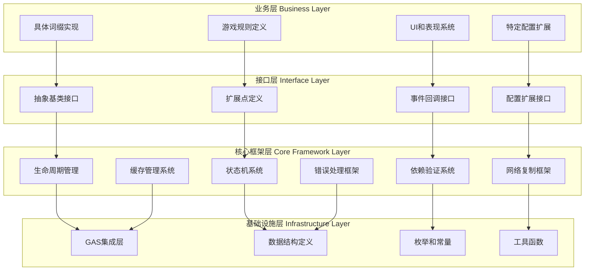

# 词缀系统架构分层设计文档

## 文档信息
- **文档标题**: SagaStats词缀系统架构分层设计
- **创建日期**: 2025-07-21
- **版本**: v1.0
- **用途**: 明确定义词缀系统的核心框架与业务逻辑的边界划分

## 概述

本文档明确定义了SagaStats词缀系统中核心框架（Framework Core）与业务逻辑（Business Logic）的分层架构，确保系统既具备高度复用性，又能满足不同游戏的个性化需求。

## 分层架构原则

### 核心设计理念
1. **框架与业务分离**: 核心提供稳定的基础设施，业务层实现具体游戏逻辑
2. **接口导向设计**: 通过抽象接口定义扩展点，保证系统的可扩展性
3. **数据驱动配置**: 核心定义必需结构，业务层扩展具体字段
4. **依赖倒置原则**: 核心不依赖具体实现，具体实现依赖核心抽象

### 分层结构图



## 核心框架层详细定义

### 1. 基础设施层（必须是核心）

#### 基础数据结构
```cpp
// 核心枚举 - 系统必需，不可变
UENUM(BlueprintType)
enum class ESagaAffixState : uint8
{
    None        UMETA(DisplayName = "None"),
    Pending     UMETA(DisplayName = "Pending"),
    Active      UMETA(DisplayName = "Active"),
    Suspended   UMETA(DisplayName = "Suspended"),
    Expired     UMETA(DisplayName = "Expired"),
    Removed     UMETA(DisplayName = "Removed")
};

// 核心数据结构 - 系统基础，只包含必需字段
USTRUCT(BlueprintType)
struct SAGASTATS_API FSagaAffixDefinitionCore
{
    GENERATED_BODY()

    // 系统必需字段 - 不可删除或修改
    UPROPERTY(EditAnywhere, BlueprintReadWrite, Category = "Core")
    FGameplayTag AffixID;

    UPROPERTY(EditAnywhere, BlueprintReadWrite, Category = "Core")
    TSubclassOf<USagaAffixInstanceAbility> ImplementationClass;

    UPROPERTY(EditAnywhere, BlueprintReadWrite, Category = "Core")
    ESagaAffixState InitialState = ESagaAffixState::Pending;

    UPROPERTY(EditAnywhere, BlueprintReadWrite, Category = "Core")
    float BaseDuration = -1.0f; // -1表示永久
    
    UPROPERTY(EditAnywhere, BlueprintReadWrite, Category = "Core")
    bool bCanStack = false;
    
    UPROPERTY(EditAnywhere, BlueprintReadWrite, Category = "Core", meta = (EditCondition = "bCanStack"))
    int32 MaxStackCount = 1;
};
```

#### GAS集成层
```cpp
// 核心管理器基类 - 提供生命周期管理
UCLASS(Abstract, BlueprintType)
class SAGASTATS_API USagaAffixManagerAbility : public UGameplayAbility
{
    GENERATED_BODY()

protected:
    // 核心生命周期 - 所有子类都需要
    virtual void ActivateAbility(const FGameplayAbilitySpecHandle Handle, const FGameplayAbilityActorInfo* ActorInfo, const FGameplayAbilityActivationInfo ActivationInfo, const FGameplayEventData* TriggerEventData) override;
    virtual void EndAbility(const FGameplayAbilitySpecHandle Handle, const FGameplayAbilityActorInfo* ActorInfo, const FGameplayAbilityActivationInfo ActivationInfo, bool bReplicateEndAbility, bool bWasCancelled) override;

    // 核心功能接口 - 框架提供的稳定API
    UFUNCTION(BlueprintCallable, Category = "Saga Affix")
    FGuid ApplyAffix(const FSagaAffixApplicationRequest& Request);
    
    UFUNCTION(BlueprintCallable, Category = "Saga Affix")
    bool RemoveAffix(const FGuid& InstanceID);
    
    UFUNCTION(BlueprintCallable, BlueprintPure, Category = "Saga Affix")
    TArray<FSagaActiveAffixInfo> GetActiveAffixes() const;

    // 业务扩展点 - 子类可重写
    virtual bool CanApplyAffix(const FSagaAffixApplicationRequest& Request) { return true; }
    virtual void OnAffixApplied(const FGuid& InstanceID, const FSagaActiveAffixInfo& AffixInfo) {}
    virtual void OnAffixRemoved(const FGuid& InstanceID, const FSagaActiveAffixInfo& AffixInfo) {}

private:
    // 核心数据 - 框架管理，业务层不直接访问
    UPROPERTY(Replicated)
    TMap<FGuid, FSagaActiveAffixInfo> ActiveAffixInstances;
    
    UPROPERTY()
    TMap<FGameplayTag, FSagaAffixDefinitionCore> CachedAffixDefinitions;
};
```

### 2. 生命周期管理系统

#### 词缀实例基类
```cpp
// 核心实例基类 - 定义所有词缀的通用行为
UCLASS(Abstract, BlueprintType)
class SAGASTATS_API USagaAffixInstanceAbility : public UGameplayAbility
{
    GENERATED_BODY()

protected:
    // 核心生命周期 - 框架管理
    virtual void ActivateAbility(const FGameplayAbilitySpecHandle Handle, const FGameplayAbilityActorInfo* ActorInfo, const FGameplayAbilityActivationInfo ActivationInfo, const FGameplayEventData* TriggerEventData) override final;
    virtual void EndAbility(const FGameplayAbilitySpecHandle Handle, const FGameplayAbilityActorInfo* ActorInfo, const FGameplayAbilityActivationInfo ActivationInfo, bool bReplicateEndAbility, bool bWasCancelled) override final;

    // 核心状态管理 - 框架提供
    UFUNCTION(BlueprintCallable, Category = "Saga Affix Instance")
    bool UpdateInstanceState(ESagaAffixState NewState);
    
    UFUNCTION(BlueprintCallable, Category = "Saga Affix Instance")
    bool AddStack(int32 StacksToAdd = 1);
    
    UFUNCTION(BlueprintCallable, Category = "Saga Affix Instance")
    bool RemoveStack(int32 StacksToRemove = 1);

public:
    // 业务扩展接口 - 子类必须实现
    UFUNCTION(BlueprintImplementableEvent, Category = "Saga Affix Business")
    void OnAffixActivated();
    
    UFUNCTION(BlueprintImplementableEvent, Category = "Saga Affix Business") 
    void OnAffixDeactivated();
    
    UFUNCTION(BlueprintImplementableEvent, Category = "Saga Affix Business")
    void OnStackCountChanged(int32 OldCount, int32 NewCount);

    // 业务扩展接口 - 子类可选择实现
    UFUNCTION(BlueprintNativeEvent, Category = "Saga Affix Business")
    float CalculateEffectMagnitude(float BaseMagnitude);
    virtual float CalculateEffectMagnitude_Implementation(float BaseMagnitude) { return BaseMagnitude; }
    
    UFUNCTION(BlueprintNativeEvent, Category = "Saga Affix Business")
    bool ShouldAffixExpire() const;
    virtual bool ShouldAffixExpire_Implementation() const { return GetRemainingDuration() <= 0.0f; }

protected:
    // 核心数据 - 框架管理
    UPROPERTY(BlueprintReadOnly, Category = "Saga Affix Core")
    FSagaAffixDefinitionCore AffixDefinition;
    
    UPROPERTY(BlueprintReadOnly, Category = "Saga Affix Core") 
    FSagaActiveAffixInfo InstanceInfo;
    
    UPROPERTY(BlueprintReadOnly, Category = "Saga Affix Core")
    TWeakObjectPtr<USagaAffixManagerAbility> ManagerAbility;

private:
    // 内部状态 - 框架私有
    FTimerHandle DurationTimerHandle;
    FTimerHandle PeriodicEffectTimerHandle;
};
```

### 3. 依赖验证系统

#### 基于Hades的依赖框架
```cpp
// 核心依赖结构 - 基于Hades分析的通用模式
USTRUCT(BlueprintType)
struct SAGASTATS_API FSagaAffixDependencyCore
{
    GENERATED_BODY()

    // OneOf模式：需要其中任意一个
    UPROPERTY(EditAnywhere, BlueprintReadWrite, Category = "Core Dependencies")
    TArray<FGameplayTag> OneOfRequired;
    
    // OneFromEachSet模式：需要每个集合中至少一个  
    UPROPERTY(EditAnywhere, BlueprintReadWrite, Category = "Core Dependencies")
    TArray<FSagaAffixSet> OneFromEachSetRequired;
    
    // 基础互斥标签
    UPROPERTY(EditAnywhere, BlueprintReadWrite, Category = "Core Dependencies")
    FGameplayTagContainer ExclusiveTags;
};

// 核心验证器 - 框架提供的通用验证逻辑
UCLASS(BlueprintType)
class SAGASTATS_API USagaAffixDependencyValidator : public UBlueprintFunctionLibrary
{
    GENERATED_BODY()

public:
    // 核心验证方法 - 基于Hades逻辑实现
    UFUNCTION(BlueprintCallable, Category = "Saga Affix Dependency")
    static bool ValidateAffixDependencies(
        const FSagaAffixDependencyCore& Dependencies,
        const USagaAbilitySystemComponent* ASC);
        
    UFUNCTION(BlueprintCallable, Category = "Saga Affix Dependency")
    static bool CheckAffixConflicts(
        const FGameplayTag& AffixID,
        const USagaAbilitySystemComponent* ASC);

    // 业务扩展点 - 可被重写的验证逻辑
    UFUNCTION(BlueprintImplementableEvent, Category = "Saga Affix Business")
    static bool ValidateBusinessDependencies(
        const FGameplayTag& AffixID,
        const USagaAbilitySystemComponent* ASC);
};
```

## 业务逻辑层定义

### 1. 具体词缀实现（业务层）

#### 业务配置扩展
```cpp
// 业务配置 - 游戏特定字段，可自由扩展
USTRUCT(BlueprintType)
struct MYGAME_API FMyGameAffixDefinition : public FSagaAffixDefinitionCore
{
    GENERATED_BODY()

    // 游戏特定字段 - 可以随游戏需求增减
    UPROPERTY(EditAnywhere, BlueprintReadWrite, Category = "Display")
    FText DisplayName;
    
    UPROPERTY(EditAnywhere, BlueprintReadWrite, Category = "Display")
    FText Description;
    
    UPROPERTY(EditAnywhere, BlueprintReadWrite, Category = "Display")
    TSoftObjectPtr<UTexture2D> Icon;
    
    UPROPERTY(EditAnywhere, BlueprintReadWrite, Category = "Game Rules")
    ESagaAffixRarity Rarity = ESagaAffixRarity::Common;
    
    UPROPERTY(EditAnywhere, BlueprintReadWrite, Category = "Game Rules")
    int32 RequiredLevel = 1;
    
    UPROPERTY(EditAnywhere, BlueprintReadWrite, Category = "Game Rules")
    float Weight = 1.0f;
    
    // 业务特定的依赖扩展
    UPROPERTY(EditAnywhere, BlueprintReadWrite, Category = "Business Dependencies")
    FMyGameAffixDependencies BusinessDependencies;
};

// 业务特定的依赖扩展
USTRUCT(BlueprintType)
struct MYGAME_API FMyGameAffixDependencies : public FSagaAffixDependencyCore
{
    GENERATED_BODY()

    // 品质依赖 - 游戏特定
    UPROPERTY(EditAnywhere, BlueprintReadWrite, Category = "Quality Dependencies")
    TMap<FGameplayTag, ESagaAffixRarity> QualityRequirements;
    
    // 等级依赖 - 游戏特定
    UPROPERTY(EditAnywhere, BlueprintReadWrite, Category = "Level Dependencies")
    int32 MinimumLevel = 1;
    
    // 职业限制 - 游戏特定
    UPROPERTY(EditAnywhere, BlueprintReadWrite, Category = "Class Dependencies")
    TArray<FGameplayTag> AllowedClasses;
};
```

#### 具体词缀实现示例
```cpp
// 具体词缀实现 - 业务逻辑
UCLASS(BlueprintType)
class MYGAME_API UFireDamageAffixAbility : public USagaAffixInstanceAbility
{
    GENERATED_BODY()

protected:
    // 实现业务接口
    virtual void OnAffixActivated_Implementation() override;
    virtual void OnAffixDeactivated_Implementation() override;
    virtual float CalculateEffectMagnitude_Implementation(float BaseMagnitude) override;

    // 游戏特定的功能
    UFUNCTION(BlueprintCallable, Category = "Fire Damage")
    void ApplyBurnEffect();
    
    UFUNCTION(BlueprintCallable, Category = "Fire Damage")
    float GetFireAffinityBonus() const;

private:
    // 游戏特定数据
    UPROPERTY(EditDefaultsOnly, Category = "Fire Damage Settings")
    float BurnDamagePerSecond = 10.0f;
    
    UPROPERTY(EditDefaultsOnly, Category = "Fire Damage Settings")
    float FireAffinityMultiplier = 0.1f;
    
    FTimerHandle BurnTimerHandle;
};
```

### 2. 游戏规则层（业务层）

#### 游戏管理器扩展
```cpp
// 游戏特定的管理器 - 实现具体游戏规则
UCLASS(BlueprintType)
class MYGAME_API UMyGameAffixManager : public USagaAffixManagerAbility  
{
    GENERATED_BODY()

protected:
    // 重写业务扩展点
    virtual bool CanApplyAffix(const FSagaAffixApplicationRequest& Request) override;
    virtual void OnAffixApplied(const FGuid& InstanceID, const FSagaActiveAffixInfo& AffixInfo) override;
    virtual void OnAffixRemoved(const FGuid& InstanceID, const FSagaActiveAffixInfo& AffixInfo) override;

    // 游戏特定的规则检查
    UFUNCTION(BlueprintCallable, Category = "Game Rules")
    bool CheckLevelRequirement(const FGameplayTag& AffixID) const;
    
    UFUNCTION(BlueprintCallable, Category = "Game Rules")
    bool CheckClassRestriction(const FGameplayTag& AffixID) const;
    
    UFUNCTION(BlueprintCallable, Category = "Game Rules")
    int32 GetMaxAffixSlots() const;

private:
    // 游戏特定配置
    UPROPERTY(EditDefaultsOnly, Category = "Game Settings")
    TMap<ESagaAffixRarity, int32> RaritySlotLimits;
    
    UPROPERTY(EditDefaultsOnly, Category = "Game Settings")
    TMap<FGameplayTag, int32> CategorySlotLimits;
};
```

## 配置系统分层

### 1. 核心配置（不可变）
```json
{
    "CoreConfiguration": {
        "SystemVersion": "1.0",
        "RequiredFields": [
            "AffixID",
            "ImplementationClass", 
            "InitialState",
            "BaseDuration"
        ],
        "StateTransitions": {
            "Pending": ["Active", "Removed"],
            "Active": ["Suspended", "Expired", "Removed"],
            "Suspended": ["Active", "Expired", "Removed"],
            "Expired": ["Removed"]
        }
    }
}
```

### 2. 业务配置（可扩展）
```json
{
    "GameConfiguration": {
        "DisplaySettings": {
            "LocalizationTable": "AffixTexts",
            "IconPath": "/Game/UI/Icons/Affixes/"
        },
        "GameRules": {
            "MaxAffixSlots": 8,
            "RarityWeights": {
                "Common": 1.0,
                "Rare": 0.3,
                "Epic": 0.1,
                "Legendary": 0.05
            }
        },
        "BusinessDependencies": {
            "EnableLevelRequirements": true,
            "EnableClassRestrictions": true,
            "EnableQualityDependencies": true
        }
    }
}
```

## API分层设计

### 核心API（稳定接口）
```cpp
// 核心API - 版本间保持兼容
namespace SagaStats::Core 
{
    // 基础CRUD操作
    FGuid ApplyAffix(const FSagaAffixApplicationRequest& Request);
    bool RemoveAffix(const FGuid& InstanceID);
    TArray<FSagaActiveAffixInfo> GetActiveAffixes();
    
    // 基础查询
    bool HasAffix(const FGameplayTag& AffixID);
    int32 GetAffixCount();
    
    // 基础验证
    bool ValidateDependencies(const FSagaAffixDependencyCore& Dependencies);
    bool CheckConflicts(const FGameplayTag& AffixID);
}
```

### 业务API（可扩展）
```cpp
// 业务API - 游戏特定功能
namespace MyGame::Affixes
{
    // 游戏特定操作
    bool CanPlayerAffordAffix(const FGameplayTag& AffixID);
    void ShowAffixSelectionUI(const TArray<FGameplayTag>& AvailableAffixes);
    void PlayAffixAcquisitionEffects(const FGameplayTag& AffixID);
    
    // 游戏规则查询
    ESagaAffixRarity GetAffixRarity(const FGameplayTag& AffixID);
    int32 GetRequiredLevel(const FGameplayTag& AffixID);
    bool IsAffixAllowedForClass(const FGameplayTag& AffixID, const FGameplayTag& ClassTag);
}
```

## 测试分层策略

### 核心框架测试
```cpp
// 核心功能的单元测试
UCLASS()
class USagaAffixCoreTests : public UObject
{
    GENERATED_BODY()
    
public:
    // 测试核心生命周期
    void TestAffixLifecycle();
    void TestStateTransitions();
    void TestStackingLogic();
    
    // 测试依赖验证
    void TestOneOfDependencies();
    void TestOneFromEachSetDependencies();
    void TestConflictDetection();
    
    // 测试网络复制
    void TestNetworkReplication();
    void TestClientServerSync();
};
```

### 业务逻辑测试
```cpp
// 业务功能的集成测试
UCLASS()
class UMyGameAffixBusinessTests : public UObject
{
    GENERATED_BODY()
    
public:
    // 测试游戏规则
    void TestLevelRequirements();
    void TestClassRestrictions();
    void TestRarityLimits();
    
    // 测试具体词缀
    void TestFireDamageAffix();
    void TestHealingAffix();
    void TestSpeedBoostAffix();
    
    // 测试UI集成
    void TestAffixDisplayUI();
    void TestSelectionInterface();
};
```

## 部署和版本管理

### 核心框架版本策略
- **语义化版本**: Core框架使用严格的语义化版本（Major.Minor.Patch）
- **向后兼容**: Minor版本保证向后兼容，Major版本可能包含破坏性变更
- **稳定API**: 核心API一旦发布，在同一Major版本内保持稳定

### 业务逻辑版本策略
- **独立版本**: 业务逻辑可以独立于核心框架进行版本管理
- **快速迭代**: 支持频繁的业务逻辑更新而不影响核心稳定性
- **热更新支持**: 业务配置支持运行时热更新

## 总结

### 分层架构的优势

1. **高复用性**: 核心框架可在多个项目间复用
2. **强扩展性**: 业务层可以自由扩展而不影响核心稳定性  
3. **易维护性**: 清晰的职责边界，便于定位和修复问题
4. **测试友好**: 分层测试策略，确保各层次的质量
5. **版本独立**: 核心和业务可以独立演进和部署

### 实施建议

1. **第一阶段**: 实现核心框架的基础设施层和生命周期管理
2. **第二阶段**: 完善依赖验证系统和网络复制机制
3. **第三阶段**: 实现业务层的扩展接口和示例实现
4. **第四阶段**: 建立完整的测试体系和文档

这种分层架构确保了SagaStats词缀系统既是一个稳定可复用的框架，又具备满足各种游戏需求的灵活性。

---

**文档版本**: v1.0  
**最后更新**: 2025-07-21  
**文档作者**: ZhangJinming  
**项目路径**: D:\UnrealEngine\UnrealEngine\Projects\SagaStats